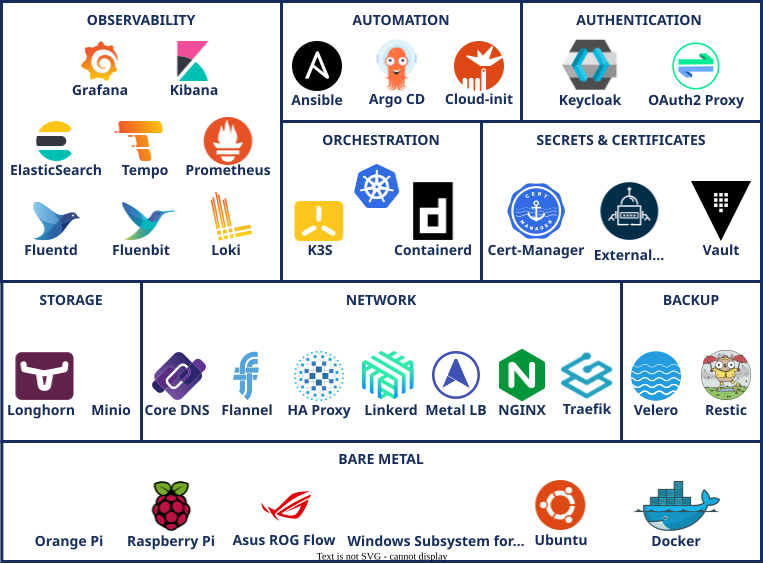
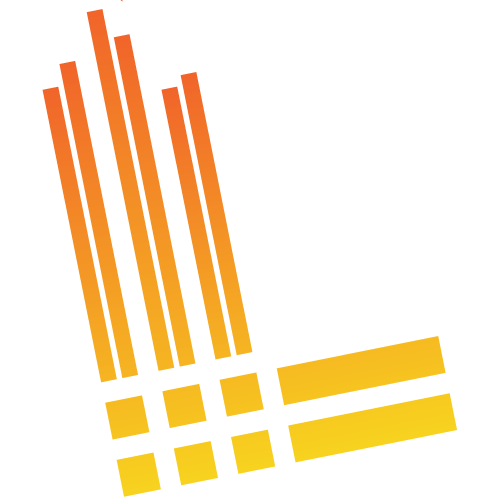
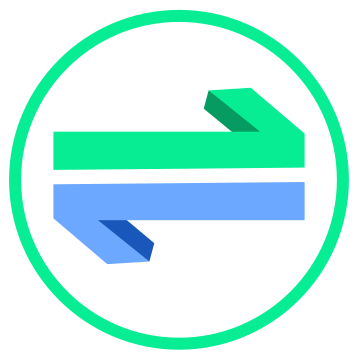
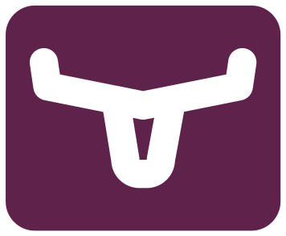
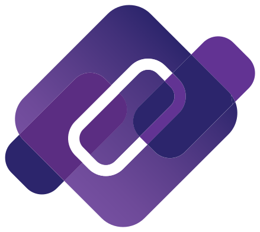
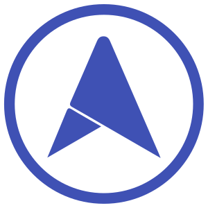
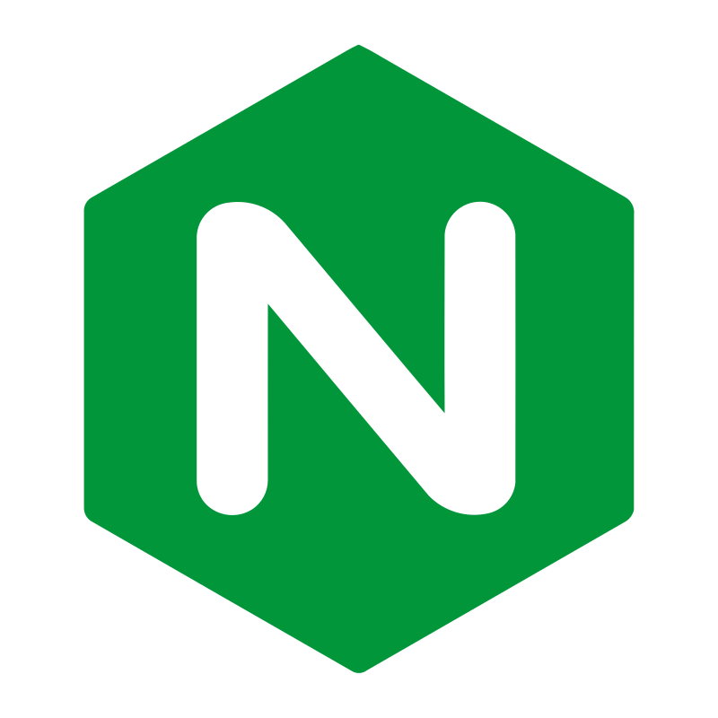
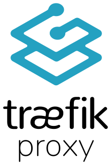
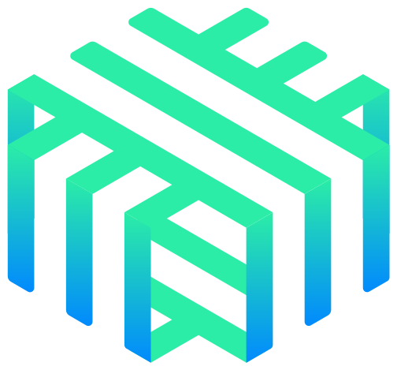

# {{ $frontmatter.title }}

    

## Project Scope: PiKube Kubernetes Service

The primary goal of this project is to build a sophisticated, home-based Kubernetes cluster on ARM bare metal nodes (Raspberry Pis and Orange Pis). This is not just a simple cluster; it is a fully automated, observable, and extensible platform designed to explore the frontiers of modern cloud-native technologies.

The project is built on two core pillars:

1. **Extreme Automation:** Leveraging Infrastructure as Code (IaC) and GitOps principles with **Ansible**, **cloud-init**, and **Argo CD**, the entire cluster lifecycle—from bare-metal provisioning to application deployment—is automated. This ensures consistency, repeatability, and rapid recovery.

2. **Deep Observability:** A comprehensive, integrated observability stack provides deep insights into the cluster's health and performance. This includes:
    * **Metrics:** **Prometheus** for time-series monitoring and alerting.
    * **Logs:** A dual-stack approach with **Loki** for efficient, real-time log aggregation and the **EFK stack (Elasticsearch, Fluentd/Fluentbit, Kibana)** for powerful, in-depth log analytics.
    * **Traces:** **Grafana Tempo** for distributed tracing to understand the flow of requests across microservices.
    * **Visualization:** **Grafana** as a single pane of glass for all metrics, logs, and traces.

Beyond the foundational platform, PiKube is designed to run a diverse set of modern workloads, making it an ideal environment for learning and experimentation:

-   **Microservices Architecture:** With **Linkerd** service mesh, **Keycloak** for API security (OAuth 2.0/OIDC), and **HashiCorp Vault** for secrets management, the cluster is primed for secure, reliable, and observable microservices.
-   **Real-Time Data Streaming:** **Apache Kafka**, managed by the **Strimzi** operator, provides a robust backbone for real-time data pipelines and event-driven architectures.
-   **High-Performance Batch Computing:** **Volcano**, a CNCF batch scheduling system, is integrated to efficiently manage and schedule high-performance computing (HPC), machine learning, and big data workloads, which are not well-served by the default Kubernetes scheduler.
-   **Persistent Storage:** **Longhorn** provides resilient, distributed block storage for stateful applications, while **Minio** offers an S3-compatible object store.
-   **Backup and Recovery:** **Velero** and **Restic** ensure that the cluster's state and application data are backed up and can be restored.

## Design Principles

-   **Heterogeneous ARM Bare Metal:** A mix of Raspberry Pi and Orange Pi nodes to explore the challenges and opportunities of a diverse hardware environment.
-   **Lightweight & Efficient:** **K3s** as the Kubernetes distribution of choice, optimized for resource-constrained environments.
-   **Open Source & CNCF-Aligned:** A strong commitment to using open-source technologies, with a preference for projects within the Cloud Native Computing Foundation (CNCF) ecosystem.
-   **Cutting-Edge Exploration:** Use of the latest stable versions of all tools to stay at the forefront of the cloud-native landscape.
-   **Declarative & Git-Driven:** All aspects of the cluster and its applications are defined declaratively in a Git repository, which serves as the single source of truth.

## Open Source Technologies: Building the Cluster

The diagram below provides a comprehensive overview of the technology stack that powers the PiKube platform.

    

    <table class="table table-white table-bordered border-dark w-auto align-middle">
        <thead>
            <tr>
                <th></th>
                <th></th>
                <th>Technology Stack</th>
                <th>Description</th>
            </tr>
        </thead>
        <tbody>
            <!-- Layer 1: Observability -->
            <tr>
                <td rowspan="8" class="vertical-cell">
                    
OBSERVABILITY

                </td>
                <td></td>
                <td><a href="https://grafana.com/oss/grafana/">Grafana</a></td>
                <td>Unified visualization for metrics, logs, and traces.</td>
            </tr>
            <tr>
                <td></td>
                <td><a href="https://www.elastic.co/kibana/">Kibana</a></td>
                <td>Advanced log analytics and visualization.</td>
            </tr>
            <tr>
                <td></td>
                <td><a href="https://www.elastic.co/elasticsearch/">Elasticsearch</a></td>
                <td>Full-text search and analytics engine for logs.</td>
            </tr>
            <tr>
                <td></td>
                <td><a href="https://grafana.com/oss/tempo/">Tempo</a></td>
                <td>High-scale distributed tracing backend.</td>
            </tr>
            <tr>
                <td></td>
                <td><a href="https://prometheus.io/">Prometheus</a></td>
                <td>Metrics-based monitoring and alerting.</td>
            </tr>
            <tr>
                <td></td>
                <td><a href="https://www.fluentd.org/">Fluentd</a></td>
                <td>Log aggregation and forwarding.</td>
            </tr>
            <tr>
                <td></td>
                <td><a href="https://fluentbit.io/">Fluentbit</a></td>
                <td>Lightweight log collection.</td>
            </tr>
            <tr>
                <td></td>
                <td><a href="https://grafana.com/oss/loki/">Loki</a></td>
                <td>Horizontally-scalable, multi-tenant log aggregation.</td>
            </tr>
            <!-- Layer 2: Automation -->
            <tr>
                <td rowspan="3" class="vertical-cell">
                    
AUTOMATION

                </td>
                <td></td>
                <td><a href="https://www.ansible.com">Ansible</a></td>
                <td>Automates system configuration and external service integration.</td>
            </tr>
            <tr>
                <td></td>
                <td><a href="https://argoproj.github.io/cd">ArgoCD</a></td>
                <td>Declarative, GitOps-based continuous delivery.</td>
            </tr>
            <tr>
                <td></td>
                <td><a href="https://cloudinit.readthedocs.io/en/latest/">Cloud-init</a></td>
                <td>Automates initial OS configuration.</td>
            </tr>
            <!-- Layer 3: Authentication -->
            <tr>
                <td rowspan="2" class="vertical-cell">
                    
AUTHENTICATION

                </td>
                <td></td>
                <td><a href="https://www.keycloak.org/">Keycloak</a></td>
                <td>OpenID Connect & OAuth 2.0 Identity and Access Management.</td>
            </tr>
            <tr>
                <td></td>
                <td><a href="https://oauth2-proxy.github.io/oauth2-proxy/">OAuth2-Proxy</a></td>
                <td>Reverse proxy for adding authentication to applications.</td>
            </tr>
            <!-- Layer 4: Orchestration -->
            <tr>
                <td rowspan="3" class="vertical-cell">
                    
ORCHESTRATION

                </td>
                <td></td>
                <td><a href="https://k3s.io/">K3S</a></td>
                <td>Lightweight, certified Kubernetes distribution.</td>
            </tr>
            <tr>
                <td></td>
                <td><a href="https://containerd.io/">containerd</a></td>
                <td>Industry-standard container runtime.</td>
            </tr>
            <tr>
                <td></td>
                <td><a href="https://volcano.sh/">Volcano</a></td>
                <td>Batch scheduling for HPC and AI/ML workloads.</td>
            </tr>
            <!-- Layer 5: Security -->
            <tr>
                <td rowspan="3" class="vertical-cell">
                    
SECURITY

                </td>
                <td></td>
                <td><a href="https://cert-manager.io">Cert-manager</a></td>
                <td>Automated TLS certificate management.</td>
            </tr>
            <tr>
                <td></td>
                <td><a href="https://www.vaultproject.io/">Hashicorp Vault</a></td>
                <td>Centralized secrets management.</td>
            </tr>
            <tr>
                <td></td>
                <td><a href="https://external-secrets.io/">External Secrets Operator</a></td>
                <td>Syncs secrets from external APIs into Kubernetes.</td>
            </tr>
            <!-- Layer 6: Storage -->
            <tr>
                <td rowspan="2" class="vertical-cell">
                    
STORAGE

                </td>
                <td></td>
                <td><a href="https://longhorn.io/">Longhorn</a></td>
                <td>Cloud-native distributed block storage.</td>
            </tr>
            <tr>
                <td></td>
                <td><a href="https://min.io/">Minio</a></td>
                <td>High-performance, S3-compatible object storage.</td>
            </tr>
            <!-- Layer 7: Network -->
            <tr>
                <td rowspan="7" class="vertical-cell">
                    
NETWORK

                </td>
                <td></td>
                <td><a href="https://coredns.io/">CoreDNS</a></td>
                <td>Cluster DNS resolution.</td>
            </tr>
            <tr>
                <td></td>
                <td><a href="https://github.com/flannel-io/flannel">Flannel</a></td>
                <td>CNI plugin for pod-to-pod networking.</td>
            </tr>
            <tr>
                <td></td>
                <td><a href="https://www.haproxy.org/">HA Proxy</a></td>
                <td>High-availability load balancer for the Kubernetes API.</td>
            </tr>
            <tr>
                <td></td>
                <td><a href="https://metallb.universe.tf/">Metal LB</a></td>
                <td>Bare-metal load balancer for Kubernetes services.</td>
            </tr>
            <tr>
                <td></td>
                <td><a href="https://kubernetes.github.io/ingress-nginx/">Ingress NGINX</a></td>
                <td>Manages external access to cluster services.</td>
            </tr>
            <tr>
                <td></td>
                <td><a href="https://traefik.io/">Traefik</a></td>
                <td>Cloud-native Ingress Controller.</td>
            </tr>
            <tr>
                <td></td>
                <td><a href="https://linkerd.io/">Linkerd</a></td>
                <td>Ultralight, security-first service mesh.</td>
            </tr>
            <!-- Layer 8: Backup -->
            <tr>
                <td rowspan="2" class="vertical-cell">
                    
BACKUP

                </td>
                <td></td>
                <td><a href="https://velero.io/">Velero</a></td>
                <td>Cluster backup and restore.</td>
            </tr>
            <tr>
                <td></td>
                <td><a href="https://restic.net/">Restic</a></td>
                <td>Secure and efficient file-level backup.</td>
            </tr>
        </tbody>
    </table>

## External Services and Dependencies

While PiKube is designed to be as self-contained as possible, it leverages a few external services for public-facing endpoints.

### Cloud-Based Services

> [!NOTE]
>
> The use of these external services is optional. The cluster can operate in a fully private mode, but will lack publicly trusted TLS certificates for its services.

    <table class="table table-white table-bordered border-dark w-auto align-middle">
        <thead>
            <tr>
                <th></th>
                <th></th>
                <th>Service Provider</th>
                <th>Role</th>
                <th>Strategic Importance</th>
            </tr>
        </thead>
        <tbody>
            <tr>
                <td rowspan="2" class="vertical-cell">
                    
SECURITY

                </td>
                <td></td>
                <td><a href="https://letsencrypt.org/">Let's Encrypt</a></td>
                <td>TLS Certificate Authority</td>
                <td>Provides free, trusted TLS certificates for securing public-facing services.</td>
            </tr>
            <tr>
                <td></td>
                <td><a href="https://www.cloudflare.com/">Cloudflare</a></td>
                <td>DNS & Web Security</td>
                <td>Manages the public DNS records for the cluster and provides an API for automated DNS-01 challenges with Cert-Manager.</td>
            </tr>
        </tbody>
    </table>

### Externally Hosted Services

Certain critical services are hosted outside the main Kubernetes cluster to avoid circular dependencies and ensure the cluster can be bootstrapped from a clean state.

    <table class="table table-white table-bordered border-dark w-auto align-middle">
        <thead>
            <tr>
                <th></th>
                <th></th>
                <th>Technology Stack</th>
                <th>Strategic Importance</th>
            </tr>
        </thead>
        <tbody>
            <tr>
                <td rowspan="2" class="vertical-cell">
                    
STRATEGIC SERVICES

                </td>
                <td></td>
                <td><a href="https://min.io/">Minio</a></td>
                <td>S3 Object Store for cluster backups.</td>
            </tr>
            <tr>
                <td></td>
                <td><a href="https://www.vaultproject.io/">Hashicorp Vault</a></td>
                <td>Centralized secrets management.</td>
            </tr>
        </tbody>
    </table>

* **Minio:** Provides an S3-compatible object store for **Velero** backups. It is hosted on a dedicated node to ensure that cluster backups are independent of the cluster's own storage systems.

* **Hashicorp Vault:** Manages all sensitive secrets for the cluster. It is hosted on the gateway node and is a prerequisite for many other services, making it essential to be available before the rest of the cluster comes online.