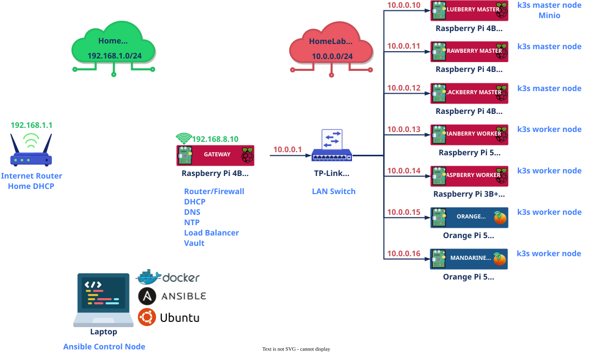

# {{ $frontmatter.title }}

## 🏗️ Structural Overview

The PiKube Kubernetes cluster is architected with a mix of nodes, each playing a vital role. This infrastructure consists of 12 ARM64 nodes deployed across three network segments, featuring heterogeneous hardware, multi-tier storage, high-performance networking capabilities, and professional power management.

<p align="center">
    
</p>

---

## 🌐 Complete Network Topology

### Gateway Node

**1 Gateway Node:**

- **gateway** (10.0.0.1): Raspberry Pi 4B Rev 1.5, 8GB RAM
- Role: Acts as the cluster's primary router and firewall
- Storage: 128GB Samsung EVO (YD4QD)

### Infrastructure Nodes

| IP Address | Hostname | Hardware | Role | RAM | Storage | Network |
|------------|----------|----------|------|-----|---------|---------|
| **10.0.0.2** | hedgeway | Orange Pi Zero 2W | Edge Gateway | 4GB | 32GB SanDisk (SL32G) | Wi-Fi 5 |
| **10.0.0.4** | raspberry-sentinel | Raspberry Pi 3B+ Rev 1.3 | Monitoring | 1GB | 32GB SanDisk (SL32G) | Ethernet |

### Master Nodes

**3 Master Nodes:**

| IP Address | Hostname | Hardware | RAM | Storage | Network |
|------------|----------|----------|-----|---------|---------|
| **10.0.0.10** | blueberry-master | Raspberry Pi 4B | 8GB | 128GB SanDisk (SN128) | Gigabit Ethernet |
| **10.0.0.11** | strawberry-master | Raspberry Pi 4B | 8GB | 128GB SanDisk (SR128) | Gigabit Ethernet |
| **10.0.0.12** | blackberry-master | Raspberry Pi 4B | 4GB | 128GB SanDisk (SR128) | Gigabit Ethernet |

### Worker Nodes

**6 Worker Nodes:**

| IP Address | Hostname | Hardware | RAM | Storage | Network | AI |
|------------|----------|----------|-----|---------|---------|-----|
| **10.0.0.13** | cranberry-worker | Raspberry Pi 5 Model B | 4GB | 256GB Samsung EVO (GE4S5) | Gigabit Ethernet | - |
| **10.0.0.15** | orange-worker | Orange Pi 5 | 16GB | 256GB Samsung EVO (GE4S5) | Gigabit Ethernet | 6 TOPS NPU |
| **10.0.0.16** | mandarine-worker | Orange Pi 5 | 16GB | 256GB Samsung EVO (GE4S5) | Gigabit Ethernet | 6 TOPS NPU |
| **10.0.0.17** | lemon-worker | Orange Pi 5 Ultra | 16GB | 256GB Samsung EVO (FE4S9) | 2.5G Ethernet | 6 TOPS NPU |
| **10.0.0.18** | clementine-worker | Orange Pi 5 Ultra | 16GB | 256GB Samsung EVO (FE4S9) | 2.5G Ethernet | 6 TOPS NPU |
| **10.0.0.19** | grapefruit-worker | Orange Pi 5 Ultra | 16GB | 256GB Samsung EVO (GE4S5) + **931GB NVMe SSD** | 2.5G Ethernet | 6 TOPS NPU |

---

## 🌐 Network Infrastructure

The network infrastructure is tailored to provide high-speed, reliable connectivity for the PiKube Cluster, utilizing advanced networking hardware and high-quality cabling. The foundation of the network is established through multiple TP-Link switches for comprehensive coverage and management capabilities. All nodes are interconnected using superior Cat8 Ethernet cables, leveraging their Gigabit Ethernet ports to maximize data transfer speeds.

### Networking Hardware

- **TP-Link TL-SG108S:** 8-port Gigabit Ethernet unmanaged switch for plug-and-play setup
- **TP-Link TL-SG608E:** 8-port managed switch with VLAN support and remote management capabilities for enhanced network functionality
- **Ethernet Cables:** 8 UGREEN Cat 8 cables 40Gbps 2000MHz for reliable, high-speed connections

### Network Performance Tiers

#### High-Speed Tier (2.5G Capable)
- **Nodes**: lemon-worker, clementine-worker, grapefruit-worker (Orange Pi 5 Ultra)
- **Technology**: 2.5G Ethernet controllers + Wi-Fi 6E
- **Use Cases**: High-bandwidth applications, real-time processing

#### Standard Tier (1G)
- **Nodes**: All masters, cranberry-worker, orange-worker, mandarine-worker, gateway, sentinel
- **Technology**: Gigabit Ethernet + Wi-Fi 5/6
- **Use Cases**: Standard workloads, control plane communication

#### Edge Tier (Wireless Primary)
- **Nodes**: hedgeway (Orange Pi Zero 2W)
- **Technology**: Wi-Fi 5 dual-band
- **Use Cases**: IoT gateway, edge computing

### Networking Services

The **gateway** node offers essential networking services:

- [**Router/Firewall**](../0-definitions.md#router-firewall): Controls internet access and network security using nftables
- [**DNS**](../0-definitions.md#dns): Domain Name System services via dnsmasq
- [**NTP**](../0-definitions.md#ntp): Network Time Protocol for time synchronization using chrony
- [**DHCP**](../0-definitions.md#dhcp): Dynamic Host Configuration Protocol for network management via dnsmasq

For enhanced Kubernetes API availability, an HAProxy load balancer is deployed on the gateway.

### Ansible Control Node

The **pimaster**, an Ansible control node, is a Docker Linux VM on a Windows laptop or Windows Subsystem for Linux. It manages the cluster's configuration, connecting to the home network and facilitating communication with cluster nodes.

---

## 🔌 Power Management & Infrastructure

### Power Supply Infrastructure

**Primary Power Distribution:**
- **2× Anker PowerPort 60W 6-port USB Chargers** with PowerIQ technology for efficient multi-device charging
- **Total Power Capacity**: 120W across 12 ports
- **PowerIQ Technology**: Intelligent charging optimization for each connected device

**Power Control & Management:**
- **USB-C Male/Female Power Switches** with LED indicators for controlled power management
- **Individual Node Control**: Each node can be powered on/off independently
- **Visual Status Indicators**: LED lights show power state for each node
- **Maintenance-Friendly**: Easy power cycling for individual nodes without affecting the cluster

### Power Distribution Strategy

| Power Unit | Connected Nodes | Total Load | Purpose |
|------------|----------------|------------|---------|
| **Anker PowerPort #1** | Masters + Gateway + Edge & Sentinel nodes | ~70W | Control plane infrastructure |
| **Anker PowerPort #2** | Workers | ~70W | Compute workloads |

### Cooling & Physical Infrastructure

**Cluster Housing:**
- **GeeekPi Raspberry Pi Cluster Case** with integrated cooling system
- **Active Cooling**: Built-in fans for temperature management
- **Heat Dissipation**: Individual heatsinks for each node
- **Stackable Design**: Organized, space-efficient cluster layout
- **Cable Management**: Integrated cable routing for clean setup

**Cooling Components:**
- **Individual Heatsinks**: Per-node thermal management
- **Cluster Case Fans**: Active airflow management
- **Open-Frame Design**: Natural convection assistance
- **Temperature Monitoring**: Built-in thermal sensors on nodes

---

## 🔧 Node Hardware Specifications

### Raspberry Pi 4B

**Specifications:**

- **CPU:** Broadcom BCM2711, Quad-core Cortex-A72 (ARM v8), 1.5GHz
- **RAM:** 2GB/4GB/8GB LPDDR4-3200 SDRAM options
- **Disk:** MicroSD card for booting and storage; USB disk (Flash Disk or SSD via USB to SATA adapter) for additional storage

**Hardware Components Used:**

- **Units:** Raspberry Pi 4 Model B (4GB and 8GB configurations) for cluster nodes; Raspberry Pi 4 Model B (4GB) as router/firewall
- **Storage:** Various MicroSD cards for storage solutions, including 128GB and 256GB SAMSUNG EVO Select Micro SD-Memory-Cards
- **SSD Connectivity:** USB to SATA adapters for SSD connectivity (planned for future use)
- **Cooling:** Individual heatsinks and cluster case cooling system
- **Power Management:** USB-C power switches with LED indicators

### Raspberry Pi 5

**Specifications:**

- **CPU:** Broadcom BCM2712, Quad-core Cortex-A76 (ARM v8), 2.4GHz
- **RAM:** 2GB/4GB/8GB options
- **Disk:** SDCard or USB disk (Flash Disk or SSD via USB to SATA adapter)

**Hardware Components Used:**

- **Units:** Raspberry Pi 5 Model B with 4GB RAM for cluster nodes
- **Storage:** Various MicroSD cards for storage solutions, including 128GB and 256GB SAMSUNG EVO Select Micro SD-Memory-Cards
- **SSD Connectivity:** USB to SATA adapters for SSD connectivity (planned for future use)
- **Cooling:** Individual heatsinks and cluster case cooling system
- **Power Management:** USB-C power switches with LED indicators

### Orange Pi 5

**Specifications:**

- **CPU:** Rockchip RK3588S, 8-core 64-bit processor with Big.Little architecture (4xCortex-A76 @ 2.4GHz and 4xCortex-A55 @ 1.8GHz)
- **RAM:** 4GB/8GB/16GB LPDDR4/4X
- **Disk:** MicroSD card for booting and storage; USB disk (Flash Disk or SSD via USB to SATA adapter) for additional storage

**Hardware Components Used:**

- **Units:** Orange Pi 5 Model B units with 16GB RAM for cluster nodes
- **Storage:** Various MicroSD cards for storage solutions, including 128GB and 256GB SAMSUNG EVO Select Micro SD-Memory-Cards
- **SSD Connectivity:** M.2 PCIe 2.0 NVMe support for high-speed storage expansion
- **Cooling:** Individual heatsinks and cluster case cooling system
- **Power Management:** USB-C power switches with LED indicators

### Orange Pi 5 Ultra

**Specifications:**

- **CPU:** Rockchip RK3588, 8-core 64-bit processor with Big.Little architecture (4xCortex-A76 @ 2.4GHz and 4xCortex-A55 @ 1.8GHz)
- **RAM:** 16GB LPDDR5
- **GPU:** ARM Mali-G610 MP4 (OpenGL ES 3.2, Vulkan 1.2)
- **NPU:** 6 TOPS (INT4/INT8/INT16/FP16)
- **Storage:** MicroSD card + M.2 PCIe 3.0 4-lane NVMe support
- **Network:** 2.5G Ethernet + Wi-Fi 6E + Bluetooth 5.3
- **Form Factor:** 89×57×1.6mm

### Orange Pi Zero 2W

**Specifications:**

- **CPU:** Allwinner H618, Quad-core Cortex-A53 @ 1.5GHz
- **RAM:** 4GB LPDDR4 @ 1866MHz
- **GPU:** Mali G31 MP2 (OpenGL ES 3.2, Vulkan 1.1)
- **Storage:** 16MB SPI Flash + MicroSD card
- **Network:** Wi-Fi 5 dual-band + Bluetooth 5.0 BLE
- **I/O:** 2× USB-C 2.0, Mini-HDMI 2.0 (4K@60Hz)
- **Form Factor:** 30×65×1.2mm (ultra-compact)

### Raspberry Pi 3 Model B+

**Specifications:**

- **CPU:** Broadcom BCM2837B0, Quad-core Cortex-A53 @ 1.4GHz
- **RAM:** 1GB LPDDR2 SDRAM
- **Network:** Dual-band Wi-Fi 802.11ac, Bluetooth 4.2, 300Mbps Ethernet (PoE capable)
- **I/O:** 4× USB 2.0, HDMI output
- **GPIO:** 40-pin header

---

## 💾 Storage Solutions

### Verified Storage Configuration by Node
*Source: Verified via SSH commands (lsblk, fdisk, /sys/block)*

| Node | Storage Type | Model | Capacity (GiB) | Manufacturer ID | Performance |
|------|-------------|-------|----------------|-----------------|-------------|
| **grapefruit-worker** | NVMe SSD + SD | CT1000P3PSSD8 + GE4S5 | 931.5 + 238.8 | - + 0x00001b | Ultra-high + High |
| **clementine-worker** | Samsung EVO Select | FE4S9 | 238.8 | 0x00001b | High |
| **lemon-worker** | Samsung EVO Select | FE4S9 | 238.8 | 0x00001b | High |
| **mandarine-worker** | Samsung EVO Select | GE4S5 | 238.8 | 0x00001b | High |
| **orange-worker** | Samsung EVO Select | GE4S5 | 238.8 | 0x00001b | High |
| **cranberry-worker** | Samsung EVO Select | GE4S5 | 238.8 | 0x00001b | High |
| **gateway** | Samsung EVO | YD4QD | 119.4 | 0x00001b | Standard |
| **blueberry-master** | SanDisk | SN128 | 119.1 | 0x000003 | Standard |
| **strawberry-master** | SanDisk | SR128 | 119.1 | 0x000003 | Standard |
| **blackberry-master** | SanDisk | SR128 | 119.1 | 0x000003 | Standard |
| **hedgeway** | SanDisk | SL32G | 29.7 | 0x000003 | Low |
| **raspberry-sentinel** | SanDisk | SL32G | 29.7 | 0x000003 | Low |

### Storage Performance Tiers

| Tier | Storage Type | Nodes | Total Capacity | Use Case |
|------|-------------|-------|----------------|----------|
| **Tier 1** | NVMe SSD | grapefruit-worker | 931GB | High-I/O, databases, Longhorn primary |
| **Tier 2** | Samsung EVO Select 256GB | 6× Workers | 1,433GB | Application storage, worker workloads |
| **Tier 3** | Samsung EVO 128GB | Gateway | 119GB | System reliability, gateway services |
| **Tier 4** | SanDisk 128GB | 3× Masters | 357GB | Control plane, etcd storage |
| **Tier 5** | SanDisk 32GB | 2× Edge nodes | 59GB | Edge workloads, monitoring |

### Total Storage Summary

| Storage Type | Count | Total Capacity | Percentage |
|-------------|-------|----------------|------------|
| **NVMe SSD** | 1 | 931GB | 31.4% |
| **Samsung EVO** | 7 | 1,552GB | 52.4% |
| **SanDisk** | 5 | 476GB | 16.2% |
| **Total** | **13** | **2,959GB** | **100%** |

---

## 📊 Verified Performance Data

### NVMe Storage Performance (grapefruit-worker)
*Source: Measured via SSH with dd and fio commands*

#### Sequential Performance
```bash
# DD Tests (Direct I/O)
Direct Read:  2.6 GB/s
Direct Write: 896 MB/s

# FIO Sequential Performance  
Read:  1,947 MB/s (1,946 IOPS at 1MB blocks)
Write: 1,852 MB/s (1,851 IOPS at 1MB blocks)
```

#### Random 4K Performance
```bash
# FIO Random Performance
Read:  205 MB/s (52,400 IOPS)
Write: 208 MB/s (53,300 IOPS)
```

### NVMe Hardware Details
*Source: Verified via SSH commands*

```bash
Model: CT1000P3PSSD8 (Crucial)
Capacity: 931.51 GiB (1000204886016 bytes)
Sectors: 1953525168
Interface: NVMe
```
