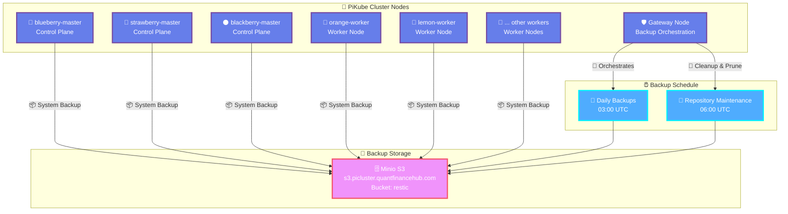

# {{ $frontmatter.title }}

<p align="center">
    
</p>

## Overview

[Restic](https://restic.net/) is a modern, secure, and efficient backup solution that provides fast incremental backups with strong encryption. This guide configures Restic to perform automated system-level backups of the PiKube cluster nodes using the existing Minio S3 backend.

### 🎯 Backup Strategy

The PiKube backup strategy implements a multi-layered approach:

- **System-level backups** (Restic) - OS configuration and critical files
- **Kubernetes application backups** (Velero) - Cluster resources and persistent volumes
- **Storage-level backups** (Longhorn) - Persistent volume snapshots

### 🔄 Backup Architecture



### 📋 Backup Scope

**Included in Backups:**

- System configuration files (`/etc/`)
- User home directories (`/home/`)
- Root configuration (`/root/`)
- SSH keys and certificates
- Kubernetes cluster configurations
- Custom application configs

**Excluded from Backups:**

- Temporary files and caches
- Log files (handled by centralized logging)
- Kubernetes data (handled by Velero/Longhorn)
- Large binary files and package caches

## Prerequisites

> [!NOTE] 🏠 Minio S3 Backend Required*  
> This guide assumes you have already configured Minio S3 storage as described in:  
> [Minio S3 Backup Backend Setup](../../3-external-services/1-s3-backup-backend-minio-setup.md)
>
> Required components:
>
> - **Minio Server**: Running on s3.picluster.quantfinancehub.com:9091
> - **Restic Bucket**: `restic` bucket created
> - **Restic User**: Dedicated user with bucket access
> - **TLS Certificates**: Valid SSL certificates configured

## Restic Installation

### Step 1: Install Restic Binary

Install Restic on **all cluster nodes** (masters and workers):

```bash
# Detect architecture
ARCH=$(uname -m)
if [ "$ARCH" == "x86_64" ]; then
    ARCH="amd64"
elif [ "$ARCH" == "aarch64" ]; then
    ARCH="arm64"
else
    echo "Unsupported architecture: $ARCH"
    exit 1
fi

# Download latest Restic release
RESTIC_VERSION=$(curl -s https://api.github.com/repos/restic/restic/releases/latest | jq -r '.tag_name' | sed 's/^v//')
wget https://github.com/restic/restic/releases/download/v${RESTIC_VERSION}/restic_${RESTIC_VERSION}_linux_${ARCH}.bz2

# Extract and install
bunzip2 restic_${RESTIC_VERSION}_linux_${ARCH}.bz2
chmod +x restic_${RESTIC_VERSION}_linux_${ARCH}
sudo mv restic_${RESTIC_VERSION}_linux_${ARCH} /usr/local/bin/restic

# Verify installation
restic version
```

### Step 2: Configure Environment Variables

Create Restic configuration on **all nodes**:

```bash
sudo mkdir -p /etc/restic
sudo chmod 750 /etc/restic
```

Create environment file `/etc/restic/env`:

```bash
# Restic Repository Configuration
export RESTIC_REPOSITORY="s3:https://s3.picluster.quantfinancehub.com:9091/restic"
export RESTIC_PASSWORD="your-secure-restic-password"

# S3 Backend Configuration  
export AWS_ACCESS_KEY_ID="restic"
export AWS_SECRET_ACCESS_KEY="restic_password"

# Custom CA Support (if using custom certificates)
export AWS_CA_BUNDLE="/usr/local/share/ca-certificates/rootCA.crt"

# Performance Tuning
export RESTIC_CACHE_DIR="/var/cache/restic"
export RESTIC_PACK_SIZE="16"
export RESTIC_COMPRESSION="auto"
```

Secure the environment file:

```bash
sudo chmod 600 /etc/restic/env
sudo chown root:root /etc/restic/env
```

> [!IMPORTANT] 🔐 Security Note**  
> Generate a strong password for `RESTIC_PASSWORD` and store it securely. This password encrypts all backup data.

### Step 3: Initialize Restic Repository

**On the primary master node** (blueberry-master), initialize the repository:

```bash
# Load environment variables
source /etc/restic/env

# Create cache directory
sudo mkdir -p $RESTIC_CACHE_DIR
sudo chmod 755 $RESTIC_CACHE_DIR

# Initialize repository (only run once)
sudo -E restic init
```

Expected output:

```bash
created restic repository f5c6108821 at s3:https://s3.picluster.quantfinancehub.com:9091/restic
Please note that knowledge of your password is required to access the repository.
Losing your password means that your data is irrecoverably lost.
```

### Step 4: Test Repository Access

Verify repository access from all nodes:

```bash
# Load environment and test
source /etc/restic/env
sudo -E restic snapshots

# Should show: repository is empty (or existing snapshots)
```

## Backup Configuration

### Step 5: Create Backup Scripts

#### Main Backup Script

Create `/etc/restic/backup.sh` on **all nodes**:

```bash
#!/bin/bash

# Load environment variables
source /etc/restic/env

# Configuration
HOSTNAME=$(hostname)
LOG_FILE="/var/log/restic-backup.log"
BACKUP_PATHS="/etc /home /root"
EXCLUDE_FILE="/etc/restic/exclude.txt"

# Logging function
log() {
    echo "$(date '+%Y-%m-%d %H:%M:%S') [$HOSTNAME] $1" | tee -a "$LOG_FILE"
}

# Create cache directory if it doesn't exist
mkdir -p "$RESTIC_CACHE_DIR"

log "Starting backup for $HOSTNAME"

# Perform backup
restic backup $BACKUP_PATHS \
    --tag "daily,$(date +%Y-%m)" \
    --tag "node:$HOSTNAME" \
    --exclude-file="$EXCLUDE_FILE" \
    --verbose 2>&1 | tee -a "$LOG_FILE"

BACKUP_EXIT_CODE=$?

if [ $BACKUP_EXIT_CODE -eq 0 ]; then
    log "Backup completed successfully"
else
    log "Backup failed with exit code $BACKUP_EXIT_CODE"
    exit $BACKUP_EXIT_CODE
fi

# Show latest snapshots
log "Latest snapshots:"
restic snapshots --last 3 --tag "node:$HOSTNAME" 2>&1 | tee -a "$LOG_FILE"

log "Backup process finished"
```

#### Repository Maintenance Script

Create `/etc/restic/maintenance.sh` on **gateway node only**:

```bash
#!/bin/bash

# Load environment variables
source /etc/restic/env

# Configuration
LOG_FILE="/var/log/restic-maintenance.log"
RETENTION_DAILY=7
RETENTION_WEEKLY=4
RETENTION_MONTHLY=6
RETENTION_YEARLY=2

# Logging function
log() {
    echo "$(date '+%Y-%m-%d %H:%M:%S') [MAINTENANCE] $1" | tee -a "$LOG_FILE"
}

log "Starting repository maintenance"

# Check repository integrity
log "Checking repository integrity..."
restic check --verbose 2>&1 | tee -a "$LOG_FILE"
CHECK_EXIT_CODE=$?

if [ $CHECK_EXIT_CODE -ne 0 ]; then
    log "Repository check failed with exit code $CHECK_EXIT_CODE"
    exit $CHECK_EXIT_CODE
fi

# Forget old snapshots according to retention policy
log "Applying retention policy..."
restic forget \
    --tag "daily" \
    --keep-daily $RETENTION_DAILY \
    --keep-weekly $RETENTION_WEEKLY \
    --keep-monthly $RETENTION_MONTHLY \
    --keep-yearly $RETENTION_YEARLY \
    --prune \
    --verbose 2>&1 | tee -a "$LOG_FILE"

FORGET_EXIT_CODE=$?

if [ $FORGET_EXIT_CODE -eq 0 ]; then
    log "Retention policy applied successfully"
else
    log "Retention policy failed with exit code $FORGET_EXIT_CODE"
    exit $FORGET_EXIT_CODE
fi

# Show repository statistics
log "Repository statistics:"
restic stats --mode blobs-per-file 2>&1 | tee -a "$LOG_FILE"

log "Maintenance completed successfully"
```

#### Exclusion File

Create `/etc/restic/exclude.txt` on **all nodes**:

```config
# Temporary files and caches
/tmp/*
/var/tmp/*
/var/cache/*
/var/log/*

# Container and Kubernetes runtime
/var/lib/docker/*
/var/lib/containerd/*
/var/lib/kubelet/pods/*
/var/lib/rancher/k3s/data/*

# System runtime
/proc/*
/sys/*
/dev/*
/run/*
/mnt/*
/media/*

# Package manager caches
/var/lib/apt/lists/*
/var/cache/apt/*

# Large files that change frequently  
*.log
*.tmp
*.swap
*~

# Exclude Restic cache from backup
/var/cache/restic/*

# SSH known_hosts (dynamic)
/root/.ssh/known_hosts
/home/*/.ssh/known_hosts
```

Make scripts executable:

```bash
sudo chmod +x /etc/restic/backup.sh /etc/restic/maintenance.sh
```

## Automation with Systemd and Cron

### Step 6: Create Systemd Service

Create `/etc/systemd/system/restic-backup.service` on **all nodes**:

```ini
[Unit]
Description=Restic Backup Service
After=network-online.target
Wants=network-online.target

[Service]
Type=oneshot
Environment="PATH=/usr/local/bin:/usr/bin:/bin"
EnvironmentFile=/etc/restic/env
ExecStart=/etc/restic/backup.sh
User=root
Group=root

# Logging
StandardOutput=journal
StandardError=journal
SyslogIdentifier=restic-backup

# Resource limits
MemoryLimit=1G
TimeoutStartSec=3600

[Install]
WantedBy=multi-user.target
```

Create `/etc/systemd/system/restic-maintenance.service` on **gateway node only**:

```ini
[Unit]
Description=Restic Repository Maintenance
After=network-online.target
Wants=network-online.target

[Service]
Type=oneshot
Environment="PATH=/usr/local/bin:/usr/bin:/bin"
EnvironmentFile=/etc/restic/env
ExecStart=/etc/restic/maintenance.sh
User=root
Group=root

# Logging
StandardOutput=journal
StandardError=journal
SyslogIdentifier=restic-maintenance

# Resource limits
MemoryLimit=512M
TimeoutStartSec=7200

[Install]
WantedBy=multi-user.target
```

### Step 7: Configure Cron Scheduling

Create cron jobs on **all nodes** for daily backups:

```bash
# Create backup cron job
sudo crontab -e

# Add this line for daily backup at 3:00 AM
0 3 * * * /bin/systemctl start restic-backup.service
```

Create maintenance cron job on **gateway node only**:

```bash
# Add this line for daily maintenance at 6:00 AM
0 6 * * * /bin/systemctl start restic-maintenance.service
```

### Step 8: Enable Services

```bash
# Reload systemd configuration
sudo systemctl daemon-reload

# Enable services (they will be triggered by cron)
sudo systemctl enable restic-backup.service
sudo systemctl enable restic-maintenance.service  # Gateway only
```

## Backup Operations

### Manual Backup

Run an immediate backup:

```bash
sudo systemctl start restic-backup.service

# Monitor progress
sudo journalctl -u restic-backup.service -f
```

### View Backup Status

Check recent snapshots:

```bash
source /etc/restic/env
sudo -E restic snapshots --tag "node:$(hostname)"
```

View detailed snapshot information:

```bash
sudo -E restic snapshots --tag "node:$(hostname)" --json | jq '.[0]'
```

### Restore Operations

#### List Files in Snapshot

```bash
source /etc/restic/env
sudo -E restic ls latest --tag "node:$(hostname)"
```

#### Restore Specific Files

```bash
# Restore specific directory
sudo -E restic restore latest:/etc/ssh --target /tmp/restore --tag "node:$(hostname)"

# Restore entire snapshot
sudo -E restic restore latest --target /tmp/full-restore --tag "node:$(hostname)"
```

#### Mount Backup for Browsing

```bash
# Create mount point
sudo mkdir -p /mnt/restic

# Mount latest snapshot
sudo -E restic mount /mnt/restic --tag "node:$(hostname)"

# Browse files (in another terminal)
ls -la /mnt/restic/snapshots/latest/

# Unmount when done
sudo umount /mnt/restic
```

## Monitoring and Alerting

### Step 9: Backup Status Monitoring

Create monitoring script `/etc/restic/monitor.sh`:

```bash
#!/bin/bash

source /etc/restic/env

HOSTNAME=$(hostname)
WEBHOOK_URL="https://your-monitoring-system/webhook"  # Optional

# Check last backup age
LAST_BACKUP=$(restic snapshots --tag "node:$HOSTNAME" --json | jq -r '.[0].time')
LAST_BACKUP_EPOCH=$(date -d "$LAST_BACKUP" +%s)
CURRENT_EPOCH=$(date +%s)
AGE_HOURS=$(( (CURRENT_EPOCH - LAST_BACKUP_EPOCH) / 3600 ))

echo "Last backup for $HOSTNAME: $AGE_HOURS hours ago"

if [ $AGE_HOURS -gt 48 ]; then
    echo "WARNING: Backup is older than 48 hours!"
    # Send alert to monitoring system
    # curl -X POST "$WEBHOOK_URL" -d "Backup alert: $HOSTNAME backup is $AGE_HOURS hours old"
    exit 1
fi

echo "Backup status: OK"
```

### Log Rotation

Configure log rotation in `/etc/logrotate.d/restic`:

```config
/var/log/restic-*.log {
    daily
    rotate 30
    compress
    delaycompress
    missingok
    notifempty
    create 0644 root root
}
```

## Troubleshooting

### Common Issues

| Issue | Symptoms | Solution |
|-------|----------|----------|
| **Repository Access Error** | `unable to open config file` | Check S3 credentials and network connectivity |
| **Certificate Errors** | `x509: certificate signed by unknown authority` | Verify `AWS_CA_BUNDLE` path and certificate installation |
| **Permission Denied** | `permission denied` during backup | Check file permissions and run as root |
| **Out of Space** | `no space left on device` | Check local cache directory and Minio storage |
| **Slow Backups** | Long backup times | Adjust `RESTIC_PACK_SIZE` and check network bandwidth |

### Debug Commands

```bash
# Test S3 connectivity
source /etc/restic/env
sudo -E restic stats

# Check repository consistency
sudo -E restic check --read-data

# View repository info
sudo -E restic cat config

# List all snapshots with details
sudo -E restic snapshots --json | jq '.'

# Show repository size
sudo -E restic stats --mode restore-size
```

### Performance Tuning

Optimize backup performance in `/etc/restic/env`:

```bash
# Increase pack size for faster backups (default: 16MB)
export RESTIC_PACK_SIZE="32"

# Enable compression (auto, max, off)
export RESTIC_COMPRESSION="max"

# Increase cache size
export RESTIC_CACHE_DIR="/var/cache/restic"

# Limit concurrent connections
export RESTIC_CONNECTIONS="5"
```

## Security Best Practices

### 🔐 Encryption and Security

1. **Strong Passwords**: Use cryptographically secure passwords for `RESTIC_PASSWORD`
2. **Access Control**: Limit S3 user permissions to only the restic bucket
3. **Certificate Validation**: Always validate TLS certificates
4. **Environment Security**: Protect environment files (600 permissions)
5. **Regular Testing**: Periodically test restore procedures

### 🔄 Backup Validation

```bash
# Verify backup integrity monthly
sudo -E restic check --read-data

# Test restore capability
sudo -E restic restore latest:/etc/hostname --target /tmp/test-restore
cat /tmp/test-restore/etc/hostname
```

## Advanced Configuration

### Multi-Repository Setup

For enhanced security, consider separate repositories per node type:

```bash
# Master nodes repository
export RESTIC_REPOSITORY="s3:https://s3.picluster.quantfinancehub.com:9091/restic-masters"

# Worker nodes repository  
export RESTIC_REPOSITORY="s3:https://s3.picluster.quantfinancehub.com:9091/restic-workers"
```

### Backup Encryption Key Management

For enterprise environments, use key files instead of passwords:

```bash
# Generate key file
restic generate --repo s3:https://s3.picluster.quantfinancehub.com:9091/restic > /etc/restic/key

# Use key file
export RESTIC_KEY_FILE="/etc/restic/key"
# Remove RESTIC_PASSWORD from environment
```

This Restic backup solution provides automated, encrypted, and reliable system-level backups for your PiKube cluster, ensuring that critical configuration and user data is protected and can be quickly restored when needed.

## References

- [Restic Documentation](https://restic.readthedocs.io/)
- [Restic GitHub Repository](https://github.com/restic/restic)
- [S3 Backend Configuration](https://restic.readthedocs.io/en/stable/030_preparing_a_new_repo.html#amazon-s3)
- [Backup Best Practices](https://restic.readthedocs.io/en/stable/040_backup.html)