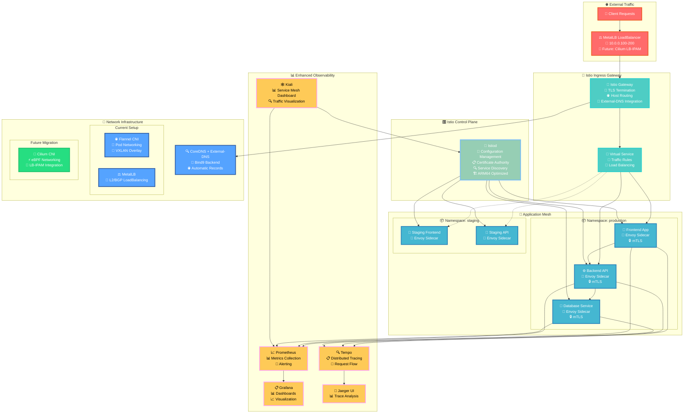

# {{ $frontmatter.title }}

## Overview

Istio is a comprehensive service mesh platform that provides advanced traffic management, security, and observability capabilities for microservices running in Kubernetes. This guide covers the deployment and configuration of Istio on the PiKube ARM64 cluster, integrating seamlessly with the existing infrastructure and preparing for future network migrations.

> [!IMPORTANT] 🔗 Current Network Architecture
> This deployment is optimized for the current PiKube setup:
> - **CNI**: Flannel (with future Cilium migration support)
> - **Load Balancer**: MetalLB (with Cilium LB-IPAM migration path)
> - **DNS**: CoreDNS + External-DNS with Bind9
> - **Observability**: Prometheus, Grafana, Tempo integration

### 🏗️ Istio Architecture on PiKube



### 🎯 Key Features

#### Advanced Traffic Management
- **Intelligent Routing**: Host-based, path-based, and header-based routing
- **Load Balancing**: Multiple algorithms (round-robin, least-request, random)
- **Circuit Breakers**: Fault tolerance and resilience patterns
- **Retries & Timeouts**: Automatic request retry and timeout handling

#### Enhanced Security
- **mTLS Automation**: Automatic mutual TLS between services
- **Authorization Policies**: Fine-grained access control
- **Security Scanning**: Runtime security analysis
- **Certificate Management**: Automatic certificate rotation

#### Deep Observability
- **Request Tracing**: End-to-end distributed tracing
- **Service Topology**: Visual service dependency mapping
- **Metrics Collection**: L4 and L7 metrics with Prometheus
- **Log Aggregation**: Structured logging with correlation IDs

## Prerequisites

### Cluster Requirements

Ensure your PiKube cluster meets these requirements:

```bash
# Verify cluster status
kubectl cluster-info

# Check node resources (Istio needs ~200Mi memory per node)
kubectl top nodes

# Verify existing components
kubectl get pods -n kube-system | grep -E "(flannel|coredns)"
kubectl get pods -n metal-lb
kubectl get pods -n monitoring
```

### Network Infrastructure Compatibility

#### Current Setup Verification

```bash
# Verify Flannel CNI
kubectl -n kube-system get configmap kube-flannel-cfg -o yaml
kubectl -n kube-system get pods -l app=flannel

# Check MetalLB status
kubectl -n metal-lb get pods
kubectl -n metal-lb get configmap config -o yaml

# Verify External-DNS integration
kubectl -n external-dns get pods
kubectl -n external-dns logs -l app.kubernetes.io/name=external-dns
```

> [!NOTE] 🔮 Future Cilium Migration Path
> This Istio installation is designed to work with both current Flannel + MetalLB setup and future Cilium migration:
>
> - **Istio CNI compatibility** with both Flannel and Cilium
> - **Gateway configuration** that works with MetalLB and Cilium LB-IPAM
> - **Monitoring setup** that adapts to network infrastructure changes

## Installation

### 1. Install Istioctl

Download and install the Istio CLI tool for ARM64:

```bash
# Download Istio for ARM64
curl -L https://istio.io/downloadIstio | ISTIO_ARCH=arm64 sh -

# Move to PATH
sudo mv istio-*/bin/istioctl /usr/local/bin/

# Verify installation
istioctl version --remote=false
```

### 2. Pre-installation Configuration

#### Network Infrastructure Preparation

Create Istio configuration optimized for current setup with future migration support:

```bash
# Create Istio configuration (minimal working version)
cat <<EOF > istio-pikube-config.yaml
apiVersion: install.istio.io/v1alpha1
kind: IstioOperator
metadata:
  name: pikube-control-plane
  namespace: istio-system
spec:
  values:
    pilot:
      env:
        EXTERNAL_ISTIOD: false
    cni:
      enabled: true
      excludeNamespaces:
        - istio-system
        - kube-system
        - metal-lb
        - monitoring
    meshConfig:
      defaultConfig:
        proxyMemoryLimit: 128Mi
        proxyCPULimit: 100m
        concurrency: 2
  components:
    pilot:
      k8s:
        resources:
          requests:
            memory: 128Mi
            cpu: 100m
          limits:
            memory: 512Mi
            cpu: 500m
    ingressGateways:
    - name: istio-ingressgateway
      enabled: true
      k8s:
        service:
          type: LoadBalancer
        resources:
          requests:
            memory: 64Mi
            cpu: 50m
          limits:
            memory: 256Mi
            cpu: 200m
EOF
```

### 3. Install Istio Components

#### Install Base Components

```bash
# Create namespace
kubectl create namespace istio-system

# Install base Istio components
istioctl install -f istio-pikube-config.yaml --verify

# Verify installation
kubectl -n istio-system get pods
kubectl -n istio-system get svc
```

#### Verify Network Integration

```bash
# Check MetalLB assignment
kubectl -n istio-system get svc istio-ingressgateway -o wide

# Verify External-DNS record creation
kubectl -n external-dns logs -l app.kubernetes.io/name=external-dns | grep istio

# Test external connectivity
curl -I http://10.0.0.100  # Should get response from Istio gateway
```

### 4. Configure Istio Gateway

Create an Istio Gateway that integrates with your existing DNS and certificate setup:

```yaml
# istio-gateway.yaml
apiVersion: networking.istio.io/v1beta1
kind: Gateway
metadata:
  name: pikube-gateway
  namespace: istio-system
spec:
  selector:
    istio: ingressgateway
  servers:
  # HTTP server (redirects to HTTPS)
  - port:
      number: 80
      name: http
      protocol: HTTP
    hosts:
    - "*.picluster.quantfinancehub.com"
    tls:
      httpsRedirect: true
  
  # HTTPS server
  - port:
      number: 443
      name: https
      protocol: HTTPS
    hosts:
    - "*.picluster.quantfinancehub.com"
    tls:
      mode: SIMPLE
      credentialName: wildcard-tls

---
# Certificate for Istio Gateway (using existing cert-manager setup)
apiVersion: cert-manager.io/v1
kind: Certificate
metadata:
  name: wildcard-tls
  namespace: istio-system
spec:
  secretName: wildcard-tls
  issuerRef:
    name: letsencrypt-prod  # Use your existing ClusterIssuer
    kind: ClusterIssuer
  commonName: "*.picluster.quantfinancehub.com"
  dnsNames:
  - "*.picluster.quantfinancehub.com"
  - "picluster.quantfinancehub.com"
```

Apply the gateway configuration:

```bash
kubectl apply -f istio-gateway.yaml

# Verify certificate issuance
kubectl -n istio-system get certificate
kubectl -n istio-system describe certificate wildcard-tls
```

## Observability Integration

### 1. Prometheus Integration

Configure Istio metrics collection with your existing Prometheus:

```yaml
# istio-prometheus-integration.yaml
apiVersion: v1
kind: ConfigMap
metadata:
  name: prometheus-additional-config
  namespace: monitoring
data:
  istio-scrape-config.yml: |
    # Istio control plane metrics
    - job_name: 'istio-mesh'
      kubernetes_sd_configs:
      - role: endpoints
        namespaces:
          names:
          - istio-system
      relabel_configs:
      - source_labels: [__meta_kubernetes_service_name, __meta_kubernetes_endpoint_port_name]
        action: keep
        regex: istio-proxy;http-monitoring
      - source_labels: [__address__, __meta_kubernetes_endpoint_port]
        action: replace
        regex: ([^:]+)(?::\d+)?;(\d+)
        replacement: $1:15090
        target_label: __address__
      - action: labelmap
        regex: __meta_kubernetes_service_label_(.+)
      - source_labels: [__meta_kubernetes_namespace]
        action: replace
        target_label: kubernetes_namespace
      - source_labels: [__meta_kubernetes_service_name]
        action: replace
        target_label: kubernetes_name

    # Istiod metrics
    - job_name: 'pilot'
      kubernetes_sd_configs:
      - role: endpoints
        namespaces:
          names:
          - istio-system
      relabel_configs:
      - source_labels: [__meta_kubernetes_service_name, __meta_kubernetes_endpoint_port_name]
        action: keep
        regex: istiod;http-monitoring
      - source_labels: [__address__]
        action: replace
        targetLabel: job
        replacement: pilot

    # Envoy proxy metrics (all namespaces)
    - job_name: 'envoy-stats'
      kubernetes_sd_configs:
      - role: pod
      relabel_configs:
      - source_labels: [__meta_kubernetes_pod_container_port_name]
        action: keep
        regex: '.*-envoy-prom'
      - source_labels: [__address__, __meta_kubernetes_pod_annotation_prometheus_io_port]
        action: replace
        regex: ([^:]+)(?::\d+)?;(\d+)
        replacement: $1:15090
        target_label: __address__
      - action: labelmap
        regex: __meta_kubernetes_pod_label_(.+)
      - source_labels: [__meta_kubernetes_namespace]
        action: replace
        target_label: kubernetes_namespace
      - source_labels: [__meta_kubernetes_pod_name]
        action: replace
        target_label: kubernetes_pod_name

---
# Add to your existing prometheus values or configuration
# This ensures Istio metrics are collected
apiVersion: v1
kind: Secret
metadata:
  name: additional-scrape-configs
  namespace: monitoring
type: Opaque
stringData:
  prometheus-additional.yaml: |
    - job_name: 'istio-mesh'
      kubernetes_sd_configs:
      - role: endpoints
        namespaces:
          names:
          - istio-system
      relabel_configs:
      - source_labels: [__meta_kubernetes_service_name, __meta_kubernetes_endpoint_port_name]
        action: keep
        regex: istio-proxy;http-monitoring
      metric_relabel_configs:
      - source_labels: [__name__]
        regex: 'istio_.*'
        target_label: job
        replacement: 'istio-mesh'
```

### 2. Grafana Dashboards

Deploy Istio-specific Grafana dashboards:

```bash
# Create directory for dashboard files
mkdir -p /tmp/istio-dashboards

# Download official Istio dashboards
curl -L https://grafana.com/api/dashboards/7639/revisions/latest/download > /tmp/istio-dashboards/istio-mesh-dashboard.json
curl -L https://grafana.com/api/dashboards/7636/revisions/latest/download > /tmp/istio-dashboards/istio-service-dashboard.json
curl -L https://grafana.com/api/dashboards/7630/revisions/latest/download > /tmp/istio-dashboards/istio-workload-dashboard.json
curl -L https://grafana.com/api/dashboards/11829/revisions/latest/download > /tmp/istio-dashboards/istio-control-plane-dashboard.json

# Create ConfigMaps for Grafana
for dashboard in /tmp/istio-dashboards/*.json; do
    name=$(basename "$dashboard" .json)
    kubectl create configmap "$name" \
      --from-file="$dashboard" \
      --namespace monitoring
    kubectl label configmap "$name" grafana_dashboard=1 -n monitoring
done

# Cleanup
rm -rf /tmp/istio-dashboards
```

### 3. Kiali Installation

Deploy Kiali for service mesh visualization:

```bash
# Add Kiali Helm repository
helm repo add kiali https://kiali.org/helm-charts
helm repo update

# Create Kiali configuration
cat <<EOF > kiali-values.yaml
cr:
  create: true
  namespace: istio-system
  spec:
    # Integration with existing auth
    auth:
      strategy: anonymous  # Change to openid for production
    
    # External services configuration
    external_services:
      prometheus:
        url: "http://kube-prometheus-stack-prometheus.monitoring.svc.cluster.local:9090"
      
      grafana:
        enabled: true
        in_cluster_url: "http://kube-prometheus-stack-grafana.monitoring.svc.cluster.local:3000"
        url: "https://grafana.picluster.quantfinancehub.com"
      
      tracing:
        enabled: true
        in_cluster_url: "http://tempo-query-frontend.monitoring.svc.cluster.local:3200"
        url: "https://tempo.picluster.quantfinancehub.com"
        use_grpc: false
    
    # Deployment configuration
    deployment:
      # Resource optimization for ARM
      resources:
        requests:
          memory: "64Mi"
          cpu: "50m"
        limits:
          memory: "256Mi"
          cpu: "200m"
      
      # Node selection
      node_selector:
        node-role.kubernetes.io/worker: "true"
    
    # Server configuration
    server:
      web_root: "/kiali"
    
    # Ingress configuration for external access
    server:
      web_fqdn: "kiali.picluster.quantfinancehub.com"
    
    # Custom dashboards
    custom_dashboards:
    - name: "pikube-overview"
      title: "PiKube Cluster Overview"
    - name: "istio-performance"
      title: "Istio Performance Metrics"
EOF

# Install Kiali
helm install kiali-operator kiali/kiali-operator \
  --namespace kiali-operator \
  --create-namespace \
  -f kiali-values.yaml

# Wait for Kiali to be ready
kubectl wait --for=condition=Ready pod -l app=kiali -n istio-system --timeout=300s
```

### 4. Kiali Ingress Configuration

Create ingress for Kiali dashboard:

```yaml
# kiali-ingress.yaml
apiVersion: networking.istio.io/v1beta1
kind: VirtualService
metadata:
  name: kiali
  namespace: istio-system
spec:
  hosts:
  - kiali.picluster.quantfinancehub.com
  gateways:
  - pikube-gateway
  http:
  - match:
    - uri:
        prefix: /
    route:
    - destination:
        host: kiali
        port:
          number: 20001

---
# External-DNS will automatically create DNS records
# based on the VirtualService host configuration
```

Apply the Kiali ingress:

```bash
kubectl apply -f kiali-ingress.yaml
```

## Application Integration

### 1. Namespace Preparation

Enable Istio injection for application namespaces:

```bash
# Label namespace for automatic sidecar injection
kubectl label namespace default istio-injection=enabled

# Create a test namespace
kubectl create namespace istio-test
kubectl label namespace istio-test istio-injection=enabled

# Verify injection
kubectl get namespace -L istio-injection
```

### 2. Sample Application

Deploy a sample application to test Istio functionality:

```yaml
# bookinfo-pikube.yaml
apiVersion: v1
kind: Service
metadata:
  name: productpage
  namespace: istio-test
  labels:
    app: productpage
    service: productpage
spec:
  ports:
  - port: 9080
    name: http
  selector:
    app: productpage

---
apiVersion: v1
kind: ServiceAccount
metadata:
  name: bookinfo-productpage
  namespace: istio-test
  labels:
    account: productpage

---
apiVersion: apps/v1
kind: Deployment
metadata:
  name: productpage-v1
  namespace: istio-test
  labels:
    app: productpage
    version: v1
spec:
  replicas: 1
  selector:
    matchLabels:
      app: productpage
      version: v1
  template:
    metadata:
      annotations:
        sidecar.istio.io/inject: "true"
      labels:
        app: productpage
        version: v1
    spec:
      serviceAccountName: bookinfo-productpage
      containers:
      - name: productpage
        image: docker.io/istio/examples-bookinfo-productpage-v1:1.17.0
        imagePullPolicy: IfNotPresent
        ports:
        - containerPort: 9080
        env:
        - name: SERVICE_VERSION
          value: v1
        resources:
          requests:
            memory: "64Mi"
            cpu: "50m"
          limits:
            memory: "128Mi"
            cpu: "100m"

---
# Virtual Service for routing
apiVersion: networking.istio.io/v1beta1
kind: VirtualService
metadata:
  name: productpage
  namespace: istio-test
spec:
  hosts:
  - bookinfo.picluster.quantfinancehub.com
  gateways:
  - istio-system/pikube-gateway
  http:
  - match:
    - uri:
        exact: /productpage
    - uri:
        prefix: /static
    - uri:
        exact: /login
    - uri:
        exact: /logout
    - uri:
        prefix: /api/v1/products
    route:
    - destination:
        host: productpage
        port:
          number: 9080

---
# Destination Rule for load balancing
apiVersion: networking.istio.io/v1beta1
kind: DestinationRule
metadata:
  name: productpage
  namespace: istio-test
spec:
  host: productpage
  trafficPolicy:
    loadBalancer:
      simple: LEAST_CONN
```

Deploy the sample application:

```bash
kubectl apply -f bookinfo-pikube.yaml

# Wait for deployment
kubectl wait --for=condition=Available deployment/productpage-v1 -n istio-test --timeout=300s

# Verify sidecar injection
kubectl get pods -n istio-test -o jsonpath='{.items[*].spec.containers[*].name}' | grep -o istio-proxy

# Test application
curl -I https://bookinfo.picluster.quantfinancehub.com/productpage
```

## Future Network Migration Considerations

### 🚀 Cilium Migration Preparation

This Istio installation is designed to seamlessly work with future Cilium migration:

#### 1. CNI Migration Compatibility

```yaml
# Future Cilium configuration adjustments
# When migrating to Cilium, update the IstioOperator:
apiVersion: install.istio.io/v1alpha1
kind: IstioOperator
metadata:
  name: pikube-cilium-migration
  namespace: istio-system
spec:
  values:
    # Update CNI configuration for Cilium
    cni:
      enabled: true
      # Cilium-specific settings
      cniBinDir: /opt/cni/bin
      cniConfDir: /etc/cni/net.d
      # Ensure compatibility with Cilium eBPF
      excludeNamespaces:
        - istio-system
        - kube-system
        - cilium-system  # Add Cilium system namespace
```

#### 2. Load Balancer Migration

```yaml
# When migrating to Cilium LB-IPAM, update gateway service:
apiVersion: v1
kind: Service
metadata:
  name: istio-ingressgateway
  namespace: istio-system
  annotations:
    # Remove MetalLB annotations
    # metallb.universe.tf/allow-shared-ip: "istio-gateway"
    # metallb.universe.tf/address-pool: default

    # Add Cilium LB-IPAM annotations
    io.cilium/lb-ipam-ips: "10.0.0.111,10.0.0.112"
    external-dns.alpha.kubernetes.io/hostname: "*.picluster.quantfinancehub.com"
spec:
  type: LoadBalancer
  # Remove loadBalancerIP when using Cilium
  # loadBalancerIP: 10.0.0.100
```

#### 3. Migration Checklist

> [!TIP] 📋 Cilium Migration Steps
> When ready to migrate to Cilium:
> 
> 1. **Backup current configuration**:
>    ```bash
>    kubectl get istiooperator -n istio-system -o yaml > istio-backup.yaml
>    kubectl get svc istio-ingressgateway -n istio-system -o yaml > gateway-backup.yaml
>    ```
> 
> 2. **Install Cilium** following your [Cilium documentation](../5-networking/5-cilium-kubernetes-cni.md)
> 
> 3. **Update Istio configuration**:
>    ```bash
>    istioctl install -f istio-cilium-config.yaml --skip-confirmation
>    ```
> 
> 4. **Migrate load balancer services**:
>    ```bash
>    kubectl patch svc istio-ingressgateway -n istio-system --patch-file gateway-cilium-patch.yaml
>    ```
> 
> 5. **Verify connectivity and DNS records**

## Advanced Traffic Management

### 1. Canary Deployments

```yaml
# canary-deployment.yaml
apiVersion: networking.istio.io/v1beta1
kind: VirtualService
metadata:
  name: productpage-canary
  namespace: istio-test
spec:
  hosts:
  - bookinfo.picluster.quantfinancehub.com
  gateways:
  - istio-system/pikube-gateway
  http:
  - match:
    - headers:
        canary:
          exact: "true"
    route:
    - destination:
        host: productpage
        subset: v2
  - route:
    - destination:
        host: productpage
        subset: v1
      weight: 90
    - destination:
        host: productpage
        subset: v2
      weight: 10

---
apiVersion: networking.istio.io/v1beta1
kind: DestinationRule
metadata:
  name: productpage-canary
  namespace: istio-test
spec:
  host: productpage
  subsets:
  - name: v1
    labels:
      version: v1
  - name: v2
    labels:
      version: v2
  trafficPolicy:
    tls:
      mode: ISTIO_MUTUAL
```

### 2. Circuit Breaker Pattern

```yaml
# circuit-breaker.yaml
apiVersion: networking.istio.io/v1beta1
kind: DestinationRule
metadata:
  name: productpage-circuit-breaker
  namespace: istio-test
spec:
  host: productpage
  trafficPolicy:
    connectionPool:
      tcp:
        maxConnections: 10
      http:
        http1MaxPendingRequests: 10
        http2MaxRequests: 100
        maxRequestsPerConnection: 2
        maxRetries: 3
    outlierDetection:
      consecutiveErrors: 3
      interval: 30s
      baseEjectionTime: 30s
      maxEjectionPercent: 50
      minHealthPercent: 50
```

### 3. Security Policies

#### mTLS Configuration

```yaml
# mtls-policy.yaml
apiVersion: security.istio.io/v1beta1
kind: PeerAuthentication
metadata:
  name: default
  namespace: istio-test
spec:
  mtls:
    mode: STRICT

---
apiVersion: security.istio.io/v1beta1
kind: AuthorizationPolicy
metadata:
  name: productpage-authorization
  namespace: istio-test
spec:
  selector:
    matchLabels:
      app: productpage
  rules:
  - from:
    - source:
        principals: ["cluster.local/ns/istio-system/sa/istio-ingressgateway-service-account"]
  - to:
    - operation:
        methods: ["GET", "POST"]
```

## Monitoring and Alerting

### 1. Istio-Specific Alerts

```yaml
# istio-alerts.yaml
apiVersion: monitoring.coreos.com/v1
kind: PrometheusRule
metadata:
  name: istio-alerts
  namespace: monitoring
  labels:
    prometheus: kube-prometheus
    role: alert-rules
spec:
  groups:
  - name: istio.rules
    rules:
    - alert: IstioHighRequestLatency
      expr: histogram_quantile(0.99, sum(irate(istio_request_duration_milliseconds_bucket[5m])) by (destination_service_name, le)) > 1000
      for: 5m
      labels:
        severity: warning
      annotations:
        summary: "High request latency on {{$labels.destination_service_name}}"
        description: "{{$labels.destination_service_name}} has 99th percentile latency above 1s"
    
    - alert: IstioHighErrorRate
      expr: sum(irate(istio_requests_total{response_code!~"2.."}[5m])) / sum(irate(istio_requests_total[5m])) > 0.05
      for: 5m
      labels:
        severity: critical
      annotations:
        summary: "High error rate in service mesh"
        description: "Error rate is {{$value | humanizePercentage}}"
    
    - alert: IstioConfigurationError
      expr: increase(pilot_k8s_cfg_events{type="Error"}[5m]) > 0
      for: 1m
      labels:
        severity: warning
      annotations:
        summary: "Istio configuration error detected"
        description: "Pilot detected {{$value}} configuration errors"
    
    - alert: IstioProxyConnectionFailure
      expr: increase(envoy_cluster_upstream_cx_connect_fail[5m]) > 10
      for: 5m
      labels:
        severity: warning
      annotations:
        summary: "High connection failure rate to upstream"
        description: "Envoy connection failures: {{$value}}"
```

Apply the alerts:

```bash
kubectl apply -f istio-alerts.yaml
```

## Troubleshooting

### Common Issues

| Issue | Symptoms | Solution |
|-------|----------|----------|
| **Sidecar Injection Fails** | Pods don't have Envoy sidecar | Check namespace labels and admission controller |
| **Gateway Not Accessible** | External traffic can't reach services | Verify MetalLB and gateway configuration |
| **High Memory Usage** | Nodes running out of memory | Optimize resource limits and reduce tracing sampling |
| **Certificate Issues** | TLS errors in logs | Check cert-manager and Istio certificate configuration |
| **DNS Resolution Issues** | Services can't reach external domains | Verify External-DNS and CoreDNS configuration |

### Debug Commands

```bash
# Check Istio configuration
istioctl analyze

# Verify proxy configuration
istioctl proxy-config cluster <pod-name> -n <namespace>

# Check certificate status
istioctl proxy-config secret <pod-name> -n <namespace>

# Analyze traffic routing
istioctl proxy-config route <pod-name> -n <namespace>

# Check Envoy logs
kubectl logs <pod-name> -c istio-proxy -n <namespace>

# Verify mTLS status
istioctl authn tls-check <pod-name>.<namespace>.svc.cluster.local

# Check pilot logs
kubectl -n istio-system logs -l app=istiod

# Test connectivity
istioctl proxy-config endpoints <pod-name> -n <namespace>

# Check MetalLB service assignment
kubectl -n istio-system get svc istio-ingressgateway -o wide

# Verify External-DNS record creation
kubectl -n external-dns logs -l app.kubernetes.io/name=external-dns | grep -i istio
```

### Network-Specific Debugging

#### Current Setup (Flannel + MetalLB)

```bash
# Check Flannel status
kubectl -n kube-system get pods -l app=flannel
kubectl -n kube-system logs -l app=flannel

# Verify MetalLB configuration
kubectl -n metal-lb get configmap config -o yaml
kubectl -n metal-lb get pods
kubectl -n metal-lb logs -l app=metallb

# Test external connectivity
ping 10.0.0.100  # Should reach Istio gateway
curl -I http://10.0.0.100  # Should get Istio response
```

#### Future Setup (Cilium)

```bash
# When using Cilium, these commands will be relevant:
kubectl -n kube-system exec ds/cilium -- cilium status
kubectl -n kube-system exec ds/cilium -- cilium service list
kubectl -n kube-system logs -l k8s-app=cilium
```

## Best Practices

### 🔧 Configuration

1. **Resource Management**: Set appropriate resource limits for ARM64 nodes
2. **Namespace Isolation**: Use different namespaces for different environments
3. **Gradual Rollout**: Enable sidecar injection incrementally
4. **Certificate Management**: Integrate with existing cert-manager setup
5. **DNS Integration**: Leverage External-DNS for automatic record management

### 🚀 Performance

1. **Sampling Configuration**: Adjust tracing sampling for production
2. **Resource Optimization**: Tune Envoy proxy resources for ARM64
3. **Cache Configuration**: Optimize pilot cache settings
4. **Network Policies**: Use Kubernetes network policies with Istio
5. **Load Balancing**: Configure appropriate load balancing algorithms

### 🔒 Security

1. **mTLS Enforcement**: Enable strict mTLS for all services
2. **Authorization Policies**: Implement fine-grained access control
3. **Certificate Rotation**: Automate certificate management
4. **Network Segmentation**: Use Istio security policies
5. **Audit Logging**: Enable comprehensive audit logging

### 🔍 Observability

1. **Distributed Tracing**: Configure end-to-end tracing
2. **Metrics Collection**: Collect both L4 and L7 metrics
3. **Dashboard Creation**: Build service-specific dashboards
4. **Alert Configuration**: Set up proactive alerting
5. **Service Map Visualization**: Use Kiali for topology understanding

### 🔄 Migration Planning

1. **Network Compatibility**: Design for current and future CNI
2. **Load Balancer Flexibility**: Use annotations that work across solutions
3. **Configuration Versioning**: Track configuration changes
4. **Testing Strategy**: Test traffic flows before and after migration
5. **Rollback Planning**: Maintain ability to revert changes

## Cleanup and Uninstallation

### Remove Istio Components

```bash
# Remove sample applications
kubectl delete namespace istio-test

# Remove Istio configuration
istioctl uninstall --purge

# Remove CRDs
kubectl delete crd $(kubectl get crd | grep istio.io | awk '{print $1}')

# Remove namespace
kubectl delete namespace istio-system

# Clean up MetalLB configuration
kubectl -n metal-lb patch configmap config --type merge -p '{"data":{"config":""}}'
```

This comprehensive Istio deployment provides enterprise-grade service mesh capabilities to your PiKube cluster while maintaining compatibility with both current and future network infrastructure.
