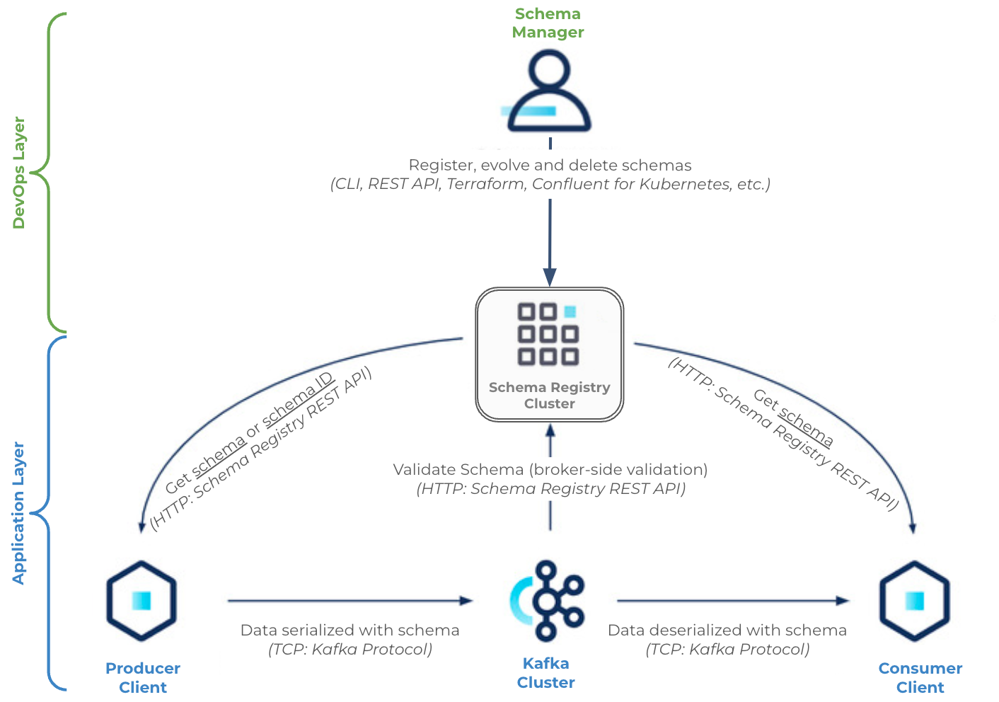

# {{ $frontmatter.title }}

<p align="center">
    
</p>

## Kafka Cluster Installation

This guide outlines the deployment of an Apache Kafka cluster on Kubernetes using the [**`Strimzi Kafka Operator`**](https://strimzi.io/). Strimzi simplifies Kafka deployment and management by providing Kubernetes-native resources.

### Installing the Strimzi Operator Using Helm

- Add the Strimzi Helm repository

```bash
helm repo add strimzi https://strimzi.io/charts/
```

- Update Helm repositories

```bash
helm repo update
```

- Create the `kafka` Namespace

```bash
kubectl create namespace kafka
```

- Install the Strimzi Kafka Operator:

```bash
helm install strimzi-kafka-operator strimzi/strimzi-kafka-operator --namespace kafka
```

- Ensure the operator pods are running successfully.

```bash
kubectl -n kafka get pods
```

### Deploying the Kafka Cluster

With the Strimzi operator installed, you can now deploy a Kafka cluster by creating a Kafka Custom Resource Definition (CRD).

- Create a manifest file named `kafka-cluster.yaml`

```yaml
apiVersion: kafka.strimzi.io/v1beta2
kind: Kafka
metadata:
  name: my-cluster
  namespace: kafka
spec:
  kafka:
    version: 3.5.1
    replicas: 3
    listeners:
      - name: plain
        port: 9092
        type: internal
        tls: false
      - name: tls
        port: 9093
        type: internal
        tls: true
    config:
      offsets.topic.replication.factor: 3
      transaction.state.log.replication.factor: 3
      transaction.state.log.min.isr: 2
      default.replication.factor: 3
      min.insync.replicas: 2
      inter.broker.protocol.version: "3.5"
    storage:
      type: jbod
      volumes:
        - id: 0
          type: persistent-claim
          class: longhorn
          size: 5Gi
          deleteClaim: false

  zookeeper:
    replicas: 3
    storage:
      type: persistent-claim
      size: 5Gi
      class: longhorn
      deleteClaim: false

  entityOperator:
    topicOperator: {}
    userOperator: {}
```

> [!NOTE]
> **Configuration Highlights**:
>
> - **Kafka Brokers**: Three brokers are deployed with both plain (non-TLS) and TLS listeners.
> - **ZooKeeper**: Three ZooKeeper instances manage Kafka cluster metadata.
>- **Storage**: Persistent volumes are provisioned using the Longhorn storage class, each with 5Gi of storage.
> - **High Availability**: Replication factors and in-sync replica settings ensure data redundancy and fault tolerance.

- Deploy the Kafka cluster by applying the manifest:

```bash
kubectl apply -f kafka-cluster.yaml
```

- Check the status of the Kafka cluster to ensure it's running correctly:

```bash
kubectl get kafka -n kafka
```

**Expected Output**:

```bash
NAME         DESIRED KAFKA REPLICAS   DESIRED ZK REPLICAS   READY   WARNINGS
my-cluster   3                        3                     True
```

> [!NOTE]
> By default, intra-broker communication is encrypted with TLS, and communication with ZooKeeper is authenticated and encrypted using mTLS. The ZooKeeper clusters are not exposed outside the Kubernetes cluster, enhancing security.

### Creating a Kafka Topic

- Create a file named `kafka-topic.yaml`

```yaml
apiVersion: kafka.strimzi.io/v1beta2
kind: KafkaTopic
metadata:
  name: my-topic
  labels:
    strimzi.io/cluster: my-cluster
spec:
  partitions: 1
  replicas: 3
  config:
    retention.ms: 7200000
    segment.bytes: 1073741824
```

> [!NOTE]
> **Configuration Details**:
>
> - **Partitions**: The topic is divided into 1 partition.
> - **Replicas**: Each partition has 3 replicas for high availability.
> - **Retention**: Messages are retained for 2 hours (7200000 milliseconds).
> - **Segment Size**: Each log segment is 1 GB.

- Deploy the Kafka topic by applying the manifest:

```bash
kubectl apply -f kafka-topic.yaml
```

- Check the status of the newly created topic:

```bash
kubectl get kafkatopic my-topic -n kafka
```

**Expected Output**:

```bash
NAME       CLUSTER      PARTITIONS   REPLICATION FACTOR   READY
my-topic   my-cluster   1            3                    True
```

### Testing the Kafka Cluster

To ensure that your Kafka cluster is functioning correctly, you can perform a simple test by producing and consuming messages.

- Run a `Kafka producer` pod to send messages to the `my-topic` topic:

```bash
kubectl -n kafka run kafka-producer -ti --image=quay.io/strimzi/kafka:0.29.0-kafka-3.2.0 --rm=true --restart=Never -- bin/kafka-console-producer.sh --bootstrap-server my-cluster-kafka-bootstrap:9092 --topic my-topic
```

- In a separate terminal, run a `Kafka consumer` pod to receive messages from the `my-topic` topic:

```bash
kubectl -n kafka run kafka-consumer -ti --image=quay.io/strimzi/kafka:0.29.0-kafka-3.2.0 --rm=true --restart=Never -- bin/kafka-console-consumer.sh --bootstrap-server my-cluster-kafka-bootstrap:9092 --topic my-topic --from-beginning
```

- Send and Receive messages
  - **Producer Terminal**: Type messages and press Enter to send them.
  - **Consumer Terminal**: Observe the messages being received in real-time.
  - Use **Ctrl+C** to exit both `producer` and `consumer` pods.

## Schema Registry

A `schema` defines the structure, data types, and relationships of message data, acting as a blueprint for data records. The `Kafka Schema Registry` is a centralized service that manages these schemas, ensuring data consistency and compatibility across Kafka producers and consumers.

Refer to [Schema Registry clients](https://www.confluent.io/en-gb/blog/how-schema-registry-clients-work/) documentation,

<p align="center">
    
</p>

and refer to [Schema Registry Concepts for Confluent Platform](https://docs.confluent.io/platform/current/schema-registry/fundamentals/index.html) documentation.

<p align="center">
    
</p>

### Benefits of Using Kafka Schema Registry

- **Schema Evolution**: Allows seamless updates to data schemas while maintaining compatibility with existing consumers.
- **Data Validation**: Ensures that data conforms to predefined structures, enhancing data quality and preventing processing errors.
- **Schema Management**: Provides a centralized repository for tracking, versioning, and managing schemas.
- **Interoperability**: Facilitates consistent data formats across different programming languages and serialization frameworks.
- **Compatibility Checks**: Enforces schema compatibility (backward, forward, full) to prevent breaking changes.

### Deploying the Schema Registry

While the official Confluent Helm chart for Schema Registry is outdated, you can use the Bitnami Schema Registry Helm chart, which is actively maintained and supports multi-architecture Docker images.

- Create a `kafka-schema-registry-values.yaml` file

```yaml
kafka:
  enabled: false

auth:
  protocol: {}

service:
  ports:
    client: {}

externalKafka:
  brokers:
    - PLAINTEXT://my-cluster-kafka-bootstrap:9092
```

> [!NOTE]
> **Configuration Details**:
>
> - **Kafka Integration**: Disables internal Kafka provisioning and connects to the existing Kafka cluster (`my-cluster-kafka-bootstrap:9092`).
> - **Authentication**: Configured with default settings; modify as needed.
> - **Service Ports**: Default client ports are used.

- Deploy the Schema Registry using Helm:

```bash
helm install schema-registry bitnami/schema-registry -f kafka-schema-registry-values.yaml --namespace kafka
```

- Check the logs to ensure the Schema Registry has started successfully

```bash
kubectl logs kafka-schema-registry-0 -n kafka
```

**Sample Log Output**:

```log
[2023-08-19 09:06:38,783] INFO HV000001: Hibernate Validator 6.1.7.Final (org.hibernate.validator.internal.util.Version:21)
[2023-08-19 09:06:39,019] INFO Started o.e.j.s.ServletContextHandler@7e94d093{/,null,AVAILABLE} (org.eclipse.jetty.server.handler.ContextHandler:921)
...
[2023-08-19 09:06:39,041] INFO Schema Registry version: 7.4.1 commitId: 8969f9f38b043ca55d4e97536b6bcb5ccc54f42f (io.confluent.kafka.schemaregistry.rest.SchemaRegistryMain:47)
[2023-08-19 09:06:39,042] INFO Server started, listening for requests... (io.confluent.kafka.
```

### Testing the Schema Registry

To test the Schema Registry, you can use producer and consumer clients that interact with Avro-encoded messages.

> [!NOTE]
> The Kafka consumer and producer Docker images used for testing are available in the kafka-python-client repository. These images include examples from the Confluent Kafka Python client.

- Run a producer pod that sends Avro-encoded messages to the Schema Registry:

```bash
kubectl -n kafka run kafka-producer -ti --image=AElQazouiInsights/kafka-python-client:latest --rm=true --restart=Never -- python avro_producer.py -b my-cluster-kafka-bootstrap:9092 -s http://schema-registry.kafka:8081 -t my-avro-topic
```

Provide the necessary fields when prompted to build the Avro message.

- In a separate terminal, run a consumer pod to receive and decode Avro messages from the Schema Registry:

```bash
kubectl -n kafka run kafka-consumer -ti --image=AElQazouiInsights/kafka-python-client:latest --rm=true --restart=Never -- python avro_consumer.py -b my-cluster-kafka-bootstrap:9092 -s http://schema-registry.kafka:8081 -t my-avro-topic
```

The consumer will display the messages produced by the producer.

## Kafka UI (Kafdrop)

[**`Kafdrop`**](https://github.com/obsidiandynamics/kafdrop) is a web-based user interface for browsing and monitoring Kafka topics, brokers, and consumer groups. It provides insights into Kafka cluster health and facilitates message inspection.

> [!NOTE]
> The official Helm chart for Kafdrop is not available in any official repository. Instead, a self-hosted Helm chart is maintained at https://AElQazouiInsights.github.io/helm-charts/.

- Add your self-hosted Helm repository containing the Kafdrop chart

```bash
helm repo add AElQazouiInsights https://AElQazouiInsights.github.io/helm-charts/
```

- Fetch the latest charts from the repository:

```bash
helm repo update
```

- Create a `kafka-kafdrop-values.yaml` file

```yaml
# Kafka broker connection
kafka:
  brokerConnect: my-cluster-kafka-bootstrap:9092

# JVM options
jvm:
  opts: "-Xms32M -Xmx64M"

# Schema Registry connection
cmdArgs: "--schemaregistry.connect=http://schema-registry.kafka:8081"

# Ingress configuration
ingress:
  enabled: true
  ingressClassName: nginx
  hosts:
    - kafdrop.picluster.quantfinancehub.com
  tls:
    - secretName: kafdrop-tls
      hosts:
        - kafdrop.picluster.quantfinancehub.com
  path: /
  annotations:
    # Enable cert-manager to automatically create SSL certificates
    cert-manager.io/cluster-issuer: letsencrypt-issuer
    cert-manager.io/common-name: kafdrop.picluster.quantfinancehub.com

# Node affinity for architecture compatibility
affinity:
  nodeAffinity:
    requiredDuringSchedulingIgnoredDuringExecution:
      nodeSelectorTerms:
        - matchExpressions:
            - key: kubernetes.io/arch
              operator: In
              values:
                - amd64
```

> [!NOTE]
> **Configuration Highlights**:
>
> - **Kafka Connection**: Connects to the Kafka cluster at `my-cluster-kafka-bootstrap:9092`.
> - **Schema Registry**: Integrates with the Schema Registry at `http://schema-registry.kafka:8081`.
> - **Ingress**: Configures ingress with TLS using `cert-manager` and routes traffic to `https://kafdrop.picluster.quantfinancehub.com/`.
> - **Node Affinity**: Ensures that Kafdrop runs on `amd64` architecture nodes, as the Kafdrop Docker image is not multi-architecture.

- Deploy Kafdrop using Helm

```bash
helm upgrade -i kafdrop AElQazouiInsights/kafdrop -f kafka-kafdrop-values.yaml --namespace kafka
```

- Ensure that the Kafdrop pod is running:

```bash
kubectl -n kafka get pods
```

- Once the deployment is successful, access the Kafdrop UI at:

```bash
https://kafdrop.picluster.quantfinancehub.com/
```

**Features of Kafdrop**:

- **Browse Topics**: View detailed information about Kafka topics, including partitions and replication factors.
- **Inspect Messages**: Browse and search through messages within topics.
- **Monitor Consumer Groups**: Track consumer group activity and lag.
- **Cluster Overview**: Gain insights into broker health and cluster metrics.

## References

- [**`Strimzi Documentation`**](https://strimzi.io/docs/operators/latest/overview)
- [**`Strimzi Kafka Operator GitHub Repository`**](https://github.com/strimzi/strimzi-kafka-operator/)
- [**`Kafdrop - Kafka Web UI`**](https://github.com/obsidiandynamics/kafdrop)
- [**`Confluent Schema Registry Documentation`**](https://docs.confluent.io/platform/current/schema-registry/index.html)
- [**`Bitnami Schema Registry Helm Chart`**](https://github.com/bitnami/charts/tree/main/bitnami/schema-registry)