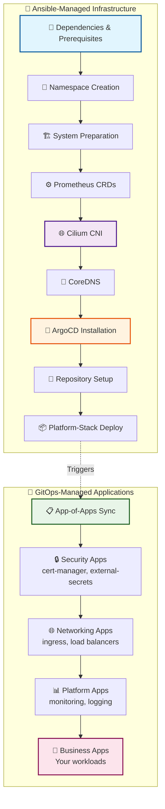

# {{ $frontmatter.title }}

<p align="center">
    
</p>

> [!TIP]
> **Why Bootstrap Automation Matters**
> 
> 🚀 **Transform Hours into Minutes** - What once took an entire weekend now completes in under 30 minutes
> 
> 🎯 **Zero-Touch Production** - From bare hardware to GitOps-ready platform with a single command
> 
> 🔄 **Disaster Recovery Ready** - Rebuild your entire cluster infrastructure in minutes, not days

## The Challenge: From Chaos to Orchestration

Setting up a production-ready Kubernetes cluster traditionally involves a complex dance of manual steps, configuration files, and careful timing. You need to install K3s, configure networking, set up DNS, deploy load balancing, establish GitOps, and ensure everything works together seamlessly.

**The old way:** Hours of manual work, prone to human error, difficult to reproduce.

**The new way:** One command that orchestrates the entire process intelligently.

## What This Automation Delivers

This bootstrap automation transforms your Raspberry Pi cluster into an **enterprise-grade Kubernetes platform** with these key capabilities:

### 🌐 **Advanced Networking Foundation**
- **Cilium CNI** with eBPF-powered performance
- **Integrated Load Balancer** (LB-IPAM) replacing MetalLB
- **Kube-proxy replacement** for enhanced networking
- **L2 announcements** for external connectivity

### 🎯 **Bulletproof DNS Resolution**
- **Custom CoreDNS** deployment optimized for cluster workloads
- **High availability** across control plane nodes
- **Performance tuning** for container environments

### 🚀 **GitOps-Ready Platform**
- **ArgoCD** installation and configuration
- **Repository authentication** setup
- **App-of-apps pattern** deployment
- **Platform components** managed declaratively

### 📊 **Observability Foundation**
- **Prometheus Operator CRDs** pre-installed
- **Service monitoring** capabilities
- **Metrics collection** ready from day one

## Architecture: The Separation of Concerns

> [!IMPORTANT]
> **🏗️ Infrastructure vs Application Management**
> 
> This architecture follows a **clear separation of responsibilities** that's essential for production operations:
> 
> **🔧 Ansible Domain (Infrastructure Layer)**
> - ✅ **Host configuration** - System packages, kernel modules, networking
> - ✅ **K3s cluster setup** - Control plane, worker nodes, cluster networking
> - ✅ **Core infrastructure** - CNI, DNS, load balancing, GitOps platform
> - ✅ **Bootstrap tooling** - Helm, Helmfile, kubectl, ArgoCD installation
> - ✅ **Initial secrets** - Repository access, service accounts, certificates
> 
> **🚀 GitOps Domain (Application Layer)**
> - ✅ **Platform applications** - cert-manager, external-secrets, monitoring
> - ✅ **Workload applications** - Your business applications and services
> - ✅ **Configuration management** - ConfigMaps, Secrets, application settings
> - ✅ **Policy enforcement** - NetworkPolicies, RBAC, security policies
> - ✅ **Lifecycle management** - Updates, rollbacks, scaling, deployments

## The Bootstrap Architecture

### 🔀 **Responsibility Handoff Diagram**

```mermaid
graph LR
    subgraph "🔧 Ansible Infrastructure Domain"
        A[🖥️ Host Setup<br/>OS, packages, kernel] --> B[🏗️ K3s Cluster<br/>Control/worker nodes]
        B --> C[🌐 Network Foundation<br/>Cilium CNI, CoreDNS]
        C --> D[🛠️ GitOps Platform<br/>ArgoCD, repositories]
    end
    
    subgraph "🚀 GitOps Application Domain"
        E[📦 Platform Apps<br/>cert-manager, monitoring] --> F[🏢 Business Apps<br/>Your applications]
        F --> G[⚙️ Configuration<br/>Secrets, policies]
        G --> H[🔄 Lifecycle<br/>Updates, scaling]
    end
    
    D -.->|Handoff Point| E
    
    style A fill:#ffebee,stroke:#c62828,stroke-width:2px
    style B fill:#ffebee,stroke:#c62828,stroke-width:2px
    style C fill:#ffebee,stroke:#c62828,stroke-width:2px
    style D fill:#ffebee,stroke:#c62828,stroke-width:2px
    style E fill:#e8f5e8,stroke:#2e7d32,stroke-width:2px
    style F fill:#e8f5e8,stroke:#2e7d32,stroke-width:2px
    style G fill:#e8f5e8,stroke:#2e7d32,stroke-width:2px
    style H fill:#e8f5e8,stroke:#2e7d32,stroke-width:2px
```



### 🎯 **Bootstrap Execution Flow**

The bootstrap follows a carefully orchestrated sequence that respects component dependencies and ensures reliable deployment:



> [!NOTE]
> **Sequential Execution by Design**
> 
> Each phase builds upon the previous one, ensuring that dependencies are satisfied and components can communicate properly. This eliminates the common "works on my machine" syndrome.

## Infrastructure vs GitOps: The Complete Picture

### 🔧 **What Ansible Manages (Infrastructure Layer)**

Ansible is responsible for everything needed to create a **functional Kubernetes cluster** - the foundational infrastructure that supports applications:

#### 🖥️ **Host-Level Infrastructure**
```yaml
# System packages and kernel configuration
- name: Install eBPF prerequisites
  package:
    name: [linux-headers-generic, build-essential, clang, llvm]
    
# Kernel modules for advanced networking
- name: Load networking modules
  modprobe:
    name: [br_netfilter, overlay, ip_vs, nf_conntrack]
```

#### 🏗️ **K3s Cluster Infrastructure**
```yaml
# K3s server configuration
token-file: /etc/rancher/k3s/cluster-token
flannel-backend: none              # Replaced by Cilium
disable-network-policy: true       # Cilium handles policies
disable-kube-proxy: true          # Cilium replacement
disable: [servicelb, traefik, coredns]  # Custom implementations
```

#### 🌐 **Core Networking Infrastructure**
- **Cilium CNI**: eBPF-powered container networking
- **LoadBalancer IPAM**: Integrated load balancing without MetalLB
- **CoreDNS**: Cluster DNS optimized for container workloads
- **Network policies**: Foundation for security enforcement

#### 🛠️ **GitOps Platform Infrastructure**
- **ArgoCD**: GitOps operator installation and initial configuration
- **Repository secrets**: Authenticated access to Git repositories
- **Service accounts**: Cluster-level permissions for GitOps operations
- **Bootstrap applications**: The initial app-of-apps that triggers everything else

### 🚀 **What GitOps Manages (Application Layer)**

Once Ansible completes the infrastructure bootstrap, **GitOps takes over** to manage all application-level concerns:

#### 📦 **Platform Applications**
```yaml
# Example: cert-manager via ArgoCD
apiVersion: argoproj.io/v1alpha1
kind: Application
metadata:
  name: cert-manager
  annotations:
    argocd.argoproj.io/sync-wave: "-2"  # Deploy early
spec:
  source:
    chart: cert-manager
    repoURL: https://charts.jetstack.io
    targetRevision: v1.15.3
  syncPolicy:
    automated:
      prune: true
      selfHeal: true
```

#### 🏢 **Business Applications**
- **Microservices**: Your application workloads
- **Databases**: PostgreSQL, MongoDB, Redis deployments
- **Message queues**: Kafka, RabbitMQ, NATS
- **API gateways**: Kong, Ambassador, Istio

#### ⚙️ **Configuration Management**
- **ConfigMaps**: Application configuration
- **Secrets**: Application credentials (via external-secrets)
- **Environment variables**: Runtime configuration
- **Feature flags**: Dynamic application behavior

#### 🔒 **Policy and Security**
- **NetworkPolicies**: Micro-segmentation and traffic controls
- **RBAC**: Role-based access control for applications
- **Pod Security Standards**: Security constraints
- **Service mesh policies**: mTLS, traffic routing, observability

### 🎯 **The Critical Handoff Point**

The transition from Ansible to GitOps happens at a **precisely defined moment**:

```yaml
# Ansible's final task: Deploy the platform-stack application
- name: Deploy platform-stack root application
  kubernetes.core.k8s:
    state: present
    definition:
      apiVersion: argoproj.io/v1alpha1
      kind: Application
      metadata:
        name: platform-stack
        namespace: argocd
      spec:
        source:
          path: bootstrap/platform-stack/overlays/prod
          repoURL: "{{ vault.git.url }}"
          targetRevision: "{{ gitops.revision }}"
        syncPolicy:
          automated:
            prune: true
            selfHeal: true
```

**After this point:**
- ❌ **Ansible stops** - No more infrastructure changes via automation
- ✅ **ArgoCD takes over** - All changes via Git commits and GitOps
- 🔄 **Continuous reconciliation** - Cluster state matches Git repository
- 📈 **Declarative management** - Everything defined as code

> [!WARNING]
> **Never Mix Infrastructure and Application Management**
> 
> Once GitOps is active, **never use Ansible** to manage applications or configurations. This creates conflicts and breaks the GitOps model.
> 
> - ✅ **Infrastructure changes**: Use Ansible (rare, typically cluster upgrades)
> - ✅ **Application changes**: Use Git commits → ArgoCD sync
> - ❌ **Mixed management**: Recipe for configuration drift and conflicts

## The Power of Helmfile Integration

At the heart of this bootstrap lies **Helmfile** - a declarative deployment tool that brings order to complex Helm chart orchestration:

### 🎼 **Orchestrated Deployment**
```yaml
# Simplified view of the Helmfile structure
releases:
  - name: prometheus-operator-crds
    chart: prometheus-community/prometheus-operator-crds
    # Installs first - foundation for monitoring
    
  - name: cilium
    chart: cilium/cilium
    needs: [prometheus-operator-crds]  # Wait for CRDs
    # Advanced CNI with load balancing
    
  - name: coredns
    chart: coredns/coredns
    needs: [cilium]  # Network must be ready
    # Cluster DNS resolution
```

### 🔄 **Dependency Management**
- **Smart sequencing** ensures components deploy in the right order
- **Failure recovery** with automatic rollback capabilities
- **Version pinning** for reproducible deployments

### 🎯 **External Configuration**
All configuration values are stored in your GitOps repository, ensuring:
- **Single source of truth** for all cluster configuration
- **Version controlled** infrastructure changes
- **Environment-specific** customization support

## Implementation Deep Dive

### Phase 1: Infrastructure Preparation

The foundation phase ensures your cluster nodes are ready for advanced networking:

```yaml
# System dependencies installation
- name: Install required system packages
  package:
    name:
      - curl          # Download tools
      - jq            # JSON processing
      - socat         # Network utilities
      - conntrack     # Connection tracking
      - ipvsadm       # Load balancing
    state: present
```

**Key preparations include:**
- 🔧 **System packages** required for eBPF and advanced networking
- 🗂️ **Namespace creation** for all bootstrap components
- 🐍 **Python environment** setup for Kubernetes management
- ⚙️ **Tool installation** (Helm, Helmfile, kubectl)

### Phase 2: Core Infrastructure via Helmfile

This is where the magic happens - deploying interconnected infrastructure components:

#### 🌐 **Cilium CNI Configuration**

```yaml
# Cilium values optimized for Pi cluster
operator:
  replicas: 1
  nodeSelector:
    node-role.kubernetes.io/control-plane: "true"
  tolerations:
    - key: node-role.kubernetes.io/master
      operator: Exists
      effect: NoSchedule

# Kube-proxy replacement for better performance
kubeProxyReplacement: true

# Load balancer integration
l2announcements:
  enabled: true
externalIPs:
  enabled: true

# High-performance networking
ipam:
  mode: kubernetes
  operator:
    clusterPoolIPv4PodCIDRList:
      - "10.42.0.0/16"
```

> [!WARNING]
> **K3s Integration Critical**
> 
> The bootstrap automatically configures K3s to disable conflicting components:
> - ❌ **Flannel CNI** disabled (`flannel-backend: none`)
> - ❌ **Kube-proxy** disabled (Cilium replacement)
> - ❌ **ServiceLB** disabled (Cilium LB-IPAM)
> - ❌ **Default CoreDNS** disabled (custom deployment)

#### 🎯 **CoreDNS Deployment**

The CoreDNS configuration is optimized for cluster workloads:

```yaml
# High availability with 3 replicas
replicaCount: 3

# Fixed cluster IP for stability
service:
  name: kube-dns
  clusterIP: "10.43.0.10"

# Control plane affinity for reliability
nodeSelector:
  node-role.kubernetes.io/control-plane: "true"
tolerations:
  - key: node-role.kubernetes.io/control-plane
    operator: Exists
    effect: NoSchedule
```

### Phase 3: GitOps Platform Installation

ArgoCD installation marks the transition from bootstrap to GitOps management:

#### 🚀 **ArgoCD Setup**

```yaml
# ArgoCD optimized for cluster access
server:
  extraArgs:
    - --insecure  # For internal cluster access
configs:
  params:
    server.insecure: true
```

#### 🔐 **Repository Authentication**

The bootstrap automatically configures private repository access:

```yaml
# Repository secret creation
apiVersion: v1
kind: Secret
metadata:
  name: pikube-argocd-repo
  namespace: argocd
  labels:
    argocd.argoproj.io/secret-type: repository
stringData:
  type: git
  url: "{{ vault.git.url }}"
  username: "{{ vault.git.username }}"
  password: "{{ vault.git.token }}"
```

#### 📦 **Platform-Stack Deployment**

The crown jewel - deploying the app-of-apps that manages your entire platform:

```yaml
apiVersion: argoproj.io/v1alpha1
kind: Application
metadata:
  name: platform-stack
  namespace: argocd
spec:
  project: default
  source:
    repoURL: https://gitlab.com/your-org/pikube-argocd.git
    targetRevision: feat/cilium-volcano-istio-integration
    path: bootstrap/platform-stack/overlays/prod
  destination:
    server: https://kubernetes.default.svc
    namespace: argocd
  syncPolicy:
    automated:
      prune: true
      selfHeal: true
```

This application deploys **all** your platform components with proper sync waves:
- 🔒 **Wave -3**: CRDs (cert-manager, external-secrets)
- 🏗️ **Wave -2**: Core infrastructure (operators, namespaces)
- 🌐 **Wave -1**: Networking (load balancers, ingress)
- 📊 **Wave 0+**: Applications and services

## Advanced Features

### 🔄 **Git Clone Methodology**

The bootstrap uses the same approach as Helmfile for fetching configuration:

```yaml
# Temporary git clone for configuration access
- name: Clone ArgoCD repository for platform-stack
  git:
    repo: "{{ bootstrap_git_repo_url }}"
    dest: "{{ temp_git_dir }}"
    version: "{{ gitops.revision }}"
    accept_hostkey: yes
    force: yes
  environment:
    GIT_ASKPASS: "/tmp/git-askpass-platform.sh"
```

**Benefits:**
- ✅ **Bypasses API limits** and Cloudflare challenges
- ✅ **Consistent with Helmfile** approach
- ✅ **Supports private repositories** securely
- ✅ **Works with any Git provider**

### 🎯 **Sync Wave Management**

ArgoCD applications deploy in carefully orchestrated waves:

```yaml
metadata:
  annotations:
    argocd.argoproj.io/sync-wave: "-2"  # Deploy early
```

**Wave strategy:**
- **Wave -3**: Foundation CRDs that other components depend on
- **Wave -2**: Core operators and infrastructure
- **Wave -1**: Networking and security components
- **Wave 0+**: Applications and platform services

### 🏥 **Health Checking**

Comprehensive validation ensures everything is working:

```yaml
# Cilium connectivity test
- name: Test Cilium connectivity
  shell: |
    kubectl -n kube-system exec ds/cilium -- cilium status --brief
  register: cilium_status

# DNS resolution test
- name: Verify CoreDNS resolution
  shell: |
    kubectl run test-dns --image=busybox:latest --rm -it --restart=Never -- nslookup kubernetes.default
```

## Running the Bootstrap

### Prerequisites

Ensure your environment is ready:

```bash
# Activate Ansible environment
micromamba activate ansible

# Navigate to project directory
cd /home/quantstacker/pikube-ansible
```

### 🚀 **Single Command Deployment**

```bash
# Complete cluster bootstrap
micromamba run -n ansible ansible-playbook -i inventory.yaml k3s-cluster-bootstrap.yaml
```

### 📊 **Monitoring Progress**

Track the deployment in real-time:

```bash
# Watch ArgoCD applications
kubectl get apps -n argocd -w

# Monitor Cilium status
kubectl -n kube-system get pods -l k8s-app=cilium

# Check LoadBalancer functionality
kubectl create service loadbalancer test-lb --tcp=80:80
kubectl get svc test-lb  # Should show external IP
kubectl delete svc test-lb
```

## Validation and Verification

### ✅ **Infrastructure Health**

Verify your cluster is fully operational:

```bash
# All nodes ready
kubectl get nodes
# Expected: All nodes in Ready state

# Core networking operational
kubectl -n kube-system get pods -l k8s-app=cilium
# Expected: All Cilium pods Running

# DNS resolution working
kubectl -n kube-system get pods -l k8s-app=kube-dns
# Expected: CoreDNS pods Running

# ArgoCD operational
kubectl get apps -n argocd
# Expected: All applications Synced/Healthy
```

### 🌐 **Network Connectivity**

Test advanced networking features:

```bash
# LoadBalancer IP assignment
kubectl create deployment nginx --image=nginx
kubectl expose deployment nginx --type=LoadBalancer --port=80
kubectl get svc nginx
# Expected: External IP from your pool range

# Cleanup
kubectl delete deployment nginx
kubectl delete svc nginx
```

### 🔒 **Security Components**

Verify security infrastructure:

```bash
# cert-manager ready
kubectl get clusterissuer
# Expected: letsencrypt ClusterIssuer Ready=True

# external-secrets operational
kubectl get clustersecretstore
# Expected: vault-backend ClusterSecretStore Ready=True

# ArgoCD repository access
kubectl get secret -n argocd | grep repo
# Expected: Repository secret present
```

## Troubleshooting Guide

### 🔧 **Common Issues and Solutions**

| Issue | Symptoms | Solution |
|-------|----------|-----------|
| **Cilium pods failing** | Pods in CrashLoopBackOff | Check K3s config disabled components |
| **DNS resolution fails** | Unable to resolve services | Verify CoreDNS deployment and configuration |
| **ArgoCD can't sync** | Applications stuck in Unknown | Check repository credentials and network access |
| **LoadBalancer no IP** | Services stuck in Pending | Verify Cilium LB-IPAM pool configuration |

### 🩺 **Diagnostic Commands**

```bash
# Comprehensive cluster status
kubectl get nodes,pods -A

# Cilium detailed status
kubectl -n kube-system exec ds/cilium -- cilium status

# ArgoCD application details
kubectl describe app -n argocd platform-stack

# Network connectivity test
kubectl run netshoot --image=nicolaka/netshoot -it --rm -- /bin/bash
```

### 🔄 **Recovery Procedures**

If something goes wrong, the automation includes recovery options:

```bash
# Reset cluster completely
micromamba run -n ansible ansible-playbook -i inventory.yaml k3s-cluster-reset.yaml

# Rebuild K3s infrastructure
micromamba run -n ansible ansible-playbook -i inventory.yaml k3s-cluster-setup.yaml

# Re-run bootstrap
micromamba run -n ansible ansible-playbook -i inventory.yaml k3s-cluster-bootstrap.yaml
```

## Configuration Customization

### 🎛️ **Key Configuration Files**

Your bootstrap behavior is controlled by these files:

```bash
# Main cluster configuration
vars/pikube-cluster.yaml

# Secrets and credentials
vars/vault.yaml  # (encrypted)

# Node inventory
inventory.yaml
```

### ⚙️ **Customization Options**

```yaml
# vars/pikube-cluster.yaml
bootstrap:
  deploy_platform_stack: true      # Auto-deploy platform apps
  
  cilium:
    version: "1.17.5"              # Pin Cilium version
    lb_pool:
      start: "10.0.0.100"          # LoadBalancer IP range
      stop: "10.0.0.200"
      
  argocd:
    version: "8.1.3"               # Pin ArgoCD version
    
gitops:
  revision: "main"                 # Git branch to track
```

## GitOps Tool Flexibility

While this bootstrap uses **ArgoCD** as the GitOps operator, the architecture supports any GitOps tool:

### 🎯 **Supported GitOps Tools**

| Tool | Bootstrap Support | Migration Path |
|------|------------------|----------------|
| **ArgoCD** | ✅ **Native** | Pre-configured and ready |
| **FluxCD** | 🔄 **Compatible** | Replace ArgoCD installation step |
| **Jenkins X** | 🔄 **Compatible** | Custom GitOps operator deployment |
| **Weave GitOps** | 🔄 **Compatible** | Replace ArgoCD with Weave components |

### 🔄 **FluxCD Alternative**

To use FluxCD instead of ArgoCD, modify the bootstrap to install Flux:

```yaml
# Replace ArgoCD installation with FluxCD
- name: Install FluxCD
  shell: |
    flux bootstrap gitlab \
      --owner={{ vault.git.username }} \
      --repository=pikube-gitops \
      --branch={{ gitops.revision }} \
      --path=clusters/pikube \
      --personal \
      --token-auth
  environment:
    GITLAB_TOKEN: "{{ vault.git.token }}"
```

**FluxCD Benefits:**
- ✅ **Lighter weight** - Fewer cluster resources required
- ✅ **Native Kustomize** - Built-in support for Kustomize workflows
- ✅ **CNCF graduated** - Strong ecosystem support
- ✅ **Multi-tenancy** - Advanced namespace isolation

### 🎨 **GitOps Best Practices**

Regardless of your GitOps tool choice, follow these patterns:

#### 🗂️ **Repository Structure**
```
gitops-repository/
├── infrastructure/          # Platform components
│   ├── networking/         # CNI, load balancers, ingress
│   ├── security/           # cert-manager, external-secrets
│   ├── observability/      # monitoring, logging, tracing
│   └── storage/            # persistent volumes, databases
├── applications/           # Business workloads
│   ├── frontend/           # Web applications, SPAs
│   ├── backend/            # APIs, microservices
│   └── data/               # Data processing, ETL
├── environments/           # Environment-specific configs
│   ├── development/        # Dev environment overrides
│   ├── staging/            # Staging environment
│   └── production/         # Production configuration
└── clusters/               # Cluster-specific bootstrapping
    └── pikube/             # Your cluster configuration
```

#### 🔄 **Sync Wave Strategy**
```yaml
# Infrastructure first (negative waves)
metadata:
  annotations:
    argocd.argoproj.io/sync-wave: "-3"  # CRDs and operators
    argocd.argoproj.io/sync-wave: "-2"  # Core infrastructure
    argocd.argoproj.io/sync-wave: "-1"  # Networking and security

# Applications second (positive waves)
metadata:
  annotations:
    argocd.argoproj.io/sync-wave: "0"   # Platform services
    argocd.argoproj.io/sync-wave: "1"   # Backend applications
    argocd.argoproj.io/sync-wave: "2"   # Frontend applications
```

#### 🏗️ **App-of-Apps Pattern**
```yaml
# Root application that deploys everything else
apiVersion: argoproj.io/v1alpha1
kind: Application
metadata:
  name: platform-stack
spec:
  source:
    path: platform/
    repoURL: https://gitlab.com/your-org/gitops-repo.git
  syncPolicy:
    automated:
      prune: true      # Remove resources not in Git
      selfHeal: true   # Fix configuration drift
```

## Operational Excellence

### 🔍 **Infrastructure Monitoring**

Monitor the **infrastructure layer** (Ansible domain) separately from applications:

```yaml
# Infrastructure health checks
- name: Monitor K3s cluster health
  uri:
    url: "https://{{ ansible_default_ipv4.address }}:6443/healthz"
    validate_certs: no
  register: cluster_health

- name: Check Cilium agent status
  shell: kubectl -n kube-system exec ds/cilium -- cilium status --brief
  register: cilium_health
```

### 📈 **Application Monitoring**

Let GitOps manage **application observability**:

```yaml
# Application monitoring via GitOps
apiVersion: argoproj.io/v1alpha1
kind: Application
metadata:
  name: monitoring-stack
spec:
  source:
    path: infrastructure/observability/
    values:
      prometheus:
        retention: 30d
      grafana:
        dashboards:
          infrastructure: true
          applications: true
```

### 🔄 **Disaster Recovery**

The clear separation enables effective disaster recovery:

#### 🏗️ **Infrastructure Recovery**
```bash
# Rebuild cluster infrastructure
ansible-playbook -i inventory.yaml k3s-cluster-reset.yaml
ansible-playbook -i inventory.yaml k3s-cluster-setup.yaml
ansible-playbook -i inventory.yaml k3s-cluster-bootstrap.yaml
```

#### 📦 **Application Recovery**
```bash
# Applications automatically restore via GitOps
kubectl get applications -n argocd
# All applications sync from Git repository automatically
```

### 🚀 **Scaling Operations**

**Infrastructure scaling** (add nodes):
```bash
# Add new nodes to inventory.yaml, then:
ansible-playbook -i inventory.yaml k3s-cluster-setup.yaml --limit new_nodes
```

**Application scaling** (via GitOps):
```yaml
# Update in Git repository
spec:
  replicas: 10  # Scale application
# ArgoCD automatically applies changes
```

## What's Next?

After successful bootstrap, your cluster is ready for:

### 🏗️ **Platform Components**
- **Ingress controllers** (nginx, istio)
- **Storage solutions** (Longhorn)
- **Monitoring stack** (Prometheus, Grafana, Loki)
- **Service mesh** (Istio, Linkerd)

### 🚀 **Application Deployment**
- **CI/CD pipelines** integration
- **Application repositories** 
- **Environment promotion** workflows

### 📈 **Observability**
- **Metrics collection** and alerting
- **Log aggregation** and analysis
- **Distributed tracing** setup

## Conclusion

This bootstrap automation transforms the complex process of setting up a production-ready Kubernetes cluster into a single, reliable command. By combining Ansible orchestration, Helmfile dependency management, and GitOps principles, you get:

🎯 **Consistency** - Every deployment is identical
⚡ **Speed** - Minutes instead of hours
🔒 **Reliability** - Built-in error handling and recovery
📊 **Observability** - Complete monitoring from day one
🔄 **Maintainability** - GitOps-managed infrastructure

Your Raspberry Pi cluster is now ready to compete with enterprise Kubernetes platforms, delivering the same capabilities at a fraction of the cost.

> [!TIP]
> **Join the Community**
>
> Found this automation helpful? Share your experience and improvements with the community. Your feedback helps make this project even better for everyone building production Kubernetes on Raspberry Pi.
