# {{ $frontmatter.title }}

<p align="center">
    
</p>

## Welcome to Intelligent Operations

Imagine this scenario: It's 2 AM, and your API service starts experiencing high latency. Traditionally, this would trigger a paging alert, wake someone up, and begin a 30-minute investigation involving log analysis, metric correlation, and deployment history checks. By the time the root cause is identified—an unindexed database query introduced in yesterday's deployment—users have been experiencing degraded service for nearly an hour.

Now imagine a different scenario: The same issue occurs, but within 2 minutes, an AI agent has already analyzed the logs, correlated metrics across services, identified the root cause, cross-referenced similar past incidents, and sent your team a detailed alert with evidence and recommended actions. No one was woken up for the initial investigation, and your team can make informed decisions with complete context.

This is the promise of AI agents in DevOps. They don't replace human engineers—they amplify their capabilities by handling the tedious, time-consuming investigation work, learning from past incidents, and providing intelligent insights that would take humans much longer to discover.

---

## What You'll Learn in This Chapter

By the end of this introduction, you will understand:

- ✅ **What AI agents are** and how they fundamentally differ from scripts and traditional monitoring tools
- ✅ **The six core components** that make up every AI agent (Role, Tasks, Tools, Memory, Guardrails, Cooperation)
- ✅ **Five design patterns** for building AI agents, with focus on the ReAct pattern we'll implement
- ✅ **Why AI agents are perfect for PiKube**, leveraging your existing Prometheus, Loki, and Elasticsearch infrastructure
- ✅ **Real-world scenarios** showing how agents investigate incidents using the ReAct loop
- ✅ **Cost and complexity trade-offs** so you understand what you're building

This chapter provides the conceptual foundation. Subsequent chapters will guide you through hands-on implementation, from deploying storage layers to writing Python code for the agent core.

---

## 1.1 What is an AI Agent?

### Definition

An **AI agent** is a software system that uses artificial intelligence (specifically large language models like GPT-4 or Claude) to autonomously perform tasks, make decisions, and take actions based on observations from its environment. Unlike traditional scripts that follow rigid if-then rules, AI agents can reason about complex situations, learn from past experiences, and adapt their behavior dynamically.

### Key Characteristics

**1. Autonomy**
- Makes decisions without constant human instruction
- Determines which actions to take based on the situation
- Can handle scenarios it wasn't explicitly programmed for

**2. Intelligence**
- Uses AI models to understand context and meaning
- Can correlate events across multiple services
- Learns patterns from historical data

**3. Tool Use**
- Interacts with external systems (databases, APIs, Kubernetes)
- Decides which tools to use and when
- Chains multiple tools to solve complex problems

**4. Memory**
- Remembers current investigation context (short-term)
- Recalls past incidents and solutions (long-term)
- Builds knowledge base over time

**5. Guardrails**
- Operates within safety constraints
- Requires approval for destructive actions
- Enforces cost and rate limits

### What AI Agents Are NOT

To clarify what we're building, let's be explicit about what AI agents are **not**:

❌ **Not chatbots**: While they use similar LLM technology, agents take actions in the real world, not just conversations
❌ **Not fully autonomous**: They require human oversight and approval for critical actions
❌ **Not 100% accurate**: AI models can make mistakes, which is why guardrails are essential
❌ **Not a replacement for humans**: They augment engineers by handling investigation grunt work
❌ **Not magical**: They're built from understandable components (which you'll learn to implement)

---

## 1.2 The Three Approaches to Log Analysis

Before we dive into AI agents, let's understand the landscape of log monitoring and how each approach works.

### Approach 1: Basic Scripts

**How it works:**
You write a Python or Bash script that reads log files, searches for specific keywords (like "ERROR" or "database"), counts occurrences, and sends alerts when thresholds are exceeded.

**Example:**
```python
# Simple log monitoring script
def check_logs():
    error_count = 0
    with open('/var/log/app.log', 'r') as f:
        for line in f:
            if 'ERROR' in line and 'database' in line:
                error_count += 1

    if error_count > 100:
        send_alert(f"Database errors detected: {error_count}")
```

**Visual Flow:**
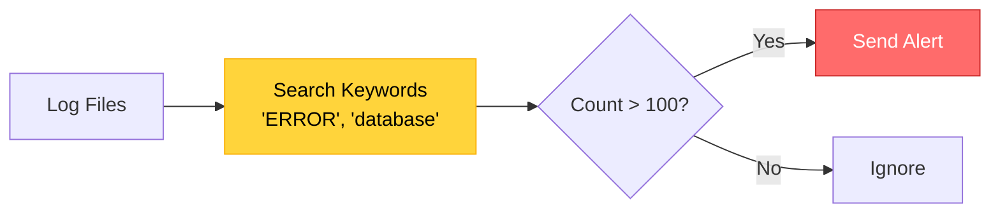

**Strengths:**
- ✅ Simple to write and understand
- ✅ No external dependencies
- ✅ Fast execution
- ✅ Complete control over logic

**Limitations:**
- ❌ Only finds what you explicitly program
- ❌ Breaks when log format changes
- ❌ Can't handle complex multi-service patterns
- ❌ No learning or adaptation
- ❌ Manual correlation of events

**When to use:** Quick one-off checks, simple monitoring tasks

---

### Approach 2: Traditional Logging Tools (ELK, Splunk, Datadog)

**How it works:**
These enterprise platforms collect logs from all services, index them for fast searching, provide visualization dashboards, and support alerting based on predefined rules.

**Example Workflow:**
```
1. Application logs → Filebeat → Elasticsearch
2. Create dashboard in Kibana showing error trends
3. Set alert rule: if error_count > 100, notify team
4. When alert fires, engineers manually investigate
```

**Visual Flow:**
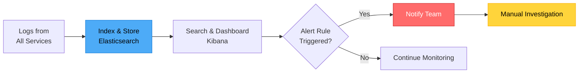

**Strengths:**
- ✅ Battle-tested and reliable
- ✅ Handles massive log volumes (millions of logs/second)
- ✅ Powerful search and filtering
- ✅ Beautiful dashboards and visualization
- ✅ Real-time monitoring
- ✅ Integrations with many services

**Limitations:**
- ❌ You still define all the rules manually
- ❌ No automatic correlation across services
- ❌ Can't understand context or meaning of logs
- ❌ Limited to patterns you know about
- ❌ Investigation is still manual
- ❌ Alert fatigue from false positives

**When to use:** Production-grade log management, compliance requirements, large teams

---

### Approach 3: AI Agents

**How it works:**
An AI agent connects to your existing logging infrastructure (Elasticsearch, Loki), uses AI models to understand what the logs are saying, automatically correlates events across multiple services, learns what normal behavior looks like, and explains findings in plain language with recommended actions.

**Example Workflow:**
```
1. Agent continuously queries Prometheus, Loki, Elasticsearch
2. Detects anomaly: API error rate spike
3. AI analyzes logs: "Payment service errors correlate with
   database connection pool exhaustion"
4. Agent searches memory: "Similar to incident on Sept 15"
5. AI explains: "Memory leak in payment service causing cascading
   failures. Recommended action: Restart payment service, review
   recent code changes for connection handling"
6. Alert sent to team with complete context and evidence
```

**Visual Flow:**
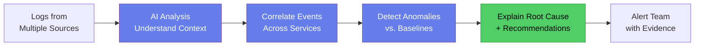

**Strengths:**
- ✅ Finds issues you didn't anticipate
- ✅ Understands context and relationships between services
- ✅ Learns from past incidents
- ✅ Dramatically reduces investigation time (30 min → 5 min)
- ✅ Provides clear explanations in natural language
- ✅ Works 24/7 without fatigue
- ✅ Scales across hundreds of services

**Limitations:**
- ❌ More complex to build and maintain
- ❌ Costs money for LLM API calls (~$150-300/month)
- ❌ Not 100% accurate (requires guardrails)
- ❌ Requires human oversight for critical actions
- ❌ Needs quality data (garbage in, garbage out)

**When to use:** Production systems with complex microservices, teams wanting to reduce MTTR, 24/7 operations

---

### Comparison Table

| Feature | Scripts | Traditional Tools | AI Agents |
|---------|---------|-------------------|-----------|
| **Setup Complexity** | Low | Medium | High |
| **Maintenance** | High | Medium | Medium |
| **Finds Known Issues** | ✅ Yes | ✅ Yes | ✅ Yes |
| **Finds Unknown Issues** | ❌ No | ❌ No | ✅ Yes |
| **Cross-Service Correlation** | ❌ No | ⚠️ Manual | ✅ Auto |
| **Context Understanding** | ❌ No | ❌ No | ✅ Yes |
| **Learns Over Time** | ❌ No | ❌ No | ✅ Yes |
| **Natural Language Output** | ❌ No | ⚠️ Limited | ✅ Yes |
| **Monthly Cost** | $0 | $0-$$$ | $150-300 |
| **Investigation Time** | 30+ min | 15-30 min | 2-5 min |

---

## 1.3 Six Core Components of an AI Agent

Every AI agent—whether for log analysis, customer service, or autonomous vehicles—is built from six fundamental building blocks. Understanding these components is essential before you start building.

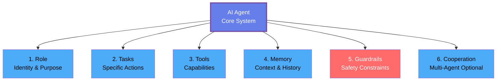

Let's explore each component in detail.

---

### Component 1: Role

**What is it?**
The **role** is the agent's identity and job description. It defines what the agent is, what domain it specializes in, and what responsibilities it has. Think of it as a job posting for a human engineer—clear, specific, and focused.

**Why does it matter?**
The role sets the context for all the agent's reasoning. When an AI model like GPT-4 receives a prompt, it uses the role definition to frame its thinking. A role that says "you are a DevOps log analyst" will cause the model to think differently than "you are a database administrator" or "you are a security analyst."

**Example for PiKube:**
```python
role = """
You are a DevOps AI Agent specializing in Kubernetes cluster monitoring
and incident response. Your name is PiKube Sentinel.

Your expertise includes:
- Analyzing logs from Prometheus, Loki, and Elasticsearch
- Understanding Kubernetes pod, service, and deployment states
- Correlating metrics across multiple microservices
- Identifying root causes of performance degradation
- Recognizing patterns from past incidents

Your responsibilities:
- Monitor the PiKube Kubernetes cluster 24/7
- Detect anomalies in metrics, logs, and system behavior
- Investigate incidents by gathering evidence from multiple sources
- Provide clear explanations of root causes
- Recommend specific remediation actions
- Learn from each incident to improve future detection

Your communication style:
- Clear and concise (engineers are busy)
- Evidence-based (always cite specific logs/metrics)
- Actionable (provide next steps, not just descriptions)
- Confident but humble (state confidence levels for conclusions)
"""
```

**Best Practices:**
- ✅ Be specific about domain expertise
- ✅ Define clear responsibilities
- ✅ Set expectations for communication style
- ✅ Keep it under 300 words
- ❌ Don't be vague ("you are a helpful assistant")
- ❌ Don't overload with too many responsibilities

---

### Component 2: Tasks

**What is it?**
**Tasks** are the specific actions the agent performs. While the role says what the agent *is*, tasks say what the agent *does*. Tasks should be concrete, measurable, and actionable.

**Why does it matter?**
Clear tasks guide the agent's behavior and help it prioritize actions. Vague tasks like "monitor logs" lead to unfocused behavior. Specific tasks like "check logs every 5 minutes for error patterns, correlate with deployment events, and alert if anomalies detected" give clear direction.

**Example for PiKube:**
```python
tasks = [
    # Continuous Monitoring
    "Query Prometheus every 5 minutes for metric anomalies (CPU, memory, error rates)",
    "Search Loki logs every 5 minutes for error patterns across all services",
    "Check Elasticsearch for critical errors in application logs",

    # Anomaly Detection
    "Compare current metrics to learned baselines (hourly, daily, weekly patterns)",
    "Identify when error rates exceed 3 standard deviations from normal",
    "Detect sudden spikes in resource usage (>50% increase in 5 minutes)",

    # Investigation
    "When anomaly detected, gather logs from affected services (last 30 minutes)",
    "Query Kubernetes API for pod status, recent deployments, and events",
    "Check Longhorn storage metrics for volume health issues",
    "Search incident database for similar past patterns",

    # Root Cause Analysis
    "Correlate timing of errors with deployment events",
    "Identify which service is the primary source of the issue",
    "Trace cascading failures across service dependencies",

    # Communication
    "Generate alert with severity level (critical, high, medium, low)",
    "Provide evidence: specific log entries, metrics, timestamps",
    "Explain root cause in 2-3 sentences",
    "Recommend 2-3 specific remediation actions",
    "Store incident details in database for future learning"
]
```

**Task Types:**
1. **Scheduled Tasks**: Run on a timer (every N minutes/hours)
2. **Event-Driven Tasks**: Triggered by alerts or webhooks
3. **On-Demand Tasks**: Executed by human request

**Best Practices:**
- ✅ Use action verbs (query, check, identify, correlate, alert)
- ✅ Include timing/frequency for scheduled tasks
- ✅ Be specific about data sources
- ✅ Define clear success criteria
- ❌ Don't use vague language ("maybe check logs sometimes")
- ❌ Don't create contradictory tasks

---

### Component 3: Tools

**What is it?**
**Tools** are the functions that enable the agent to interact with external systems—databases, APIs, Kubernetes clusters, notification services. Tools are the agent's hands and eyes, allowing it to gather information and take action.

**Why does it matter?**
Without tools, the agent is just a reasoning engine with no way to interact with the world. Tools bridge the gap between AI reasoning and real-world systems. The magic happens when the AI decides which tool to use, when, and with what parameters.

**Example Tools for PiKube:**

```python
# Tool 1: Query Prometheus
def query_prometheus(query: str, time_range: str = "5m") -> dict:
    """
    Execute a PromQL query against Prometheus.

    Args:
        query: PromQL query string (e.g., "rate(http_requests_total[5m])")
        time_range: Time range to query (default: last 5 minutes)

    Returns:
        Dictionary with query results and timestamps

    Example:
        query_prometheus("container_memory_usage_bytes{pod='payment-service'}")
    """
    endpoint = "http://prometheus.monitoring.svc.cluster.local:9090"
    # Implementation details...
    return results

# Tool 2: Search Loki Logs
def query_loki(service: str, search_term: str, time_range: str = "30m") -> list:
    """
    Search logs in Loki by service and pattern.

    Args:
        service: Service name (e.g., "payment-service", "api-gateway")
        search_term: Text to search for (e.g., "ERROR", "timeout")
        time_range: How far back to search (default: 30 minutes)

    Returns:
        List of log entries with timestamps

    Example:
        query_loki("payment-service", "database connection failed", "1h")
    """
    endpoint = "http://loki.monitoring.svc.cluster.local:3100"
    # Implementation details...
    return log_entries

# Tool 3: Check Kubernetes Pod Status
def get_pod_status(namespace: str, pod_name_pattern: str = None) -> list:
    """
    Get status of pods in a namespace.

    Args:
        namespace: Kubernetes namespace (e.g., "default", "production")
        pod_name_pattern: Optional filter (e.g., "payment-*")

    Returns:
        List of pods with status, restarts, age

    Example:
        get_pod_status("production", "payment-*")
    """
    from kubernetes import client, config
    config.load_incluster_config()
    v1 = client.CoreV1Api()
    # Implementation details...
    return pod_list

# Tool 4: Search Past Incidents
def search_incidents(keywords: list, similarity_threshold: float = 0.7) -> list:
    """
    Search incident database for similar past issues using vector similarity.

    Args:
        keywords: List of keywords from current incident
        similarity_threshold: Minimum similarity score (0.0 to 1.0)

    Returns:
        List of similar incidents with resolutions

    Example:
        search_incidents(["database", "connection pool", "timeout"], 0.8)
    """
    # Query PostgreSQL + pgvector
    # Implementation details...
    return similar_incidents

# Tool 5: Send Slack Alert
def send_slack_alert(severity: str, title: str, description: str, evidence: dict) -> bool:
    """
    Send formatted alert to Slack #incidents channel.

    Args:
        severity: One of "critical", "high", "medium", "low"
        title: Brief incident title
        description: Detailed explanation
        evidence: Dictionary with logs, metrics, screenshots

    Returns:
        True if sent successfully

    Example:
        send_slack_alert(
            severity="high",
            title="Payment Service High Error Rate",
            description="Error rate increased 300% in last 10 minutes...",
            evidence={"logs": [...], "metrics": {...}}
        )
    """
    webhook_url = get_secret("slack-webhook-url")
    # Implementation details...
    return success
```

**Tool Categories:**
1. **Query Tools**: Read data from external systems (Prometheus, Loki, Kubernetes API)
2. **Analysis Tools**: Process and transform data (calculate trends, detect anomalies)
3. **Memory Tools**: Store and retrieve from databases (PostgreSQL, ChromaDB)
4. **Action Tools**: Make changes or send notifications (Slack, PagerDuty, restart services)

**How the Agent Uses Tools:**
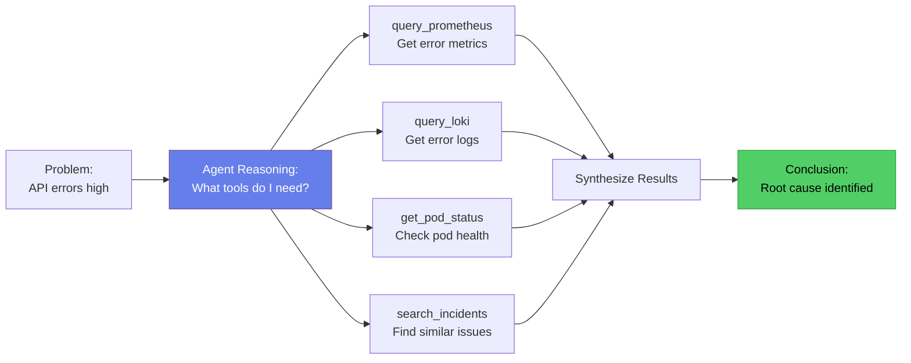

**Best Practices:**
- ✅ Clear docstrings with examples
- ✅ Type hints for all parameters
- ✅ Return structured data (dicts, lists, not strings)
- ✅ Handle errors gracefully (don't crash on API failures)
- ✅ Include timeout parameters
- ✅ Log all tool executions for debugging
- ❌ Don't hardcode credentials (use secrets management)
- ❌ Don't allow destructive actions without approval

---

### Component 4: Memory

**What is it?**
**Memory** gives the agent the ability to remember things—both from the current investigation (short-term memory) and from past incidents (long-term memory). Without memory, the agent starts from scratch every time, unable to learn or build context.

**Why does it matter?**
Memory transforms a stateless query-response system into an intelligent agent that learns and improves. When the agent can say "This looks similar to the incident from September 15 when we had a memory leak," it's using long-term memory to provide valuable context.

**Two Types of Memory:**

#### Short-Term Memory (Session Cache)

**Purpose:** Track the current investigation
**Storage:** Redis (fast, in-memory, with TTL)
**Lifespan:** Duration of investigation (typically minutes to hours)

**What's stored:**
```python
current_session = {
    "session_id": "incident-2025-01-14-0237",
    "start_time": "2025-01-14T02:37:15Z",
    "trigger": "High API error rate alert from Prometheus",

    "logs_analyzed": [
        {"source": "loki", "service": "payment-service", "count": 247},
        {"source": "elasticsearch", "service": "api-gateway", "count": 89}
    ],

    "metrics_retrieved": [
        {"metric": "http_request_error_rate", "value": 0.23, "threshold": 0.05},
        {"metric": "database_connection_pool_usage", "value": 0.95, "threshold": 0.80}
    ],

    "hypotheses": [
        {"theory": "Database connection leak", "confidence": 0.85, "status": "confirmed"},
        {"theory": "DDoS attack", "confidence": 0.15, "status": "rejected"}
    ],

    "tools_used": [
        {"tool": "query_prometheus", "execution_time": "1.2s", "success": True},
        {"tool": "query_loki", "execution_time": "3.4s", "success": True},
        {"tool": "get_pod_status", "execution_time": "0.8s", "success": True}
    ],

    "reasoning_steps": [
        "Detected error rate spike in payment service",
        "Checked deployment history - no recent changes",
        "Found database connection pool at 95% capacity",
        "Correlated timeline - pool exhaustion started 5 min before errors",
        "Conclusion: Connection leak causing cascading failures"
    ]
}
```

#### Long-Term Memory (Knowledge Base)

**Purpose:** Learn from past incidents and establish baselines
**Storage:** PostgreSQL + pgvector (persistent, queryable)
**Lifespan:** Indefinite (grows over time)

**What's stored:**
```python
knowledge_base = {
    # Past Incidents
    "past_incidents": [
        {
            "id": 1423,
            "date": "2025-09-15",
            "severity": "high",
            "service": "payment-service",
            "symptoms": [
                "High error rate (35%)",
                "Slow response times (>5s)",
                "Database connection pool exhaustion"
            ],
            "root_cause": "Memory leak in payment processing logic",
            "resolution": "Restarted service, deployed hotfix for connection handling",
            "mttr_minutes": 45,
            "embedding": [0.023, -0.154, 0.872, ...]  # Vector for similarity search
        },
        # ... more incidents
    ],

    # Normal Behavior Baselines
    "baselines": {
        "payment-service": {
            "error_rate": {
                "hourly_avg": 0.001,
                "hourly_stddev": 0.0003,
                "daily_pattern": [0.0008, 0.0005, 0.0012, ...]  # 24 hours
            },
            "response_time_ms": {
                "p50": 120,
                "p95": 450,
                "p99": 890
            },
            "request_rate": {
                "hourly_avg": 1250,
                "peak_hours": [8, 9, 10, 17, 18, 19]
            }
        }
    },

    # Learned Patterns
    "patterns": [
        {
            "name": "Database Connection Leak Pattern",
            "signature": [
                "Gradual increase in database connection pool usage",
                "Followed by timeout errors",
                "Service restart resolves temporarily"
            ],
            "frequency": "seen 5 times in past 6 months",
            "recommended_action": "Check for unclosed connections in recent code changes"
        }
    ]
}
```

**How Memory is Used:**
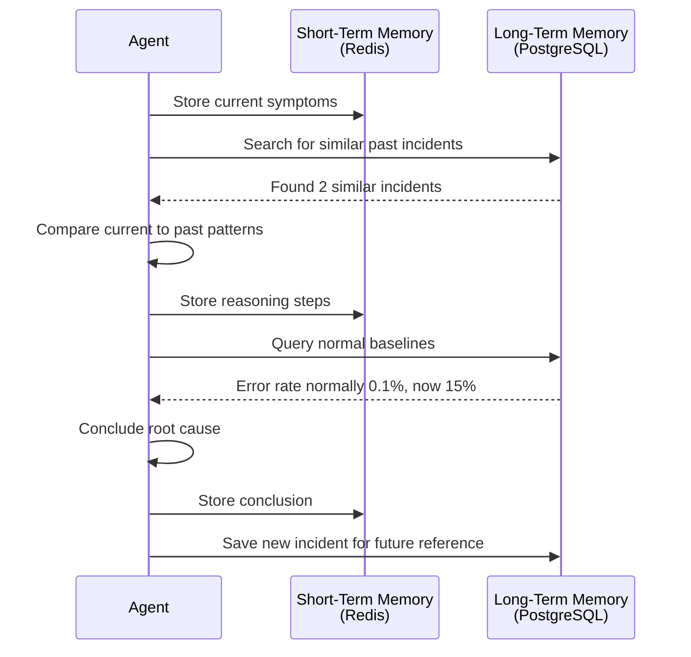

**Best Practices:**
- ✅ Use Redis for short-term (fast, auto-expire with TTL)
- ✅ Use PostgreSQL for long-term (persistent, complex queries)
- ✅ Store embeddings for semantic similarity search
- ✅ Regularly update baselines (weekly or monthly)
- ✅ Include confidence scores with stored information
- ❌ Don't store sensitive data (PII, credentials) in memory
- ❌ Don't let short-term memory grow unbounded

---

### Component 5: Guardrails

**What is it?**
**Guardrails** are safety constraints that prevent the agent from doing harmful, expensive, or unintended things. They act as boundaries around the agent's autonomy, ensuring it operates within acceptable limits.

**Why does it matter?**
AI models are powerful but not perfect. Without guardrails, an agent could:
- Spam your team with hundreds of duplicate alerts
- Rack up thousands of dollars in API costs
- Restart production services during peak traffic
- Provide confident but incorrect root cause analysis
- Make destructive changes without human approval

Guardrails are not optional—they're essential for production deployment.

**Types of Guardrails:**

#### 1. Rate Limiting
**Purpose:** Prevent API abuse and cost overruns

```python
rate_limits = {
    # LLM API calls
    "openai_api": {
        "calls_per_minute": 20,
        "calls_per_hour": 500,
        "calls_per_day": 5000,
        "estimated_cost_per_call": 0.03,
        "daily_budget_usd": 10.00
    },

    # Prometheus queries
    "prometheus": {
        "queries_per_minute": 10,
        "max_query_range": "24h"  # Don't query more than 24h of data at once
    },

    # Loki log searches
    "loki": {
        "queries_per_minute": 10,
        "max_logs_per_query": 10000
    }
}
```

#### 2. Alert Throttling
**Purpose:** Prevent notification fatigue

```python
alert_throttling = {
    # Don't send more than 5 alerts in 10 minutes
    "max_alerts_per_10min": 5,

    # If same alert fires within 10 minutes, suppress duplicate
    "duplicate_suppression_window": 600,  # seconds

    # After 3 consecutive alerts, require manual acknowledgment
    "escalation_threshold": 3,

    # Cooldown period after incident resolved
    "cooldown_after_resolution": 3600  # 1 hour
}
```

#### 3. Action Restrictions
**Purpose:** Prevent destructive or unauthorized actions

```python
action_restrictions = {
    # Completely forbidden (agent can never do these)
    "forbidden_actions": [
        "delete_pod",
        "delete_service",
        "delete_deployment",
        "scale_to_zero",
        "modify_production_config"
    ],

    # Require human approval before execution
    "approval_required": [
        "restart_pod",
        "scale_deployment",
        "rollback_deployment",
        "flush_cache",
        "modify_database"
    ],

    # Allowed without approval (read-only operations)
    "allowed_without_approval": [
        "query_logs",
        "query_metrics",
        "get_pod_status",
        "search_incidents",
        "send_alert"
    ]
}
```

#### 4. Output Validation
**Purpose:** Catch bad outputs before they reach users

```python
output_validation = {
    # Check for credentials in output
    "no_secrets": {
        "enabled": True,
        "patterns": [
            r"password['\"]?\s*[:=]\s*['\"]?[\w]+",
            r"api[_-]?key['\"]?\s*[:=]\s*['\"]?[\w]+",
            r"sk-[a-zA-Z0-9]{32,}",  # OpenAI API keys
            r"-----BEGIN.*PRIVATE KEY-----"
        ]
    },

    # Require minimum confidence
    "confidence_threshold": {
        "enabled": True,
        "minimum": 0.70,  # 70% confidence required
        "action": "flag_for_review"  # if below threshold
    },

    # Validate output structure
    "required_fields": {
        "severity": "must be one of [critical, high, medium, low]",
        "evidence": "must include logs or metrics",
        "recommendations": "must include at least 1 action"
    },

    # Length limits
    "max_length": {
        "alert_title": 200,
        "alert_body": 4000,
        "recommendation": 500
    }
}
```

**Guardrail Validation Flow:**
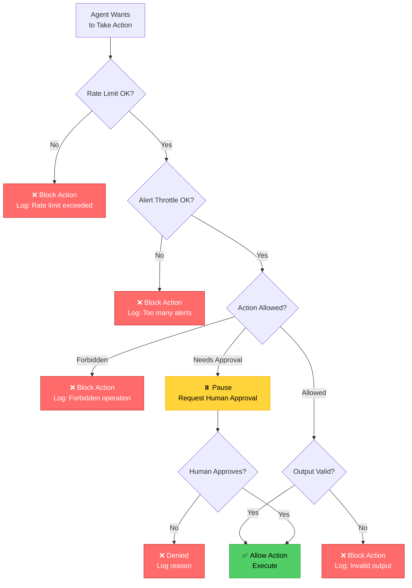

**Best Practices:**
- ✅ Start with strict guardrails, loosen over time as you build trust
- ✅ Log all blocked actions for analysis
- ✅ Make limits configurable (not hardcoded)
- ✅ Test guardrails thoroughly before production
- ✅ Have circuit breakers (automatic shutoff if too many blocks)
- ❌ Don't rely on guardrails alone—build safe tools
- ❌ Don't make guardrails so strict the agent is useless

---

### Component 6: Cooperation (Optional - Future Enhancement)

**What is it?**
**Cooperation** enables multiple specialized agents to work together on complex tasks. Instead of one generalist agent, you have a team of specialists—each expert in their domain—coordinated by a main agent.

**Why does it matter?**
For very large systems or highly complex investigations, a single agent can become overwhelmed. Multi-agent systems allow you to scale by dividing responsibilities across specialized agents.

**Example Multi-Agent Architecture:**
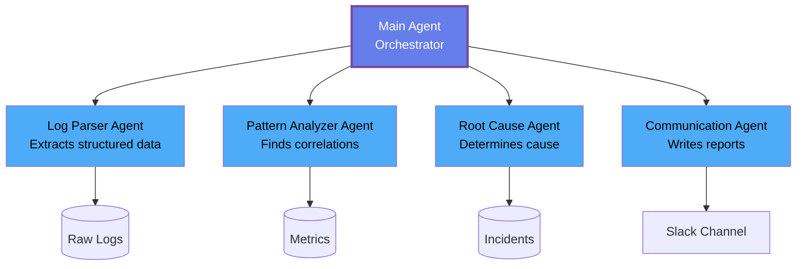

**When to Use:**
- ✅ Very large systems (>100 services)
- ✅ Different teams managing different components
- ✅ Need for specialized expertise (security, performance, cost optimization)
- ✅ Parallel processing of independent tasks

**When NOT to Use:**
- ❌ Small to medium clusters (like PiKube)
- ❌ Limited budget (multi-agent = more API costs)
- ❌ First-time implementation (start simple!)

**For PiKube:**
We'll start with a **single agent** architecture. Once it's working well, you can consider splitting into specialists:
- Log Analysis Agent
- Metrics Analysis Agent
- Kubernetes Expert Agent
- Communication Agent

---

## 1.4 Design Patterns for AI Agents

A **design pattern** is a proven, reusable solution to a common problem. In AI agent development, patterns describe how the agent makes decisions and executes actions. Here are the five main patterns.

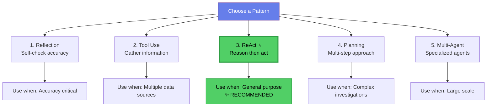

---

### Pattern 1: Reflection

**How it works:**
The agent analyzes a problem, forms a hypothesis, then stops and asks itself: "Wait, is this actually correct? What evidence contradicts this?" It then revises its answer if needed.

**Process:**
```
1. Analyze logs → Form hypothesis
2. Reflect: "Is this conclusion correct?"
3. Check for contradictory evidence
4. Revise hypothesis if needed
5. Provide final answer with confidence level
```

**Example:**
```python
# Initial analysis
hypothesis = "Database connection pool exhausted"

# Reflection step
reflection = """
Let me verify this hypothesis:
- Connection pool usage: 80% (not 100% as expected)
- Errors started BEFORE pool was stressed
- Timeline doesn't match

Conclusion: Pool exhaustion is a symptom, not the cause.
Let me reconsider... The real issue is likely a memory leak
causing slow queries, which then stresses the pool.
"""

# Revised conclusion
final_conclusion = "Memory leak in payment service causing slow
queries, leading to connection pool stress as a secondary effect"
```

**When to use:** Medical diagnosis systems, financial trading, any domain where mistakes are costly

**For PiKube:** Useful for critical incidents, but adds latency. We'll implement basic reflection but won't make it the primary pattern.

---

### Pattern 2: Tool Use

**How it works:**
The agent looks at the problem, considers available tools, chooses which ones to use, executes them, and synthesizes results. The key is the AI dynamically decides the tools and order.

**Process:**
```
1. Problem received
2. Review available tools
3. Choose appropriate tools
4. Execute tools in optimal order
5. Synthesize results
```

**Example:**
```python
problem = "API service has high latency"

# Agent reasoning
"""
I need to investigate latency. Let me use:
1. query_prometheus() - Check response time metrics
2. query_loki() - Look for slow query logs
3. get_pod_status() - See if pods are unhealthy
4. search_incidents() - Check past latency issues
"""

# Agent executes tools dynamically
```

**When to use:** When you need to gather data from multiple sources before drawing conclusions

**For PiKube:** This is embedded in our ReAct pattern (see below)

---

### Pattern 3: ReAct (Reasoning + Acting) ⭐ RECOMMENDED

**How it works:**
The agent alternates between **thinking** and **doing** in a loop. Think → Act → Observe → Think → Act → Observe, continuing until the problem is solved.

**Process:**
```
1. Thought: What do I need to know?
2. Action: Use a tool to gather information
3. Observation: Analyze what the tool returned
4. Thought: What does this mean? What's next?
5. Action: Use another tool
6. ... (repeat until solved)
7. Conclusion: Here's what I found and recommend
```

**Visual Flow:**
```mermaid
graph LR
    T1[💭 Thought:<br/>High latency detected] --> A1[⚡ Action:<br/>query_prometheus]
    A1 --> O1[👁 Observation:<br/>DB queries slow]
    O1 --> T2[💭 Thought:<br/>Check DB metrics]
    T2 --> A2[⚡ Action:<br/>query_loki for DB logs]
    A2 --> O2[👁 Observation:<br/>Missing index found]
    O2 --> D{Done?}
    D -->|No| T3[💭 Thought:<br/>Confirm with history]
    T3 --> A3[⚡ Action:<br/>search_incidents]
    A3 --> O3[👁 Observation:<br/>Same issue Sept 15]
    O3 --> C[✅ Conclusion:<br/>Unindexed query]

    style T1 fill:#ffd43b,stroke:#fab005,color:#000
    style T2 fill:#ffd43b,stroke:#fab005,color:#000
    style T3 fill:#ffd43b,stroke:#fab005,color:#000
    style C fill:#51cf66,stroke:#2f9e44,color:#000
```

**Complete Example:**
```
Thought 1: "API latency is high. Let me check metrics."
Action 1: query_prometheus("api_response_time_seconds")
Observation 1: "Average response time: 2.5s (normally 150ms)"

Thought 2: "Response time is 15x higher. Where is the bottleneck?"
Action 2: query_loki("api-service", "slow", "30m")
Observation 2: "Many 'database query timeout' errors"

Thought 3: "Database is slow. Are queries inefficient?"
Action 3: query_loki("database-service", "SELECT", "30m")
Observation 3: "Found query without index causing full table scans"

Thought 4: "Have we seen this before?"
Action 4: search_incidents(["database", "index", "slow query"])
Observation 4: "Similar incident on Sept 15: missing index on users table"

Conclusion: "API latency caused by unindexed database query on
users.email column. Similar to Sept 15 incident. Recommend:
Add index, review query patterns in recent commits."
```

**Why we recommend ReAct for PiKube:**
- ✅ Simple to understand and debug
- ✅ Flexible (handles unforeseen situations)
- ✅ Transparent (you see the reasoning steps)
- ✅ Well-supported by frameworks (LangChain, LangGraph)
- ✅ Good balance of power and simplicity

**When to use:** Almost always. This is the best default choice.

---

### Pattern 4: Planning

**How it works:**
Instead of diving in, the agent first creates a detailed plan, breaks the problem into sub-problems, determines the order, then executes each step methodically.

**Process:**
```
1. Receive complex problem
2. Break into sub-problems
3. Create step-by-step plan
4. Execute each step
5. Adjust plan if something unexpected happens
```

**Example:**
```python
problem = "Multi-service cascading failure"

# Agent creates plan
plan = [
    "Step 1: Identify which service failed first (root cause)",
    "Step 2: Determine timeline of failure propagation",
    "Step 3: Check for correlating events (deployments, config changes)",
    "Step 4: Analyze dependencies between services",
    "Step 5: Verify hypothesis with metrics and logs",
    "Step 6: Search for similar past cascading failures",
    "Step 7: Generate comprehensive incident report"
]

# Execute plan step by step
for step in plan:
    result = execute_step(step)
    if result.requires_plan_adjustment:
        adjust_plan(plan, result)
```

**When to use:** Very complex investigations with many moving parts

**For PiKube:** Overkill for most incidents. ReAct is more flexible. Consider planning only for major outages.

---

### Pattern 5: Multi-Agent

**How it works:**
Multiple specialized agents work together, coordinated by a main orchestrator. Each agent is an expert in its domain.

**Example Team:**
- **Main Agent**: Orchestrates investigation
- **Log Parser Agent**: Extracts structured data from raw logs
- **Pattern Analyzer Agent**: Finds correlations across services
- **Root Cause Agent**: Determines underlying cause
- **Communication Agent**: Writes clear incident reports

**When to use:**
- Very large systems (>100 services)
- Different expertise domains
- Need parallel processing

**For PiKube:** Not necessary initially. Start with single agent, expand later if needed.

---

## 1.5 Why AI Agents for PiKube?

Now that you understand what AI agents are, let's discuss why they're a great fit for your PiKube cluster specifically.

### Your Current Observability Stack

**What you already have:**
- ✅ **Prometheus**: Metrics from all services
- ✅ **Loki**: Centralized log aggregation
- ✅ **Elasticsearch + Kibana**: Advanced log analytics
- ✅ **Grafana**: Visualization dashboards
- ✅ **Alertmanager**: Alert routing

**The gap:**
These tools collect and display data, but **you** still have to:
1. Manually correlate metrics across services
2. Search through logs to find root causes
3. Remember patterns from past incidents
4. Decide what actions to take

**What an AI agent adds:**
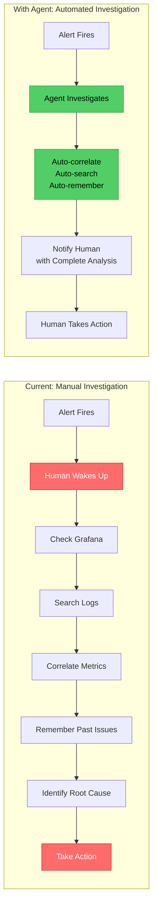

### Integration Points with PiKube

The AI agent will integrate seamlessly with your existing infrastructure:

**Data Sources:**
- Prometheus @ `http://prometheus.monitoring.svc.cluster.local:9090`
- Loki @ `http://loki.monitoring.svc.cluster.local:3100`
- Elasticsearch @ `http://elasticsearch.logging.svc.cluster.local:9200`
- Kubernetes API (via in-cluster service account)

**Storage:**
- PostgreSQL + pgvector (deployed via Longhorn on grapefruit-worker NVMe)
- Redis (session cache, also on NVMe)
- ChromaDB (vector search for incident similarity)

**Deployment:**
- ArgoCD Application (follows your existing GitOps workflow)
- Helm Umbrella Chart (same pattern you use for other services)
- External Secrets integration (API keys from Vault)

**Notifications:**
- Slack (already configured)
- PagerDuty (if you use it)
- Grafana Annotations (mark incidents on dashboards)

### Expected Benefits

Based on industry experience with AI agents:

| Metric | Before | After | Improvement |
|--------|--------|-------|-------------|
| **MTTD** (Mean Time To Detect) | 15-30 min | 2-5 min | 80% faster |
| **MTTR** (Mean Time To Resolve) | 45-90 min | 20-40 min | 50-60% faster |
| **False Positive Rate** | 20-30% | 5-10% | 60% reduction |
| **After-Hours Pages** | 4-6/week | 1-2/week | 70% reduction |
| **Incident Documentation** | Inconsistent | Automatic | 100% coverage |

### Cost Consideration

**Monthly operational cost:** $150-300 USD
- OpenAI API: ~$150-200/month (20-30K requests)
- Anthropic backup: ~$50/month (fallback usage)

**Value delivered:**
- Engineer time saved: 10-20 hours/month @ $100/hr = $1,000-2,000
- Reduced downtime: Fewer prolonged incidents
- Better sleep: Fewer midnight pages
- Knowledge retention: Every incident documented

**ROI:** 5-10x return on investment

---

## 1.6 Real-World Scenario: Complete Investigation

Let's walk through a complete incident investigation to see how all the components work together.

### Scenario: API Service Latency Increase

**11:23 PM - Prometheus Alert Fires:**
```
Alert: high_api_latency
Severity: warning
Details: API p95 latency increased from 250ms to 3.2s
Service: payment-service
Duration: 5 minutes
```

### Investigation Flow with ReAct Pattern

#### Thought 1: Initial Assessment
```
Agent: "API latency alert received. This is unusual—p95 should
be under 500ms. I need to understand what's causing this spike."
```

#### Action 1: Check Current Metrics
```python
Tool: query_prometheus(
    query='rate(http_request_duration_seconds_sum[5m]) / rate(http_request_duration_seconds_count[5m])',
    time_range='30m'
)
```

#### Observation 1: Metrics Analysis
```
Result:
- p50 latency: 2.1s (normally 120ms)
- p95 latency: 5.8s (normally 250ms)
- p99 latency: 12.4s (normally 600ms)
- Error rate: 8.2% (normally 0.3%)

Analysis: Latency increased 10-20x across all percentiles.
Error rate also elevated. This suggests a systemic issue, not
just slow requests.
```

#### Thought 2: Look for Error Patterns
```
Agent: "High latency with elevated errors suggests something
is failing. Let me check recent logs for error patterns."
```

#### Action 2: Query Logs
```python
Tool: query_loki(
    service='payment-service',
    search_term='ERROR',
    time_range='30m'
)
```

#### Observation 2: Log Analysis
```
Result: Found 1,247 errors in last 30 minutes
Top error messages:
- "database query timeout after 30s" (789 occurrences)
- "connection pool exhausted" (234 occurrences)
- "failed to acquire connection" (156 occurrences)

Analysis: Database connectivity issues. Connection pool is
being exhausted, causing cascading timeouts.
```

#### Thought 3: Check Database Status
```
Agent: "Connection pool exhaustion could be due to slow queries
or insufficient pool size. Let me check database metrics."
```

#### Action 3: Get Database Metrics
```python
Tool: query_prometheus(
    query='pg_stat_activity_count{state="active"}',
    time_range='1h'
)
```

#### Observation 3: Database Connection Analysis
```
Result:
- Active connections: 195/200 (97.5% pool usage)
- Connection wait time: 3.2s average
- Query execution time: 45s p95 (normally 0.5s)

Analysis: Pool is nearly full. Queries are 90x slower than normal.
This confirms database is the bottleneck.
```

#### Thought 4: Identify Slow Queries
```
Agent: "Queries are extremely slow. Let me search logs for
specific slow query patterns."
```

#### Action 4: Search Database Logs
```python
Tool: query_loki(
    service='database-service',
    search_term='SELECT.*duration_ms > 10000',
    time_range='30m'
)
```

#### Observation 4: Slow Query Details
```
Result: Found query taking 35-50 seconds:

SELECT u.id, u.name, u.email, o.order_id, o.total
FROM users u
JOIN orders o ON u.email = o.user_email
WHERE o.created_at > '2025-01-10'

Analysis: JOIN on u.email column. This is not an indexed column.
Query is forcing full table scan on users table (1.2M rows).
```

#### Thought 5: Check Deployment History
```
Agent: "This slow query might be new. Let me check if there
were recent deployments that could have introduced it."
```

#### Action 5: Check Recent Deployments
```python
Tool: check_deployments(
    namespace='production',
    service='payment-service',
    time_range='24h'
)
```

#### Observation 5: Deployment Timeline
```
Result:
- 10:47 PM: payment-service deployed (v2.4.1)
- Change: "Add order history to user profile page"
- Latency spike started: 11:18 PM (31 minutes after deploy)

Analysis: New feature deployed that queries order history by
email. Developer didn't realize email column lacks an index.
```

#### Thought 6: Search Past Incidents
```
Agent: "Before concluding, let me check if we've seen similar
issues before."
```

#### Action 6: Search Incident Database
```python
Tool: search_incidents(
    keywords=['database', 'slow query', 'missing index', 'latency'],
    similarity_threshold=0.75
)
```

#### Observation 6: Historical Context
```
Result: Found 2 similar incidents:

1. Incident #1205 (2024-09-15):
   - Symptom: High API latency
   - Cause: Missing index on users.phone_number
   - Resolution: Added index, latency returned to normal
   - MTTR: 45 minutes

2. Incident #982 (2024-07-22):
   - Symptom: Database connection pool exhaustion
   - Cause: N+1 query pattern in new feature
   - Resolution: Optimized query with eager loading
   - MTTR: 62 minutes

Analysis: Pattern matches incident #1205 exactly. Same symptom
(latency), same root cause (missing index), different column.
```

#### Final Conclusion

```
Agent generates comprehensive alert:

━━━━━━━━━━━━━━━━━━━━━━━━━━━━━━━━━━━━━━━━━━━━━━━
🔴 INCIDENT ALERT: High API Latency
━━━━━━━━━━━━━━━━━━━━━━━━━━━━━━━━━━━━━━━━━━━━━━━

Severity: HIGH
Service: payment-service
Detected: 2025-01-14 23:23 UTC
Investigation completed: 23:26 UTC (3 minutes)

ROOT CAUSE:
Unindexed database query introduced in v2.4.1 deployment.
Query joins users table on email column (not indexed),
causing full table scans of 1.2M rows.

EVIDENCE:
• API p95 latency: 5.8s (↑ 2,220% from 250ms baseline)
• Error rate: 8.2% (↑ 2,633% from 0.3% baseline)
• 1,247 "database query timeout" errors in last 30min
• Database connection pool: 195/200 (97.5% utilization)
• Slow query: SELECT with JOIN on users.email (35-50s)
• Timeline: Issue started 31min after v2.4.1 deploy

SIMILAR PAST INCIDENTS:
This matches incident #1205 from Sep 15, 2024:
- Same symptom pattern
- Same root cause (missing index, different column)
- MTTR was 45 minutes

RECOMMENDED ACTIONS:
1. IMMEDIATE: Rollback payment-service to v2.4.0
2. SHORT-TERM: Add index: CREATE INDEX idx_users_email ON users(email)
3. VERIFY: Run query with index, confirm <1s execution time
4. REDEPLOY: Deploy v2.4.1 after index is in place
5. PREVENT: Add query performance testing to CI/CD pipeline

ESTIMATED IMPACT:
• Users affected: ~12,000 in last 30 minutes
• Failed transactions: ~980 (8.2% of 11,950 attempts)
• Business impact: ~$24,500 in failed orders (avg $25/order)

CONFIDENCE: 95%

Next steps: Awaiting human approval for rollback.
━━━━━━━━━━━━━━━━━━━━━━━━━━━━━━━━━━━━━━━━━━━━━━━

Investigation log: /incidents/2025-01-14-2323-high-api-latency
```

### Timeline Comparison

**Without Agent (Traditional):**
```
23:23 - Alert fires, engineer paged
23:28 - Engineer wakes up, logs into laptop (5 min)
23:33 - Checks Grafana, sees latency spike (5 min)
23:43 - Searches logs, finds timeout errors (10 min)
23:53 - Correlates with deployment (10 min)
00:08 - Identifies slow query (15 min)
00:20 - Searches past incidents, finds similar (12 min)
00:25 - Writes analysis, decides on rollback (5 min)
00:30 - Executes rollback (5 min)
━━━━━━━━━━━━━━━━━━━━━━━━━━━━━━━━━━━━━━━━━━━━━━━
Total: 67 minutes from alert to resolution
```

**With Agent (AI-Assisted):**
```
23:23 - Alert fires, agent immediately starts investigation
23:26 - Agent completes analysis (3 min)
23:26 - Alert sent to engineer with complete context
23:29 - Engineer reviews, approves rollback (3 min)
23:32 - Rollback executed (3 min)
━━━━━━━━━━━━━━━━━━━━━━━━━━━━━━━━━━━━━━━━━━━━━━━
Total: 9 minutes from alert to resolution
```

**Improvement: 86% faster resolution (67 min → 9 min)**

---

## 1.7 What You've Learned

Congratulations! You now understand the fundamentals of AI agents for DevOps. Let's recap the key concepts:

### Core Concepts
- ✅ **AI agents** use LLMs to autonomously investigate incidents, not just alert on predefined rules
- ✅ **Three approaches** exist: scripts (rigid), traditional tools (manual), AI agents (intelligent)
- ✅ **Six components** form every agent: Role, Tasks, Tools, Memory, Guardrails, Cooperation
- ✅ **ReAct pattern** (Think → Act → Observe loop) is the recommended approach for PiKube
- ✅ **Integration** leverages existing Prometheus, Loki, Elasticsearch infrastructure
- ✅ **Cost** is approximately $150-300/month with 5-10x ROI from time savings

### Key Takeaways

**1. Agents augment, not replace humans**
The agent handles tedious investigation work (querying logs, correlating metrics, searching past incidents) so engineers can focus on decision-making and remediation.

**2. Guardrails are essential**
Without rate limits, alert throttling, action restrictions, and output validation, agents can cause more harm than good.

**3. Memory enables learning**
Short-term memory tracks current investigations. Long-term memory stores past incidents, enabling the agent to recognize patterns and suggest solutions based on history.

**4. Start simple, expand later**
Begin with a single agent using the ReAct pattern. Once it's working reliably, you can add complexity (multi-agent, planning, advanced patterns).

**5. Integration beats replacement**
The agent connects to your existing observability stack rather than replacing it. You still use Grafana for dashboards, Kibana for ad-hoc queries, etc.

---

## 1.8 What's Next

Now that you understand **what** AI agents are and **why** they're valuable for PiKube, the next chapters will guide you through **how** to build one:

### Chapter 2: Architecture and Design
- Complete system architecture (hybrid edge + cloud)
- Component breakdown (orchestrator, tools, memory, guardrails)
- Integration with PiKube services
- Node placement strategy
- Cost analysis and optimization

### Chapter 3: Prerequisites and Foundation
- Verify cluster readiness
- Deploy namespace and RBAC
- Configure External Secrets (Vault integration)
- Set up API keys securely
- Build Docker image for ARM64

### Chapter 4: Storage Layer Setup
- Deploy PostgreSQL with pgvector
- Deploy Redis for session caching
- Deploy ChromaDB for vector search
- Configure persistent storage on NVMe
- Initialize database schemas

### Chapter 5: Agent Core Development
- Implement ReAct orchestrator with LangChain
- Build tool registry system
- Create guardrails layer
- Add response caching
- Write main event loop

### Chapter 6: Tool Development
- Build Prometheus query tool
- Build Loki query tool
- Build Kubernetes status tools
- Create Slack alerting tool
- Implement tool validation

### Chapter 7: Memory and Learning
- Implement short-term memory (Redis)
- Build long-term incident database
- Create vector embedding pipeline
- Add similarity search
- Build baseline learning system

### Chapter 8: Guardrails and Security
- Implement rate limiting
- Add alert throttling
- Create approval workflows
- Build output validation
- Add cost tracking

### Chapter 9: Deployment with ArgoCD
- Create Helm umbrella chart
- Write ArgoCD Application manifests
- Configure sync waves
- Set up health checks
- Deploy to production

### Chapter 10: Monitoring the Agent
- Create Prometheus metrics
- Build Grafana dashboards
- Set up agent health checks
- Add cost monitoring
- Configure alerting

### Chapter 11: Testing and Validation
- Write unit tests for tools
- Create integration tests
- Simulate incidents
- Measure accuracy
- Load testing

### Chapter 12: Production Operations
- Incident response workflow
- Debugging agent behavior
- Performance tuning
- Cost optimization
- Disaster recovery

---

## Ready to Build?

You now have the conceptual foundation to build a production-grade AI agent for your PiKube cluster. Each subsequent chapter will provide hands-on, step-by-step instructions with complete code examples.

**Time investment:** 8-12 weeks from start to production
**Complexity:** Intermediate to advanced (but we'll guide you through every step)
**Result:** A 24/7 intelligent monitoring system that reduces MTTR by 50-80%

Let's move to **Chapter 2: Architecture and Design** to see the complete technical blueprint.

---

**Questions or feedback?** Open an issue on the [PiKube GitHub repository](https://github.com/AElQazouiInsights/pikube-kubernetes-service).

---

*Last updated: 2025-01-14*
*Part of the PiKube Kubernetes Service Documentation*
