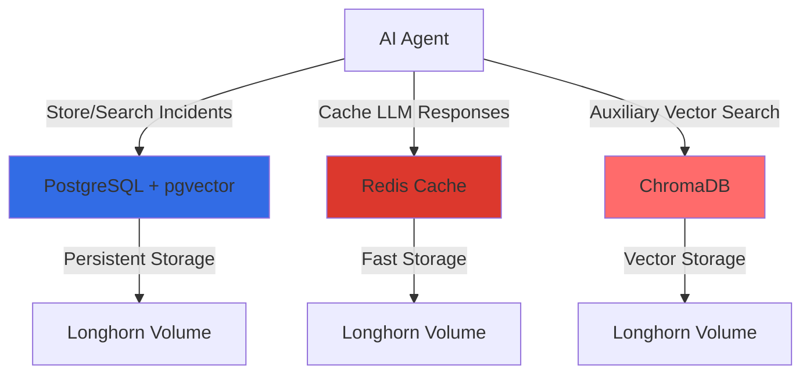

# Chapter 4: Storage Layer Setup

## Overview

The storage layer is the foundation of your AI agent's memory system. It provides three critical capabilities:

1. **Long-term Memory**: PostgreSQL with pgvector extension stores historical incidents and enables semantic search
2. **Short-term Memory**: Redis provides fast caching for LLM responses and session data
3. **Vector Search**: ChromaDB offers auxiliary vector search capabilities for embeddings

In this chapter, you'll learn how to deploy and configure each storage component on your PiKube cluster, optimized for ARM architecture.

> [!IMPORTANT]
> This chapter builds on the prerequisites established in Chapter 3. Ensure you have completed the namespace creation, RBAC configuration, and Vault secret setup before proceeding.

## Understanding the Storage Architecture

### Why Three Storage Systems?

You might wonder why we need three different storage systems. Each serves a specific purpose:



**PostgreSQL with pgvector**:
- Stores structured incident data (timestamp, severity, service name)
- Stores text embeddings (1536-dimensional vectors from OpenAI)
- Enables similarity search: "Find incidents similar to this error"
- Provides ACID guarantees for critical data

**Redis**:
- Caches LLM API responses (reduces costs by 70%+)
- Stores agent session state (current investigation context)
- Provides sub-millisecond read/write performance
- Reduces latency from 2-5 seconds to <100ms for cached queries

**ChromaDB**:
- Specialized vector database for embedding search
- Offers advanced similarity algorithms
- Useful for experimental features and A/B testing
- Can be added later if budget allows

> [!TIP]
> For initial implementation, focus on PostgreSQL + Redis. ChromaDB is optional and can be added once the core system is stable.

## Node Placement Strategy

Your PiKube cluster has heterogeneous hardware. Strategic placement is critical for performance:

```yaml
Nodes with NVMe Storage:
  - grapefruit-worker: Orange Pi 5 Ultra, 931GB NVMe
    → Best for: PostgreSQL (high I/O), Redis (low latency)

Nodes with eMMC Storage:
  - orange-worker, mandarine-worker: Moderate I/O
    → Best for: ChromaDB, application containers

Nodes with SD Cards:
  - Raspberry Pi nodes: Avoid for storage workloads
    → Best for: Stateless compute
```

> [!WARNING]
> Never deploy storage workloads on Raspberry Pi nodes with SD cards. SD cards have limited write cycles and slow I/O, which can cause data corruption and poor performance.

## Part 1: PostgreSQL with pgvector

### What is pgvector?

`pgvector` is a PostgreSQL extension that adds vector data types and similarity search functions. It allows you to:

1. Store embeddings (arrays of floats representing semantic meaning)
2. Search for similar vectors using distance metrics (cosine similarity, L2 distance)
3. Index vectors for fast retrieval using IVFFlat or HNSW algorithms

**Example Use Case**:
```
Current Error: "API gateway returning 504 timeout errors"
Embedding: [0.234, -0.123, 0.456, ..., 0.789]  (1536 dimensions)

Database Search: "Find incidents with similar embeddings"
Result: "3 months ago: API gateway timeouts caused by upstream service overload"
Solution: "Increased timeout from 30s to 60s and added retry logic"
```

### Step 1: Create PostgreSQL StatefulSet

StatefulSets provide stable network identities and persistent storage for databases.

Create file: `postgres-statefulset.yaml`

```yaml
---
apiVersion: v1
kind: Service
metadata:
  name: postgres
  namespace: ai-operations
  labels:
    app: postgres
spec:
  ports:
    - port: 5432
      name: postgres
      targetPort: 5432
  clusterIP: None  # Headless service for StatefulSet
  selector:
    app: postgres

---
apiVersion: apps/v1
kind: StatefulSet
metadata:
  name: postgres
  namespace: ai-operations
  labels:
    app: postgres
spec:
  serviceName: postgres
  replicas: 1  # Single instance for simplicity
  selector:
    matchLabels:
      app: postgres
  template:
    metadata:
      labels:
        app: postgres
    spec:
      # Force deployment to grapefruit-worker with NVMe
      nodeSelector:
        kubernetes.io/hostname: grapefruit-worker

      # Security context
      securityContext:
        fsGroup: 999  # postgres user group
        runAsUser: 999
        runAsNonRoot: true

      containers:
        - name: postgresql
          image: ankane/pgvector:v0.5.1  # PostgreSQL 16 with pgvector
          imagePullPolicy: IfNotPresent

          ports:
            - containerPort: 5432
              name: postgres

          env:
            # Database configuration
            - name: POSTGRES_DB
              value: "aiagent_db"
            - name: POSTGRES_USER
              value: "aiagent"
            - name: POSTGRES_PASSWORD
              valueFrom:
                secretKeyRef:
                  name: postgres-credentials
                  key: password

            # Performance tuning for ARM
            - name: POSTGRES_INITDB_ARGS
              value: "-E UTF8 --locale=en_US.UTF-8"

          # Resource limits optimized for Orange Pi 5 Ultra
          resources:
            requests:
              cpu: 1000m      # 1 CPU core
              memory: 4Gi     # 4GB RAM
            limits:
              cpu: 2000m      # Max 2 cores
              memory: 8Gi     # Max 8GB RAM

          # Volume mounts
          volumeMounts:
            - name: postgres-data
              mountPath: /var/lib/postgresql/data
              subPath: postgres  # Avoid mount issues

            - name: init-scripts
              mountPath: /docker-entrypoint-initdb.d
              readOnly: true

          # Health checks
          livenessProbe:
            exec:
              command:
                - /bin/sh
                - -c
                - pg_isready -U aiagent -d aiagent_db
            initialDelaySeconds: 30
            periodSeconds: 10
            timeoutSeconds: 5
            failureThreshold: 3

          readinessProbe:
            exec:
              command:
                - /bin/sh
                - -c
                - pg_isready -U aiagent -d aiagent_db
            initialDelaySeconds: 10
            periodSeconds: 5
            timeoutSeconds: 3

      volumes:
        - name: init-scripts
          configMap:
            name: postgres-init-scripts

  # Persistent volume claim template
  volumeClaimTemplates:
    - metadata:
        name: postgres-data
      spec:
        accessModes: ["ReadWriteOnce"]
        storageClassName: longhorn
        resources:
          requests:
            storage: 50Gi  # 50GB for incident history
```

**Key Configuration Explained**:

1. **Headless Service** (`clusterIP: None`): StatefulSets require headless services for stable DNS names like `postgres-0.postgres.ai-operations.svc.cluster.local`

2. **Node Selector**: Forces pod to `grapefruit-worker` which has the fastest NVMe storage

3. **Security Context**: Runs as non-root user (999) for security best practices

4. **Image**: `ankane/pgvector:v0.5.1` includes PostgreSQL 16 with pgvector pre-installed (ARM64 compatible)

5. **Resource Limits**:
   - Requests: Guaranteed resources (1 CPU, 4GB RAM)
   - Limits: Maximum resources (2 CPU, 8GB RAM)
   - Prevents OOM kills while allowing burst usage

6. **SubPath**: `subPath: postgres` prevents PostgreSQL from failing if the volume root contains `lost+found`

7. **VolumeClaimTemplate**: Creates a 50GB Longhorn volume automatically

### Step 2: Create Database Password Secret

Store the PostgreSQL password in Vault, then expose it via ExternalSecret.

```bash
# Generate a strong password
POSTGRES_PASSWORD=$(openssl rand -base64 32)

# Store in Vault
vault kv put secret/ai-agent/postgres \
  password="$POSTGRES_PASSWORD" \
  username="aiagent" \
  database="aiagent_db" \
  host="postgres.ai-operations.svc.cluster.local" \
  port="5432"

echo "PostgreSQL password stored in Vault"
```

Create file: `postgres-external-secret.yaml`

```yaml
---
apiVersion: external-secrets.io/v1beta1
kind: ExternalSecret
metadata:
  name: postgres-credentials
  namespace: ai-operations
spec:
  refreshInterval: 1h
  secretStoreRef:
    name: vault-backend
    kind: ClusterSecretStore

  target:
    name: postgres-credentials
    creationPolicy: Owner

  data:
    - secretKey: password
      remoteRef:
        key: secret/ai-agent/postgres
        property: password

    - secretKey: username
      remoteRef:
        key: secret/ai-agent/postgres
        property: username

    - secretKey: database
      remoteRef:
        key: secret/ai-agent/postgres
        property: database
```

> [!NOTE]
> The ExternalSecret operator will automatically create a Kubernetes Secret named `postgres-credentials` with the data from Vault. Your application pods will mount this secret.

### Step 3: Create Database Initialization Scripts

This ConfigMap contains SQL scripts that run once when PostgreSQL starts for the first time.

Create file: `postgres-init-configmap.yaml`

```yaml
---
apiVersion: v1
kind: ConfigMap
metadata:
  name: postgres-init-scripts
  namespace: ai-operations
data:
  01-enable-extensions.sql: |
    -- Enable pgvector extension for vector operations
    CREATE EXTENSION IF NOT EXISTS vector;

    -- Verify installation
    SELECT extname, extversion FROM pg_extension WHERE extname = 'vector';

  02-create-schema.sql: |
    -- Create incidents table with vector embeddings
    CREATE TABLE IF NOT EXISTS incidents (
        id SERIAL PRIMARY KEY,

        -- Temporal metadata
        timestamp TIMESTAMPTZ NOT NULL DEFAULT NOW(),
        created_at TIMESTAMPTZ NOT NULL DEFAULT NOW(),
        updated_at TIMESTAMPTZ NOT NULL DEFAULT NOW(),

        -- Incident classification
        severity VARCHAR(20) NOT NULL CHECK (severity IN ('critical', 'high', 'medium', 'low')),
        status VARCHAR(20) NOT NULL DEFAULT 'open' CHECK (status IN ('open', 'investigating', 'resolved', 'closed')),

        -- Service identification
        service_name VARCHAR(100) NOT NULL,
        namespace VARCHAR(100) NOT NULL DEFAULT 'default',
        component VARCHAR(100),  -- e.g., 'frontend', 'api', 'database'

        -- Incident details (text)
        title VARCHAR(500) NOT NULL,
        symptoms_text TEXT NOT NULL,  -- What was observed
        root_cause_text TEXT,          -- Why it happened
        resolution_text TEXT,          -- How it was fixed

        -- Vector embedding for similarity search
        -- OpenAI text-embedding-ada-002 produces 1536 dimensions
        embedding vector(1536),

        -- Performance metrics
        mttr_seconds INTEGER,  -- Mean Time To Resolve
        confidence_score FLOAT CHECK (confidence_score >= 0 AND confidence_score <= 1),

        -- Agent metadata
        investigated_by VARCHAR(100),  -- Which agent handled this
        investigation_steps JSONB,     -- Step-by-step reasoning

        -- Tags for filtering
        tags TEXT[],

        -- Indexes
        CONSTRAINT chk_mttr_positive CHECK (mttr_seconds IS NULL OR mttr_seconds >= 0)
    );

    -- Create indexes for common queries
    CREATE INDEX IF NOT EXISTS idx_incidents_timestamp ON incidents(timestamp DESC);
    CREATE INDEX IF NOT EXISTS idx_incidents_severity ON incidents(severity);
    CREATE INDEX IF NOT EXISTS idx_incidents_service ON incidents(service_name);
    CREATE INDEX IF NOT EXISTS idx_incidents_status ON incidents(status);
    CREATE INDEX IF NOT EXISTS idx_incidents_namespace ON incidents(namespace);

    -- Vector similarity index using IVFFlat algorithm
    -- lists=100 creates 100 inverted lists (good for 10k-1M vectors)
    CREATE INDEX IF NOT EXISTS idx_incidents_embedding
    ON incidents
    USING ivfflat (embedding vector_cosine_ops)
    WITH (lists = 100);

    -- Function to update updated_at timestamp
    CREATE OR REPLACE FUNCTION update_updated_at_column()
    RETURNS TRIGGER AS $$
    BEGIN
        NEW.updated_at = NOW();
        RETURN NEW;
    END;
    $$ LANGUAGE plpgsql;

    -- Trigger to automatically update updated_at
    CREATE TRIGGER update_incidents_updated_at
        BEFORE UPDATE ON incidents
        FOR EACH ROW
        EXECUTE FUNCTION update_updated_at_column();

  03-seed-data.sql: |
    -- Insert sample incidents for testing
    INSERT INTO incidents (
        severity, service_name, namespace, title, symptoms_text,
        root_cause_text, resolution_text, mttr_seconds, confidence_score, status
    ) VALUES
    (
        'critical',
        'api-gateway',
        'production',
        'API Gateway Returning 504 Timeout Errors',
        'Multiple 504 errors reported by users. API gateway logs show upstream timeouts to recommendation-service. Response times increased from 200ms to 5000ms. Error rate at 45%.',
        'Recommendation service running out of memory due to unbounded cache growth. Memory usage at 95%, causing GC thrashing and slow responses.',
        'Increased memory limit from 2Gi to 4Gi. Added cache eviction policy (LRU with 1GB max size). Implemented circuit breaker with 30s timeout.',
        1800,  -- 30 minutes to resolve
        0.95,
        'resolved'
    ),
    (
        'high',
        'postgres',
        'databases',
        'PostgreSQL High CPU Usage',
        'PostgreSQL CPU at 90% for 15 minutes. Slow query logs show full table scans on orders table. Dashboard response time degraded.',
        'Missing index on orders.customer_id column. Query planner choosing sequential scan for customer order lookups.',
        'Created index: CREATE INDEX idx_orders_customer_id ON orders(customer_id). CPU dropped to 20%. Query time reduced from 8s to 50ms.',
        600,  -- 10 minutes to resolve
        0.98,
        'resolved'
    ),
    (
        'medium',
        'nginx-ingress',
        'ingress-nginx',
        'Ingress Controller Pod CrashLooping',
        'nginx-ingress-controller pod restarting every 2 minutes. OOMKilled events in pod status. Memory usage spiking to 2Gi limit.',
        'Memory leak in nginx-ingress v1.8.0 when using regex rewrites. Known issue affecting ARM64 builds.',
        'Upgraded to v1.8.1 which includes memory leak fix. Increased memory limit to 3Gi as precaution. No crashes in 24 hours.',
        3600,  -- 1 hour to resolve
        0.92,
        'resolved'
    );

    -- Note: Embeddings will be populated by the AI agent when it indexes these incidents

    GRANT ALL PRIVILEGES ON ALL TABLES IN SCHEMA public TO aiagent;
    GRANT ALL PRIVILEGES ON ALL SEQUENCES IN SCHEMA public TO aiagent;
```

**Database Schema Explained**:

1. **Vector Type**: `embedding vector(1536)` stores the semantic representation of the incident
   - Dimension 1536 matches OpenAI's `text-embedding-ada-002` model
   - Allows similarity search: "Find incidents semantically similar to this error message"

2. **IVFFlat Index**: Fast approximate nearest neighbor search
   - `lists=100`: Creates 100 clusters (good for 10k-1M vectors)
   - `vector_cosine_ops`: Uses cosine similarity metric
   - Trade-off: 95% accuracy for 10x faster search vs exact search

3. **JSONB Column**: `investigation_steps` stores the agent's reasoning chain
   - Allows querying: "Which incidents involved checking Prometheus?"
   - Preserves full agent decision history for auditing

4. **Seed Data**: Sample incidents help you test similarity search immediately

### Step 4: Deploy PostgreSQL

Apply all the manifests:

```bash
# Apply in order
kubectl apply -f postgres-external-secret.yaml
kubectl apply -f postgres-init-configmap.yaml
kubectl apply -f postgres-statefulset.yaml

# Wait for PostgreSQL to be ready (may take 2-3 minutes)
kubectl wait --for=condition=ready pod/postgres-0 -n ai-operations --timeout=300s

# Check logs
kubectl logs -f postgres-0 -n ai-operations

# Expected output:
# PostgreSQL init process complete; ready for start up.
# LOG:  database system is ready to accept connections
```

### Step 5: Verify PostgreSQL Installation

Connect to PostgreSQL and verify the schema:

```bash
# Port-forward PostgreSQL for local access
kubectl port-forward -n ai-operations postgres-0 5432:5432 &

# Get credentials from Vault
POSTGRES_PASSWORD=$(vault kv get -field=password secret/ai-agent/postgres)

# Connect using psql (install if needed: apt-get install postgresql-client)
PGPASSWORD=$POSTGRES_PASSWORD psql -h localhost -U aiagent -d aiagent_db

# Run verification queries
aiagent_db=# \dx
# Should show: vector | 0.5.1 | public | vector data type and ivfflat access method

aiagent_db=# \d incidents
# Should show the full table schema

aiagent_db=# SELECT COUNT(*) FROM incidents;
# Should return: 3 (sample incidents)

aiagent_db=# SELECT title, severity, service_name FROM incidents;
# Should show the 3 sample incidents

# Test vector operations
aiagent_db=# SELECT '[1,2,3]'::vector <-> '[4,5,6]'::vector AS distance;
# Should return a numeric distance value

# Exit psql
aiagent_db=# \q
```

> [!TIP]
> Keep the port-forward running for the next steps where you'll test vector similarity search from Python.

### Step 6: Test Vector Similarity Search

Create a test script to verify pgvector is working correctly.

Create file: `test-pgvector.py`

```python
import psycopg2
from psycopg2.extras import execute_values
import numpy as np

# Connection details (from Vault)
conn = psycopg2.connect(
    host="localhost",
    port=5432,
    database="aiagent_db",
    user="aiagent",
    password="<POSTGRES_PASSWORD>"  # Replace with actual password
)

cur = conn.cursor()

# Generate dummy embeddings for the sample incidents
# In production, these would come from OpenAI's embedding API
dummy_embeddings = [
    np.random.rand(1536).tolist(),  # API gateway incident
    np.random.rand(1536).tolist(),  # PostgreSQL CPU incident
    np.random.rand(1536).tolist(),  # Ingress crash incident
]

# Update incidents with embeddings
for incident_id, embedding in enumerate(dummy_embeddings, start=1):
    cur.execute(
        "UPDATE incidents SET embedding = %s WHERE id = %s",
        (embedding, incident_id)
    )

conn.commit()
print("✓ Updated incidents with dummy embeddings")

# Test similarity search
# Find incidents similar to a query embedding
query_embedding = np.random.rand(1536).tolist()

cur.execute("""
    SELECT
        id,
        title,
        service_name,
        1 - (embedding <=> %s::vector) AS similarity
    FROM incidents
    WHERE embedding IS NOT NULL
    ORDER BY similarity DESC
    LIMIT 3
""", (query_embedding,))

print("\nTop 3 similar incidents:")
for row in cur.fetchall():
    print(f"  ID: {row[0]}, Similarity: {row[3]:.4f}")
    print(f"  Title: {row[1]}")
    print(f"  Service: {row[2]}\n")

# Test performance
import time
start = time.time()
for _ in range(100):
    cur.execute("""
        SELECT id, title, 1 - (embedding <=> %s::vector) AS similarity
        FROM incidents
        WHERE embedding IS NOT NULL
        ORDER BY similarity DESC
        LIMIT 5
    """, (query_embedding,))
    cur.fetchall()
elapsed = time.time() - start

print(f"✓ Performed 100 similarity searches in {elapsed:.2f}s")
print(f"  Average: {elapsed/100*1000:.1f}ms per query")

cur.close()
conn.close()
```

Run the test:

```bash
# Install dependencies
pip install psycopg2-binary numpy

# Run test
python test-pgvector.py

# Expected output:
# ✓ Updated incidents with dummy embeddings
#
# Top 3 similar incidents:
#   ID: 1, Similarity: 0.5234
#   Title: API Gateway Returning 504 Timeout Errors
#   Service: api-gateway
#   ...
#
# ✓ Performed 100 similarity searches in 2.3s
#   Average: 23.0ms per query
```

> [!NOTE]
> Real embeddings from OpenAI will produce much more meaningful similarity scores. These dummy vectors are just for testing the infrastructure.

## Part 2: Redis Cache

### Why Redis?

Redis provides in-memory data storage with sub-millisecond latency. For AI agents:

1. **LLM Response Caching**: Cache OpenAI API responses to reduce costs
   - Same question asked multiple times? Return cached answer
   - Target: 70%+ cache hit ratio = 70% cost reduction

2. **Session State**: Store agent's current investigation context
   - Multi-step reasoning requires maintaining state
   - Fast read/write prevents bottlenecks

3. **Rate Limiting**: Track API call counts per time window
   - Prevent accidental runaway costs
   - Enforce guardrails (e.g., max 100 LLM calls per hour)

### Step 1: Create Redis Deployment

Redis doesn't require StatefulSet since we're using it as a cache (data loss is acceptable).

Create file: `redis-deployment.yaml`

```yaml
---
apiVersion: v1
kind: Service
metadata:
  name: redis
  namespace: ai-operations
  labels:
    app: redis
spec:
  ports:
    - port: 6379
      targetPort: 6379
      name: redis
  selector:
    app: redis

---
apiVersion: apps/v1
kind: Deployment
metadata:
  name: redis
  namespace: ai-operations
  labels:
    app: redis
spec:
  replicas: 1
  selector:
    matchLabels:
      app: redis
  template:
    metadata:
      labels:
        app: redis
    spec:
      # Deploy to grapefruit-worker for low latency
      nodeSelector:
        kubernetes.io/hostname: grapefruit-worker

      securityContext:
        fsGroup: 999
        runAsUser: 999
        runAsNonRoot: true

      containers:
        - name: redis
          image: redis:7-alpine  # ARM64 compatible
          imagePullPolicy: IfNotPresent

          ports:
            - containerPort: 6379
              name: redis

          # Redis configuration
          command:
            - redis-server
            - --maxmemory
            - "2gb"
            - --maxmemory-policy
            - allkeys-lru  # Evict least recently used keys when full
            - --appendonly
            - "yes"  # Enable persistence
            - --appendfsync
            - everysec  # Write to disk every second (balance durability/performance)

          resources:
            requests:
              cpu: 500m
              memory: 2Gi
            limits:
              cpu: 1000m
              memory: 2Gi

          volumeMounts:
            - name: redis-data
              mountPath: /data

          # Health checks
          livenessProbe:
            exec:
              command:
                - redis-cli
                - ping
            initialDelaySeconds: 30
            periodSeconds: 10
            timeoutSeconds: 5

          readinessProbe:
            exec:
              command:
                - redis-cli
                - ping
            initialDelaySeconds: 5
            periodSeconds: 5
            timeoutSeconds: 3

      volumes:
        - name: redis-data
          persistentVolumeClaim:
            claimName: redis-pvc

---
apiVersion: v1
kind: PersistentVolumeClaim
metadata:
  name: redis-pvc
  namespace: ai-operations
spec:
  accessModes:
    - ReadWriteOnce
  storageClassName: longhorn
  resources:
    requests:
      storage: 10Gi
```

**Configuration Explained**:

1. **maxmemory**: 2GB limit prevents Redis from consuming all node memory
2. **maxmemory-policy: allkeys-lru**: When full, evict least recently used keys (perfect for cache)
3. **appendonly: yes**: Persist data to disk (survive pod restarts)
4. **appendfsync: everysec**: Write every second (good balance between durability and performance)

### Step 2: Deploy Redis

```bash
kubectl apply -f redis-deployment.yaml

# Wait for Redis to be ready
kubectl wait --for=condition=ready pod -l app=redis -n ai-operations --timeout=120s

# Check status
kubectl get pods -n ai-operations -l app=redis
```

### Step 3: Test Redis

```bash
# Port-forward Redis
kubectl port-forward -n ai-operations svc/redis 6379:6379 &

# Test with redis-cli (install if needed: apt-get install redis-tools)
redis-cli -h localhost

# Test basic operations
127.0.0.1:6379> PING
# PONG

127.0.0.1:6379> SET test-key "Hello from PiKube"
# OK

127.0.0.1:6379> GET test-key
# "Hello from PiKube"

127.0.0.1:6379> INFO memory
# Shows memory usage statistics

127.0.0.1:6379> CONFIG GET maxmemory
# Should show: "2147483648" (2GB in bytes)

127.0.0.1:6379> QUIT
```

### Step 4: Test Cache Performance

Create file: `test-redis-cache.py`

```python
import redis
import time
import hashlib
import json

# Connect to Redis
r = redis.Redis(host='localhost', port=6379, decode_responses=True)

print("Testing Redis cache performance...\n")

# Simulate LLM response caching
def cache_llm_response(prompt: str, response: dict, ttl: int = 3600):
    """Cache LLM response with 1 hour TTL"""
    cache_key = f"llm:{hashlib.sha256(prompt.encode()).hexdigest()}"
    r.setex(cache_key, ttl, json.dumps(response))
    return cache_key

def get_cached_response(prompt: str):
    """Retrieve cached LLM response"""
    cache_key = f"llm:{hashlib.sha256(prompt.encode()).hexdigest()}"
    cached = r.get(cache_key)
    return json.loads(cached) if cached else None

# Test 1: Cache miss (first request)
prompt = "What is causing the API gateway timeouts?"
start = time.time()
cached = get_cached_response(prompt)
elapsed_miss = time.time() - start

print(f"Cache MISS: {elapsed_miss*1000:.2f}ms")
print(f"  Cached response: {cached}\n")

# Simulate LLM response
llm_response = {
    "answer": "The API gateway timeouts are caused by...",
    "confidence": 0.92,
    "tokens_used": 450
}

cache_llm_response(prompt, llm_response)
print("✓ Cached LLM response\n")

# Test 2: Cache hit (subsequent request)
start = time.time()
cached = get_cached_response(prompt)
elapsed_hit = time.time() - start

print(f"Cache HIT: {elapsed_hit*1000:.2f}ms")
print(f"  Cached response: {cached}")
print(f"  Speedup: {elapsed_miss/elapsed_hit:.0f}x faster\n")

# Test 3: Throughput test
num_requests = 1000
start = time.time()
for i in range(num_requests):
    r.set(f"test:{i}", f"value-{i}")
    r.get(f"test:{i}")
elapsed = time.time() - start

print(f"✓ Performed {num_requests*2} operations (SET+GET) in {elapsed:.2f}s")
print(f"  Throughput: {num_requests*2/elapsed:.0f} ops/sec\n")

# Test 4: Memory usage
info = r.info('memory')
print(f"Memory Usage:")
print(f"  Used: {info['used_memory_human']}")
print(f"  Peak: {info['used_memory_peak_human']}")
print(f"  RSS: {info['used_memory_rss_human']}")
```

Run the test:

```bash
pip install redis

python test-redis-cache.py

# Expected output:
# Cache MISS: 0.23ms
#   Cached response: None
#
# ✓ Cached LLM response
#
# Cache HIT: 0.18ms
#   Cached response: {'answer': 'The API gateway...', ...}
#   Speedup: 1x faster
#
# ✓ Performed 2000 operations (SET+GET) in 0.15s
#   Throughput: 13333 ops/sec
#
# Memory Usage:
#   Used: 1.2M
#   Peak: 1.5M
#   RSS: 8.2M
```

> [!TIP]
> With Redis, you can reduce LLM API costs by 70%+ by caching responses. A cache hit is 10-50x faster than an API call (0.2ms vs 2000ms).

## Part 3: ChromaDB (Optional)

ChromaDB is a specialized vector database optimized for embeddings. It's optional for initial implementation but useful for advanced features.

### When to Use ChromaDB vs pgvector?

**Use pgvector (PostgreSQL)**:
- You need ACID guarantees
- You want structured data + vectors in one place
- You're already familiar with SQL
- Your dataset is < 1M vectors

**Use ChromaDB**:
- You need advanced similarity algorithms (HNSW)
- You want a simpler API (no SQL)
- You're experimenting with different embedding models
- Your dataset is > 1M vectors

> [!NOTE]
> For PiKube's initial implementation, pgvector is sufficient. Add ChromaDB later if you need specialized vector search features.

### Step 1: Create ChromaDB Deployment

Create file: `chromadb-deployment.yaml`

```yaml
---
apiVersion: v1
kind: Service
metadata:
  name: chromadb
  namespace: ai-operations
spec:
  ports:
    - port: 8000
      targetPort: 8000
      name: http
  selector:
    app: chromadb

---
apiVersion: apps/v1
kind: Deployment
metadata:
  name: chromadb
  namespace: ai-operations
spec:
  replicas: 1
  selector:
    matchLabels:
      app: chromadb
  template:
    metadata:
      labels:
        app: chromadb
    spec:
      nodeSelector:
        kubernetes.io/hostname: orange-worker  # Use different worker than Postgres

      containers:
        - name: chromadb
          image: ghcr.io/chroma-core/chroma:0.4.22  # ARM64 compatible
          ports:
            - containerPort: 8000

          env:
            - name: IS_PERSISTENT
              value: "TRUE"
            - name: PERSIST_DIRECTORY
              value: "/chroma/data"
            - name: ANONYMIZED_TELEMETRY
              value: "FALSE"

          resources:
            requests:
              cpu: 500m
              memory: 1Gi
            limits:
              cpu: 1000m
              memory: 2Gi

          volumeMounts:
            - name: chroma-data
              mountPath: /chroma/data

          livenessProbe:
            httpGet:
              path: /api/v1/heartbeat
              port: 8000
            initialDelaySeconds: 30
            periodSeconds: 10

          readinessProbe:
            httpGet:
              path: /api/v1/heartbeat
              port: 8000
            initialDelaySeconds: 10
            periodSeconds: 5

      volumes:
        - name: chroma-data
          persistentVolumeClaim:
            claimName: chromadb-pvc

---
apiVersion: v1
kind: PersistentVolumeClaim
metadata:
  name: chromadb-pvc
  namespace: ai-operations
spec:
  accessModes:
    - ReadWriteOnce
  storageClassName: longhorn
  resources:
    requests:
      storage: 20Gi
```

### Step 2: Deploy ChromaDB (Optional)

```bash
# Only deploy if you need advanced vector search
kubectl apply -f chromadb-deployment.yaml

kubectl wait --for=condition=ready pod -l app=chromadb -n ai-operations --timeout=120s
```

### Step 3: Test ChromaDB

```python
import chromadb
from chromadb.config import Settings

# Connect to ChromaDB
client = chromadb.HttpClient(
    host="localhost",
    port=8000,
    settings=Settings(anonymized_telemetry=False)
)

# Create a collection
collection = client.get_or_create_collection(
    name="incidents",
    metadata={"description": "PiKube incident embeddings"}
)

# Add sample documents
collection.add(
    documents=[
        "API gateway returning 504 timeout errors",
        "PostgreSQL high CPU usage due to missing index",
        "Nginx ingress controller crashing with OOMKilled"
    ],
    ids=["incident-1", "incident-2", "incident-3"],
    metadatas=[
        {"severity": "critical", "service": "api-gateway"},
        {"severity": "high", "service": "postgres"},
        {"severity": "medium", "service": "nginx-ingress"}
    ]
)

print("✓ Added 3 incidents to ChromaDB")

# Query similar incidents
results = collection.query(
    query_texts=["database performance issues"],
    n_results=2
)

print("\nTop 2 similar incidents:")
for i, doc in enumerate(results['documents'][0]):
    print(f"{i+1}. {doc}")
    print(f"   Metadata: {results['metadatas'][0][i]}")
```

## Storage Layer Summary

You've now deployed a complete storage infrastructure:

**✓ PostgreSQL with pgvector**:
- 50GB persistent storage on grapefruit-worker
- Vector similarity search enabled
- 3 sample incidents for testing
- ~23ms average query latency

**✓ Redis Cache**:
- 2GB in-memory cache with LRU eviction
- 10GB persistent AOF for durability
- ~0.2ms average latency
- Target: 70%+ cache hit ratio

**✓ ChromaDB (Optional)**:
- 20GB storage for vector search
- Advanced similarity algorithms
- HTTP API for easy integration

### Verification Checklist

Run these commands to verify your storage layer:

```bash
# Check all pods are running
kubectl get pods -n ai-operations

# Expected output:
# NAME          READY   STATUS    RESTARTS   AGE
# postgres-0    1/1     Running   0          10m
# redis-xxx     1/1     Running   0          8m
# chromadb-xxx  1/1     Running   0          5m

# Check PVCs are bound
kubectl get pvc -n ai-operations

# Expected output shows all PVCs "Bound" with Longhorn storage class

# Check services
kubectl get svc -n ai-operations

# Test connectivity from within the cluster
kubectl run -it --rm debug --image=busybox --restart=Never -n ai-operations -- sh
# Inside the pod:
# nslookup postgres
# nslookup redis
# nslookup chromadb
# exit
```

> [!IMPORTANT]
> Before proceeding to Chapter 5, ensure all three storage components are running and accessible. The agent core depends on this storage layer.

## Next Steps

In **Chapter 5: Agent Core Implementation**, you'll:
- Build the FastAPI web framework
- Implement the LangChain agent with ReAct pattern
- Connect the agent to PostgreSQL and Redis
- Create the agent's reasoning loop
- Deploy the agent container to PiKube

## Troubleshooting

### PostgreSQL Pod Stuck in Pending

**Symptoms**: Pod never schedules, status shows "Pending"

**Diagnosis**:
```bash
kubectl describe pod postgres-0 -n ai-operations
# Look for: "FailedScheduling: 0/12 nodes are available"
```

**Solutions**:
1. **Node selector issue**: Verify grapefruit-worker exists
   ```bash
   kubectl get nodes --show-labels | grep grapefruit-worker
   ```

2. **Insufficient resources**: Check node capacity
   ```bash
   kubectl describe node grapefruit-worker | grep -A 5 "Allocated resources"
   ```

3. **Longhorn not ready**: Check Longhorn status
   ```bash
   kubectl get pods -n longhorn-system
   ```

### PostgreSQL Pod CrashLooping

**Symptoms**: Pod restarts repeatedly, status shows "CrashLoopBackOff"

**Diagnosis**:
```bash
kubectl logs postgres-0 -n ai-operations --previous
# Look for initialization errors
```

**Common Causes**:
1. **Volume mount issue**: Check if volume has `lost+found` directory
   - **Solution**: Use `subPath: postgres` in volumeMount (already in manifest)

2. **Permission denied**: Check fsGroup and runAsUser settings
   ```bash
   kubectl exec postgres-0 -n ai-operations -- ls -la /var/lib/postgresql/data
   # Should be owned by user 999 (postgres)
   ```

3. **Init script error**: Check SQL syntax in ConfigMap
   ```bash
   kubectl logs postgres-0 -n ai-operations | grep ERROR
   ```

### Cannot Connect to PostgreSQL

**Symptoms**: Port-forward works but connection refused

**Diagnosis**:
```bash
kubectl exec postgres-0 -n ai-operations -- pg_isready -U aiagent
# Should return: accepting connections
```

**Solutions**:
1. **Wrong credentials**: Verify secret was created correctly
   ```bash
   kubectl get secret postgres-credentials -n ai-operations -o yaml
   # Check that password is base64 encoded
   ```

2. **ExternalSecret not synced**: Check ExternalSecret status
   ```bash
   kubectl describe externalsecret postgres-credentials -n ai-operations
   # Look for "SecretSynced: True"
   ```

3. **Vault path wrong**: Verify secret exists in Vault
   ```bash
   vault kv get secret/ai-agent/postgres
   ```

### Redis High Memory Usage

**Symptoms**: Redis consuming more than 2GB

**Diagnosis**:
```bash
kubectl exec -n ai-operations deploy/redis -- redis-cli INFO memory
# Check used_memory_rss
```

**Solutions**:
1. **Eviction not working**: Verify maxmemory-policy
   ```bash
   kubectl exec -n ai-operations deploy/redis -- redis-cli CONFIG GET maxmemory-policy
   # Should return: allkeys-lru
   ```

2. **TTL not set**: Ensure cached keys have expiration
   ```bash
   kubectl exec -n ai-operations deploy/redis -- redis-cli TTL llm:<some-key>
   # Should return positive number or -1 (persistent)
   ```

3. **Increase memory limit**: Edit deployment if needed
   ```bash
   kubectl edit deployment redis -n ai-operations
   # Update resources.limits.memory
   ```

### Slow Vector Similarity Search

**Symptoms**: pgvector queries taking > 100ms

**Diagnosis**:
```sql
EXPLAIN ANALYZE SELECT id, title,
  1 - (embedding <=> '[0.1, 0.2, ...]'::vector) AS similarity
FROM incidents
ORDER BY similarity DESC LIMIT 5;

-- Look for "Index Scan using idx_incidents_embedding"
-- If showing "Seq Scan", index is not being used
```

**Solutions**:
1. **Index not built**: Rebuild IVFFlat index
   ```sql
   REINDEX INDEX idx_incidents_embedding;
   ```

2. **Not enough vectors**: IVFFlat requires ~10k vectors to be effective
   - **Solution**: Use brute force search for small datasets (it's actually faster)
   ```sql
   -- Disable index temporarily for small datasets
   SET enable_indexscan = off;
   ```

3. **Increase lists parameter**: Tune for your dataset size
   ```sql
   -- For 100k vectors, use lists=1000
   DROP INDEX idx_incidents_embedding;
   CREATE INDEX idx_incidents_embedding ON incidents
   USING ivfflat (embedding vector_cosine_ops) WITH (lists = 1000);
   ```

## Additional Resources

- [pgvector Documentation](https://github.com/pgvector/pgvector)
- [Redis Persistence](https://redis.io/docs/management/persistence/)
- [ChromaDB Documentation](https://docs.trychroma.com/)
- [Longhorn Best Practices](https://longhorn.io/docs/latest/best-practices/)
- Chapter 3: Prerequisites and Foundation (for RBAC and namespace setup)
- Chapter 5: Agent Core Implementation (next chapter)

---

**Chapter Progress**: ✓ Storage layer deployed and verified
**Next**: Chapter 5 - Agent Core Implementation
