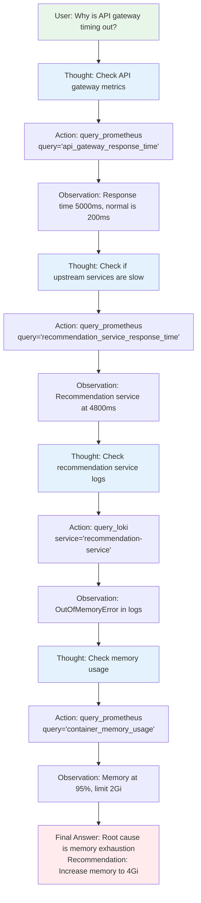
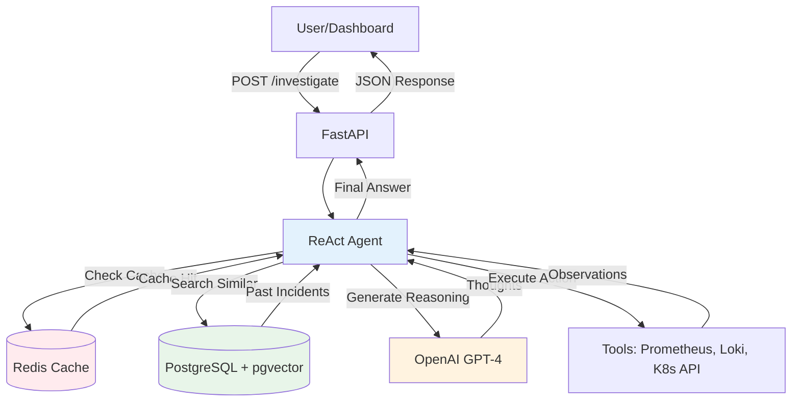

# Chapter 5: Agent Core Implementation

## Overview

In this chapter, you'll build the "brain" of your AI agent - the core reasoning system that investigates incidents and makes recommendations. You'll learn:

1. **FastAPI Framework**: Web API for receiving requests and returning responses
2. **LangChain Integration**: Framework for building LLM-powered applications
3. **ReAct Pattern**: Reasoning + Acting loop that enables intelligent decision-making
4. **PostgreSQL Integration**: Connecting to your storage layer from Chapter 4
5. **Redis Caching**: Implementing cost-saving LLM response caching

By the end of this chapter, you'll have a working AI agent that can:
- Accept incident investigation requests via HTTP API
- Reason through problems using the ReAct pattern
- Query Kubernetes APIs (tools covered in Chapter 6)
- Return detailed analysis with recommendations

> [!IMPORTANT]
> This chapter assumes you've completed Chapter 4 (Storage Layer Setup). Your PostgreSQL and Redis instances must be running and accessible.

## Understanding the ReAct Pattern

### What is ReAct?

ReAct (Reasoning + Acting) is a pattern where the AI agent alternates between:

1. **Thought**: Reasoning about what information is needed
2. **Action**: Using a tool to gather that information
3. **Observation**: Analyzing the tool's output
4. **Repeat**: Continue until enough evidence is gathered
5. **Final Answer**: Provide comprehensive answer with recommendations

**Example Investigation Flow**:



### Why ReAct?

**Alternative 1: Simple Prompt** (No reasoning):
```
Prompt: "What's wrong with the API gateway?"
Problem: AI doesn't know what data to look at, makes random guesses
```

**Alternative 2: Chain-of-Thought** (Reasoning but no action):
```
Prompt: "Think step by step about API gateway issues"
Problem: AI can reason but can't gather actual data
```

**ReAct: Best of Both Worlds**:
```
AI thinks → Uses tool to get real data → Thinks about data → Uses another tool → ...
Result: Grounded reasoning based on actual evidence
```

> [!TIP]
> ReAct is like having a junior DevOps engineer who asks questions, looks at dashboards, reads logs, and then explains what they found. The tools (Chapter 6) are their "dashboards" and "log viewers".

## Project Structure

Let's organize the code in a maintainable structure:

```
ai-agent/
├── Dockerfile                 # Container build instructions
├── requirements.txt           # Python dependencies
├── app/
│   ├── __init__.py
│   ├── main.py               # FastAPI application entry point
│   ├── config.py             # Configuration and environment variables
│   ├── models.py             # Pydantic models for request/response
│   ├── agent/
│   │   ├── __init__.py
│   │   ├── core.py           # ReAct agent implementation
│   │   ├── prompts.py        # Prompt templates
│   │   └── tools.py          # Tool definitions (expand in Chapter 6)
│   ├── storage/
│   │   ├── __init__.py
│   │   ├── postgres.py       # PostgreSQL client
│   │   └── redis.py          # Redis cache client
│   └── utils/
│       ├── __init__.py
│       └── logging.py        # Structured logging
└── tests/
    ├── __init__.py
    ├── test_agent.py
    └── test_storage.py
```

## Step 1: Set Up Python Environment

First, create the project directory and dependencies file.

```bash
# Create project directory
mkdir -p ~/ai-agent
cd ~/ai-agent

# Create directory structure
mkdir -p app/{agent,storage,utils} tests

# Create empty __init__.py files
touch app/__init__.py
touch app/agent/__init__.py
touch app/storage/__init__.py
touch app/utils/__init__.py
touch tests/__init__.py
```

Create `requirements.txt`:

```txt
# Web framework
fastapi==0.109.0
uvicorn[standard]==0.27.0
pydantic==2.5.3
pydantic-settings==2.1.0

# LangChain and LLM
langchain==0.1.4
langchain-openai==0.0.5
langchain-community==0.0.16
openai==1.10.0

# Database clients
psycopg2-binary==2.9.9
redis==5.0.1
sqlalchemy==2.0.25

# Kubernetes client
kubernetes==29.0.0

# Utilities
python-dotenv==1.0.0
python-json-logger==2.0.7
tenacity==8.2.3  # Retry logic

# Optional: Anthropic Claude (fallback LLM)
anthropic==0.8.1
```

> [!NOTE]
> We're pinning versions for reproducibility. In production, use tools like Poetry or pip-tools for dependency management.

## Step 2: Configuration Management

Create `app/config.py` to centralize configuration:

```python
"""Configuration management for AI Agent."""
from pydantic_settings import BaseSettings
from functools import lru_cache


class Settings(BaseSettings):
    """Application settings loaded from environment variables."""

    # Application
    app_name: str = "PiKube AI Agent"
    app_version: str = "1.0.0"
    log_level: str = "INFO"

    # OpenAI Configuration
    openai_api_key: str
    openai_model: str = "gpt-4-turbo-preview"
    openai_temperature: float = 0.0  # Deterministic outputs
    openai_max_tokens: int = 4096
    openai_timeout: int = 60  # seconds

    # Anthropic Claude (fallback)
    anthropic_api_key: str | None = None
    anthropic_model: str = "claude-3-5-sonnet-20240620"

    # PostgreSQL Configuration
    postgres_host: str = "postgres.ai-operations.svc.cluster.local"
    postgres_port: int = 5432
    postgres_database: str = "aiagent_db"
    postgres_user: str = "aiagent"
    postgres_password: str
    postgres_pool_size: int = 10
    postgres_max_overflow: int = 20

    # Redis Configuration
    redis_host: str = "redis.ai-operations.svc.cluster.local"
    redis_port: int = 6379
    redis_db: int = 0
    redis_password: str | None = None
    redis_ttl: int = 3600  # Cache TTL in seconds (1 hour)

    # Agent Configuration
    agent_max_iterations: int = 10  # Prevent infinite loops
    agent_verbose: bool = True  # Log reasoning steps

    # Rate Limiting
    max_requests_per_minute: int = 60
    max_llm_calls_per_hour: int = 100

    # Kubernetes Configuration
    k8s_in_cluster: bool = True  # Use in-cluster config when running in K8s
    k8s_namespace: str = "ai-operations"

    class Config:
        env_file = ".env"
        env_file_encoding = "utf-8"
        case_sensitive = False


@lru_cache()
def get_settings() -> Settings:
    """Get cached settings instance."""
    return Settings()
```

**Key Configuration Explained**:

1. **Pydantic Settings**: Automatically loads from environment variables or `.env` file
2. **Type Safety**: Pydantic validates types (e.g., `port` must be int)
3. **Defaults**: Sensible defaults for non-sensitive values
4. **LRU Cache**: `@lru_cache()` ensures we only create one Settings instance
5. **Secrets**: `openai_api_key` and `postgres_password` must be provided (no defaults)

Create `.env.example` for local development:

```bash
# OpenAI
OPENAI_API_KEY=sk-your-key-here
OPENAI_MODEL=gpt-4-turbo-preview
OPENAI_TEMPERATURE=0.0

# PostgreSQL
POSTGRES_HOST=localhost
POSTGRES_PORT=5432
POSTGRES_DATABASE=aiagent_db
POSTGRES_USER=aiagent
POSTGRES_PASSWORD=your-password-here

# Redis
REDIS_HOST=localhost
REDIS_PORT=6379

# Application
LOG_LEVEL=DEBUG
AGENT_VERBOSE=true
```

> [!WARNING]
> Never commit `.env` to version control! Add it to `.gitignore`. Use Kubernetes Secrets (from Vault) in production.

## Step 3: Structured Logging

Create `app/utils/logging.py`:

```python
"""Structured logging configuration."""
import logging
import sys
from pythonjsonlogger import jsonlogger


def setup_logging(log_level: str = "INFO"):
    """Configure structured JSON logging."""

    logger = logging.getLogger()
    logger.setLevel(log_level)

    # Remove existing handlers
    logger.handlers = []

    # Create console handler with JSON formatter
    handler = logging.StreamHandler(sys.stdout)

    formatter = jsonlogger.JsonFormatter(
        fmt="%(asctime)s %(levelname)s %(name)s %(message)s",
        rename_fields={
            "asctime": "timestamp",
            "levelname": "level",
            "name": "logger",
        },
    )

    handler.setFormatter(formatter)
    logger.addHandler(handler)

    return logger


def get_logger(name: str) -> logging.Logger:
    """Get a logger instance."""
    return logging.getLogger(name)
```

**Why JSON Logging?**

Traditional logs:
```
2024-01-15 10:30:45 INFO Starting investigation for api-gateway
```

JSON logs (parseable by Loki/Elasticsearch):
```json
{
  "timestamp": "2024-01-15T10:30:45.123Z",
  "level": "INFO",
  "logger": "agent.core",
  "message": "Starting investigation",
  "service": "api-gateway",
  "incident_id": 42
}
```

> [!TIP]
> JSON logs enable powerful queries in Grafana: "Show all ERROR logs where service='api-gateway' and response_time > 1000ms"

## Step 4: Database Clients

### PostgreSQL Client

Create `app/storage/postgres.py`:

```python
"""PostgreSQL client with pgvector support."""
import logging
from typing import List, Dict, Any, Optional
from contextlib import asynccontextmanager

import psycopg2
from psycopg2.extras import RealDictCursor, execute_values
from psycopg2.pool import ThreadedConnectionPool

from app.config import get_settings

logger = logging.getLogger(__name__)
settings = get_settings()


class PostgresClient:
    """PostgreSQL client with connection pooling."""

    def __init__(self):
        """Initialize connection pool."""
        self.pool = ThreadedConnectionPool(
            minconn=1,
            maxconn=settings.postgres_pool_size,
            host=settings.postgres_host,
            port=settings.postgres_port,
            database=settings.postgres_database,
            user=settings.postgres_user,
            password=settings.postgres_password,
        )
        logger.info("PostgreSQL connection pool created")

    def get_connection(self):
        """Get connection from pool."""
        return self.pool.getconn()

    def return_connection(self, conn):
        """Return connection to pool."""
        self.pool.putconn(conn)

    @asynccontextmanager
    async def get_cursor(self):
        """Context manager for database cursor."""
        conn = self.get_connection()
        try:
            cursor = conn.cursor(cursor_factory=RealDictCursor)
            yield cursor
            conn.commit()
        except Exception as e:
            conn.rollback()
            logger.error(f"Database error: {e}")
            raise
        finally:
            cursor.close()
            self.return_connection(conn)

    async def search_similar_incidents(
        self,
        embedding: List[float],
        threshold: float = 0.75,
        limit: int = 5,
        filters: Optional[Dict[str, Any]] = None,
    ) -> List[Dict[str, Any]]:
        """
        Search for similar incidents using vector similarity.

        Args:
            embedding: Query embedding (1536 dimensions from OpenAI)
            threshold: Minimum similarity score (0-1)
            limit: Maximum number of results
            filters: Optional filters (e.g., {"severity": "critical"})

        Returns:
            List of similar incidents with metadata
        """
        query = """
            SELECT
                id,
                timestamp,
                severity,
                service_name,
                namespace,
                title,
                symptoms_text,
                root_cause_text,
                resolution_text,
                mttr_seconds,
                confidence_score,
                1 - (embedding <=> %s::vector) AS similarity
            FROM incidents
            WHERE embedding IS NOT NULL
                AND 1 - (embedding <=> %s::vector) > %s
        """

        params = [embedding, embedding, threshold]

        # Add filters
        if filters:
            if "severity" in filters:
                query += " AND severity = %s"
                params.append(filters["severity"])
            if "service_name" in filters:
                query += " AND service_name = %s"
                params.append(filters["service_name"])
            if "namespace" in filters:
                query += " AND namespace = %s"
                params.append(filters["namespace"])

        query += " ORDER BY similarity DESC LIMIT %s"
        params.append(limit)

        async with self.get_cursor() as cursor:
            cursor.execute(query, params)
            results = cursor.fetchall()

        logger.info(f"Found {len(results)} similar incidents (threshold={threshold})")
        return [dict(row) for row in results]

    async def store_incident(
        self,
        severity: str,
        service_name: str,
        namespace: str,
        title: str,
        symptoms_text: str,
        root_cause_text: Optional[str] = None,
        resolution_text: Optional[str] = None,
        embedding: Optional[List[float]] = None,
        mttr_seconds: Optional[int] = None,
        confidence_score: Optional[float] = None,
        investigated_by: Optional[str] = None,
        investigation_steps: Optional[Dict] = None,
        tags: Optional[List[str]] = None,
    ) -> int:
        """
        Store a new incident in the database.

        Returns:
            incident_id: Primary key of inserted incident
        """
        query = """
            INSERT INTO incidents (
                severity, service_name, namespace, title, symptoms_text,
                root_cause_text, resolution_text, embedding, mttr_seconds,
                confidence_score, investigated_by, investigation_steps, tags
            ) VALUES (
                %s, %s, %s, %s, %s, %s, %s, %s, %s, %s, %s, %s, %s
            )
            RETURNING id
        """

        async with self.get_cursor() as cursor:
            cursor.execute(
                query,
                (
                    severity,
                    service_name,
                    namespace,
                    title,
                    symptoms_text,
                    root_cause_text,
                    resolution_text,
                    embedding,
                    mttr_seconds,
                    confidence_score,
                    investigated_by,
                    investigation_steps,
                    tags,
                ),
            )
            incident_id = cursor.fetchone()["id"]

        logger.info(f"Stored incident {incident_id}: {title}")
        return incident_id

    async def get_incident(self, incident_id: int) -> Optional[Dict[str, Any]]:
        """Get incident by ID."""
        query = "SELECT * FROM incidents WHERE id = %s"

        async with self.get_cursor() as cursor:
            cursor.execute(query, (incident_id,))
            result = cursor.fetchone()

        return dict(result) if result else None

    async def update_incident(
        self, incident_id: int, updates: Dict[str, Any]
    ) -> bool:
        """Update incident fields."""
        if not updates:
            return False

        set_clause = ", ".join([f"{key} = %s" for key in updates.keys()])
        query = f"UPDATE incidents SET {set_clause} WHERE id = %s"

        async with self.get_cursor() as cursor:
            cursor.execute(query, (*updates.values(), incident_id))
            return cursor.rowcount > 0

    def close(self):
        """Close all connections in pool."""
        self.pool.closeall()
        logger.info("PostgreSQL connection pool closed")


# Global instance
_postgres_client: Optional[PostgresClient] = None


def get_postgres_client() -> PostgresClient:
    """Get or create PostgreSQL client singleton."""
    global _postgres_client
    if _postgres_client is None:
        _postgres_client = PostgresClient()
    return _postgres_client
```

**Key Features**:

1. **Connection Pooling**: Reuses connections instead of creating new ones (expensive)
2. **Vector Similarity Search**: Uses `<=>` operator for cosine distance
3. **Parameterized Queries**: Prevents SQL injection
4. **RealDictCursor**: Returns rows as dictionaries (easier to work with)
5. **Singleton Pattern**: Only one client instance across application

### Redis Client

Create `app/storage/redis.py`:

```python
"""Redis cache client for LLM response caching."""
import json
import hashlib
import logging
from typing import Any, Optional

import redis
from tenacity import retry, stop_after_attempt, wait_exponential

from app.config import get_settings

logger = logging.getLogger(__name__)
settings = get_settings()


class RedisClient:
    """Redis client with connection pooling and retry logic."""

    def __init__(self):
        """Initialize Redis connection pool."""
        self.client = redis.Redis(
            host=settings.redis_host,
            port=settings.redis_port,
            db=settings.redis_db,
            password=settings.redis_password,
            decode_responses=True,  # Decode bytes to strings
            socket_timeout=5,
            socket_connect_timeout=5,
            retry_on_timeout=True,
            health_check_interval=30,
        )
        logger.info("Redis connection pool created")

        # Test connection
        try:
            self.client.ping()
            logger.info("Redis connection verified")
        except redis.ConnectionError as e:
            logger.error(f"Redis connection failed: {e}")
            raise

    @retry(
        stop=stop_after_attempt(3),
        wait=wait_exponential(multiplier=1, min=1, max=10),
    )
    def get(self, key: str) -> Optional[str]:
        """Get value from cache with retry logic."""
        try:
            return self.client.get(key)
        except redis.RedisError as e:
            logger.error(f"Redis GET error for key '{key}': {e}")
            raise

    @retry(
        stop=stop_after_attempt(3),
        wait=wait_exponential(multiplier=1, min=1, max=10),
    )
    def set(
        self, key: str, value: str, ttl: Optional[int] = None
    ) -> bool:
        """Set value in cache with optional TTL."""
        try:
            if ttl:
                return self.client.setex(key, ttl, value)
            else:
                return self.client.set(key, value)
        except redis.RedisError as e:
            logger.error(f"Redis SET error for key '{key}': {e}")
            raise

    def cache_llm_response(
        self,
        prompt: str,
        response: Any,
        ttl: Optional[int] = None,
    ) -> str:
        """
        Cache LLM response with prompt hash as key.

        Args:
            prompt: Full prompt sent to LLM
            response: LLM response (will be JSON serialized)
            ttl: Time to live in seconds (default from settings)

        Returns:
            cache_key: The key used for caching
        """
        # Hash prompt to create cache key
        prompt_hash = hashlib.sha256(prompt.encode()).hexdigest()
        cache_key = f"llm:{prompt_hash}"

        # Serialize response
        response_json = json.dumps(response)

        # Store with TTL
        ttl = ttl or settings.redis_ttl
        self.set(cache_key, response_json, ttl)

        logger.debug(f"Cached LLM response with key: {cache_key}")
        return cache_key

    def get_cached_llm_response(self, prompt: str) -> Optional[Any]:
        """
        Retrieve cached LLM response.

        Args:
            prompt: Full prompt to look up

        Returns:
            Cached response or None if not found
        """
        prompt_hash = hashlib.sha256(prompt.encode()).hexdigest()
        cache_key = f"llm:{prompt_hash}"

        cached = self.get(cache_key)
        if cached:
            logger.info(f"Cache HIT for prompt hash: {prompt_hash[:16]}...")
            return json.loads(cached)
        else:
            logger.info(f"Cache MISS for prompt hash: {prompt_hash[:16]}...")
            return None

    def increment(self, key: str, amount: int = 1) -> int:
        """Increment counter (useful for rate limiting)."""
        return self.client.incrby(key, amount)

    def expire(self, key: str, ttl: int) -> bool:
        """Set expiration on key."""
        return self.client.expire(key, ttl)

    def delete(self, key: str) -> int:
        """Delete key from cache."""
        return self.client.delete(key)

    def flushdb(self):
        """Clear all keys in current database (use with caution!)."""
        self.client.flushdb()
        logger.warning("Redis database flushed")

    def close(self):
        """Close Redis connection."""
        self.client.close()
        logger.info("Redis connection closed")


# Global instance
_redis_client: Optional[RedisClient] = None


def get_redis_client() -> RedisClient:
    """Get or create Redis client singleton."""
    global _redis_client
    if _redis_client is None:
        _redis_client = RedisClient()
    return _redis_client
```

**Key Features**:

1. **Prompt Hashing**: SHA256 hash ensures identical prompts get same cache key
2. **Retry Logic**: `tenacity` library retries failed operations with exponential backoff
3. **Health Checks**: Periodically pings Redis to detect connection issues
4. **Rate Limiting Support**: `increment()` method for counting API calls

> [!NOTE]
> Cache hit rate is critical for cost savings. Aim for 70%+ hit ratio to reduce LLM costs by 70%.

## Step 5: Agent Prompts

Create `app/agent/prompts.py`:

```python
"""Prompt templates for the AI agent."""
from langchain.prompts import PromptTemplate


SYSTEM_PROMPT = """You are PiKube Sentinel, an AI agent specializing in Kubernetes operations and incident investigation.

You are monitoring a production Kubernetes cluster running on ARM64 hardware (Raspberry Pi and Orange Pi nodes).

**Your Role**:
- Investigate incidents using available tools
- Provide root cause analysis based on evidence
- Recommend specific, actionable solutions
- Explain your reasoning clearly

**Key Technologies in the Cluster**:
- K3s (lightweight Kubernetes)
- Longhorn (distributed storage)
- Prometheus (metrics), Loki (logs), Elasticsearch (log analytics)
- Linkerd (service mesh)
- ArgoCD (GitOps)
- MetalLB (load balancer)
- NGINX Ingress

**Investigation Guidelines**:
1. Start with high-level metrics (CPU, memory, error rates)
2. Drill down into specific services showing anomalies
3. Check logs for error messages and stack traces
4. Look for recent changes (deployments, config changes)
5. Search for similar past incidents
6. Provide evidence-based recommendations

**Safety Rules**:
- You have READ-ONLY access (cannot modify resources)
- Never guess - always use tools to gather evidence
- If unsure, say so and explain what additional information would help
- Flag potential security issues immediately
"""


REACT_PROMPT_TEMPLATE = """
{system_prompt}

**Available Tools**:
{tools}

**Tool Usage Format**:
To use a tool, use this exact format:

Thought: [Your reasoning about what information is needed]
Action: [Tool name]
Action Input: [Tool parameters as JSON]
Observation: [Tool output will appear here]

You can repeat the Thought/Action/Observation cycle as many times as needed.

When you have enough information to answer, use this format:

Thought: I have gathered sufficient evidence to provide a comprehensive answer
Final Answer: [Your detailed analysis with evidence and recommendations]

**Current Investigation**:
User Question: {input}

{agent_scratchpad}
"""


REACT_PROMPT = PromptTemplate(
    input_variables=["system_prompt", "tools", "input", "agent_scratchpad"],
    template=REACT_PROMPT_TEMPLATE,
)


SIMILARITY_SEARCH_PROMPT = """Based on the following similar past incidents, provide context for the current investigation:

{similar_incidents}

Consider:
1. Are any of these incidents directly relevant to the current issue?
2. What solutions worked in the past?
3. What patterns do you notice?

Do not assume the current issue is identical to past incidents - use this as additional context only.
"""
```

**Prompt Engineering Best Practices**:

1. **Clear Role Definition**: "You are PiKube Sentinel" sets the agent's identity
2. **Technology Context**: Lists specific tools in the cluster (helps with recommendations)
3. **Investigation Framework**: Step-by-step guidelines prevent random exploration
4. **Safety Constraints**: Read-only access, no guessing, flag security issues
5. **Structured Output**: Explicit format for Thought/Action/Observation

> [!TIP]
> The prompt is the agent's "instruction manual". Invest time in refining it based on real usage patterns.

## Step 6: ReAct Agent Core

Create `app/agent/core.py`:

```python
"""ReAct agent core implementation."""
import logging
import time
from typing import List, Dict, Any, Optional

from langchain.agents import AgentExecutor, create_react_agent
from langchain_openai import ChatOpenAI, OpenAIEmbeddings
from langchain.tools import BaseTool

from app.config import get_settings
from app.agent.prompts import SYSTEM_PROMPT, REACT_PROMPT, SIMILARITY_SEARCH_PROMPT
from app.storage.postgres import get_postgres_client
from app.storage.redis import get_redis_client

logger = logging.getLogger(__name__)
settings = get_settings()


class PiKubeAgent:
    """Main AI agent for Kubernetes incident investigation."""

    def __init__(self, tools: List[BaseTool]):
        """
        Initialize the agent.

        Args:
            tools: List of LangChain tools (Prometheus, Loki, etc.)
        """
        self.tools = tools
        self.postgres = get_postgres_client()
        self.redis = get_redis_client()

        # Initialize OpenAI LLM
        self.llm = ChatOpenAI(
            model=settings.openai_model,
            temperature=settings.openai_temperature,
            max_tokens=settings.openai_max_tokens,
            timeout=settings.openai_timeout,
            api_key=settings.openai_api_key,
        )

        # Initialize embeddings model
        self.embeddings = OpenAIEmbeddings(
            model="text-embedding-ada-002",
            api_key=settings.openai_api_key,
        )

        # Create ReAct agent
        self.agent = create_react_agent(
            llm=self.llm,
            tools=self.tools,
            prompt=REACT_PROMPT,
        )

        # Create agent executor
        self.agent_executor = AgentExecutor(
            agent=self.agent,
            tools=self.tools,
            verbose=settings.agent_verbose,
            max_iterations=settings.agent_max_iterations,
            handle_parsing_errors=True,  # Gracefully handle malformed outputs
        )

        logger.info(f"PiKube Agent initialized with {len(tools)} tools")

    async def investigate(
        self,
        question: str,
        context: Optional[Dict[str, Any]] = None,
    ) -> Dict[str, Any]:
        """
        Investigate an incident using the ReAct pattern.

        Args:
            question: User's question or incident description
            context: Optional context (service name, namespace, etc.)

        Returns:
            Dictionary with investigation results
        """
        start_time = time.time()
        logger.info(f"Starting investigation: {question}")

        # Check cache first
        cached_response = self.redis.get_cached_llm_response(question)
        if cached_response:
            logger.info("Returning cached investigation result")
            return {
                "answer": cached_response["answer"],
                "from_cache": True,
                "elapsed_seconds": time.time() - start_time,
            }

        # Search for similar past incidents
        similar_incidents = await self._search_similar_incidents(
            question, context
        )

        # Build enhanced prompt with similar incidents
        enhanced_question = question
        if similar_incidents:
            incidents_text = self._format_similar_incidents(similar_incidents)
            enhanced_question = (
                f"{question}\n\n"
                f"{SIMILARITY_SEARCH_PROMPT.format(similar_incidents=incidents_text)}"
            )

        # Run ReAct agent
        try:
            result = await self.agent_executor.ainvoke(
                {
                    "system_prompt": SYSTEM_PROMPT,
                    "input": enhanced_question,
                }
            )

            answer = result["output"]
            intermediate_steps = result.get("intermediate_steps", [])

            # Extract metadata
            tools_used = [
                step[0].tool for step in intermediate_steps if step[0].tool
            ]
            observations = [
                step[1] for step in intermediate_steps if len(step) > 1
            ]

            response = {
                "answer": answer,
                "from_cache": False,
                "similar_incidents_found": len(similar_incidents),
                "tools_used": tools_used,
                "steps_count": len(intermediate_steps),
                "elapsed_seconds": time.time() - start_time,
            }

            # Cache the response
            self.redis.cache_llm_response(question, response)

            logger.info(
                f"Investigation completed in {response['elapsed_seconds']:.2f}s, "
                f"{len(tools_used)} tools used, {len(intermediate_steps)} steps"
            )

            return response

        except Exception as e:
            logger.error(f"Investigation failed: {e}", exc_info=True)
            return {
                "answer": f"Investigation failed: {str(e)}",
                "error": True,
                "elapsed_seconds": time.time() - start_time,
            }

    async def _search_similar_incidents(
        self, question: str, context: Optional[Dict[str, Any]] = None
    ) -> List[Dict[str, Any]]:
        """Search for similar past incidents using vector similarity."""
        try:
            # Generate embedding for the question
            embedding = await self.embeddings.aembed_query(question)

            # Build filters from context
            filters = {}
            if context:
                if "service_name" in context:
                    filters["service_name"] = context["service_name"]
                if "namespace" in context:
                    filters["namespace"] = context["namespace"]

            # Search similar incidents
            similar = await self.postgres.search_similar_incidents(
                embedding=embedding,
                threshold=0.75,  # 75% similarity minimum
                limit=3,  # Top 3 most similar
                filters=filters,
            )

            logger.info(f"Found {len(similar)} similar past incidents")
            return similar

        except Exception as e:
            logger.error(f"Similarity search failed: {e}")
            return []

    def _format_similar_incidents(
        self, incidents: List[Dict[str, Any]]
    ) -> str:
        """Format similar incidents for inclusion in prompt."""
        formatted = []
        for i, incident in enumerate(incidents, 1):
            formatted.append(
                f"**Similar Incident #{i}** (Similarity: {incident['similarity']:.2%})\n"
                f"- Service: {incident['service_name']}\n"
                f"- Severity: {incident['severity']}\n"
                f"- Symptoms: {incident['symptoms_text']}\n"
                f"- Root Cause: {incident.get('root_cause_text', 'N/A')}\n"
                f"- Resolution: {incident.get('resolution_text', 'N/A')}\n"
                f"- Time to Resolve: {incident.get('mttr_seconds', 0) // 60} minutes\n"
            )
        return "\n".join(formatted)


# Global instance
_agent: Optional[PiKubeAgent] = None


def get_agent(tools: List[BaseTool]) -> PiKubeAgent:
    """Get or create agent singleton."""
    global _agent
    if _agent is None:
        _agent = PiKubeAgent(tools)
    return _agent
```

**Agent Flow Explained**:

1. **Cache Check**: First checks Redis for cached response (70%+ hit rate = instant response)
2. **Similarity Search**: Searches PostgreSQL for similar past incidents using embeddings
3. **Enhanced Prompt**: Adds similar incidents to provide historical context
4. **ReAct Loop**: Agent alternates Thought → Action → Observation until satisfied
5. **Response Caching**: Caches result for future identical questions
6. **Metrics**: Tracks tools used, steps taken, elapsed time

> [!IMPORTANT]
> The `handle_parsing_errors=True` parameter is crucial. LLMs sometimes produce malformed outputs, and this prevents crashes.

## Step 7: FastAPI Application

Create `app/main.py`:

```python
"""FastAPI application for PiKube AI Agent."""
import logging
from contextlib import asynccontextmanager

from fastapi import FastAPI, HTTPException, Request
from fastapi.responses import JSONResponse
from pydantic import BaseModel, Field

from app.config import get_settings
from app.utils.logging import setup_logging, get_logger
from app.agent.core import get_agent
from app.agent.tools import get_tools  # Will implement in Chapter 6
from app.storage.postgres import get_postgres_client
from app.storage.redis import get_redis_client

settings = get_settings()
setup_logging(settings.log_level)
logger = get_logger(__name__)


@asynccontextmanager
async def lifespan(app: FastAPI):
    """Application lifespan events."""
    # Startup
    logger.info(f"Starting {settings.app_name} v{settings.app_version}")

    # Initialize storage clients
    postgres = get_postgres_client()
    redis = get_redis_client()

    # Initialize agent with tools
    tools = get_tools()  # Chapter 6
    agent = get_agent(tools)

    logger.info("Application started successfully")

    yield

    # Shutdown
    logger.info("Shutting down application")
    postgres.close()
    redis.close()


app = FastAPI(
    title=settings.app_name,
    version=settings.app_version,
    description="AI-powered Kubernetes incident investigation agent",
    lifespan=lifespan,
)


# Request/Response Models
class InvestigateRequest(BaseModel):
    """Request model for incident investigation."""

    question: str = Field(
        ...,
        description="Question or incident description",
        examples=["Why is the API gateway timing out?"],
    )
    context: dict = Field(
        default={},
        description="Optional context (service, namespace, etc.)",
        examples=[{"service_name": "api-gateway", "namespace": "production"}],
    )


class InvestigateResponse(BaseModel):
    """Response model for investigation results."""

    answer: str = Field(..., description="Agent's analysis and recommendations")
    from_cache: bool = Field(default=False, description="Whether response was cached")
    similar_incidents_found: int = Field(default=0, description="Number of similar past incidents")
    tools_used: list[str] = Field(default=[], description="Tools used during investigation")
    steps_count: int = Field(default=0, description="Number of reasoning steps")
    elapsed_seconds: float = Field(..., description="Time taken for investigation")


# Health check endpoint
@app.get("/health")
async def health_check():
    """Health check endpoint for Kubernetes probes."""
    try:
        # Check Redis
        redis = get_redis_client()
        redis.client.ping()

        # Check PostgreSQL
        postgres = get_postgres_client()
        conn = postgres.get_connection()
        postgres.return_connection(conn)

        return {
            "status": "healthy",
            "version": settings.app_version,
            "checks": {
                "redis": "ok",
                "postgres": "ok",
            },
        }
    except Exception as e:
        logger.error(f"Health check failed: {e}")
        raise HTTPException(status_code=503, detail=f"Service unhealthy: {str(e)}")


# Main investigation endpoint
@app.post("/investigate", response_model=InvestigateResponse)
async def investigate_incident(request: InvestigateRequest):
    """
    Investigate an incident using the AI agent.

    The agent will use available tools (Prometheus, Loki, Kubernetes API) to gather
    evidence and provide root cause analysis with recommendations.
    """
    try:
        agent = get_agent(get_tools())

        result = await agent.investigate(
            question=request.question,
            context=request.context,
        )

        return InvestigateResponse(**result)

    except Exception as e:
        logger.error(f"Investigation endpoint error: {e}", exc_info=True)
        raise HTTPException(
            status_code=500,
            detail=f"Investigation failed: {str(e)}",
        )


# Error handling
@app.exception_handler(Exception)
async def global_exception_handler(request: Request, exc: Exception):
    """Global exception handler for unhandled errors."""
    logger.error(f"Unhandled exception: {exc}", exc_info=True)
    return JSONResponse(
        status_code=500,
        content={
            "detail": "Internal server error",
            "error": str(exc),
        },
    )


# Root endpoint
@app.get("/")
async def root():
    """Root endpoint with API information."""
    return {
        "name": settings.app_name,
        "version": settings.app_version,
        "docs": "/docs",
        "health": "/health",
    }


if __name__ == "__main__":
    import uvicorn

    uvicorn.run(
        "app.main:app",
        host="0.0.0.0",
        port=8000,
        reload=True,  # Auto-reload on code changes (dev only)
        log_level=settings.log_level.lower(),
    )
```

**FastAPI Features**:

1. **Lifespan Events**: Initialize/cleanup resources on startup/shutdown
2. **Pydantic Models**: Automatic request validation and OpenAPI docs
3. **Health Check**: Kubernetes liveness/readiness probes
4. **Exception Handling**: Graceful error responses with logging
5. **Auto Documentation**: Swagger UI at `/docs`, ReDoc at `/redoc`

## Step 8: Placeholder Tools (Chapter 6)

For now, create a placeholder `app/agent/tools.py`:

```python
"""Tool definitions (full implementation in Chapter 6)."""
from typing import List
from langchain.tools import BaseTool


class DummyTool(BaseTool):
    """Placeholder tool for testing."""

    name = "dummy_tool"
    description = "A placeholder tool that returns static data"

    def _run(self, query: str) -> str:
        """Run the tool."""
        return "This is a placeholder tool. Real tools will be implemented in Chapter 6."


def get_tools() -> List[BaseTool]:
    """Get list of available tools."""
    return [DummyTool()]
```

> [!NOTE]
> In Chapter 6, you'll replace this with real tools for Prometheus, Loki, and Kubernetes API.

## Step 9: Build Docker Image

Create `Dockerfile`:

```dockerfile
# Use official Python image (ARM64 compatible)
FROM python:3.11-slim-bullseye

# Set working directory
WORKDIR /app

# Install system dependencies
RUN apt-get update && apt-get install -y \
    gcc \
    postgresql-client \
    && rm -rf /var/lib/apt/lists/*

# Copy requirements first (better layer caching)
COPY requirements.txt .

# Install Python dependencies
RUN pip install --no-cache-dir -r requirements.txt

# Copy application code
COPY app/ ./app/

# Create non-root user
RUN useradd -m -u 1000 aiagent && chown -R aiagent:aiagent /app
USER aiagent

# Expose port
EXPOSE 8000

# Health check
HEALTHCHECK --interval=30s --timeout=10s --start-period=5s --retries=3 \
    CMD python -c "import requests; requests.get('http://localhost:8000/health')"

# Run application
CMD ["python", "-m", "uvicorn", "app.main:app", "--host", "0.0.0.0", "--port", "8000"]
```

Create `.dockerignore`:

```
__pycache__
*.pyc
*.pyo
*.pyd
.Python
*.so
*.egg
*.egg-info
dist
build
.env
.venv
venv/
*.log
.git
.gitignore
tests/
*.md
```

Build and test locally:

```bash
# Build image
docker build -t pikube/ai-agent:v1.0.0 .

# Run locally (with environment variables)
docker run -d \
  --name ai-agent \
  -p 8000:8000 \
  -e OPENAI_API_KEY=sk-your-key \
  -e POSTGRES_HOST=localhost \
  -e POSTGRES_PASSWORD=your-password \
  -e REDIS_HOST=localhost \
  pikube/ai-agent:v1.0.0

# Check logs
docker logs -f ai-agent

# Test health endpoint
curl http://localhost:8000/health

# Stop and remove
docker stop ai-agent && docker rm ai-agent
```

> [!TIP]
> For production, push the image to a registry (Docker Hub, Harbor, or GitHub Container Registry) so your Kubernetes cluster can pull it.

## Step 10: Test the Agent

Create `tests/test_agent_basic.py`:

```python
"""Basic agent tests."""
import pytest
import asyncio
from app.agent.core import PiKubeAgent
from app.agent.tools import get_tools


@pytest.mark.asyncio
async def test_agent_initialization():
    """Test agent initializes correctly."""
    tools = get_tools()
    agent = PiKubeAgent(tools)

    assert agent is not None
    assert len(agent.tools) > 0
    assert agent.llm is not None
    assert agent.agent_executor is not None


@pytest.mark.asyncio
async def test_investigate_with_dummy_tool():
    """Test investigation with placeholder tool."""
    tools = get_tools()
    agent = PiKubeAgent(tools)

    result = await agent.investigate(
        question="What is the status of the cluster?",
        context={}
    )

    assert "answer" in result
    assert "elapsed_seconds" in result
    assert result["elapsed_seconds"] > 0


if __name__ == "__main__":
    pytest.main([__file__, "-v"])
```

Run tests:

```bash
# Install pytest
pip install pytest pytest-asyncio

# Run tests
pytest tests/test_agent_basic.py -v

# Expected output:
# tests/test_agent_basic.py::test_agent_initialization PASSED
# tests/test_agent_basic.py::test_investigate_with_dummy_tool PASSED
```

## Summary

You've built a complete AI agent core with:

**✓ FastAPI Web Framework**:
- HTTP API for investigations (`POST /investigate`)
- Health checks for Kubernetes
- Automatic OpenAPI documentation

**✓ LangChain ReAct Agent**:
- Reasoning + Acting loop
- Configurable max iterations (prevents infinite loops)
- Graceful error handling

**✓ Storage Integration**:
- PostgreSQL client with vector similarity search
- Redis client with LLM response caching
- Connection pooling and retry logic

**✓ Production Features**:
- Structured JSON logging
- Configuration management
- Docker container
- Health checks

### Architecture Visualization



## Next Steps

In **Chapter 6: Tool Development**, you'll:
- Implement Prometheus tool for metrics queries
- Implement Loki tool for log searches
- Implement Kubernetes API tool for resource inspection
- Test the full investigation workflow with real tools

> [!IMPORTANT]
> The agent is functional but limited without real tools. Chapter 6 is where the agent becomes truly powerful by gaining access to your cluster's observability data.

## Troubleshooting

### Import Errors

**Symptoms**: `ModuleNotFoundError: No module named 'langchain'`

**Solution**: Install dependencies
```bash
pip install -r requirements.txt
```

### Redis Connection Failed

**Symptoms**: `redis.exceptions.ConnectionError`

**Solution**: Verify Redis is accessible
```bash
kubectl port-forward -n ai-operations svc/redis 6379:6379
redis-cli -h localhost ping
```

### PostgreSQL Connection Failed

**Symptoms**: `psycopg2.OperationalError: could not connect to server`

**Solution**: Verify PostgreSQL is accessible
```bash
kubectl port-forward -n ai-operations postgres-0 5432:5432
pg_isready -h localhost -U aiagent
```

### OpenAI API Errors

**Symptoms**: `openai.AuthenticationError: Invalid API key`

**Solutions**:
1. Verify API key is set: `echo $OPENAI_API_KEY`
2. Check API key validity at https://platform.openai.com/api-keys
3. Ensure key has credits: Check usage at https://platform.openai.com/usage

### Agent Hangs/Timeout

**Symptoms**: Investigation never completes, no response

**Diagnosis**: Check logs for last action attempted
```bash
docker logs ai-agent | grep "Action:"
```

**Common Causes**:
1. **Tool timeout**: LLM called a tool that's hanging
   - Solution: Add timeout to tool implementations (Chapter 6)

2. **Infinite loop**: Agent stuck in Thought/Action cycle
   - Solution: Lower `max_iterations` in settings

3. **LLM API timeout**: OpenAI API slow/down
   - Solution: Increase `openai_timeout` setting or use fallback LLM

---

**Chapter Progress**: ✓ Agent core implemented and tested
**Next**: Chapter 6 - Tool Development (Prometheus, Loki, Kubernetes API)
