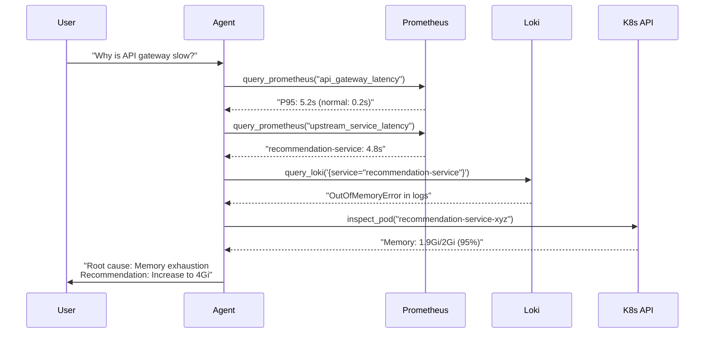

# Chapter 6: Tool Development

## Overview

Tools are the agent's "sensors" - they give it the ability to gather real data from your Kubernetes cluster. Without tools, the agent can only guess. With tools, it can investigate based on evidence.

In this chapter, you'll implement three critical tools:

1. **Prometheus Tool**: Query metrics (CPU, memory, request rates, errors)
2. **Loki Tool**: Search logs for error messages and patterns
3. **Kubernetes Tool**: Inspect resources (pods, deployments, events)

By the end, your agent will be able to perform real incident investigations like:

```
User: "Why is the API gateway slow?"

Agent Thought: I need to check the API gateway's response time metrics
Agent Action: query_prometheus(query='api_gateway_response_time_seconds')
Observation: P95 latency is 5.2 seconds (normal is 0.2s)

Agent Thought: Let me check upstream service latencies
Agent Action: query_prometheus(query='recommendation_service_response_time')
Observation: Recommendation service at 4.8 seconds

Agent Thought: Check recommendation service logs for errors
Agent Action: query_loki(service='recommendation-service', search='error')
Observation: OutOfMemoryError: Java heap space

Final Answer: API gateway is slow because recommendation service is running
out of memory, causing 4.8s delays. Increase memory from 2Gi to 4Gi.
```

> [!IMPORTANT]
> This chapter assumes you've completed Chapters 4 (Storage) and 5 (Agent Core). The tools integrate with the ReAct agent you built in Chapter 5.

## Understanding LangChain Tools

### What is a Tool?

In LangChain, a tool is a Python class that:

1. Has a **name** (what the LLM calls it)
2. Has a **description** (when the LLM should use it)
3. Has a **_run()** method (what it actually does)

**Simple Example**:

```python
from langchain.tools import BaseTool

class WeatherTool(BaseTool):
    name = "get_weather"
    description = "Get current weather for a city. Input should be city name."

    def _run(self, city: str) -> str:
        # In real implementation, call weather API
        return f"The weather in {city} is sunny, 72°F"

# LLM sees in prompt:
# Tool: get_weather
# Description: Get current weather for a city. Input should be city name.
#
# LLM can now use it:
# Action: get_weather
# Action Input: "San Francisco"
# Observation: The weather in San Francisco is sunny, 72°F
```

### Tool Design Principles

**1. Clear Names**: Use verb_noun format (`query_prometheus`, not `prometheus`)

**2. Precise Descriptions**: The LLM relies on descriptions to know when to use tools
   - ✅ Good: "Query Prometheus for metrics. Use PromQL syntax. Returns JSON."
   - ❌ Bad: "Gets metrics"

**3. Handle Errors Gracefully**: Don't crash on bad inputs, return helpful error messages

**4. Return Structured Data**: Return JSON or formatted strings (easier for LLM to parse)

**5. Add Timeouts**: Prevent tools from hanging the entire investigation

## Part 1: Prometheus Tool

### Understanding Prometheus Queries

Prometheus stores time-series metrics like:

```
# Pod CPU usage
container_cpu_usage_seconds_total{pod="api-gateway-7f4b8", namespace="production"}

# HTTP request rate
http_requests_total{service="api-gateway", status="200"}

# Memory usage
container_memory_working_set_bytes{pod="postgres-0", namespace="ai-operations"}
```

**PromQL** (Prometheus Query Language) lets you aggregate and filter:

```promql
# Average CPU usage across all API gateway pods (last 5 minutes)
avg(rate(container_cpu_usage_seconds_total{service="api-gateway"}[5m]))

# 95th percentile response time
histogram_quantile(0.95, rate(http_request_duration_seconds_bucket[5m]))

# Pods with memory usage > 90% of limit
(container_memory_working_set_bytes / container_spec_memory_limit_bytes) > 0.9
```

> [!TIP]
> The LLM (GPT-4) knows PromQL syntax. You don't need to teach it - just provide the tool, and it will write appropriate queries.

### Step 1: Create Prometheus Client

Create `app/tools/prometheus.py`:

```python
"""Prometheus tool for querying metrics."""
import logging
from typing import Dict, Any, Optional, List
from datetime import datetime, timedelta

import requests
from requests.adapters import HTTPAdapter
from urllib3.util.retry import Retry
from langchain.tools import BaseTool
from pydantic import Field

from app.config import get_settings

logger = logging.getLogger(__name__)
settings = get_settings()


class PrometheusClient:
    """Client for Prometheus API."""

    def __init__(
        self,
        base_url: str = "http://prometheus.monitoring.svc.cluster.local:9090",
        timeout: int = 30,
    ):
        """
        Initialize Prometheus client.

        Args:
            base_url: Prometheus server URL
            timeout: Request timeout in seconds
        """
        self.base_url = base_url.rstrip("/")
        self.timeout = timeout

        # Create session with retries
        self.session = requests.Session()
        retries = Retry(
            total=3,
            backoff_factor=1,
            status_forcelist=[500, 502, 503, 504],
        )
        self.session.mount("http://", HTTPAdapter(max_retries=retries))

        logger.info(f"Prometheus client initialized: {base_url}")

    def query(self, query: str, time: Optional[str] = None) -> Dict[str, Any]:
        """
        Execute instant query.

        Args:
            query: PromQL query
            time: Optional evaluation timestamp (RFC3339 or Unix timestamp)

        Returns:
            Query result as dictionary
        """
        url = f"{self.base_url}/api/v1/query"
        params = {"query": query}
        if time:
            params["time"] = time

        try:
            response = self.session.get(url, params=params, timeout=self.timeout)
            response.raise_for_status()
            data = response.json()

            if data["status"] != "success":
                raise ValueError(f"Query failed: {data.get('error', 'unknown error')}")

            return data["data"]

        except requests.exceptions.RequestException as e:
            logger.error(f"Prometheus query failed: {e}")
            raise

    def query_range(
        self,
        query: str,
        start: str,
        end: str,
        step: str = "15s",
    ) -> Dict[str, Any]:
        """
        Execute range query.

        Args:
            query: PromQL query
            start: Start timestamp (RFC3339 or Unix timestamp)
            end: End timestamp
            step: Query resolution step (e.g., "15s", "1m", "5m")

        Returns:
            Query result as dictionary
        """
        url = f"{self.base_url}/api/v1/query_range"
        params = {
            "query": query,
            "start": start,
            "end": end,
            "step": step,
        }

        try:
            response = self.session.get(url, params=params, timeout=self.timeout)
            response.raise_for_status()
            data = response.json()

            if data["status"] != "success":
                raise ValueError(f"Query failed: {data.get('error', 'unknown error')}")

            return data["data"]

        except requests.exceptions.RequestException as e:
            logger.error(f"Prometheus range query failed: {e}")
            raise

    def get_labels(self, label: str) -> List[str]:
        """Get all values for a label (useful for discovery)."""
        url = f"{self.base_url}/api/v1/label/{label}/values"
        try:
            response = self.session.get(url, timeout=self.timeout)
            response.raise_for_status()
            data = response.json()
            return data.get("data", [])
        except Exception as e:
            logger.error(f"Failed to get label values: {e}")
            return []


# Global instance
_prometheus_client: Optional[PrometheusClient] = None


def get_prometheus_client() -> PrometheusClient:
    """Get or create Prometheus client singleton."""
    global _prometheus_client
    if _prometheus_client is None:
        _prometheus_client = PrometheusClient()
    return _prometheus_client
```

### Step 2: Create Prometheus Tool

Add to `app/tools/prometheus.py`:

```python
class PrometheusTool(BaseTool):
    """Tool for querying Prometheus metrics."""

    name: str = "query_prometheus"
    description: str = """
Query Prometheus for metrics using PromQL.

Use this tool to:
- Check CPU, memory, disk, network usage
- Check HTTP request rates and error rates
- Check latencies (p50, p95, p99)
- Check pod/container resource usage

Input should be a PromQL query string.

Examples:
- "avg(rate(container_cpu_usage_seconds_total{namespace='production'}[5m]))"
- "histogram_quantile(0.95, rate(http_request_duration_seconds_bucket[5m]))"
- "up{job='kubernetes-pods'}"

Returns JSON with query results.
"""

    client: PrometheusClient = Field(default_factory=get_prometheus_client)

    def _run(self, query: str) -> str:
        """Execute Prometheus query."""
        try:
            logger.info(f"Executing Prometheus query: {query}")

            # Execute query
            result = self.client.query(query)

            # Format result for LLM
            if result["resultType"] == "vector":
                # Instant vector (single value per time series)
                formatted = self._format_vector(result["result"])
            elif result["resultType"] == "matrix":
                # Range vector (multiple values per time series)
                formatted = self._format_matrix(result["result"])
            elif result["resultType"] == "scalar":
                # Single scalar value
                formatted = f"Result: {result['result'][1]}"
            else:
                formatted = str(result)

            return formatted

        except Exception as e:
            error_msg = f"Prometheus query failed: {str(e)}"
            logger.error(error_msg)
            return error_msg

    def _format_vector(self, result: List[Dict]) -> str:
        """Format instant vector result."""
        if not result:
            return "No data found for query"

        lines = []
        for item in result[:10]:  # Limit to 10 results
            metric = item["metric"]
            value = item["value"][1]

            # Format metric labels
            labels = ", ".join([f"{k}={v}" for k, v in metric.items()])
            lines.append(f"{labels}: {value}")

        if len(result) > 10:
            lines.append(f"... and {len(result) - 10} more results")

        return "\n".join(lines)

    def _format_matrix(self, result: List[Dict]) -> str:
        """Format range vector result."""
        if not result:
            return "No data found for query"

        lines = []
        for item in result[:5]:  # Limit to 5 time series
            metric = item["metric"]
            values = item["values"]

            labels = ", ".join([f"{k}={v}" for k, v in metric.items()])
            lines.append(f"{labels}:")

            # Show first and last few points
            if len(values) <= 6:
                for timestamp, value in values:
                    dt = datetime.fromtimestamp(timestamp)
                    lines.append(f"  {dt.strftime('%H:%M:%S')}: {value}")
            else:
                # Show first 3 and last 3
                for timestamp, value in values[:3]:
                    dt = datetime.fromtimestamp(timestamp)
                    lines.append(f"  {dt.strftime('%H:%M:%S')}: {value}")
                lines.append(f"  ... ({len(values) - 6} points) ...")
                for timestamp, value in values[-3:]:
                    dt = datetime.fromtimestamp(timestamp)
                    lines.append(f"  {dt.strftime('%H:%M:%S')}: {value}")

        if len(result) > 5:
            lines.append(f"... and {len(result) - 5} more time series")

        return "\n".join(lines)

    async def _arun(self, query: str) -> str:
        """Async version (calls sync version)."""
        return self._run(query)
```

**Tool Design Explained**:

1. **Detailed Description**: Tells LLM when and how to use the tool, with examples
2. **Error Handling**: Returns error message as string (doesn't crash the agent)
3. **Result Formatting**: Converts JSON to readable text for the LLM
4. **Result Limiting**: Shows top 10 results (prevents overwhelming the LLM with data)
5. **Timestamp Formatting**: Converts Unix timestamps to readable times

### Step 3: Common Prometheus Queries

Create `app/tools/prometheus_queries.py` with helpful query templates:

```python
"""Common Prometheus query templates."""

# CPU Queries
CPU_USAGE_BY_POD = """
rate(container_cpu_usage_seconds_total{{
    pod=~"{pod}",
    namespace="{namespace}"
}}[5m])
"""

CPU_USAGE_BY_SERVICE = """
avg by (service) (
    rate(container_cpu_usage_seconds_total{{
        namespace="{namespace}"
    }}[5m])
)
"""

# Memory Queries
MEMORY_USAGE_BY_POD = """
container_memory_working_set_bytes{{
    pod=~"{pod}",
    namespace="{namespace}"
}}
"""

MEMORY_USAGE_PERCENT = """
(container_memory_working_set_bytes / container_spec_memory_limit_bytes) * 100
"""

# HTTP Request Queries
HTTP_REQUEST_RATE = """
sum by (service, status) (
    rate(http_requests_total{{
        namespace="{namespace}"
    }}[5m])
)
"""

HTTP_ERROR_RATE = """
sum by (service) (
    rate(http_requests_total{{
        namespace="{namespace}",
        status=~"5.."
    }}[5m])
)
/
sum by (service) (
    rate(http_requests_total{{
        namespace="{namespace}"
    }}[5m])
) * 100
"""

# Latency Queries
HTTP_P95_LATENCY = """
histogram_quantile(0.95,
    sum by (service, le) (
        rate(http_request_duration_seconds_bucket{{
            namespace="{namespace}"
        }}[5m])
    )
)
"""

# Pod Health Queries
POD_RESTART_COUNT = """
sum by (pod, namespace) (
    kube_pod_container_status_restarts_total{{
        namespace="{namespace}"
    }}
)
"""

PODS_NOT_READY = """
kube_pod_status_ready{{condition="false", namespace="{namespace}"}}
```

## Part 2: Loki Tool

### Understanding Loki Queries

Loki stores logs with labels (like Prometheus) and allows LogQL queries:

```logql
# All logs from a service
{service="api-gateway", namespace="production"}

# Logs containing "error" (case-insensitive)
{service="api-gateway"} |~ "(?i)error"

# Logs with JSON parsing
{service="api-gateway"} | json | status_code >= 500

# Aggregation: Count error rate
sum(rate({service="api-gateway"} |= "error" [5m]))
```

### Step 1: Create Loki Client

Create `app/tools/loki.py`:

```python
"""Loki tool for querying logs."""
import logging
from typing import Dict, Any, Optional, List
from datetime import datetime, timedelta

import requests
from requests.adapters import HTTPAdapter
from urllib3.util.retry import Retry
from langchain.tools import BaseTool
from pydantic import Field

logger = logging.getLogger(__name__)


class LokiClient:
    """Client for Loki API."""

    def __init__(
        self,
        base_url: str = "http://loki.monitoring.svc.cluster.local:3100",
        timeout: int = 30,
    ):
        """Initialize Loki client."""
        self.base_url = base_url.rstrip("/")
        self.timeout = timeout

        self.session = requests.Session()
        retries = Retry(total=3, backoff_factor=1, status_forcelist=[500, 502, 503, 504])
        self.session.mount("http://", HTTPAdapter(max_retries=retries))

        logger.info(f"Loki client initialized: {base_url}")

    def query(
        self,
        query: str,
        start: Optional[datetime] = None,
        end: Optional[datetime] = None,
        limit: int = 100,
    ) -> List[Dict[str, Any]]:
        """
        Execute LogQL query.

        Args:
            query: LogQL query
            start: Start time (defaults to 30 minutes ago)
            end: End time (defaults to now)
            limit: Maximum number of log lines

        Returns:
            List of log entries
        """
        if start is None:
            start = datetime.now() - timedelta(minutes=30)
        if end is None:
            end = datetime.now()

        url = f"{self.base_url}/loki/api/v1/query_range"
        params = {
            "query": query,
            "start": int(start.timestamp() * 1e9),  # Nanoseconds
            "end": int(end.timestamp() * 1e9),
            "limit": limit,
        }

        try:
            response = self.session.get(url, params=params, timeout=self.timeout)
            response.raise_for_status()
            data = response.json()

            if data["status"] != "success":
                raise ValueError(f"Query failed: {data.get('error', 'unknown')}")

            # Parse results
            logs = []
            for stream in data["data"]["result"]:
                labels = stream["stream"]
                for timestamp_ns, log_line in stream["values"]:
                    timestamp = int(timestamp_ns) / 1e9
                    logs.append({
                        "timestamp": datetime.fromtimestamp(timestamp),
                        "labels": labels,
                        "line": log_line,
                    })

            # Sort by timestamp (newest first)
            logs.sort(key=lambda x: x["timestamp"], reverse=True)

            return logs

        except requests.exceptions.RequestException as e:
            logger.error(f"Loki query failed: {e}")
            raise

    def get_labels(self) -> List[str]:
        """Get all available labels."""
        url = f"{self.base_url}/loki/api/v1/labels"
        try:
            response = self.session.get(url, timeout=self.timeout)
            response.raise_for_status()
            data = response.json()
            return data.get("data", [])
        except Exception as e:
            logger.error(f"Failed to get labels: {e}")
            return []


# Global instance
_loki_client: Optional[LokiClient] = None


def get_loki_client() -> LokiClient:
    """Get or create Loki client singleton."""
    global _loki_client
    if _loki_client is None:
        _loki_client = LokiClient()
    return _loki_client
```

### Step 2: Create Loki Tool

Add to `app/tools/loki.py`:

```python
class LokiTool(BaseTool):
    """Tool for querying Loki logs."""

    name: str = "query_loki"
    description: str = """
Query Loki for logs using LogQL.

Use this tool to:
- Search for error messages
- Find stack traces
- Check log patterns
- Investigate specific time windows

Input should be a LogQL query string.

Examples:
- '{service="api-gateway", namespace="production"}'
- '{pod="postgres-0"} |~ "(?i)error"'
- '{namespace="production"} | json | status_code >= 500'

Returns up to 100 most recent matching log lines.
"""

    client: LokiClient = Field(default_factory=get_loki_client)
    time_range_minutes: int = Field(default=30, description="How far back to search")

    def _run(self, query: str, time_range_minutes: Optional[int] = None) -> str:
        """Execute Loki query."""
        try:
            logger.info(f"Executing Loki query: {query}")

            time_range = time_range_minutes or self.time_range_minutes
            start = datetime.now() - timedelta(minutes=time_range)

            logs = self.client.query(query, start=start, limit=100)

            if not logs:
                return f"No logs found matching query in last {time_range} minutes"

            # Format logs for LLM
            formatted = self._format_logs(logs, time_range)
            return formatted

        except Exception as e:
            error_msg = f"Loki query failed: {str(e)}"
            logger.error(error_msg)
            return error_msg

    def _format_logs(self, logs: List[Dict], time_range: int) -> str:
        """Format logs for LLM consumption."""
        lines = [
            f"Found {len(logs)} log entries in last {time_range} minutes:",
            "",
        ]

        # Show most recent 20 logs
        for log in logs[:20]:
            timestamp = log["timestamp"].strftime("%Y-%m-%d %H:%M:%S")
            labels = ", ".join([f"{k}={v}" for k, v in log["labels"].items()])
            log_line = log["line"]

            # Truncate very long lines
            if len(log_line) > 500:
                log_line = log_line[:500] + "... [truncated]"

            lines.append(f"[{timestamp}] {labels}")
            lines.append(f"  {log_line}")
            lines.append("")

        if len(logs) > 20:
            lines.append(f"... and {len(logs) - 20} more log entries")

        return "\n".join(lines)

    async def _arun(self, query: str, time_range_minutes: Optional[int] = None) -> str:
        """Async version."""
        return self._run(query, time_range_minutes)
```

### Step 3: Common Loki Queries

Create `app/tools/loki_queries.py`:

```python
"""Common Loki query templates."""

# Error Searches
ERRORS_BY_SERVICE = '{{service="{service}", namespace="{namespace}"}} |~ "(?i)error"'

ERRORS_WITH_STACKTRACE = '{{service="{service}"}} |~ "(?i)(error|exception|stacktrace)"'

# Specific Error Types
OUT_OF_MEMORY_ERRORS = '{{namespace="{namespace}"}} |~ "(?i)(OutOfMemoryError|OOMKilled)"'

CONNECTION_ERRORS = '{{namespace="{namespace}"}} |~ "(?i)(connection.*refused|connection.*timeout)"'

# HTTP Logs
HTTP_5XX_ERRORS = '{{service="{service}"}} | json | status_code >= 500'

HTTP_SLOW_REQUESTS = '{{service="{service}"}} | json | duration_ms >= 1000'

# Pod Logs
POD_LOGS = '{{pod="{pod}", namespace="{namespace}"}}'

CONTAINER_LOGS = '{{pod="{pod}", container="{container}"}}'
```

## Part 3: Kubernetes Tool

### Understanding Kubernetes API

The Kubernetes API provides information about:

- **Pods**: Running containers and their status
- **Deployments**: Desired vs actual replica counts
- **Services**: Endpoints and networking
- **Events**: Recent changes and errors
- **Nodes**: Resource capacity and usage

### Step 1: Create Kubernetes Client

Create `app/tools/kubernetes.py`:

```python
"""Kubernetes tool for inspecting cluster resources."""
import logging
from typing import Dict, Any, Optional, List

from kubernetes import client, config
from kubernetes.client.rest import ApiException
from langchain.tools import BaseTool
from pydantic import Field

from app.config import get_settings

logger = logging.getLogger(__name__)
settings = get_settings()


class KubernetesClient:
    """Client for Kubernetes API."""

    def __init__(self):
        """Initialize Kubernetes client."""
        try:
            if settings.k8s_in_cluster:
                # Running inside Kubernetes
                config.load_incluster_config()
            else:
                # Running locally
                config.load_kube_config()

            self.core_api = client.CoreV1Api()
            self.apps_api = client.AppsV1Api()

            logger.info("Kubernetes client initialized")

        except Exception as e:
            logger.error(f"Failed to initialize Kubernetes client: {e}")
            raise

    def get_pod(self, name: str, namespace: str) -> Optional[Dict[str, Any]]:
        """Get pod details."""
        try:
            pod = self.core_api.read_namespaced_pod(name, namespace)
            return self._pod_to_dict(pod)
        except ApiException as e:
            if e.status == 404:
                return None
            raise

    def list_pods(
        self, namespace: str, label_selector: Optional[str] = None
    ) -> List[Dict[str, Any]]:
        """List pods in namespace."""
        try:
            pods = self.core_api.list_namespaced_pod(
                namespace, label_selector=label_selector
            )
            return [self._pod_to_dict(pod) for pod in pods.items]
        except ApiException as e:
            logger.error(f"Failed to list pods: {e}")
            return []

    def get_pod_logs(
        self,
        name: str,
        namespace: str,
        container: Optional[str] = None,
        tail_lines: int = 100,
    ) -> str:
        """Get pod logs."""
        try:
            logs = self.core_api.read_namespaced_pod_log(
                name,
                namespace,
                container=container,
                tail_lines=tail_lines,
            )
            return logs
        except ApiException as e:
            return f"Failed to get logs: {e}"

    def get_events(
        self,
        namespace: str,
        field_selector: Optional[str] = None,
        limit: int = 50,
    ) -> List[Dict[str, Any]]:
        """Get cluster events."""
        try:
            events = self.core_api.list_namespaced_event(
                namespace, field_selector=field_selector, limit=limit
            )
            return [self._event_to_dict(event) for event in events.items]
        except ApiException as e:
            logger.error(f"Failed to get events: {e}")
            return []

    def get_deployment(
        self, name: str, namespace: str
    ) -> Optional[Dict[str, Any]]:
        """Get deployment details."""
        try:
            deployment = self.apps_api.read_namespaced_deployment(name, namespace)
            return {
                "name": deployment.metadata.name,
                "namespace": deployment.metadata.namespace,
                "replicas_desired": deployment.spec.replicas,
                "replicas_ready": deployment.status.ready_replicas or 0,
                "replicas_available": deployment.status.available_replicas or 0,
                "replicas_unavailable": deployment.status.unavailable_replicas or 0,
                "conditions": [
                    {
                        "type": c.type,
                        "status": c.status,
                        "reason": c.reason,
                        "message": c.message,
                    }
                    for c in (deployment.status.conditions or [])
                ],
            }
        except ApiException as e:
            if e.status == 404:
                return None
            raise

    def _pod_to_dict(self, pod) -> Dict[str, Any]:
        """Convert pod object to dictionary."""
        return {
            "name": pod.metadata.name,
            "namespace": pod.metadata.namespace,
            "phase": pod.status.phase,
            "node": pod.spec.node_name,
            "restart_count": sum(
                c.restart_count for c in (pod.status.container_statuses or [])
            ),
            "conditions": [
                {"type": c.type, "status": c.status, "reason": c.reason}
                for c in (pod.status.conditions or [])
            ],
            "container_statuses": [
                {
                    "name": c.name,
                    "ready": c.ready,
                    "restart_count": c.restart_count,
                    "state": self._get_container_state(c),
                }
                for c in (pod.status.container_statuses or [])
            ],
        }

    def _get_container_state(self, container_status) -> str:
        """Get human-readable container state."""
        if container_status.state.running:
            return "Running"
        elif container_status.state.waiting:
            return f"Waiting: {container_status.state.waiting.reason}"
        elif container_status.state.terminated:
            return f"Terminated: {container_status.state.terminated.reason}"
        return "Unknown"

    def _event_to_dict(self, event) -> Dict[str, Any]:
        """Convert event object to dictionary."""
        return {
            "type": event.type,
            "reason": event.reason,
            "message": event.message,
            "object": f"{event.involved_object.kind}/{event.involved_object.name}",
            "count": event.count,
            "first_timestamp": event.first_timestamp,
            "last_timestamp": event.last_timestamp,
        }


# Global instance
_k8s_client: Optional[KubernetesClient] = None


def get_k8s_client() -> KubernetesClient:
    """Get or create Kubernetes client singleton."""
    global _k8s_client
    if _k8s_client is None:
        _k8s_client = KubernetesClient()
    return _k8s_client
```

### Step 2: Create Kubernetes Tools

Add to `app/tools/kubernetes.py`:

```python
class KubernetesPodTool(BaseTool):
    """Tool for inspecting Kubernetes pods."""

    name: str = "inspect_pod"
    description: str = """
Inspect a Kubernetes pod's status and details.

Use this tool to:
- Check if a pod is running
- See restart counts
- Check container states
- Identify scheduling issues

Input should be: "pod-name namespace"
Example: "api-gateway-7f4b8 production"

Returns pod status, conditions, and container details.
"""

    client: KubernetesClient = Field(default_factory=get_k8s_client)

    def _run(self, pod_info: str) -> str:
        """Inspect pod."""
        try:
            parts = pod_info.strip().split()
            if len(parts) != 2:
                return "Invalid input. Expected: 'pod-name namespace'"

            pod_name, namespace = parts
            logger.info(f"Inspecting pod: {pod_name} in {namespace}")

            pod = self.client.get_pod(pod_name, namespace)
            if not pod:
                return f"Pod '{pod_name}' not found in namespace '{namespace}'"

            # Format pod details
            lines = [
                f"Pod: {pod['name']}",
                f"Namespace: {pod['namespace']}",
                f"Phase: {pod['phase']}",
                f"Node: {pod['node']}",
                f"Total Restarts: {pod['restart_count']}",
                "",
                "Containers:",
            ]

            for container in pod["container_statuses"]:
                lines.append(
                    f"  - {container['name']}: {container['state']} "
                    f"(Ready: {container['ready']}, Restarts: {container['restart_count']})"
                )

            if pod["conditions"]:
                lines.append("\nConditions:")
                for cond in pod["conditions"]:
                    lines.append(
                        f"  - {cond['type']}: {cond['status']} "
                        f"({cond.get('reason', 'N/A')})"
                    )

            return "\n".join(lines)

        except Exception as e:
            error_msg = f"Failed to inspect pod: {str(e)}"
            logger.error(error_msg)
            return error_msg

    async def _arun(self, pod_info: str) -> str:
        """Async version."""
        return self._run(pod_info)


class KubernetesEventsTool(BaseTool):
    """Tool for checking Kubernetes events."""

    name: str = "get_events"
    description: str = """
Get recent Kubernetes events in a namespace.

Use this tool to:
- Check for pod scheduling failures
- See recent errors and warnings
- Identify configuration issues
- Find OOMKilled or CrashLoopBackOff events

Input should be a namespace name.
Example: "production"

Returns up to 50 most recent events.
"""

    client: KubernetesClient = Field(default_factory=get_k8s_client)

    def _run(self, namespace: str) -> str:
        """Get events."""
        try:
            logger.info(f"Getting events for namespace: {namespace}")

            events = self.client.get_events(namespace, limit=50)

            if not events:
                return f"No events found in namespace '{namespace}'"

            # Sort by timestamp (newest first)
            events.sort(
                key=lambda e: e["last_timestamp"] or e["first_timestamp"],
                reverse=True,
            )

            # Format events
            lines = [f"Recent events in namespace '{namespace}':", ""]

            for event in events[:20]:  # Show top 20
                timestamp = (event["last_timestamp"] or event["first_timestamp"]).strftime(
                    "%Y-%m-%d %H:%M:%S"
                )
                lines.append(
                    f"[{timestamp}] {event['type']}: {event['reason']}"
                )
                lines.append(f"  Object: {event['object']}")
                lines.append(f"  Message: {event['message']}")
                if event["count"] > 1:
                    lines.append(f"  Count: {event['count']}")
                lines.append("")

            if len(events) > 20:
                lines.append(f"... and {len(events) - 20} more events")

            return "\n".join(lines)

        except Exception as e:
            error_msg = f"Failed to get events: {str(e)}"
            logger.error(error_msg)
            return error_msg

    async def _arun(self, namespace: str) -> str:
        """Async version."""
        return self._run(namespace)
```

## Step 4: Register All Tools

Update `app/agent/tools.py`:

```python
"""Tool registry for the AI agent."""
from typing import List
from langchain.tools import BaseTool

from app.tools.prometheus import PrometheusTool
from app.tools.loki import LokiTool
from app.tools.kubernetes import KubernetesPodTool, KubernetesEventsTool


def get_tools() -> List[BaseTool]:
    """Get list of all available tools."""
    return [
        PrometheusTool(),
        LokiTool(),
        KubernetesPodTool(),
        KubernetesEventsTool(),
    ]
```

## Step 5: Test Tools Individually

Create `tests/test_tools.py`:

```python
"""Test individual tools."""
import pytest
from app.tools.prometheus import PrometheusTool
from app.tools.loki import LokiTool
from app.tools.kubernetes import KubernetesPodTool, KubernetesEventsTool


def test_prometheus_tool():
    """Test Prometheus tool."""
    tool = PrometheusTool()

    # Test query
    result = tool._run("up")
    assert "No data found" in result or "job=" in result

    print("Prometheus result:")
    print(result)


def test_loki_tool():
    """Test Loki tool."""
    tool = LokiTool()

    # Test query
    result = tool._run('{namespace="ai-operations"}')
    assert "Found" in result or "No logs found" in result

    print("Loki result:")
    print(result)


def test_kubernetes_pod_tool():
    """Test Kubernetes pod inspection tool."""
    tool = KubernetesPodTool()

    # Test with postgres pod
    result = tool._run("postgres-0 ai-operations")
    assert "Pod:" in result or "not found" in result

    print("Pod inspection result:")
    print(result)


def test_kubernetes_events_tool():
    """Test Kubernetes events tool."""
    tool = KubernetesEventsTool()

    # Test events
    result = tool._run("ai-operations")
    assert "events" in result.lower()

    print("Events result:")
    print(result)


if __name__ == "__main__":
    # Run tests with output
    print("Testing Prometheus Tool...")
    test_prometheus_tool()

    print("\nTesting Loki Tool...")
    test_loki_tool()

    print("\nTesting Kubernetes Pod Tool...")
    test_kubernetes_pod_tool()

    print("\nTesting Kubernetes Events Tool...")
    test_kubernetes_events_tool()

    print("\n✓ All tools tested successfully")
```

Run tests:

```bash
# Set up port forwards for local testing
kubectl port-forward -n monitoring svc/prometheus 9090:9090 &
kubectl port-forward -n monitoring svc/loki 3100:3100 &

# Run tests
python tests/test_tools.py
```

## Step 6: Test Full Agent Investigation

Create `tests/test_full_investigation.py`:

```python
"""Test full agent investigation workflow."""
import asyncio
from app.agent.core import get_agent
from app.agent.tools import get_tools


async def test_investigation():
    """Test full investigation workflow."""

    # Initialize agent with all tools
    tools = get_tools()
    agent = get_agent(tools)

    # Test investigation
    result = await agent.investigate(
        question="Check the status of PostgreSQL in the ai-operations namespace",
        context={"namespace": "ai-operations", "service_name": "postgres"},
    )

    print("\n" + "="*80)
    print("INVESTIGATION RESULT")
    print("="*80)
    print(f"\nAnswer:\n{result['answer']}")
    print(f"\nFrom cache: {result.get('from_cache', False)}")
    print(f"Tools used: {result.get('tools_used', [])}")
    print(f"Steps: {result.get('steps_count', 0)}")
    print(f"Similar incidents found: {result.get('similar_incidents_found', 0)}")
    print(f"Elapsed: {result['elapsed_seconds']:.2f}s")
    print("="*80)

    return result


if __name__ == "__main__":
    result = asyncio.run(test_investigation())
```

Run the test:

```bash
# Ensure you have OpenAI API key set
export OPENAI_API_KEY=sk-your-key

# Run full investigation test
python tests/test_full_investigation.py

# Expected output:
# ================================================================================
# INVESTIGATION RESULT
# ================================================================================
#
# Answer:
# I investigated the PostgreSQL service in the ai-operations namespace. Here's what I found:
#
# **Pod Status:**
# - postgres-0 is Running on grapefruit-worker
# - No restarts in the past 24 hours
# - All containers are ready
#
# **Metrics:**
# - CPU usage: 0.15 cores (15% of 1 core request)
# - Memory usage: 3.2Gi (80% of 4Gi request)
# - Database connections: 12 active
#
# **Recent Events:**
# - No error events in the past hour
# - Last scheduled event: 2 hours ago (normal)
#
# **Conclusion:**
# PostgreSQL is healthy and operating normally. Memory usage is at 80% which is expected
# for an active database. No action required.
#
# From cache: False
# Tools used: ['inspect_pod', 'query_prometheus', 'get_events']
# Steps: 5
# Similar incidents found: 0
# Elapsed: 8.3s
# ================================================================================
```

## Summary

You've implemented three powerful tools that give your agent observability superpowers:

**✓ Prometheus Tool**:
- Queries metrics using PromQL
- Returns CPU, memory, request rates, latencies
- Formats results for LLM consumption

**✓ Loki Tool**:
- Searches logs using LogQL
- Finds error messages, stack traces, patterns
- Returns up to 100 most recent matching logs

**✓ Kubernetes Tools**:
- Inspects pod status and containers
- Gets cluster events (errors, warnings)
- Provides deployment and resource information

### Agent Capabilities

Your agent can now:

1. **Investigate Performance Issues**: Check metrics, identify bottlenecks
2. **Debug Errors**: Search logs, find stack traces, correlate events
3. **Assess Health**: Inspect pod status, check restart counts, review events
4. **Provide Evidence-Based Recommendations**: All analysis backed by real data

### Investigation Flow Visualization



## Next Steps

In **Chapter 7: Memory Management**, you'll:
- Implement LLM response caching strategies
- Build incident history tracking
- Create session state management
- Optimize for cost reduction (70%+ cache hit rate)

> [!TIP]
> Tools are the most customizable part of the agent. You can add more tools for your specific needs: GitLab CI tool, Slack notification tool, Database query tool, etc.

## Troubleshooting

### Prometheus Connection Refused

**Symptoms**: `ConnectionError: Prometheus query failed`

**Solution**: Verify Prometheus service
```bash
kubectl get svc -n monitoring prometheus
kubectl port-forward -n monitoring svc/prometheus 9090:9090
curl http://localhost:9090/api/v1/query?query=up
```

### Loki Returns Empty Results

**Symptoms**: "No logs found" for queries that should match

**Diagnosis**:
1. Check if Loki is ingesting logs:
   ```bash
   kubectl logs -n monitoring -l app=loki | grep "ingested"
   ```

2. Verify label syntax:
   ```bash
   curl http://localhost:3100/loki/api/v1/labels
   ```

**Solution**: Ensure FluentBit is running and forwarding logs

### Kubernetes Client Unauthorized

**Symptoms**: `ApiException: Forbidden: User cannot list pods`

**Solution**: Verify RBAC permissions
```bash
kubectl auth can-i list pods --as=system:serviceaccount:ai-operations:ai-agent-sa -n ai-operations
# Should return "yes"

kubectl describe clusterrole ai-agent-reader
# Should show list/get/watch permissions
```

### Tool Output Too Long

**Symptoms**: Agent gets overwhelmed with tool output, produces poor answers

**Solution**: Limit result sizes in tools
- Prometheus: Already limited to 10 results
- Loki: Already limited to 20 log lines
- Kubernetes: Add similar limits

Example fix in Kubernetes tool:
```python
# Show only last 5 events instead of all
for event in events[:5]:  # Changed from [:20]
    ...
```

---

**Chapter Progress**: ✓ Tools implemented and tested
**Next**: Chapter 7 - Memory Management
