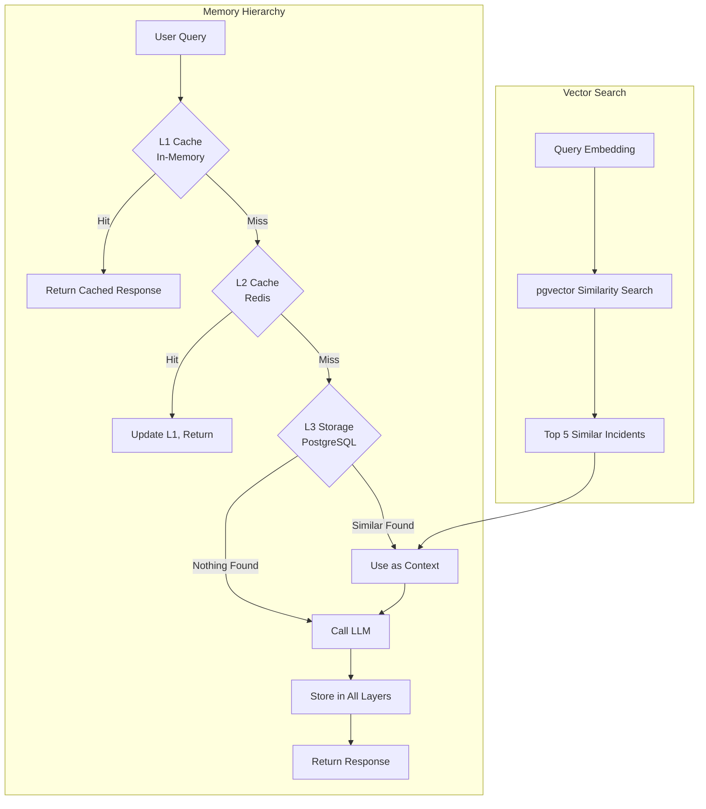
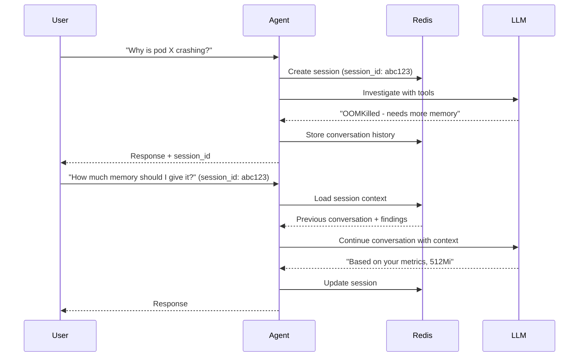

# Chapter 7: Memory Management

## Introduction

Memory management is the backbone of an efficient AI agent system. In this chapter, we'll explore how to build a sophisticated memory layer that drastically reduces costs, improves response times, and enables your agent to learn from past interactions. Think of memory management as giving your agent both short-term memory (caching recent responses) and long-term memory (learning from historical incidents).

**Why Memory Management Matters:**

- **Cost Reduction**: LLM API calls are expensive. A well-designed cache can reduce costs by 70% or more
- **Performance**: Cache hits return in milliseconds vs. seconds for LLM calls
- **Consistency**: Same questions get same answers, improving reliability
- **Learning**: Historical data helps the agent recognize patterns and improve over time
- **Context Preservation**: Multi-turn conversations require maintaining state

In our PiKube AI agent, we'll implement a multi-tiered memory system:

1. **L1 Cache**: In-memory Python cache for ultra-fast access (request-scoped)
2. **L2 Cache**: Redis for cross-request caching (shared across all agent instances)
3. **L3 Storage**: PostgreSQL for long-term incident history and learnings
4. **Vector Store**: pgvector for semantic search of similar past incidents



## Understanding Caching Fundamentals

Before diving into implementation, let's understand the theory behind effective caching for LLM responses.

### Why LLM Caching is Different

Traditional web caching is straightforward: same URL = same response. LLM caching is more nuanced:

1. **Semantic Equivalence**: "Why is pod X crashing?" and "What's wrong with pod X?" should hit the same cache
2. **Parameter Sensitivity**: Temperature, max_tokens, and model version affect responses
3. **Temporal Relevance**: Cluster state changes, so cached responses can become stale
4. **Context Windows**: Multi-turn conversations have evolving context
5. **Non-Determinism**: Even identical prompts can produce slightly different responses

**Our Strategy**: We'll use a combination of exact matching (for identical queries) and semantic matching (for similar queries) to maximize cache utility while maintaining accuracy.

### Cache Hit Rate Mathematics

Your cache hit rate is the percentage of requests served from cache:

```
Hit Rate = (Cache Hits) / (Total Requests) × 100%
```

**Target**: 70%+ hit rate for production systems

**Why 70%?**
- First-time queries: ~20% (never seen before)
- Unique troubleshooting: ~10% (specific to current incident)
- Repeatable queries: ~70% (common patterns, status checks)

A 70% hit rate on a system making 1000 LLM calls/day:
- Without cache: 1000 calls × $0.01 = $10/day = $300/month
- With 70% hit rate: 300 calls × $0.01 = $3/day = $90/month
- **Savings: $210/month (70% cost reduction)**

## Redis Caching Architecture

Redis is our L2 cache, providing fast, distributed caching across all agent instances.

### Redis Data Structures for AI Agents

We'll use multiple Redis data structures for different caching needs:

```python
# File: /app/cache/redis_manager.py
from typing import Optional, Dict, Any, List
import json
import hashlib
import redis.asyncio as redis
from datetime import timedelta
import logging

logger = logging.getLogger(__name__)


class RedisCache:
    """
    Redis cache manager for LLM responses and session state.

    This class provides a high-level interface for caching LLM responses,
    managing session state, and tracking cache performance metrics.
    """

    def __init__(
        self,
        redis_url: str = "redis://localhost:6379/0",
        prefix: str = "pikube:agent:"
    ):
        self.redis_url = redis_url
        self.prefix = prefix
        self.client: Optional[redis.Redis] = None

    async def connect(self):
        """Establish Redis connection with retry logic."""
        try:
            self.client = await redis.from_url(
                self.redis_url,
                encoding="utf-8",
                decode_responses=True,
                max_connections=50,  # Connection pool size
                socket_timeout=5.0,
                socket_connect_timeout=5.0
            )
            # Test connection
            await self.client.ping()
            logger.info("Redis connection established")
        except Exception as e:
            logger.error(f"Redis connection failed: {e}")
            raise

    async def disconnect(self):
        """Close Redis connection gracefully."""
        if self.client:
            await self.client.close()
            logger.info("Redis connection closed")

    def _make_cache_key(
        self,
        prompt: str,
        model: str,
        temperature: float,
        max_tokens: int,
        **kwargs
    ) -> str:
        """
        Generate a deterministic cache key for LLM requests.

        Why this approach:
        1. Hash the prompt to handle long prompts (Redis key limit: 512MB, but shorter is better)
        2. Include all parameters that affect the response
        3. Use prefix for namespace isolation (multiple agents, environments)

        Args:
            prompt: The LLM prompt text
            model: Model identifier (e.g., "gpt-4", "claude-3-sonnet")
            temperature: Sampling temperature
            max_tokens: Maximum response length
            **kwargs: Additional parameters to include in cache key

        Returns:
            Cache key string like "pikube:agent:llm:abc123:gpt-4:0.0:1000"
        """
        # Normalize prompt: strip whitespace, lowercase for case-insensitive matching
        normalized_prompt = prompt.strip().lower()

        # Hash the prompt using SHA-256
        prompt_hash = hashlib.sha256(normalized_prompt.encode()).hexdigest()[:12]

        # Sort kwargs for deterministic ordering
        sorted_kwargs = sorted(kwargs.items())
        kwargs_str = json.dumps(sorted_kwargs, sort_keys=True)

        # Create compound key
        key = f"{self.prefix}llm:{prompt_hash}:{model}:{temperature}:{max_tokens}:{hashlib.md5(kwargs_str.encode()).hexdigest()[:8]}"

        return key

    async def get_llm_response(
        self,
        prompt: str,
        model: str,
        temperature: float = 0.0,
        max_tokens: int = 1000,
        **kwargs
    ) -> Optional[Dict[str, Any]]:
        """
        Retrieve cached LLM response if available.

        Returns:
            Cached response dict with 'content', 'metadata', 'cached_at'
            None if cache miss
        """
        key = self._make_cache_key(prompt, model, temperature, max_tokens, **kwargs)

        try:
            cached = await self.client.get(key)
            if cached:
                # Increment hit counter
                await self.client.incr(f"{self.prefix}metrics:cache_hits")
                logger.debug(f"Cache HIT: {key}")
                return json.loads(cached)
            else:
                # Increment miss counter
                await self.client.incr(f"{self.prefix}metrics:cache_misses")
                logger.debug(f"Cache MISS: {key}")
                return None
        except Exception as e:
            logger.error(f"Redis GET error: {e}")
            # On Redis errors, fail open (return None, proceed without cache)
            return None

    async def set_llm_response(
        self,
        prompt: str,
        model: str,
        response: Dict[str, Any],
        temperature: float = 0.0,
        max_tokens: int = 1000,
        ttl_seconds: int = 3600,  # 1 hour default
        **kwargs
    ) -> bool:
        """
        Cache an LLM response with TTL.

        Why TTL matters:
        - Cluster state changes over time (pods restart, metrics change)
        - Stale cache entries waste memory
        - Different query types have different freshness requirements

        Args:
            ttl_seconds: Time-to-live in seconds (default: 1 hour)
        """
        key = self._make_cache_key(prompt, model, temperature, max_tokens, **kwargs)

        # Add caching metadata
        cache_entry = {
            **response,
            "cached_at": str(timedelta(seconds=0)),  # Will be set by Redis
            "ttl": ttl_seconds
        }

        try:
            await self.client.setex(
                key,
                ttl_seconds,
                json.dumps(cache_entry)
            )
            logger.debug(f"Cache SET: {key} (TTL: {ttl_seconds}s)")
            return True
        except Exception as e:
            logger.error(f"Redis SET error: {e}")
            return False

    async def get_cache_stats(self) -> Dict[str, Any]:
        """
        Retrieve cache performance statistics.

        Returns:
            Dict with hits, misses, hit_rate, memory_usage
        """
        try:
            hits = int(await self.client.get(f"{self.prefix}metrics:cache_hits") or 0)
            misses = int(await self.client.get(f"{self.prefix}metrics:cache_misses") or 0)

            total = hits + misses
            hit_rate = (hits / total * 100) if total > 0 else 0.0

            # Get Redis memory usage
            info = await self.client.info("memory")
            memory_used = info.get("used_memory_human", "unknown")

            return {
                "cache_hits": hits,
                "cache_misses": misses,
                "total_requests": total,
                "hit_rate_percent": round(hit_rate, 2),
                "memory_used": memory_used
            }
        except Exception as e:
            logger.error(f"Error fetching cache stats: {e}")
            return {}

    async def invalidate_pattern(self, pattern: str):
        """
        Invalidate all cache entries matching a pattern.

        Use cases:
        - Cluster state change: invalidate all metric queries
        - Pod restart: invalidate queries about that specific pod
        - Deployment: invalidate queries about that namespace

        Example:
            await cache.invalidate_pattern("*:prometheus:*")
        """
        cursor = 0
        deleted_count = 0

        full_pattern = f"{self.prefix}{pattern}"

        try:
            while True:
                # SCAN is safer than KEYS for production (non-blocking)
                cursor, keys = await self.client.scan(
                    cursor,
                    match=full_pattern,
                    count=100
                )

                if keys:
                    deleted = await self.client.delete(*keys)
                    deleted_count += deleted

                if cursor == 0:
                    break

            logger.info(f"Invalidated {deleted_count} cache entries matching '{pattern}'")
            return deleted_count
        except Exception as e:
            logger.error(f"Cache invalidation error: {e}")
            return 0
```

> [!TIP]
> **Cache Key Design Best Practices**
>
> 1. **Include Version**: Add a version prefix to your keys (e.g., `v1:llm:...`) so you can invalidate all caches on major changes
> 2. **Namespace by Environment**: Use different prefixes for dev/staging/prod (`dev:agent:...`, `prod:agent:...`)
> 3. **Keep Keys Short**: While Redis supports 512MB keys, shorter keys (< 256 bytes) are faster
> 4. **Use Hashing**: For long prompts, hash them to fixed-length keys
> 5. **Deterministic Ordering**: Always sort dictionaries before hashing to ensure consistency

### TTL Strategy Design

Different types of queries require different TTLs (Time-To-Live):

```python
# File: /app/cache/ttl_strategy.py
from enum import Enum
from typing import Dict


class QueryType(Enum):
    """Categories of queries with different freshness requirements."""

    # Real-time metrics: very short TTL (5 minutes)
    # Example: "What's the current CPU usage?"
    REALTIME_METRICS = "realtime_metrics"

    # Analysis queries: medium TTL (1 hour)
    # Example: "Why is pod X restarting?"
    ANALYSIS = "analysis"

    # Static data: long TTL (24 hours)
    # Example: "Explain Kubernetes deployments"
    STATIC_KNOWLEDGE = "static_knowledge"

    # Historical queries: very long TTL (7 days)
    # Example: "Show incidents from last week"
    HISTORICAL = "historical"

    # Aggregated metrics: medium-long TTL (6 hours)
    # Example: "What's been the average CPU usage today?"
    AGGREGATED_METRICS = "aggregated_metrics"


class TTLStrategy:
    """
    Intelligent TTL assignment based on query classification.

    Why different TTLs?
    - Realtime data changes constantly: short TTL prevents stale data
    - Static knowledge never changes: long TTL maximizes cache hits
    - Analysis balances freshness with cost savings
    """

    # TTL values in seconds
    TTL_MAP: Dict[QueryType, int] = {
        QueryType.REALTIME_METRICS: 300,        # 5 minutes
        QueryType.ANALYSIS: 3600,               # 1 hour
        QueryType.STATIC_KNOWLEDGE: 86400,      # 24 hours
        QueryType.HISTORICAL: 604800,           # 7 days
        QueryType.AGGREGATED_METRICS: 21600,    # 6 hours
    }

    @classmethod
    def classify_query(cls, prompt: str) -> QueryType:
        """
        Classify a query based on keywords and patterns.

        This is a simple rule-based classifier. In production, you might
        use a small ML model or more sophisticated NLP.
        """
        prompt_lower = prompt.lower()

        # Realtime indicators
        realtime_keywords = [
            "current", "now", "right now", "at this moment",
            "latest", "real-time", "live"
        ]
        if any(kw in prompt_lower for kw in realtime_keywords):
            return QueryType.REALTIME_METRICS

        # Historical indicators
        historical_keywords = [
            "last week", "yesterday", "past", "history",
            "previously", "before", "ago"
        ]
        if any(kw in prompt_lower for kw in historical_keywords):
            return QueryType.HISTORICAL

        # Static knowledge indicators
        static_keywords = [
            "what is", "explain", "define", "how does",
            "what are", "describe", "tutorial"
        ]
        if any(kw in prompt_lower for kw in static_keywords):
            return QueryType.STATIC_KNOWLEDGE

        # Aggregated metrics indicators
        aggregated_keywords = [
            "average", "total", "sum", "trend", "pattern",
            "over time", "during", "throughout"
        ]
        if any(kw in prompt_lower for kw in aggregated_keywords):
            return QueryType.AGGREGATED_METRICS

        # Default to analysis
        return QueryType.ANALYSIS

    @classmethod
    def get_ttl(cls, prompt: str) -> int:
        """
        Get appropriate TTL for a query.

        Usage:
            ttl = TTLStrategy.get_ttl("What's the current CPU usage?")
            # Returns 300 (5 minutes)
        """
        query_type = cls.classify_query(prompt)
        return cls.TTL_MAP[query_type]

    @classmethod
    def get_ttl_by_type(cls, query_type: QueryType) -> int:
        """Get TTL for a specific query type."""
        return cls.TTL_MAP[query_type]


# Example usage
if __name__ == "__main__":
    queries = [
        "What's the current CPU usage of pod X?",
        "Why is my deployment failing?",
        "Explain what a Kubernetes Service is",
        "Show me incidents from last week",
        "What's been the average memory usage today?"
    ]

    for query in queries:
        query_type = TTLStrategy.classify_query(query)
        ttl = TTLStrategy.get_ttl(query)
        print(f"Query: {query}")
        print(f"  Type: {query_type.value}")
        print(f"  TTL: {ttl}s ({ttl/3600:.1f} hours)\n")
```

**Output:**
```
Query: What's the current CPU usage of pod X?
  Type: realtime_metrics
  TTL: 300s (0.1 hours)

Query: Why is my deployment failing?
  Type: analysis
  TTL: 3600s (1.0 hours)

Query: Explain what a Kubernetes Service is
  Type: static_knowledge
  TTL: 86400s (24.0 hours)

Query: Show me incidents from last week
  Type: historical
  TTL: 604800s (168.0 hours)

Query: What's been the average memory usage today?
  Type: aggregated_metrics
  TTL: 21600s (6.0 hours)
```

> [!IMPORTANT]
> **Cache Invalidation is Hard**
>
> The two hardest things in computer science are:
> 1. Cache invalidation
> 2. Naming things
> 3. Off-by-one errors
>
> For your AI agent:
> - **Be conservative**: When in doubt, use a shorter TTL
> - **Monitor staleness**: Track how often cached responses are wrong
> - **Event-driven invalidation**: When cluster state changes (deployment, scaling), invalidate relevant caches
> - **User feedback**: Allow users to force refresh with `--no-cache` flag

## Session State Management

Multi-turn conversations require maintaining context across requests. We'll use Redis to store session state.

### Session Architecture



### Implementation

```python
# File: /app/cache/session_manager.py
from typing import Optional, List, Dict, Any
from datetime import datetime, timedelta
import json
import uuid
from pydantic import BaseModel
import redis.asyncio as redis


class Message(BaseModel):
    """A single message in the conversation."""
    role: str  # "user" or "assistant"
    content: str
    timestamp: datetime
    tool_calls: Optional[List[Dict[str, Any]]] = None
    metadata: Optional[Dict[str, Any]] = None


class Session(BaseModel):
    """
    A conversation session with context.

    Attributes:
        session_id: Unique session identifier
        created_at: When the session started
        updated_at: Last activity time
        messages: Conversation history
        context: Metadata about the investigation (pods involved, namespaces, etc.)
        summary: Running summary of findings (for long conversations)
    """
    session_id: str
    created_at: datetime
    updated_at: datetime
    messages: List[Message] = []
    context: Dict[str, Any] = {}
    summary: Optional[str] = None

    class Config:
        json_encoders = {
            datetime: lambda v: v.isoformat()
        }


class SessionManager:
    """
    Manages conversation sessions in Redis.

    Why Redis for sessions?
    - Fast access (sub-millisecond)
    - Automatic expiration (TTL)
    - Shared across agent instances
    - Atomic operations (no race conditions)
    """

    def __init__(
        self,
        redis_client: redis.Redis,
        prefix: str = "pikube:session:",
        default_ttl: int = 3600  # 1 hour
    ):
        self.redis = redis_client
        self.prefix = prefix
        self.default_ttl = default_ttl

    async def create_session(
        self,
        initial_context: Optional[Dict[str, Any]] = None
    ) -> Session:
        """
        Create a new conversation session.

        Returns:
            Session object with unique ID
        """
        session = Session(
            session_id=str(uuid.uuid4()),
            created_at=datetime.utcnow(),
            updated_at=datetime.utcnow(),
            context=initial_context or {}
        )

        await self._save_session(session)
        return session

    async def get_session(self, session_id: str) -> Optional[Session]:
        """
        Retrieve a session by ID.

        Returns:
            Session object or None if not found/expired
        """
        key = f"{self.prefix}{session_id}"

        try:
            data = await self.redis.get(key)
            if not data:
                return None

            session_dict = json.loads(data)
            return Session(**session_dict)
        except Exception as e:
            logger.error(f"Error loading session {session_id}: {e}")
            return None

    async def add_message(
        self,
        session_id: str,
        role: str,
        content: str,
        tool_calls: Optional[List[Dict[str, Any]]] = None,
        metadata: Optional[Dict[str, Any]] = None
    ) -> bool:
        """
        Add a message to the session.

        Args:
            session_id: Session to update
            role: "user" or "assistant"
            content: Message content
            tool_calls: Tools used (for assistant messages)
            metadata: Additional context
        """
        session = await self.get_session(session_id)
        if not session:
            return False

        message = Message(
            role=role,
            content=content,
            timestamp=datetime.utcnow(),
            tool_calls=tool_calls,
            metadata=metadata
        )

        session.messages.append(message)
        session.updated_at = datetime.utcnow()

        # Summarize if conversation gets too long (> 10 messages)
        if len(session.messages) > 10 and not session.summary:
            session.summary = await self._summarize_conversation(session)

        await self._save_session(session)
        return True

    async def update_context(
        self,
        session_id: str,
        context_updates: Dict[str, Any]
    ) -> bool:
        """
        Update session context (e.g., add discovered pod names).

        Example:
            await session_mgr.update_context(
                session_id,
                {"affected_pods": ["nginx-1", "nginx-2"]}
            )
        """
        session = await self.get_session(session_id)
        if not session:
            return False

        session.context.update(context_updates)
        session.updated_at = datetime.utcnow()

        await self._save_session(session)
        return True

    async def _save_session(self, session: Session):
        """Persist session to Redis with TTL."""
        key = f"{self.prefix}{session.session_id}"

        # Convert to JSON
        session_json = session.json()

        # Save with TTL
        await self.redis.setex(
            key,
            self.default_ttl,
            session_json
        )

    async def _summarize_conversation(self, session: Session) -> str:
        """
        Generate a summary of long conversations.

        Why summarization?
        - LLM context windows are limited (4K-128K tokens)
        - Long conversations slow down inference
        - Summaries preserve key findings while reducing tokens

        In production, you'd use an LLM for this. Here's a simple version:
        """
        findings = []
        for msg in session.messages:
            if msg.role == "assistant" and msg.metadata:
                if "findings" in msg.metadata:
                    findings.extend(msg.metadata["findings"])

        if findings:
            return "Key findings: " + "; ".join(findings[:5])
        return "Ongoing investigation"

    async def get_conversation_context(
        self,
        session_id: str,
        max_messages: int = 10
    ) -> Optional[List[Dict[str, str]]]:
        """
        Get conversation history formatted for LLM context.

        Returns:
            List of {"role": "user/assistant", "content": "..."} dicts
            or None if session not found
        """
        session = await self.get_session(session_id)
        if not session:
            return None

        # Get last N messages
        recent_messages = session.messages[-max_messages:]

        # Format for LLM
        context = []
        for msg in recent_messages:
            context.append({
                "role": msg.role,
                "content": msg.content
            })

        # Prepend summary if exists
        if session.summary and len(session.messages) > max_messages:
            context.insert(0, {
                "role": "system",
                "content": f"Previous conversation summary: {session.summary}"
            })

        return context

    async def extend_ttl(self, session_id: str, additional_seconds: int = 3600):
        """
        Extend session TTL (keep alive for active conversations).

        Call this periodically during long investigations.
        """
        key = f"{self.prefix}{session_id}"
        await self.redis.expire(key, self.default_ttl + additional_seconds)

    async def delete_session(self, session_id: str):
        """Delete a session (e.g., user ends conversation)."""
        key = f"{self.prefix}{session_id}"
        await self.redis.delete(key)
```

> [!NOTE]
> **Session TTL Considerations**
>
> - **Active conversations**: Extend TTL on each message (rolling expiration)
> - **Abandoned sessions**: Let them expire (default 1 hour) to free memory
> - **Critical investigations**: Persist to PostgreSQL after resolution
> - **Privacy**: Don't store sensitive data in sessions (sanitize logs, secrets)

## PostgreSQL Incident History

While Redis provides fast caching, PostgreSQL gives us durable, queryable storage for long-term learning.

### Database Schema

```sql
-- File: /deployments/postgres/migrations/003_incident_history.sql

-- Incidents table: stores resolved investigations
CREATE TABLE IF NOT EXISTS incidents (
    id SERIAL PRIMARY KEY,
    incident_id UUID UNIQUE NOT NULL DEFAULT gen_random_uuid(),
    created_at TIMESTAMP NOT NULL DEFAULT NOW(),
    resolved_at TIMESTAMP,

    -- What happened
    title VARCHAR(255) NOT NULL,
    description TEXT,
    severity VARCHAR(20) CHECK (severity IN ('low', 'medium', 'high', 'critical')),

    -- Where it happened
    namespace VARCHAR(253),
    resource_type VARCHAR(50),  -- pod, deployment, service, etc.
    resource_name VARCHAR(253),

    -- Investigation details
    initial_query TEXT NOT NULL,
    conversation_history JSONB,  -- Full chat history
    tools_used TEXT[],  -- Array of tool names

    -- Resolution
    root_cause TEXT,
    resolution TEXT,
    resolved_by VARCHAR(100),  -- username or "ai-agent"

    -- Metrics
    investigation_duration_seconds INTEGER,
    llm_calls_count INTEGER DEFAULT 0,
    total_cost_usd DECIMAL(10, 4) DEFAULT 0.0,

    -- Vector embedding for similarity search
    embedding vector(1536),  -- OpenAI ada-002 dimension

    -- Metadata
    tags TEXT[],
    metadata JSONB
);

-- Indexes for common queries
CREATE INDEX idx_incidents_created_at ON incidents(created_at DESC);
CREATE INDEX idx_incidents_namespace ON incidents(namespace);
CREATE INDEX idx_incidents_resource ON incidents(resource_type, resource_name);
CREATE INDEX idx_incidents_severity ON incidents(severity);
CREATE INDEX idx_incidents_tags ON incidents USING GIN(tags);

-- Vector similarity index (HNSW = Hierarchical Navigable Small World)
-- This enables fast approximate nearest neighbor search
CREATE INDEX idx_incidents_embedding ON incidents
USING hnsw (embedding vector_cosine_ops)
WITH (m = 16, ef_construction = 64);

-- Agent actions table: audit log of all agent actions
CREATE TABLE IF NOT EXISTS agent_actions (
    id SERIAL PRIMARY KEY,
    action_id UUID UNIQUE NOT NULL DEFAULT gen_random_uuid(),
    incident_id UUID REFERENCES incidents(incident_id),
    timestamp TIMESTAMP NOT NULL DEFAULT NOW(),

    -- Who and what
    user_id VARCHAR(100),
    session_id VARCHAR(100),
    action_type VARCHAR(50) NOT NULL,  -- query, tool_call, cache_hit, etc.

    -- Details
    input_data JSONB,
    output_data JSONB,
    success BOOLEAN DEFAULT TRUE,
    error_message TEXT,

    -- Metrics
    duration_ms INTEGER,
    cost_usd DECIMAL(10, 6) DEFAULT 0.0,

    -- Metadata
    metadata JSONB
);

CREATE INDEX idx_agent_actions_incident ON agent_actions(incident_id);
CREATE INDEX idx_agent_actions_timestamp ON agent_actions(timestamp DESC);
CREATE INDEX idx_agent_actions_user ON agent_actions(user_id);
CREATE INDEX idx_agent_actions_type ON agent_actions(action_type);

-- Cache performance table: track cache effectiveness over time
CREATE TABLE IF NOT EXISTS cache_performance (
    id SERIAL PRIMARY KEY,
    timestamp TIMESTAMP NOT NULL DEFAULT NOW(),

    -- Metrics (sampled every 5 minutes)
    cache_hits INTEGER NOT NULL DEFAULT 0,
    cache_misses INTEGER NOT NULL DEFAULT 0,
    hit_rate_percent DECIMAL(5, 2),

    -- Memory
    redis_memory_mb DECIMAL(10, 2),
    total_keys INTEGER,

    -- By query type
    metrics_by_type JSONB  -- {"realtime": {hits: 10, misses: 5}, ...}
);

CREATE INDEX idx_cache_performance_timestamp ON cache_performance(timestamp DESC);
```

### Incident Persistence

```python
# File: /app/storage/incident_repository.py
from typing import Optional, List, Dict, Any
import asyncpg
from datetime import datetime
import json


class IncidentRepository:
    """
    Repository for storing and querying incident history.

    Why we persist incidents:
    1. Learning: Similar incidents inform future investigations
    2. Analytics: Track MTTR (Mean Time To Resolution), common issues
    3. Compliance: Audit trail of all investigations
    4. Knowledge base: Build organizational memory
    """

    def __init__(self, db_pool: asyncpg.Pool):
        self.pool = db_pool

    async def create_incident(
        self,
        title: str,
        initial_query: str,
        namespace: Optional[str] = None,
        resource_type: Optional[str] = None,
        resource_name: Optional[str] = None,
        severity: str = "medium",
        metadata: Optional[Dict[str, Any]] = None
    ) -> str:
        """
        Create a new incident record.

        Returns:
            incident_id (UUID as string)
        """
        async with self.pool.acquire() as conn:
            row = await conn.fetchrow(
                """
                INSERT INTO incidents (
                    title, initial_query, namespace, resource_type,
                    resource_name, severity, metadata
                )
                VALUES ($1, $2, $3, $4, $5, $6, $7)
                RETURNING incident_id
                """,
                title, initial_query, namespace, resource_type,
                resource_name, severity, json.dumps(metadata or {})
            )

            return str(row["incident_id"])

    async def update_incident(
        self,
        incident_id: str,
        conversation_history: Optional[List[Dict]] = None,
        tools_used: Optional[List[str]] = None,
        root_cause: Optional[str] = None,
        resolution: Optional[str] = None,
        resolved_by: Optional[str] = None,
        llm_calls_count: Optional[int] = None,
        total_cost_usd: Optional[float] = None,
        tags: Optional[List[str]] = None
    ):
        """Update incident with investigation results."""

        # Build dynamic UPDATE query
        updates = []
        params = [incident_id]
        param_idx = 2

        if conversation_history is not None:
            updates.append(f"conversation_history = ${param_idx}")
            params.append(json.dumps(conversation_history))
            param_idx += 1

        if tools_used is not None:
            updates.append(f"tools_used = ${param_idx}")
            params.append(tools_used)
            param_idx += 1

        if root_cause is not None:
            updates.append(f"root_cause = ${param_idx}")
            params.append(root_cause)
            param_idx += 1

        if resolution is not None:
            updates.append(f"resolution = ${param_idx}")
            params.append(resolution)
            param_idx += 1

            # Also set resolved_at
            updates.append("resolved_at = NOW()")

            # Calculate investigation duration
            updates.append(
                "investigation_duration_seconds = "
                "EXTRACT(EPOCH FROM (NOW() - created_at))::INTEGER"
            )

        if resolved_by is not None:
            updates.append(f"resolved_by = ${param_idx}")
            params.append(resolved_by)
            param_idx += 1

        if llm_calls_count is not None:
            updates.append(f"llm_calls_count = ${param_idx}")
            params.append(llm_calls_count)
            param_idx += 1

        if total_cost_usd is not None:
            updates.append(f"total_cost_usd = ${param_idx}")
            params.append(total_cost_usd)
            param_idx += 1

        if tags is not None:
            updates.append(f"tags = ${param_idx}")
            params.append(tags)
            param_idx += 1

        if not updates:
            return  # Nothing to update

        query = f"""
            UPDATE incidents
            SET {', '.join(updates)}
            WHERE incident_id = $1
        """

        async with self.pool.acquire() as conn:
            await conn.execute(query, *params)

    async def log_action(
        self,
        incident_id: Optional[str],
        action_type: str,
        input_data: Optional[Dict] = None,
        output_data: Optional[Dict] = None,
        user_id: Optional[str] = None,
        session_id: Optional[str] = None,
        success: bool = True,
        error_message: Optional[str] = None,
        duration_ms: Optional[int] = None,
        cost_usd: float = 0.0,
        metadata: Optional[Dict] = None
    ):
        """
        Log an agent action to the audit trail.

        Example actions:
        - "query": User asked a question
        - "tool_call": Agent used a tool (prometheus_query, kubectl_logs, etc.)
        - "cache_hit": Response served from cache
        - "llm_call": Called LLM API
        """
        async with self.pool.acquire() as conn:
            await conn.execute(
                """
                INSERT INTO agent_actions (
                    incident_id, action_type, input_data, output_data,
                    user_id, session_id, success, error_message,
                    duration_ms, cost_usd, metadata
                )
                VALUES ($1, $2, $3, $4, $5, $6, $7, $8, $9, $10, $11)
                """,
                incident_id, action_type,
                json.dumps(input_data or {}),
                json.dumps(output_data or {}),
                user_id, session_id, success, error_message,
                duration_ms, cost_usd,
                json.dumps(metadata or {})
            )

    async def find_similar_incidents(
        self,
        query_embedding: List[float],
        limit: int = 5,
        min_similarity: float = 0.7,
        namespace: Optional[str] = None
    ) -> List[Dict[str, Any]]:
        """
        Find similar past incidents using vector similarity search.

        Args:
            query_embedding: Vector embedding of current query
            limit: Max number of results
            min_similarity: Minimum cosine similarity (0.0 - 1.0)
            namespace: Optional filter by namespace

        Returns:
            List of similar incidents with similarity scores
        """
        # Cosine similarity: 1 - cosine_distance
        # pgvector's <=> operator is cosine distance

        query = """
            SELECT
                incident_id,
                title,
                description,
                namespace,
                resource_type,
                resource_name,
                root_cause,
                resolution,
                created_at,
                resolved_at,
                (1 - (embedding <=> $1::vector)) AS similarity
            FROM incidents
            WHERE embedding IS NOT NULL
                AND (1 - (embedding <=> $1::vector)) >= $2
        """

        params = [query_embedding, min_similarity]

        if namespace:
            query += " AND namespace = $3"
            params.append(namespace)

        query += f" ORDER BY embedding <=> $1::vector LIMIT {limit}"

        async with self.pool.acquire() as conn:
            rows = await conn.fetch(query, *params)

            return [dict(row) for row in rows]

    async def get_incident_stats(
        self,
        days: int = 30
    ) -> Dict[str, Any]:
        """
        Get incident statistics for the past N days.

        Returns metrics like:
        - Total incidents
        - Average resolution time
        - Most common root causes
        - Cost trends
        """
        async with self.pool.acquire() as conn:
            stats = await conn.fetchrow(
                """
                SELECT
                    COUNT(*) as total_incidents,
                    COUNT(*) FILTER (WHERE resolved_at IS NOT NULL) as resolved_count,
                    AVG(investigation_duration_seconds) as avg_resolution_seconds,
                    SUM(total_cost_usd) as total_cost,
                    AVG(llm_calls_count) as avg_llm_calls
                FROM incidents
                WHERE created_at >= NOW() - INTERVAL '{} days'
                """.format(days)
            )

            # Get most common root causes
            common_causes = await conn.fetch(
                """
                SELECT
                    root_cause,
                    COUNT(*) as occurrences
                FROM incidents
                WHERE created_at >= NOW() - INTERVAL '{} days'
                    AND root_cause IS NOT NULL
                GROUP BY root_cause
                ORDER BY occurrences DESC
                LIMIT 10
                """.format(days)
            )

            return {
                **dict(stats),
                "common_root_causes": [dict(row) for row in common_causes]
            }
```

> [!WARNING]
> **Vector Embedding Storage Considerations**
>
> - **Dimension consistency**: Always use the same embedding model (e.g., OpenAI ada-002 = 1536 dimensions)
> - **Cost**: Storing 1536-dimensional vectors uses significant space (~6KB per incident)
> - **Index tuning**: HNSW index parameters (m, ef_construction) trade accuracy for speed
> - **Null handling**: Not all incidents need embeddings (only those useful for similarity search)

## Vector Embeddings for Semantic Search

Vector embeddings enable semantic similarity search: finding incidents that are conceptually similar, even if they use different words.

### Understanding Vector Embeddings

**What are embeddings?**

Embeddings are dense vector representations of text that capture semantic meaning. Similar concepts have similar vectors (measured by cosine similarity).

Example:
```python
# These queries have different words but similar meaning:
query1 = "Why is my pod crashing?"
query2 = "What's causing my container to restart?"

# Their embeddings would be very similar:
embedding1 = [0.23, -0.11, 0.54, ...]  # 1536 dimensions
embedding2 = [0.25, -0.09, 0.52, ...]  # Very similar values

# Cosine similarity: 0.95 (very similar)
```

### Embedding Generation

```python
# File: /app/embeddings/generator.py
from typing import List, Dict, Any
import openai
import numpy as np
from tenacity import retry, stop_after_attempt, wait_exponential


class EmbeddingGenerator:
    """
    Generate vector embeddings for text using OpenAI's API.

    Why OpenAI embeddings?
    - High quality semantic representation
    - Consistent 1536 dimensions (ada-002)
    - Relatively cheap ($0.0001 per 1K tokens)
    - Fast inference
    """

    def __init__(
        self,
        api_key: str,
        model: str = "text-embedding-ada-002"
    ):
        self.client = openai.AsyncOpenAI(api_key=api_key)
        self.model = model
        self.dimension = 1536  # ada-002 dimension

    @retry(
        stop=stop_after_attempt(3),
        wait=wait_exponential(multiplier=1, min=2, max=10)
    )
    async def generate_embedding(self, text: str) -> List[float]:
        """
        Generate embedding for a single text.

        Args:
            text: Text to embed (max ~8000 tokens)

        Returns:
            List of floats representing the embedding vector
        """
        # Clean and truncate text
        clean_text = text.strip()[:8000]  # Stay under token limit

        try:
            response = await self.client.embeddings.create(
                model=self.model,
                input=clean_text
            )

            embedding = response.data[0].embedding

            # Validate dimension
            assert len(embedding) == self.dimension, \
                f"Expected {self.dimension} dimensions, got {len(embedding)}"

            return embedding

        except Exception as e:
            logger.error(f"Embedding generation failed: {e}")
            raise

    async def generate_batch_embeddings(
        self,
        texts: List[str],
        batch_size: int = 100
    ) -> List[List[float]]:
        """
        Generate embeddings for multiple texts in batches.

        Why batching?
        - OpenAI API accepts up to 100 texts per request
        - Reduces API calls and improves throughput
        - More cost-effective
        """
        embeddings = []

        for i in range(0, len(texts), batch_size):
            batch = texts[i:i + batch_size]

            try:
                response = await self.client.embeddings.create(
                    model=self.model,
                    input=batch
                )

                batch_embeddings = [item.embedding for item in response.data]
                embeddings.extend(batch_embeddings)

            except Exception as e:
                logger.error(f"Batch embedding failed: {e}")
                # Fall back to individual generation for this batch
                for text in batch:
                    emb = await self.generate_embedding(text)
                    embeddings.append(emb)

        return embeddings

    def cosine_similarity(
        self,
        vec1: List[float],
        vec2: List[float]
    ) -> float:
        """
        Calculate cosine similarity between two vectors.

        Cosine similarity ranges from -1 to 1:
        - 1: Identical direction (very similar)
        - 0: Orthogonal (unrelated)
        - -1: Opposite direction (contradictory)

        For text embeddings, typical ranges:
        - > 0.9: Very similar
        - 0.7-0.9: Related
        - 0.5-0.7: Somewhat related
        - < 0.5: Different topics
        """
        v1 = np.array(vec1)
        v2 = np.array(vec2)

        dot_product = np.dot(v1, v2)
        norm1 = np.linalg.norm(v1)
        norm2 = np.linalg.norm(v2)

        return float(dot_product / (norm1 * norm2))

    async def embed_incident(
        self,
        incident: Dict[str, Any]
    ) -> List[float]:
        """
        Create a comprehensive embedding for an incident.

        Strategy: Combine multiple fields for rich representation
        - Title (high weight)
        - Initial query (high weight)
        - Root cause (high weight)
        - Resolution (medium weight)
        """
        parts = []

        if incident.get("title"):
            parts.append(f"Title: {incident['title']}")

        if incident.get("initial_query"):
            parts.append(f"Query: {incident['initial_query']}")

        if incident.get("root_cause"):
            parts.append(f"Root Cause: {incident['root_cause']}")

        if incident.get("resolution"):
            parts.append(f"Resolution: {incident['resolution']}")

        # Combine with newlines
        combined_text = "\n".join(parts)

        return await self.generate_embedding(combined_text)
```

### Similarity Search Integration

```python
# File: /app/agent/similar_incidents.py
from typing import List, Dict, Any, Optional
import logging

logger = logging.getLogger(__name__)


class SimilarIncidentFinder:
    """
    Find and utilize similar past incidents to inform current investigations.

    This is where the agent's "learning" happens. By finding similar
    past incidents, we can:
    1. Suggest likely root causes
    2. Recommend proven solutions
    3. Avoid repeating failed approaches
    4. Estimate resolution time
    """

    def __init__(
        self,
        incident_repo,  # IncidentRepository
        embedding_gen   # EmbeddingGenerator
    ):
        self.incident_repo = incident_repo
        self.embedding_gen = embedding_gen

    async def find_and_apply_similar(
        self,
        current_query: str,
        namespace: Optional[str] = None,
        top_k: int = 3
    ) -> Dict[str, Any]:
        """
        Find similar past incidents and extract insights.

        Returns:
            {
                "similar_incidents": [...],
                "suggested_root_causes": [...],
                "recommended_tools": [...],
                "estimated_resolution_time": 300  # seconds
            }
        """
        # Generate embedding for current query
        query_embedding = await self.embedding_gen.generate_embedding(current_query)

        # Search for similar incidents
        similar = await self.incident_repo.find_similar_incidents(
            query_embedding=query_embedding,
            limit=top_k,
            min_similarity=0.7,  # Only reasonably similar ones
            namespace=namespace
        )

        if not similar:
            logger.info("No similar past incidents found")
            return {
                "similar_incidents": [],
                "suggested_root_causes": [],
                "recommended_tools": [],
                "estimated_resolution_time": None
            }

        # Extract insights
        root_causes = []
        tools = set()
        resolution_times = []

        for incident in similar:
            if incident.get("root_cause"):
                root_causes.append({
                    "cause": incident["root_cause"],
                    "similarity": incident["similarity"],
                    "resolution": incident.get("resolution")
                })

            if incident.get("investigation_duration_seconds"):
                resolution_times.append(incident["investigation_duration_seconds"])

            # Extract tools from conversation history
            if incident.get("tools_used"):
                tools.update(incident["tools_used"])

        # Sort root causes by similarity
        root_causes.sort(key=lambda x: x["similarity"], reverse=True)

        # Calculate estimated resolution time (median of past incidents)
        estimated_time = None
        if resolution_times:
            estimated_time = int(np.median(resolution_times))

        return {
            "similar_incidents": similar,
            "suggested_root_causes": root_causes[:3],  # Top 3
            "recommended_tools": list(tools),
            "estimated_resolution_time": estimated_time
        }

    def format_for_llm_context(
        self,
        insights: Dict[str, Any]
    ) -> str:
        """
        Format similar incident insights as context for the LLM.

        This context is prepended to the LLM prompt to guide investigation.
        """
        if not insights["similar_incidents"]:
            return ""

        context_parts = [
            "## Similar Past Incidents",
            "",
            "I found similar incidents that may help guide this investigation:",
            ""
        ]

        for i, incident in enumerate(insights["similar_incidents"], 1):
            context_parts.append(f"### Similar Incident #{i} (Similarity: {incident['similarity']:.2f})")
            context_parts.append(f"- **Title**: {incident['title']}")

            if incident.get("root_cause"):
                context_parts.append(f"- **Root Cause**: {incident['root_cause']}")

            if incident.get("resolution"):
                context_parts.append(f"- **Resolution**: {incident['resolution']}")

            context_parts.append("")

        if insights["suggested_root_causes"]:
            context_parts.append("### Most Likely Root Causes (based on similar incidents):")
            for cause in insights["suggested_root_causes"]:
                context_parts.append(f"- {cause['cause']} (confidence: {cause['similarity']:.0%})")
            context_parts.append("")

        if insights["estimated_resolution_time"]:
            minutes = insights["estimated_resolution_time"] // 60
            context_parts.append(f"**Estimated Resolution Time**: ~{minutes} minutes (based on historical data)")
            context_parts.append("")

        return "\n".join(context_parts)
```

> [!TIP]
> **Improving Similarity Search Accuracy**
>
> 1. **Fine-tune the threshold**: Start with 0.7 similarity, adjust based on results
> 2. **Add filters**: Filter by namespace, resource type, severity before similarity search
> 3. **Recency weighting**: Boost score for recent incidents (cluster configs change over time)
> 4. **User feedback**: Let users mark similar incidents as helpful/not helpful
> 5. **A/B testing**: Measure whether similar incident suggestions improve resolution time

## Cache Invalidation Strategies

Cache invalidation is critical: stale cache can lead to incorrect recommendations.

### Event-Driven Invalidation

```python
# File: /app/cache/invalidation.py
from typing import List, Optional
import logging
from datetime import datetime

logger = logging.getLogger(__name__)


class CacheInvalidator:
    """
    Intelligent cache invalidation based on cluster events.

    Strategy: Listen to Kubernetes events and invalidate relevant caches.
    """

    def __init__(self, redis_cache):
        self.cache = redis_cache

    async def on_pod_event(
        self,
        event_type: str,  # "ADDED", "MODIFIED", "DELETED"
        pod_name: str,
        namespace: str
    ):
        """
        Invalidate caches when pods change.

        Why?
        - Pod restart: Logs change, metrics reset
        - Pod delete: Queries about this pod are no longer valid
        - Pod modify: Resource limits, env vars might have changed
        """
        patterns = [
            f"*:prometheus:*:{namespace}:{pod_name}*",  # Prometheus queries
            f"*:logs:*:{namespace}:{pod_name}*",        # Log queries
            f"*:kubectl:*:{namespace}*",                # kubectl queries about namespace
        ]

        total_invalidated = 0
        for pattern in patterns:
            count = await self.cache.invalidate_pattern(pattern)
            total_invalidated += count

        logger.info(
            f"Pod event {event_type} for {namespace}/{pod_name}: "
            f"invalidated {total_invalidated} cache entries"
        )

    async def on_deployment_event(
        self,
        event_type: str,
        deployment_name: str,
        namespace: str
    ):
        """
        Invalidate caches when deployments change.

        Deployments changes affect:
        - All pods in the deployment
        - Replica counts
        - Rolling update status
        """
        patterns = [
            f"*:{namespace}:{deployment_name}*",
            f"*:deployment:*:{namespace}*",
        ]

        total_invalidated = 0
        for pattern in patterns:
            count = await self.cache.invalidate_pattern(pattern)
            total_invalidated += count

        logger.info(
            f"Deployment event {event_type} for {namespace}/{deployment_name}: "
            f"invalidated {total_invalidated} cache entries"
        )

    async def on_metric_scrape_complete(self):
        """
        Invalidate realtime metric caches after Prometheus scrape.

        Prometheus scrapes every 15-30 seconds. Invalidate realtime
        metric caches to ensure fresh data.
        """
        pattern = "*:realtime_metrics:*"
        count = await self.cache.invalidate_pattern(pattern)
        logger.debug(f"Metric scrape: invalidated {count} realtime caches")

    async def scheduled_invalidation(self):
        """
        Periodic cache cleanup (run every hour).

        Cleanup:
        1. Expired keys (Redis does this automatically, but can lag)
        2. Low-hit-rate keys (keys accessed < 2 times)
        3. Large values (> 1MB, might be better to recompute)
        """
        # This is a background task, implementation depends on your scheduler
        pass
```

### Kubernetes Event Watcher

```python
# File: /app/watchers/k8s_events.py
from kubernetes import client, watch
import asyncio


class K8sEventWatcher:
    """
    Watch Kubernetes events and trigger cache invalidations.

    This runs as a background task, continuously watching for changes.
    """

    def __init__(self, cache_invalidator: CacheInvalidator):
        self.invalidator = cache_invalidator
        self.v1 = client.CoreV1Api()
        self.apps_v1 = client.AppsV1Api()

    async def watch_pods(self):
        """Watch pod events across all namespaces."""
        w = watch.Watch()

        try:
            for event in w.stream(self.v1.list_pod_for_all_namespaces):
                event_type = event['type']
                pod = event['object']

                await self.invalidator.on_pod_event(
                    event_type=event_type,
                    pod_name=pod.metadata.name,
                    namespace=pod.metadata.namespace
                )
        except Exception as e:
            logger.error(f"Pod watch error: {e}")
            # Retry after delay
            await asyncio.sleep(5)
            await self.watch_pods()

    async def watch_deployments(self):
        """Watch deployment events."""
        w = watch.Watch()

        try:
            for event in w.stream(self.apps_v1.list_deployment_for_all_namespaces):
                event_type = event['type']
                deployment = event['object']

                await self.invalidator.on_deployment_event(
                    event_type=event_type,
                    deployment_name=deployment.metadata.name,
                    namespace=deployment.metadata.namespace
                )
        except Exception as e:
            logger.error(f"Deployment watch error: {e}")
            await asyncio.sleep(5)
            await self.watch_deployments()

    async def start(self):
        """Start all watchers in background tasks."""
        await asyncio.gather(
            self.watch_pods(),
            self.watch_deployments()
        )
```

> [!IMPORTANT]
> **Cache Invalidation Best Practices**
>
> 1. **Be conservative**: When in doubt, invalidate
> 2. **Use patterns**: Invalidate groups of related keys, not individual keys
> 3. **Async invalidation**: Don't block requests waiting for invalidation
> 4. **Log invalidations**: Track what's being invalidated and why
> 5. **Monitor impact**: Track how invalidations affect hit rate

## Performance Optimization

Let's optimize our memory system for production performance.

### Benchmark Your Cache

```python
# File: /tests/performance/cache_benchmark.py
import asyncio
import time
from typing import List, Dict
import random


async def benchmark_cache_performance(
    redis_cache,
    num_requests: int = 1000
):
    """
    Benchmark cache performance under load.

    Metrics:
    - Average latency (cache hit vs miss)
    - Throughput (requests/second)
    - Hit rate
    """
    print(f"Running cache benchmark with {num_requests} requests...")

    # Generate test queries
    queries = [
        f"Why is pod-{i % 100} in namespace-{i % 10} crashing?"
        for i in range(num_requests)
    ]

    hit_count = 0
    miss_count = 0
    hit_latencies = []
    miss_latencies = []

    start_time = time.time()

    for query in queries:
        request_start = time.time()

        # Try to get from cache
        cached = await redis_cache.get_llm_response(
            prompt=query,
            model="gpt-4",
            temperature=0.0
        )

        if cached:
            hit_count += 1
            hit_latencies.append(time.time() - request_start)
        else:
            miss_count += 1
            miss_latencies.append(time.time() - request_start)

            # Simulate LLM call and cache
            fake_response = {"content": f"Response to: {query}"}
            await redis_cache.set_llm_response(
                prompt=query,
                model="gpt-4",
                response=fake_response,
                temperature=0.0
            )

    total_time = time.time() - start_time

    # Calculate statistics
    throughput = num_requests / total_time
    hit_rate = hit_count / num_requests * 100

    avg_hit_latency = sum(hit_latencies) / len(hit_latencies) if hit_latencies else 0
    avg_miss_latency = sum(miss_latencies) / len(miss_latencies) if miss_latencies else 0

    print("\n=== Cache Benchmark Results ===")
    print(f"Total Requests: {num_requests}")
    print(f"Total Time: {total_time:.2f}s")
    print(f"Throughput: {throughput:.2f} req/s")
    print(f"\nCache Performance:")
    print(f"  Hits: {hit_count} ({hit_rate:.1f}%)")
    print(f"  Misses: {miss_count} ({100-hit_rate:.1f}%)")
    print(f"\nLatency:")
    print(f"  Cache Hit: {avg_hit_latency*1000:.2f}ms")
    print(f"  Cache Miss: {avg_miss_latency*1000:.2f}ms")
    print(f"  Speedup: {avg_miss_latency/avg_hit_latency:.1f}x faster")

    return {
        "hit_rate": hit_rate,
        "throughput": throughput,
        "avg_hit_latency_ms": avg_hit_latency * 1000,
        "avg_miss_latency_ms": avg_miss_latency * 1000
    }


# Run benchmark
if __name__ == "__main__":
    from app.cache.redis_manager import RedisCache

    async def main():
        cache = RedisCache(redis_url="redis://localhost:6379/0")
        await cache.connect()

        results = await benchmark_cache_performance(cache, num_requests=1000)

        await cache.disconnect()

    asyncio.run(main())
```

### Redis Configuration Tuning

```yaml
# File: /deployments/redis/redis-config.yaml
apiVersion: v1
kind: ConfigMap
metadata:
  name: redis-config
  namespace: pikube-ai
data:
  redis.conf: |
    # Memory Management
    maxmemory 2gb
    maxmemory-policy allkeys-lru  # Evict least recently used keys when memory full

    # Persistence (for cache, we don't need durability)
    save ""  # Disable RDB snapshots (faster, cache is ephemeral)
    appendonly no  # Disable AOF (we can rebuild cache)

    # Performance
    tcp-backlog 511
    timeout 0
    tcp-keepalive 300

    # Slow log (track slow commands)
    slowlog-log-slower-than 10000  # 10ms
    slowlog-max-len 128

    # Client output buffer limits
    client-output-buffer-limit normal 0 0 0
    client-output-buffer-limit replica 256mb 64mb 60
    client-output-buffer-limit pubsub 32mb 8mb 60

    # Threading (Redis 6+)
    io-threads 4  # Use multiple threads for I/O
    io-threads-do-reads yes
```

> [!NOTE]
> **Why Disable Redis Persistence for Cache?**
>
> - **Speed**: No disk I/O means faster operations
> - **Simplicity**: Cache is rebuil dable from source data
> - **Cost**: No need for persistent volumes (can use emptyDir)
> - **Failure mode**: On Redis restart, cache is cold but system still works
>
> **When to enable persistence:**
> - Storing non-rebuilable data (sessions with critical state)
> - Startup time is critical (warm cache on restart)
> - Using Redis as primary data store (not recommended for cache)

## Monitoring Cache Performance

Track cache metrics to optimize over time.

### Prometheus Metrics

```python
# File: /app/metrics/cache_metrics.py
from prometheus_client import Counter, Histogram, Gauge


# Cache hit/miss counters
cache_hits_total = Counter(
    'agent_cache_hits_total',
    'Total number of cache hits',
    ['cache_type', 'query_type']
)

cache_misses_total = Counter(
    'agent_cache_misses_total',
    'Total number of cache misses',
    ['cache_type', 'query_type']
)

# Cache operation latency
cache_operation_duration_seconds = Histogram(
    'agent_cache_operation_duration_seconds',
    'Time spent on cache operations',
    ['operation'],  # get, set, invalidate
    buckets=[0.001, 0.005, 0.01, 0.025, 0.05, 0.1, 0.25, 0.5, 1.0]
)

# Cache memory usage
cache_memory_bytes = Gauge(
    'agent_cache_memory_bytes',
    'Redis memory usage in bytes'
)

cache_keys_total = Gauge(
    'agent_cache_keys_total',
    'Total number of keys in cache'
)


# Instrumented cache wrapper
class InstrumentedRedisCache(RedisCache):
    """Redis cache with Prometheus instrumentation."""

    async def get_llm_response(self, prompt, model, **kwargs):
        query_type = TTLStrategy.classify_query(prompt).value

        with cache_operation_duration_seconds.labels(operation='get').time():
            result = await super().get_llm_response(prompt, model, **kwargs)

        if result:
            cache_hits_total.labels(
                cache_type='redis',
                query_type=query_type
            ).inc()
        else:
            cache_misses_total.labels(
                cache_type='redis',
                query_type=query_type
            ).inc()

        return result

    async def set_llm_response(self, prompt, model, response, **kwargs):
        query_type = TTLStrategy.classify_query(prompt).value

        with cache_operation_duration_seconds.labels(operation='set').time():
            result = await super().set_llm_response(
                prompt, model, response, **kwargs
            )

        return result

    async def update_memory_metrics(self):
        """Periodically update memory metrics (call every 60s)."""
        try:
            info = await self.client.info('memory')
            cache_memory_bytes.set(info['used_memory'])

            dbsize = await self.client.dbsize()
            cache_keys_total.set(dbsize)
        except Exception as e:
            logger.error(f"Failed to update cache metrics: {e}")
```

### Grafana Dashboard Query Examples

```promql
# Cache hit rate (%)
sum(rate(agent_cache_hits_total[5m]))
/
(sum(rate(agent_cache_hits_total[5m])) + sum(rate(agent_cache_misses_total[5m])))
* 100

# Cache hit rate by query type
sum by(query_type) (rate(agent_cache_hits_total[5m]))
/
sum by(query_type) (
  rate(agent_cache_hits_total[5m]) + rate(agent_cache_misses_total[5m])
) * 100

# Average cache get latency
histogram_quantile(0.95,
  rate(agent_cache_operation_duration_seconds_bucket{operation="get"}[5m])
)

# Cache memory growth rate
rate(agent_cache_memory_bytes[1h])

# Estimated cost savings from cache
# (Assumes $0.01 per LLM call)
sum(rate(agent_cache_hits_total[1h])) * 3600 * 0.01
```

## Troubleshooting Common Issues

### Issue 1: Low Cache Hit Rate

**Symptoms**: Hit rate < 50%

**Diagnosis**:
```bash
# Check cache stats
redis-cli INFO stats

# Check key distribution
redis-cli --scan --pattern "pikube:agent:*" | head -20

# Check TTLs
redis-cli --scan --pattern "pikube:agent:*" | xargs -I {} redis-cli TTL {}
```

**Solutions**:
1. **Prompt normalization**: Ensure similar queries generate same cache key
2. **Increase TTLs**: If data doesn't change often, use longer TTLs
3. **Prewarming**: Cache common queries on startup
4. **Query templates**: Encourage users to use standard query patterns

### Issue 2: High Memory Usage

**Symptoms**: Redis memory > 80% of limit

**Diagnosis**:
```bash
# Check memory usage
redis-cli INFO memory

# Find largest keys
redis-cli --bigkeys

# Check key count by prefix
redis-cli --scan --pattern "pikube:agent:llm:*" | wc -l
```

**Solutions**:
1. **Lower TTLs**: Reduce cache retention time
2. **Eviction policy**: Use `allkeys-lru` to auto-evict
3. **Compress values**: Use gzip for large responses
4. **Increase memory**: Scale up Redis instance

### Issue 3: Stale Cache Entries

**Symptoms**: Agent returns outdated information

**Diagnosis**:
```python
# Check cache entry age
async def diagnose_stale_cache(redis_cache, cache_key):
    # Get TTL
    ttl = await redis_cache.client.ttl(cache_key)
    print(f"TTL: {ttl}s ({ttl/3600:.1f} hours remaining)")

    # Get cached value
    value = await redis_cache.client.get(cache_key)
    data = json.loads(value)
    print(f"Cached at: {data.get('cached_at')}")
```

**Solutions**:
1. **Aggressive invalidation**: Invalidate more patterns on events
2. **Shorter TTLs**: Reduce cache lifetime for volatile data
3. **Version keys**: Include timestamp in cache key
4. **Manual refresh**: Provide `--force-refresh` option

### Issue 4: Redis Connection Failures

**Symptoms**: Cache operations fail, agent still works

**Diagnosis**:
```bash
# Check Redis pod
kubectl get pods -n pikube-ai -l app=redis

# Check logs
kubectl logs -n pikube-ai -l app=redis --tail=100

# Test connectivity
kubectl run -it --rm debug --image=redis --restart=Never -- redis-cli -h redis.pikube-ai.svc.cluster.local ping
```

**Solutions**:
1. **Connection pooling**: Use connection pool with retry logic
2. **Fail open**: On cache errors, proceed without cache
3. **Health checks**: Monitor Redis availability
4. **Redundancy**: Use Redis Sentinel or Cluster for HA

## Best Practices Summary

1. **Design cache keys carefully**: Include all parameters that affect responses
2. **Use appropriate TTLs**: Match TTL to data freshness requirements
3. **Monitor hit rate**: Target 70%+ for cost savings
4. **Invalidate intelligently**: Use event-driven invalidation
5. **Fail gracefully**: Cache failures shouldn't break the agent
6. **Compress large values**: Save memory and network bandwidth
7. **Use connection pooling**: Reuse Redis connections
8. **Track metrics**: Measure what matters (hit rate, latency, cost savings)
9. **Test at scale**: Benchmark with realistic load
10. **Document cache strategy**: Help future maintainers understand your decisions

## Next Steps

In the next chapter, we'll explore **Guardrails and Safety** - how to ensure your AI agent operates safely within boundaries, preventing costly mistakes and security issues.

Key topics:
- Rate limiting and cost controls
- Output validation (no destructive commands)
- Input sanitization (prevent injection attacks)
- Timeout mechanisms
- Audit logging
- RBAC enforcement

Continue to [Chapter 8: Guardrails and Safety →](./8-guardrails-and-safety.md)

## Additional Resources

- [Redis Best Practices](https://redis.io/docs/manual/patterns/)
- [OpenAI Embeddings Guide](https://platform.openai.com/docs/guides/embeddings)
- [pgvector Documentation](https://github.com/pgvector/pgvector)
- [LangChain Memory](https://python.langchain.com/docs/modules/memory/)
- [Caching Strategies (Martin Fowler)](https://martinfowler.com/bliki/TwoHardThings.html)
