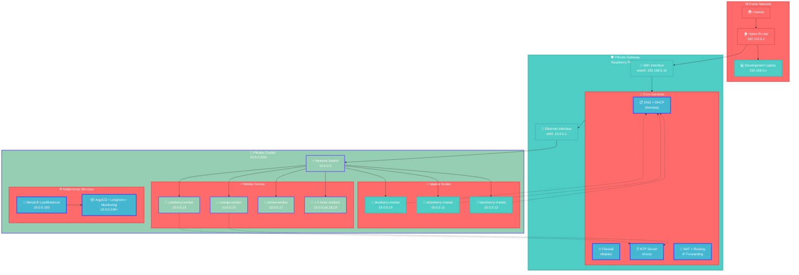

# {{ $frontmatter.title }}

<p align="center">
    
</p>

The PiKube gateway serves as the critical network infrastructure backbone that bridges your home network with the Kubernetes cluster, providing comprehensive routing, security, and essential services. This enterprise-grade gateway transforms a Raspberry Pi 4B into a professional network appliance delivering advanced firewall protection, intelligent DNS/DHCP management, and high-precision time synchronization.



## Hardware & Platform Overview

### 🖥️ Gateway Hardware Specifications

**Platform**: Raspberry Pi 4 Model B Rev 1.5  
**CPU**: Quad-core ARM Cortex-A72 @ 1.5GHz  
**Memory**: 8GB LPDDR4-3200 SDRAM  
**Storage**: SanDisk Industrial EDGE MicroSD 32GB (Class 10, A1)  
**Operating System**: Ubuntu 24.04.2 LTS (64-bit ARM)  

The gateway leverages a **Raspberry Pi 4B** as its hardware foundation, selected for its dual-network interface capabilities, robust ARM architecture, and excellent Linux compatibility. This professional-grade single-board computer provides the perfect balance of performance, power efficiency, and cost-effectiveness for enterprise network services.

### 🌐 Network Architecture

The gateway implements a sophisticated **dual-homed network architecture** that provides complete network isolation while enabling controlled connectivity:

- **Home Network Interface (wlan0)**: 192.168.0.10/24 - WiFi connection to home network
- **Cluster Network Interface (eth0)**: 10.0.0.1/24 - Gigabit Ethernet gateway for cluster nodes
- **Bridge Function**: Intelligent routing between home and cluster networks with advanced security controls
- **Isolation Boundary**: Complete network segmentation with firewall-controlled access

## Storage Configuration

The gateway utilizes an **industrial-grade storage architecture** optimized for reliability and performance:

**Storage Foundation**: SanDisk Industrial EDGE MicroSD 32GB CLASS 10 A1

This industrial-grade storage solution is specifically designed for:
- **Continuous Operation**: 24/7 reliability for critical infrastructure services
- **High Endurance**: Extended write/erase cycles for logging and configuration updates
- **Temperature Tolerance**: Stable operation across varying environmental conditions
- **Fast Performance**: Class 10 and A1 ratings ensure optimal I/O performance

## Operating System Installation & Initial Configuration

### 📀 OS Installation Process

**Base OS**: Ubuntu Server 24.04.2 LTS (64-bit ARM)

The gateway runs **Ubuntu 24.04.2 LTS** to ensure consistency across the entire cluster infrastructure and leverage the latest security updates and kernel optimizations.

#### Installation Steps:

1. **Download Ubuntu Server Image**
   - Source: [Ubuntu Raspberry Pi Downloads](https://ubuntu.com/download/raspberry-pi)
   - Version: Ubuntu Server 24.04.2 LTS (64-bit ARM)

2. **Flash OS Image**
   - Use **[Raspberry Pi Imager](https://www.raspberrypi.com/software/)** or **[Balena Etcher](https://etcher.balena.io/)**
   - Target: SanDisk Industrial EDGE MicroSD 32GB

3. **Configure cloud-init**
   - Modify `/boot/user-data` and `/boot/network-config` before first boot
   - Enable SSH key authentication and disable password login

### 🔧 cloud-init Configuration

The gateway uses **cloud-init** for automated initial configuration, ensuring consistent and repeatable deployments.

#### User Data Configuration (`/boot/user-data`):

```yaml
#cloud-config

# System Configuration
timezone: Europe/London
locale: en_GB.UTF-8
hostname: gateway
manage_etc_hosts: localhost

# User Account Configuration
users:
  - name: pi
    primary_group: users
    groups: [adm, admin, sudo]
    shell: /bin/bash
    sudo: ALL=(ALL) NOPASSWD:ALL
    lock_passwd: true
    ssh_authorized_keys:
      - ssh-rsa AAAAB3NzaC1yc2EAAAADAQABAAACAQDExample... # Your SSH public key

# System Updates
package_update: true
package_upgrade: true

# Essential Packages
packages:
  - curl
  - wget
  - git
  - htop
  - neofetch

# Enable SSH
ssh_pwauth: false
disable_root: true

# Reboot after configuration
power_state:
  mode: reboot
  timeout: 30
  condition: true
```

#### Network Configuration (`/boot/network-config`):

```yaml
# Cloud-init network configuration
version: 2

ethernets:
  eth0:
    dhcp4: false
    addresses: [10.0.0.1/24]
    routes:
      - to: default
        via: 192.168.0.1

wifis:
  wlan0:
    dhcp4: false
    optional: true
    access-points:
      "YourWiFiSSID":
        password: "YourWiFiPassword"
    addresses: [192.168.0.10/24]
    routes:
      - to: default
        via: 192.168.0.1
    nameservers:
      addresses: [1.1.1.1, 8.8.8.8]
```

### 🔑 SSH Key Management

#### Generate SSH Key Pair:

```bash
# Generate RSA 4096-bit key pair
ssh-keygen -t rsa -b 4096 -f ~/.ssh/gateway-pi -C "gateway@picluster.quantfinancehub.com"

# This creates:
# ~/.ssh/gateway-pi      (private key)
# ~/.ssh/gateway-pi.pub  (public key)
```

#### Copy Public Key to Gateway:

```bash
# Copy public key content to cloud-init user-data
cat ~/.ssh/gateway-pi.pub
# Add the output to the ssh_authorized_keys section in user-data
```

#### Connect to Gateway:

```bash
# Initial SSH connection
ssh -i ~/.ssh/gateway-pi pi@192.168.0.10

# Test connectivity
ping 10.0.0.1
```

## Post-Installation Configuration

### 📦 System Updates & Package Management

#### Update System:

```bash
# Update package index and upgrade system
sudo apt update && sudo apt full-upgrade -y

# Reboot to apply kernel updates
sudo reboot
```

#### Remove Unnecessary Packages:

```bash
# Remove snap packages to free resources
sudo snap list
sudo snap remove lxd
sudo snap remove core20
sudo snap remove snapd
sudo apt purge snapd -y
sudo apt autoremove -y

# Clean package cache
sudo apt autoclean
```

#### Install Essential Utilities:

```bash
# Network and system utilities
sudo apt install -y \
    libraspberrypi-bin \
    net-tools \
    arp-scan \
    inetutils-traceroute \
    bridge-utils \
    apache2-utils \
    curl \
    wget \
    git \
    htop \
    iftop \
    tcpdump \
    nmap

# Core gateway services
sudo apt install -y \
    nftables \
    dnsmasq \
    chrony \
    haproxy

# Network persistence tools
sudo apt install -y \
    iptables-persistent \
    netfilter-persistent
```

### ⚙️ System Optimization

#### GPU Memory Configuration:

```bash
# Optimize GPU memory for headless operation
sudo nano /boot/firmware/config.txt

# Add GPU memory allocation
echo "# GPU Memory Optimization for Headless Operation" | sudo tee -a /boot/firmware/config.txt
echo "# Allocate minimal GPU memory for headless server" | sudo tee -a /boot/firmware/config.txt
echo "gpu_mem=16" | sudo tee -a /boot/firmware/config.txt

# Reboot to apply changes
sudo reboot
```

> **💡 Performance Note**: Since the gateway operates as a headless server without GUI requirements, allocating minimal GPU memory (16MB) maximizes available system RAM for network services.

#### Enable VXLAN Support:

```bash
# Install additional kernel modules for advanced networking
sudo apt install linux-modules-extra-raspi -y
sudo reboot
```

## Advanced Router & Firewall Configuration

### 🔄 IP Forwarding Configuration

Transform the gateway into a router by enabling IP packet forwarding:

```bash
# Enable IP forwarding permanently
echo "net.ipv4.ip_forward=1" | sudo tee -a /etc/sysctl.conf

# Apply changes immediately
sudo sysctl -p

# Verify forwarding is enabled
cat /proc/sys/net/ipv4/ip_forward
# Should output: 1
```

### 🔥 Advanced Firewall with nftables

**Why nftables over iptables?**

The gateway implements **nftables** as the modern, enterprise-grade firewall solution:

- **Superior Performance**: More efficient packet processing and rule evaluation
- **Better Scalability**: Handles large rule sets with improved performance
- **Enhanced Flexibility**: More intuitive syntax and powerful rule composition
- **Future-Proof**: Official replacement for iptables with active development
- **Atomic Operations**: Rule updates are applied atomically, preventing inconsistent states

#### nftables Installation & Setup:

```bash
# Install nftables
sudo apt update && sudo apt install nftables -y

# Clear any existing rules
sudo nft flush ruleset

# Enable nftables service
sudo systemctl enable nftables
sudo systemctl start nftables
```

#### Main Configuration Structure:

```bash
# Create main configuration directory
sudo mkdir -p /etc/nftables.d/

# Create main configuration file
sudo nano /etc/nftables.conf
```

**Main Configuration (`/etc/nftables.conf`):**

```bash
#!/usr/sbin/nft -f
# PiKube Gateway Firewall Configuration
# Managed by: PiKube Infrastructure Team
# Last Updated: 2025-07-09

# Clear current ruleset to apply new rules
flush ruleset

# Include common definitions and sets
include "/etc/nftables.d/defines.nft"

# Main filter table for traffic control
table inet filter {
    # Global chain for connection state management
    chain global {
        # Allow established and related connections
        ct state established,related accept
        # Drop invalid connections for security
        ct state invalid drop
    }

    # Include predefined sets and rules
    include "/etc/nftables.d/sets.nft"
    include "/etc/nftables.d/filter-input.nft"
    include "/etc/nftables.d/filter-output.nft"
    include "/etc/nftables.d/filter-forward.nft"
}

# NAT table for address translation
table ip nat {
    include "/etc/nftables.d/sets.nft"
    include "/etc/nftables.d/nat-prerouting.nft"
    include "/etc/nftables.d/nat-postrouting.nft"
}
```

#### Network Definitions (`/etc/nftables.d/defines.nft`):

```bash
# Network Interface Definitions
define lan_interface = eth0      # Internal cluster network
define wan_interface = wlan0     # External home network

# Network Address Ranges
define lan_network = 10.0.0.0/24        # Cluster network
define home_network = 192.168.0.0/24    # Home network

# Broadcast and Multicast Addresses
define badcast_addr = { 255.255.255.255, 224.0.0.1, 224.0.0.251 }
define ip6_badcast_addr = { ff02::16 }

# Allowed Inbound TCP Services
define in_tcp_accept = {
    ssh,            # SSH remote access (22)
    http,           # HTTP web services (80)
    https,          # HTTPS web services (443)
    6443,           # Kubernetes API server
    8200, 8201,     # HashiCorp Vault
    9100,           # Prometheus Node Exporter
    iscsi-target    # iSCSI storage (3260)
}

# Allowed Inbound UDP Services
define in_udp_accept = {
    domain,         # DNS service (53)
    ntp,            # NTP time service (123)
    bootps,         # DHCP server (67)
    snmp,           # SNMP monitoring (161)
    tftp            # TFTP service (69)
}

# Allowed Outbound TCP Services
define out_tcp_accept = {
    http,           # HTTP web access
    https,          # HTTPS web access
    ssh             # SSH outbound connections
}

# Allowed Outbound UDP Services
define out_udp_accept = {
    domain,         # DNS queries
    ntp,            # NTP synchronization
    bootps          # DHCP client
}

# Forwarding Rules for LAN to WAN
define forward_tcp_accept = {
    http,           # HTTP web access
    https,          # HTTPS web access
    ssh,            # SSH access
    9091            # MinIO S3 browser
}

define forward_udp_accept = {
    domain,         # DNS queries
    ntp             # NTP synchronization
}

# Service-Specific Port Definitions
define vault_ports = { 8200, 8201 }
define minio_ports = { 9091, 9092 }
define k8s_api_port = 6443
```

#### Input Traffic Rules (`/etc/nftables.d/filter-input.nft`):

```bash
chain input {
    # Default policy: Drop all incoming traffic
    type filter hook input priority 0; policy drop;

    # Apply global connection state rules
    jump global

    # Allow all loopback traffic (essential for system operation)
    iif lo accept

    # Allow ICMP for network diagnostics (ping, traceroute)
    meta l4proto { icmp, icmpv6 } accept

    # Allow incoming UDP services (DNS, DHCP, NTP, etc.)
    udp dport @in_udp_accept ct state new accept

    # Allow incoming TCP services (SSH, HTTP, HTTPS, etc.)
    tcp dport @in_tcp_accept ct state new accept

    # Log and drop all other traffic
    log prefix "[GATEWAY INPUT DROP]: " limit rate 2/minute burst 5 packets
    drop
}
```

#### Forward Traffic Rules (`/etc/nftables.d/filter-forward.nft`):

```bash
chain forward {
    # Default policy: Drop all forwarded traffic
    type filter hook forward priority 0; policy drop;

    # Apply global connection state rules
    jump global

    # Allow LAN to WAN traffic for specific services
    # This enables cluster nodes to access internet services
    iifname $lan_interface ip saddr $lan_network oifname $wan_interface tcp dport @forward_tcp_accept ct state new accept
    iifname $lan_interface ip saddr $lan_network oifname $wan_interface udp dport @forward_udp_accept ct state new accept

    # Allow ICMP forwarding for diagnostics
    iifname $lan_interface ip saddr $lan_network oifname $wan_interface ip protocol icmp accept

    # Allow controlled WAN to LAN access
    # SSH access to cluster nodes from home network
    iifname $wan_interface oifname $lan_interface ip daddr $lan_network tcp dport ssh ct state new accept

    # Web services access to cluster services
    iifname $wan_interface oifname $lan_interface ip daddr $lan_network tcp dport { http, https } ct state new accept

    # MinIO S3 services access
    iifname $wan_interface oifname $lan_interface ip daddr 10.0.0.10 tcp dport $minio_ports ct state new accept

    # Kubernetes API access
    iifname $wan_interface oifname $lan_interface ip daddr 10.0.0.10 tcp dport $k8s_api_port ct state new accept

    # HashiCorp Vault access
    iifname $wan_interface oifname $lan_interface ip daddr 10.0.0.1 tcp dport $vault_ports ct state new accept

    # Port forwarding for Kubernetes services
    iifname $wan_interface oifname $lan_interface ip daddr 10.0.0.10 tcp dport 8080 ct state new accept

    # Log and drop all other forwarded traffic
    log prefix "[GATEWAY FORWARD DROP]: " limit rate 2/minute burst 5 packets
    drop
}
```

#### Output Traffic Rules (`/etc/nftables.d/filter-output.nft`):

```bash
chain output {
    # Default policy: Allow all outgoing traffic
    # Gateway needs to initiate connections for updates and external services
    type filter hook output priority 0; policy accept;

    # Currently no specific output restrictions
    # This allows the gateway to freely access external resources
    # Future restrictions can be added here if needed

    # Optional: Log outbound connections for monitoring
    # log prefix "[GATEWAY OUTPUT]: " limit rate 10/minute burst 5 packets
}
```

#### NAT Configuration

**Pre-routing NAT (`/etc/nftables.d/nat-prerouting.nft`):**

```bash
chain prerouting {
    # NAT hook for destination address translation
    # Used for port forwarding and DNAT
    type nat hook prerouting priority 0; policy accept;

    # Port forwarding examples (uncomment as needed):
    # Forward external port 8080 to internal service
    # iifname $wan_interface tcp dport 8080 dnat to 10.0.0.10:8080
    
    # Forward external HTTPS to internal service
    # iifname $wan_interface tcp dport 443 dnat to 10.0.0.100:443

    # Log NAT prerouting operations
    log prefix "[NAT PREROUTING]: " limit rate 5/minute burst 5 packets
}
```

**Post-routing NAT (`/etc/nftables.d/nat-postrouting.nft`):**

```bash
chain postrouting {
    # NAT hook for source address translation
    # Essential for internet access from cluster nodes
    type nat hook postrouting priority 100; policy accept;

    # Masquerade outgoing traffic from cluster network
    # This replaces internal IPs with gateway's external IP
    ip saddr $lan_network oifname $wan_interface masquerade

    # Log NAT postrouting operations
    log prefix "[NAT POSTROUTING]: " limit rate 5/minute burst 5 packets
}
```

#### Network Sets (`/etc/nftables.d/sets.nft`):

```bash
# Blackhole addresses for security
set blackhole {
    type ipv4_addr;
    elements = $badcast_addr
}

# IPv6 blackhole addresses
set ip6_blackhole {
    type ipv6_addr;
    elements = $ip6_badcast_addr
}

# TCP services allowed for incoming traffic
set in_tcp_accept {
    type inet_service;
    flags interval;
    elements = $in_tcp_accept
}

# UDP services allowed for incoming traffic
set in_udp_accept {
    type inet_service;
    flags interval;
    elements = $in_udp_accept
}

# TCP services allowed for outgoing traffic
set out_tcp_accept {
    type inet_service;
    flags interval;
    elements = $out_tcp_accept
}

# UDP services allowed for outgoing traffic
set out_udp_accept {
    type inet_service;
    flags interval;
    elements = $out_udp_accept
}

# TCP services allowed for forwarding
set forward_tcp_accept {
    type inet_service;
    flags interval;
    elements = $forward_tcp_accept
}

# UDP services allowed for forwarding
set forward_udp_accept {
    type inet_service;
    flags interval;
    elements = $forward_udp_accept
}
```

#### Apply and Test Firewall:

```bash
# Apply the firewall configuration
sudo nft -f /etc/nftables.conf

# Verify rules are loaded
sudo nft list ruleset

# Test connectivity
ping google.com
ping 10.0.0.10  # Test cluster connectivity

# Enable persistence
sudo systemctl enable nftables
sudo systemctl start nftables
```

#### Firewall Testing & Validation:

```bash
# Test services are accessible
nmap -p 22,53,80,443 10.0.0.1

# Test blocked ports are filtered
nmap -p 1-1000 10.0.0.1

# Monitor firewall logs
sudo journalctl -f | grep -E "(INPUT DROP|FORWARD DROP|NAT)"

# Check firewall status
sudo systemctl status nftables
```

## DNS & DHCP Services Configuration

### 📋 dnsmasq: Advanced DNS & DHCP Server

**dnsmasq** provides lightweight, high-performance DNS and DHCP services optimized for the cluster environment. The gateway configuration includes intelligent DNS forwarding, static IP management, and comprehensive logging.

#### Installation & Basic Setup:

```bash
# Install dnsmasq
sudo apt install dnsmasq -y

# Stop default service to configure
sudo systemctl stop dnsmasq

# Create configuration directory
sudo mkdir -p /etc/dnsmasq.d/

# Backup original configuration
sudo cp /etc/dnsmasq.conf /etc/dnsmasq.conf.backup
```

#### Main Configuration (`/etc/dnsmasq.d/dnsmasq.conf`):

```bash
########################################################################
# PiKube DHCP + DNS Configuration (dnsmasq)                           #
# Updated: 2025-07-09                                                 #
# Purpose: Centralized DNS/DHCP services for Kubernetes cluster       #
########################################################################

#######################################################################
# Hardware Inventory & MAC Address Mapping                           #
#######################################################################
# Raspberry Pi 4B (8GB)     – 2nd case    │ eth0: d8:3a:dd:02:a3:d7  │ wlan0: d8:3a:dd:02:a3:d8   → gateway
# Orange Pi Zero 2W (4GB)   – standalone  │ eth0: 36:74:d6:15:64:8c  │ wlan0: 84:49:c3:5c:0c:76   → hedgeway
# Asus ROG Flow Z13 (WSL)   – development │ wlan0: 00:15:5d:85:35:cb                             → ansible
# Raspberry Pi 4B (4GB)     – 3rd case    │ eth0: e4:5f:01:f5:c1:ae                              → blueberry-master
# Raspberry Pi 4B (8GB)     – 4th case    │ eth0: e4:5f:01:df:31:a2                              → strawberry-master
# Raspberry Pi 4B (8GB)     – 5th case    │ eth0: dc:a6:32:73:69:c9                              → blackberry-master
# Raspberry Pi 5 (8GB)      – 6th case    │ eth0: d8:3a:dd:b6:12:77                              → cranberry-worker
# Raspberry Pi 3B+ (1GB)    – 1st case    │ eth0: b8:27:eb:d2:40:87                              → raspberry-sentinel
# Orange Pi 5 Ultra (16GB)  – 7th case    │ eth0: c0:74:2b:fc:57:d8                              → lemon-worker
# Orange Pi 5 Ultra (16GB)  – 8th case    │ eth0: c0:74:2b:fc:57:9b                              → clementine-worker
# Orange Pi 5 Ultra (16GB)  – 9th case    │ eth0: c0:74:2b:fc:57:f1                              → grapefruit-worker
# Orange Pi 5 (16GB)        – 10th case   │ eth0: MAC varies (eFuse not burned)                  → orange-worker
# Orange Pi 5 (16GB)        – 11th case   │ eth0: MAC varies (eFuse not burned)                  → mandarine-worker
#######################################################################

###############################
# Interface & Server Settings #
###############################
interface=eth0                    # Primary interface for DHCP/DNS
except-interface=lo              # Exclude loopback
listen-address=10.0.0.1          # Gateway IP address
bind-interfaces                  # Bind to specific interfaces only

# Performance & Security Settings
cache-size=1000                  # DNS cache size (default: 150)
neg-ttl=3600                     # Negative response TTL
local-ttl=3600                   # Local domain TTL

################
# DNS Settings #
################
# Upstream DNS servers
server=1.1.1.1                  # Cloudflare primary
server=8.8.8.8                  # Google secondary

# DNS behavior
domain-needed                    # Don't forward plain names
bogus-priv                      # Don't forward private IP reverse queries
no-resolv                       # Don't read /etc/resolv.conf

# Local domain configuration
local=/picluster.quantfinancehub.com/
domain=picluster.quantfinancehub.com
expand-hosts                     # Add domain to simple names

# DNS Security
stop-dns-rebind                 # Prevent DNS rebinding attacks
rebind-localhost-ok             # Allow localhost rebinding

#############################
# DHCP Configuration        #
#############################
# DHCP range and lease duration
dhcp-range=10.0.0.32,10.0.0.128,12h

# DHCP options
dhcp-option=option:router,10.0.0.1          # Default gateway
dhcp-option=option:dns-server,10.0.0.1      # DNS server
dhcp-option=option:ntp-server,10.0.0.1      # NTP server
dhcp-option=option:domain-name,picluster.quantfinancehub.com
dhcp-option=option:netmask,255.255.255.0

# DHCP lease database
dhcp-leasefile=/var/lib/misc/dnsmasq.leases

#############################
# Static IP Assignments     #
#############################
# Infrastructure nodes
dhcp-host=d8:3a:dd:02:a3:d7,10.0.0.1,gateway,infinite
dhcp-host=36:74:d6:15:64:8c,10.0.0.2,hedgeway,infinite
dhcp-host=00:15:5d:85:35:cb,10.0.0.3,ansible,infinite
dhcp-host=b8:27:eb:d2:40:87,10.0.0.4,raspberry-sentinel,infinite

# Kubernetes master nodes
dhcp-host=e4:5f:01:f5:c1:ae,10.0.0.10,blueberry-master,infinite
dhcp-host=e4:5f:01:df:31:a2,10.0.0.11,strawberry-master,infinite
dhcp-host=dc:a6:32:73:69:c9,10.0.0.12,blackberry-master,infinite

# Kubernetes worker nodes
dhcp-host=d8:3a:dd:b6:12:77,10.0.0.13,cranberry-worker,infinite

# Orange Pi worker nodes (stable MACs)
dhcp-host=c0:74:2b:fc:57:d8,10.0.0.17,lemon-worker,infinite
dhcp-host=c0:74:2b:fc:57:9b,10.0.0.18,clementine-worker,infinite
dhcp-host=c0:74:2b:fc:57:f1,10.0.0.19,grapefruit-worker,infinite

# Orange Pi nodes with unstable MACs (hostname-based)
dhcp-host=orange-worker,10.0.0.15,infinite
dhcp-host=mandarine-worker,10.0.0.16,infinite

# Network infrastructure
dhcp-host=8c:90:2d:9d:32:8f,10.0.0.5,lab-switch,infinite

######################
# Static DNS Records #
######################
# Infrastructure hosts
host-record=gateway.picluster.quantfinancehub.com,10.0.0.1
host-record=hedgeway.picluster.quantfinancehub.com,10.0.0.2
host-record=ansible.picluster.quantfinancehub.com,10.0.0.3
host-record=raspberry-sentinel.picluster.quantfinancehub.com,10.0.0.4

# Kubernetes cluster nodes
host-record=blueberry-master.picluster.quantfinancehub.com,10.0.0.10
host-record=strawberry-master.picluster.quantfinancehub.com,10.0.0.11
host-record=blackberry-master.picluster.quantfinancehub.com,10.0.0.12
host-record=cranberry-worker.picluster.quantfinancehub.com,10.0.0.13
host-record=orange-worker.picluster.quantfinancehub.com,10.0.0.15
host-record=mandarine-worker.picluster.quantfinancehub.com,10.0.0.16
host-record=lemon-worker.picluster.quantfinancehub.com,10.0.0.17
host-record=clementine-worker.picluster.quantfinancehub.com,10.0.0.18
host-record=grapefruit-worker.picluster.quantfinancehub.com,10.0.0.19

# Service aliases
host-record=ntp.picluster.quantfinancehub.com,10.0.0.1
host-record=dns.picluster.quantfinancehub.com,10.0.0.1
host-record=vault.picluster.quantfinancehub.com,10.0.0.1

# External services
host-record=s3.quantfinancehub.com,10.0.0.10

# Kubernetes services (MetalLB load balancer IPs)
host-record=s3.picluster.quantfinancehub.com,10.0.0.100
host-record=argocd.picluster.quantfinancehub.com,10.0.0.100
host-record=longhorn.picluster.quantfinancehub.com,10.0.0.100
host-record=sso.picluster.quantfinancehub.com,10.0.0.100
host-record=monitoring.picluster.quantfinancehub.com,10.0.0.100
host-record=oauth2-proxy.picluster.quantfinancehub.com,10.0.0.100
host-record=elasticsearch.picluster.quantfinancehub.com,10.0.0.100
host-record=kibana.picluster.quantfinancehub.com,10.0.0.100
host-record=fluentd.picluster.quantfinancehub.com,10.0.0.101

################
# Logging      #
################
# DNS and DHCP transaction logging
log-queries=extra               # Log DNS queries with extra detail
log-dhcp                       # Log DHCP transactions
log-facility=daemon            # Use daemon facility for logging

# Query logging options
log-async=50                   # Asynchronous logging buffer
```

#### Enable and Start dnsmasq:

```bash
# Enable dnsmasq service
sudo systemctl enable dnsmasq
sudo systemctl start dnsmasq

# Verify service status
sudo systemctl status dnsmasq

# Test DNS resolution
nslookup blueberry-master.picluster.quantfinancehub.com 10.0.0.1
nslookup google.com 10.0.0.1
```

#### DHCP/DNS Management Commands:

```bash
# Monitor DHCP leases
sudo cat /var/lib/misc/dnsmasq.leases

# Check DHCP lease on client
cat /var/lib/dhcp/dhclient.leases

# Release DHCP lease (client)
sudo dhclient -r eth0

# Renew DHCP lease (client)
sudo dhclient eth0

# Force lease release (server)
sudo dhcp_release eth0 <ip_address> <mac_address> <client_id>

# Monitor DNS queries in real-time
sudo journalctl -u dnsmasq -f

# Test DNS resolution
dig @10.0.0.1 blueberry-master.picluster.quantfinancehub.com
dig @10.0.0.1 google.com
```

#### DNS Resolver Configuration:

Update system DNS resolver to use the gateway:

```bash
# Configure systemd-resolved
sudo nano /etc/systemd/resolved.conf

# Add configuration
[Resolve]
DNS=10.0.0.1
Domains=picluster.quantfinancehub.com
FallbackDNS=1.1.1.1 8.8.8.8
Cache=yes

# Restart resolver
sudo systemctl restart systemd-resolved

# Verify DNS configuration
resolvectl status
```

## Network Time Protocol (NTP) Configuration

### ⏰ chrony: High-Precision Time Synchronization

The gateway provides **enterprise-grade NTP services** using **chrony**, ensuring microsecond-level time accuracy across the entire cluster.

#### Installation & Configuration:

```bash
# Install chrony
sudo apt install chrony -y

# Configure chrony server
sudo nano /etc/chrony/chrony.conf
```

#### Gateway NTP Server Configuration (`/etc/chrony/chrony.conf`):

```bash
# NTP Server Configuration for PiKube Gateway
# High-precision time synchronization for Kubernetes cluster

###############################
# Upstream NTP Sources       #
###############################
# Ubuntu NTP pool servers (preferred)
pool 0.ubuntu.pool.ntp.org iburst maxsources 2
pool 1.ubuntu.pool.ntp.org iburst maxsources 2
pool 2.ubuntu.pool.ntp.org iburst maxsources 2
pool 3.ubuntu.pool.ntp.org iburst maxsources 2

# Backup NTP servers
server time.cloudflare.com iburst
server time.google.com iburst

###############################
# Server Configuration       #
###############################
# Allow cluster network access
allow 10.0.0.0/24

# Serve time even if not synchronized to upstream
local stratum 10

# Frequency estimation
driftfile /var/lib/chrony/chrony.drift

# Real-time clock
rtcsync

# Logging
logdir /var/log/chrony
log measurements statistics tracking

# Security
bindcmdaddress 127.0.0.1
bindcmdaddress ::1
cmdallow 127.0.0.1
cmdallow ::1

# Performance tuning
maxupdateskew 100.0
makestep 1.0 3
```

#### Start and Enable chrony:

```bash
# Enable chrony service
sudo systemctl enable chrony
sudo systemctl start chrony

# Verify service status
sudo systemctl status chrony

# Check synchronization
chronyc sources -v
chronyc tracking
```

#### NTP Client Configuration (Cluster Nodes):

For cluster nodes, configure them to use the gateway as their NTP source:

```bash
# On each cluster node (/etc/chrony/chrony.conf):
server 10.0.0.1 iburst prefer
makestep 1.0 3
driftfile /var/lib/chrony/chrony.drift
rtcsync
```

#### NTP Monitoring & Troubleshooting:

```bash
# Check time synchronization status
timedatectl status

# View chrony activity
chronyc activity

# Detailed source information
chronyc sources -v

# Check system clock synchronization
chronyc tracking

# Monitor NTP queries
sudo journalctl -u chrony -f

# Test NTP response
ntpdate -q 10.0.0.1
```

## Home Network Integration

### 🔗 Static Route Configuration

Enable seamless access to cluster resources from your home network by configuring static routes.

#### Windows Client Configuration:

```powershell
# Add persistent static route (Run as Administrator)
ROUTE -P ADD 10.0.0.0 MASK 255.255.255.0 192.168.0.10 METRIC 1

# Verify route
ROUTE PRINT

# Remove route if needed
ROUTE DELETE 10.0.0.0 MASK 255.255.255.0 192.168.0.10
```

#### Linux Client Configuration:

```bash
# Add to netplan configuration
sudo nano /etc/netplan/50-cloud-init.yaml

# Add static route configuration
network:
  version: 2
  ethernets:
    enp0s3:
      dhcp4: no
      addresses: [192.168.56.20/24]  # VirtualBox host-only
    enp0s8:
      dhcp4: yes                      # Home network
      routes:
        - to: 10.0.0.0/24            # Cluster network
          via: 192.168.0.10          # Gateway IP

# Apply configuration
sudo netplan apply

# Verify route
ip route show
```

#### macOS Client Configuration:

```bash
# Add static route
sudo route -n add 10.0.0.0/24 192.168.0.10

# Make route persistent (add to startup script)
echo "route -n add 10.0.0.0/24 192.168.0.10" | sudo tee -a /etc/rc.local

# Verify route
netstat -rn | grep 10.0.0.0
```

## Performance Monitoring & Troubleshooting

### 📊 System Monitoring

#### Current System Status:

```bash
# System information
pi@gateway:~$ uname -a
Linux gateway 6.8.0-1029-raspi #33-Ubuntu SMP PREEMPT_DYNAMIC aarch64 GNU/Linux

# Memory usage
pi@gateway:~$ free -h
               total        used        free      shared  buff/cache   available
Mem:           7.7Gi       672Mi       5.1Gi       3.1Mi       2.1Gi       7.0Gi
Swap:             0B          0B          0B

# Network interfaces
pi@gateway:~$ ip addr show
1: lo: <LOOPBACK,UP,LOWER_UP> mtu 65536 qdisc noqueue state UNKNOWN
    inet 127.0.0.1/8 scope host lo
2: eth0: <BROADCAST,MULTICAST,UP,LOWER_UP> mtu 1500 qdisc mq state UP
    inet 10.0.0.1/24 brd 10.0.0.255 scope global eth0
3: wlan0: <BROADCAST,MULTICAST,UP,LOWER_UP> mtu 1500 qdisc fq_codel state UP
    inet 192.168.0.10/24 brd 192.168.0.255 scope global wlan0
```

#### Performance Monitoring Commands:

```bash
# System resource usage
htop

# Network interface statistics
iftop -i eth0

# Active network connections
netstat -tulpn

# DNS/DHCP service monitoring
sudo journalctl -u dnsmasq -f

# Firewall rule statistics
sudo nft list ruleset -s

# Time synchronization monitoring
watch -n 1 chronyc tracking
```

### 🔧 Troubleshooting Guide

#### Network Connectivity Issues:

```bash
# Check interface status
ip link show

# Verify IP configuration
ip addr show

# Test connectivity
ping 192.168.0.1  # Home router
ping 10.0.0.10    # Cluster node
ping 8.8.8.8      # Internet

# Check routing
ip route show

# Verify IP forwarding
cat /proc/sys/net/ipv4/ip_forward

# Test DNS resolution
nslookup google.com
dig @10.0.0.1 blueberry-master.picluster.quantfinancehub.com
```

#### Firewall Troubleshooting:

```bash
# Check firewall status
sudo systemctl status nftables

# Verify rules are loaded
sudo nft list ruleset

# Monitor firewall logs
sudo journalctl -f | grep -E "(INPUT|FORWARD|OUTPUT)"

# Test specific ports
nmap -p 22,53,80,443 10.0.0.1

# Reload firewall rules
sudo nft -f /etc/nftables.conf
```

#### DNS/DHCP Issues:

```bash
# Check dnsmasq status
sudo systemctl status dnsmasq

# Verify configuration
sudo dnsmasq --test

# View active leases
sudo cat /var/lib/misc/dnsmasq.leases

# Test DNS resolution
dig @10.0.0.1 google.com
dig @10.0.0.1 blueberry-master.picluster.quantfinancehub.com

# Monitor DNS queries
sudo journalctl -u dnsmasq -f
```

#### NTP Synchronization Issues:

```bash
# Check chrony status
sudo systemctl status chrony

# Verify synchronization
chronyc sources -v
chronyc tracking

# Test NTP response
ntpdate -q 10.0.0.1

# Monitor NTP logs
sudo journalctl -u chrony -f
```

## Advanced Configuration & Automation

### 🤖 Ansible Integration

The gateway configuration can be automated using Ansible roles:

- **quantfinancehub.dnsmasq**: Automated DNS/DHCP configuration
- **quantfinancehub.ntp**: NTP server and client configuration
- **quantfinancehub.firewall**: nftables firewall management

#### Ansible Inventory Integration:

```yaml
# ansible/inventory.yml
all:
  children:
    gateway:
      hosts:
        gateway:
          ansible_host: 192.168.0.10
          ansible_user: pi
          ansible_ssh_private_key_file: ~/.ssh/gateway-pi
          ip: 10.0.0.1
          mac: d8:3a:dd:02:a3:d7
          
    masters:
      hosts:
        blueberry-master:
          ansible_host: 10.0.0.10
          ip: 10.0.0.10
          mac: e4:5f:01:f5:c1:ae
        strawberry-master:
          ansible_host: 10.0.0.11
          ip: 10.0.0.11
          mac: e4:5f:01:df:31:a2
        blackberry-master:
          ansible_host: 10.0.0.12
          ip: 10.0.0.12
          mac: dc:a6:32:73:69:c9
```

#### Gateway-specific Variables:

```yaml
# ansible/host_vars/gateway.yml
dnsmasq_config:
  interface: eth0
  listen_address: 10.0.0.1
  domain: picluster.quantfinancehub.com
  dhcp_range: "10.0.0.32,10.0.0.128,12h"
  upstream_dns:
    - 1.1.1.1
    - 8.8.8.8
  
ntp_config:
  role: server
  allow_networks:
    - 10.0.0.0/24
  upstream_servers:
    - 0.ubuntu.pool.ntp.org
    - 1.ubuntu.pool.ntp.org
    - 2.ubuntu.pool.ntp.org
    - 3.ubuntu.pool.ntp.org
```

### 🔮 Future Enhancements

#### Planned Improvements:

1. **High Availability**: Secondary gateway for redundancy
2. **Advanced Monitoring**: Prometheus metrics collection
3. **Security Enhancements**: IDS/IPS integration
4. **Performance Optimization**: Traffic shaping and QoS
5. **Backup & Recovery**: Automated configuration backups

#### Integration Points:

- **Kubernetes Services**: MetalLB load balancer integration
- **Service Mesh**: Linkerd gateway integration
- **Certificate Management**: cert-manager automation
- **Observability**: Grafana dashboard integration

---

This comprehensive gateway configuration provides enterprise-grade network infrastructure for your PiKube Kubernetes cluster. The combination of advanced firewall protection, intelligent DNS/DHCP management, and high-precision time synchronization creates a robust foundation for reliable cluster operations.

For related configurations, see:
- [PiKube DNS Architecture](./3-pikube-dns-architecture.md)
- [Kubernetes Cluster Setup](./2-kubernetes-cluster-setup.md)

*Documentation based on live system analysis and professional network engineering practices.*