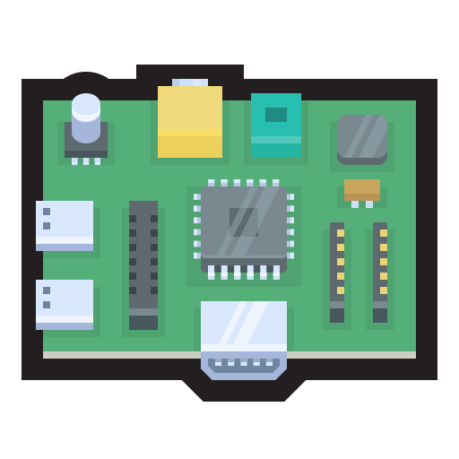

# {{ $frontmatter.title }}

<div style="display: flex; justify-content: center; align-items: center;">
    <div style="flex: 0 0 auto; margin-right: 60x;"> <!-- Adjust margin as needed for spacing -->
        
    </div>
        <div style="flex: 0 0 auto;">
        
    </div>
    <div style="flex: 0 0 auto;">
        
    </div>
</div>

## Cluster Composition

The PiKube Kubernetes Cluster comprises a heterogeneous ARM-based infrastructure:

**Master Nodes (Control Plane):**

- `blueberry-master` (Raspberry Pi 4B, 4GB)
- `strawberry-master` (Raspberry Pi 4B, 8GB)
- `blackberry-master` (Raspberry Pi 4B, 8GB)

**Worker Nodes (Compute Resources):**

- `cranberry-worker` (Raspberry Pi 5, 8GB)
- `raspberry-worker` (Raspberry Pi 3B+, 1GB)
- `orange-worker` (Orange Pi 5B, 16GB)
- `mandarine-worker` (Orange Pi 5B, 16GB)

## Unified Node Configuration

### OS Installation and Initial Configuration

**Ubuntu Server 24.04.x LTS** is the chosen operating system for all cluster nodes, providing a consistent platform across both Raspberry Pi and Orange Pi hardware.

**Installation Sources:**

- **Raspberry Pi**: [Ubuntu preconfigured cloud image](https://ubuntu.com/download/raspberry-pi)
- **Orange Pi**: [Ubuntu Rockchip preconfigured cloud image](https://github.com/Joshua-Riek/ubuntu-rockchip/releases)

**Procedure**: Burn the Ubuntu OS image onto an SD-card using tools such as [Raspberry PI Imager](https://www.raspberrypi.com/software/) or [Balena Etcher](https://etcher.balena.io/). Modify the **user-data** file within the **/boot** directory on the SD Card to customize the initial setup.

### Generating SSH Keys

Secure Shell (SSH) keys are a pair of cryptographic keys that can be used to authenticate to an SSH server as an alternative to password-based logins. A private key, which is secret, and a public key, which is shared, are used in the authentication process. Here is a procedure to generate an SSH key pair:

```bash
ssh-keygen -t rsa -b 4096 -f ~/.ssh/key-generation
```

This command creates a private key **key-generation** and a public key **key-generation.pub** in the **~/.ssh/** directory.

### Cloud-Init Configuration

**Standard cloud-init YAML file for all Node Configuration:**

```yaml
#cloud-config

# Set TimeZone and Locale for UK
timezone: Europe/London
locale: en_GB.UTF-8

# Hostname
hostname: <node-name>

# cloud-init not managing hosts file. only hostname is added
manage_etc_hosts: localhost

users:
  # not using default ubuntu user
  - name: pi
    primary_group: users
    groups: [adm, admin]
    shell: /bin/bash
    sudo: ALL=(ALL) NOPASSWD:ALL
    lock_passwd: true
    ssh_authorized_keys:
      - <public-key>

# Reboot to enable configuration
power_state:
  mode: reboot
```

### Post-Installation Configuration

**Connect and update each node:**

```bash
sudo apt-get update && sudo apt-get upgrade -y
```

### NTP Time Synchronization

All cluster nodes must be configured to synchronize time with the gateway's NTP server to ensure accurate timestamps across the cluster. This is essential for Kubernetes operations, certificate validation, and distributed logging.

For detailed NTP client configuration on cluster nodes, refer to the [Network Time Protocol (NTP) Configuration](./1-cluster-gateway-configuration.md#network-time-protocol-ntp-configuration) section in the gateway documentation.

### Raspberry Pi GPU Memory Optimization

**For Raspberry Pi nodes only - Change default GPU Memory Split:**

Add to **/boot/firmware/config.txt**:

```bash
# Set GPU Memory Allocation
# Adjust the amount of memory allocated to the GPU.
# For headless mode and non-graphical applications, a lower value is often sufficient.
# Value is in megabytes (MB). Default is 64.
# Recommended: 16 for headless scenarios, adjust as needed.
gpu_mem=16
```

> [!TIP]
>
> Since Raspberry Pis in the cluster are configured as headless servers without monitors and are using the server version of Ubuntu distribution (without the desktop GUI), the reserved GPU memory for Raspberry Pis can be set to the lowest possible value (16MB).

### Alternative Manual Configuration (If Needed)

If cloud-init configuration is not available, Orange Pi nodes can be configured manually:

#### Identifying Orange Pi IP Address and Remote Connection

Prior to configuring Orange Pi nodes within the PiKube Kubernetes Cluster, it's essential to identify each node's IP address allocated via DHCP for secure remote connectivity and configuration.

- **Identifying Orange Pi IP Address**: From `gateway` configured with `dnsmasq` and `DHCP` services, the `arp -a` command lists known IP addresses on the network, aiding in identifying IP addresses allocated to Orange Pi nodes.

- **Remote Connection**: Connect to the Orange Pi using SSH with the default credentials (username: `ubuntu`, password: `ubuntu`) by replacing `ip_address` with the actual IP address identified.

#### Configuration Steps

**Log in to the Orange Pi using the identified IP address:**

```bash
ssh ubuntu@ip_address
```

**Update the System:**

```bash
sudo apt-get update && sudo apt-get upgrade -y
```

**Set Timezone and Locale:**

```bash
sudo timedatectl set-timezone Europe/London
sudo locale-gen en_GB.UTF-8
sudo update-locale LANG=en_GB.UTF-8
```

**Set Hostname:**

```bash
sudo hostnamectl set-hostname <node-name>
```

**Create User pi:**

```bash
sudo adduser pi
sudo usermod -aG sudo,adm pi
sudo chsh -s /bin/bash pi
echo 'pi ALL=(ALL) NOPASSWD:ALL' | sudo tee -a /etc/sudoers
```

**Set Up SSH for User pi:**

```bash
sudo mkdir -p /home/pi/.ssh
sudo chmod 700 /home/pi/.ssh
sudo touch /home/pi/.ssh/authorized_keys
sudo chmod 600 /home/pi/.ssh/authorized_keys
```

**Add Public SSH Key:**

```bash
echo "<public-ssh-key>" | sudo tee /home/pi/.ssh/authorized_keys
```

**Change Ownership of the SSH Directory:**

```bash
sudo chown -R pi:pi /home/pi/.ssh
```

**Reboot the system:**

```bash
sudo shutdown -r now
```

> [!NOTE]
>
> To enable the WIFI interface (wlan0) on Orange Pi 5, if needed, follow this [wiki](https://github.com/Joshua-Riek/ubuntu-rockchip/wiki/Orange-Pi-5).
