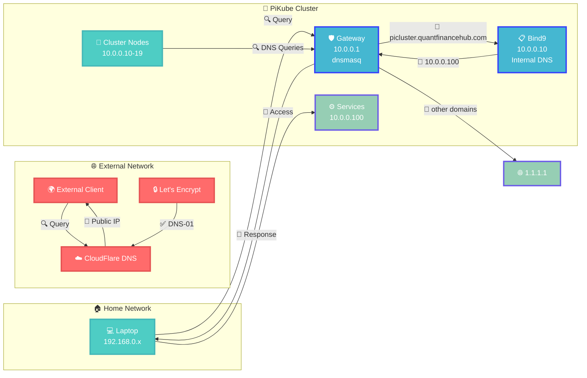
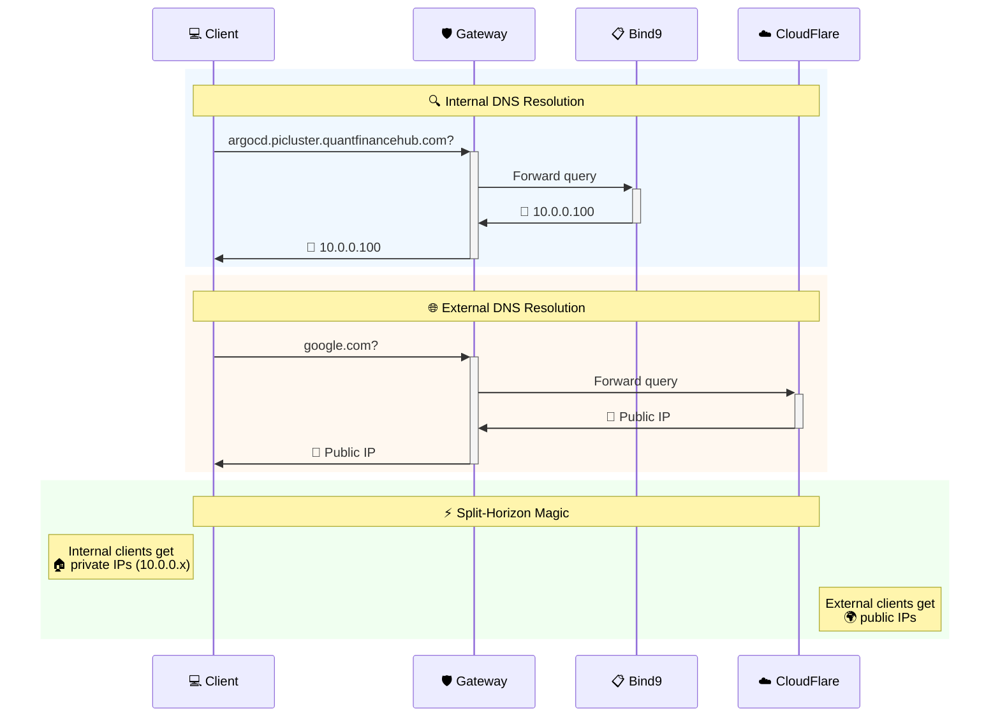

# {{ $frontmatter.title }}

PiKube implements a sophisticated split-horizon DNS architecture that enables seamless service access from both internal and external networks while providing automatic service discovery and secure TLS certificate management.



## Architecture Overview

The DNS architecture consists of three complementary layers that work together to provide comprehensive name resolution:

### 1. Internal Authoritative DNS Server (Bind9)

**Location**: `blueberry-master` (10.0.0.10)  
**Purpose**: Authoritative DNS server for the `picluster.quantfinancehub.com` domain

This [Bind9](https://www.isc.org/bind/) server provides authoritative DNS resolution for all internal services, mapping domain names to private IP addresses within the cluster network (10.0.0.0/24). It serves as the single source of truth for internal DNS records and integrates with Kubernetes ExternalDNS for automatic service discovery.

### 2. External Authoritative DNS Server (CloudFlare)

**Location**: CloudFlare DNS service  
**Purpose**: Public DNS resolution for external access and TLS certificate validation

CloudFlare DNS resolves the same `picluster.quantfinancehub.com` domain to public IP addresses, enabling:

- **TLS Certificate Validation**: Essential for Let's Encrypt DNS-01 challenges when generating valid TLS certificates
- **Future External Access**: Potential for VPN or port forwarding solutions to access internal services from the internet
- **Split-Horizon Behavior**: Same domain resolves differently based on query source (internal vs external)

### 3. DNS Forwarder/Resolver (dnsmasq)

**Location**: `gateway` (10.0.0.1)  
**Purpose**: Intelligent DNS forwarding and DHCP services

The [dnsmasq](https://thekelleys.org.uk/dnsmasq/doc.html) service on the gateway acts as the primary DNS resolver for all cluster nodes, providing:

- **Conditional Forwarding**: Routes `picluster.quantfinancehub.com` queries to the internal Bind9 server
- **Upstream Resolution**: Forwards other queries to public DNS servers (1.1.1.1, 8.8.8.8)
- **DHCP Integration**: Provides both DNS and DHCP services for the cluster network



## Kubernetes DNS Integration

This split-horizon DNS architecture provides the foundation for Kubernetes DNS services. The cluster uses two main DNS components:

### CoreDNS (Cluster DNS)

- **Internal service discovery** for pods and services within `cluster.local`
- **Upstream forwarding** to the gateway for external DNS resolution
- **Automatic configuration** by K3s with sensible defaults

### ExternalDNS (Service Integration)  

- **Automatic DNS record management** for exposed Kubernetes services
- **Bind9 integration** using TSIG authentication for secure updates
- **Ingress synchronization** for seamless external access

## Benefits of This Architecture

### 1. **Seamless Split-Horizon Resolution**

- Internal queries resolve to private IPs (10.0.0.x)
- External queries resolve to public IPs
- Same domain names work from both internal and external networks

### 2. **Automatic Service Discovery**

- Kubernetes services automatically receive DNS records
- No manual DNS record management required
- Services become accessible immediately upon deployment

### 3. **Secure TLS Certificate Management**

- DNS-01 challenges work seamlessly with Let's Encrypt
- Valid TLS certificates for internal services
- No need for self-signed certificates

### 4. **Scalable and Maintainable**

- Centralized DNS management through GitOps
- Easy to add new services and domains
- Clear separation of concerns between layers

---

## 🚀 Implementation Guide: Foundation DNS Infrastructure

### Step 1: Internal Authoritative DNS Server Setup

Deploy Bind9 on `blueberry-master` (10.0.0.10):

#### Installation

```bash
sudo apt-get install bind9 bind9-doc dnsutils -y
```

#### Configure IPv4-only operation

Edit `/etc/default/named`:

```bash
OPTIONS="-u bind -4"
```

#### Configure main options

Edit `/etc/bind/named.conf.options`:

```bash
options {
    directory "/var/cache/bind";
    dnssec-validation auto;
    
    // Listen on all IPv4 interfaces
    listen-on { any; };
    
    // Allow queries from cluster network
    allow-query { 10.0.0.0/24; };
    
    // Authoritative only - no recursion
    recursion no;
    
    // Disable zone transfer by default
    allow-transfer { none; };
};
```

#### Configure local zones

Edit `/etc/bind/named.conf.local`:

```bash
// Forward zone for picluster.quantfinancehub.com
zone "picluster.quantfinancehub.com" {
    type primary;
    file "/var/lib/bind/db.picluster.quantfinancehub.com";
    allow-update { key externaldns; };  // Allow ExternalDNS updates
};

// Reverse zone for 10.0.0.0/24
zone "0.0.10.in-addr.arpa" {
    type primary;
    file "/var/lib/bind/db.10.0.0";
    allow-update { key externaldns; };
};
```

#### Create forward zone file

Create `/var/lib/bind/db.picluster.quantfinancehub.com`:

```bash
$TTL 604800
@   IN  SOA ns.picluster.quantfinancehub.com. admin.picluster.quantfinancehub.com. (
        2025070901  ; Serial (YYYYMMDDNN)
        604800      ; Refresh
        86400       ; Retry
        2419200     ; Expire
        604800      ; Negative Cache TTL
)

; Name servers
@   IN  NS  ns.picluster.quantfinancehub.com.

; Name server A record
ns  IN  A   10.0.0.10

; Infrastructure nodes
gateway                 IN  A   10.0.0.1
blueberry-master        IN  A   10.0.0.10
strawberry-master       IN  A   10.0.0.11
blackberry-master       IN  A   10.0.0.12

; Worker nodes
cranberry-worker        IN  A   10.0.0.13
orange-worker           IN  A   10.0.0.15
mandarine-worker        IN  A   10.0.0.16
lemon-worker            IN  A   10.0.0.17
clementine-worker       IN  A   10.0.0.18
grapefruit-worker       IN  A   10.0.0.19

; Service VIPs (MetalLB load balancer IPs)
services                IN  A   10.0.0.100
monitoring              IN  A   10.0.0.100
argocd                  IN  A   10.0.0.100
longhorn                IN  A   10.0.0.100
```

#### Create reverse zone file

Create `/var/lib/bind/db.10.0.0`:

```bash
$TTL 604800
@   IN  SOA ns.picluster.quantfinancehub.com. admin.picluster.quantfinancehub.com. (
        2025070901  ; Serial
        604800      ; Refresh
        86400       ; Retry
        2419200     ; Expire
        604800      ; Negative Cache TTL
)

; Name servers
@   IN  NS  ns.picluster.quantfinancehub.com.

; PTR Records
1   IN  PTR gateway.picluster.quantfinancehub.com.
10  IN  PTR blueberry-master.picluster.quantfinancehub.com.
11  IN  PTR strawberry-master.picluster.quantfinancehub.com.
12  IN  PTR blackberry-master.picluster.quantfinancehub.com.
13  IN  PTR cranberry-worker.picluster.quantfinancehub.com.
15  IN  PTR orange-worker.picluster.quantfinancehub.com.
16  IN  PTR mandarine-worker.picluster.quantfinancehub.com.
17  IN  PTR lemon-worker.picluster.quantfinancehub.com.
18  IN  PTR clementine-worker.picluster.quantfinancehub.com.
19  IN  PTR grapefruit-worker.picluster.quantfinancehub.com.
100 IN  PTR services.picluster.quantfinancehub.com.
```

#### Security Configuration

For ExternalDNS integration, generate a TSIG key:

```bash
sudo tsig-keygen -a hmac-sha256 externaldns | sudo tee /etc/bind/externaldns.key
```

Set proper ownership and permissions:

```bash
sudo chown bind:bind /etc/bind/externaldns.key
sudo chmod 640 /etc/bind/externaldns.key
```

Include the key in `/etc/bind/named.conf`:

```bash
# Add this line to /etc/bind/named.conf
echo 'include "/etc/bind/externaldns.key";' | sudo tee -a /etc/bind/named.conf

# Verify the configuration is valid
sudo named-checkconf
```

### Step 2: Gateway DNS Forwarder Configuration

Update dnsmasq configuration on the gateway (10.0.0.1) to forward domain queries to the internal Bind9 server.

Edit `/etc/dnsmasq.d/dnsmasq.conf` and add:

```bash
# Forward picluster.quantfinancehub.com queries to internal Bind9
server=/picluster.quantfinancehub.com/10.0.0.10

# Keep existing upstream DNS servers for other queries
server=1.1.1.1
server=8.8.8.8
```

Restart dnsmasq:

```bash
sudo systemctl restart dnsmasq
```

### Step 3: External DNS Configuration

For TLS certificate validation, configure CloudFlare DNS to resolve the same domain to your public IP addresses.

### Step 4: Kubernetes Integration

Deploy ExternalDNS in your Kubernetes cluster to automatically manage DNS records for exposed services. This will sync Kubernetes Ingress and Service resources with your internal Bind9 server.

> [!IMPORTANT]📋 Implementation Details  
> For complete CoreDNS and ExternalDNS configuration, deployment steps, and troubleshooting, see:  
> [Kubernetes DNS with CoreDNS and External-DNS](../5-networking/6-dns-coredns-and-external-dns-kubernetes-revised.md)

---

## DNS Resolution Flow

### Internal Query Resolution

1. **Client Query**: Node queries `argocd.picluster.quantfinancehub.com`
2. **Gateway Forward**: dnsmasq forwards to Bind9 (10.0.0.10)
3. **Authoritative Response**: Bind9 returns private IP (10.0.0.100)
4. **Internal Access**: Client connects to service via internal network

### External Query Resolution

1. **External Query**: Internet client queries `argocd.picluster.quantfinancehub.com`
2. **Public DNS**: CloudFlare returns public IP
3. **External Access**: Client connects via public internet (if configured)

### TLS Certificate Validation

1. **Let's Encrypt**: Requests DNS-01 challenge for `argocd.picluster.quantfinancehub.com`
2. **External DNS**: CloudFlare provides TXT record validation
3. **Certificate Issue**: Valid TLS certificate issued for internal service

This architecture provides the foundation for a production-ready, secure, and scalable DNS infrastructure that grows with your Kubernetes cluster while maintaining the flexibility to access services from both internal and external networks.

For implementation details about Kubernetes DNS services, see [Kubernetes DNS with CoreDNS and External-DNS](../5-networking/6-dns-coredns-and-external-dns-kubernetes-revised.md).

Zone file syntax follows [RFC1035](https://datatracker.ietf.org/doc/html/rfc1035) standards. For detailed zone file structure information, see [Bind9 documentation](https://bind9.readthedocs.io/en/v9.18.30/chapter3.html#soa-rr).