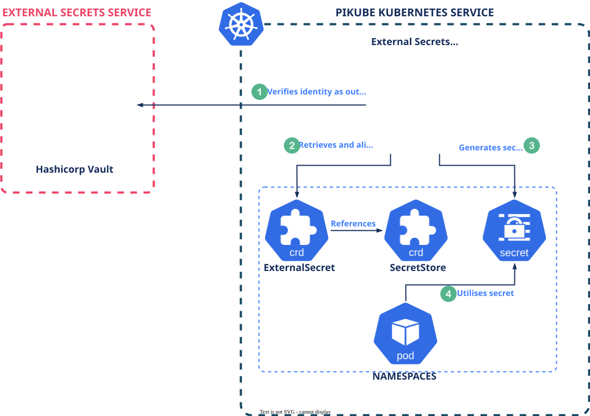

# {{ $frontmatter.title }}

<p align="center">
    
</p>

The PiKube Kubernetes Cluster utilizes HashiCorp Vault as its primary system for managing secrets. This system ensures the protection of sensitive data, such as user credentials, passwords, and API tokens, through advanced encryption methods.

- **Vault as an External Service:** Vault is deployed as an external service, situated on the gateway, distinct from the PiKube Kubernetes services within the K3S cluster. This distinct setup allows for effortless integration with the GitOps tool, **`ArgoCD`**, hereby facilitating the automated deployment of cluster services. The external positioning of Vault streamlines the management of secrets while leveraging its comprehensive security features, ensuring a robust and secure environment for sensitive data outside the Kubernetes cluster.

- **`Challenges of Kubernetes Integration:`** Deploying Vault within PiKube Kubernetes Service, either via the official Helm chart or community solutions like Banzai Bank-Vault, presents several challenges. A key issue is the dependency loop encountered when Vault is the sole repository for all secrets of Kubernetes services. This dependency necessitates an existing block storage solution, like Longhorn, because Vault requires Persistent Volumes. However, deploying such storage solutions themselves demands access to specific secrets, such as Minio credentials for backup configurations.

- **`Solution via External Secrets Operator:`** To address these challenges, the **External Secrets Operator** is employed. This tool extracts data from Vault and dynamically generates the required Kubernetes Secrets. As a result, it ensures the smooth and secure deployment of various services through ArgoCD, effectively overcoming the integration hurdles.

By integrating HashiCorp Vault with the External Secrets Operator, the PiKube cluster enhances its secret management capabilities, ensuring a secure and efficient service deployment process.

<p align="center">
    
</p>

## Quick Start: Insert and Retrieve Secrets (Gateway)

This section shows the exact commands used on the gateway to add and read secrets from Vault without exposing values on screen. The current cluster already contains several secrets under the `secret/` (KV v2) mount. We will standardize paths and field names used by downstream components like cert-manager and backup tools.

### Pre‑requisites

```bash
# On gateway
export VAULT_ADDR=https://vault.picluster.quantfinancehub.com:8200
export VAULT_TOKEN=$(cat ~/.vault-token)

# Verify connectivity
vault status
vault secrets list -detailed
```

### Cloudflare (for Let’s Encrypt DNS‑01 with cert‑manager)

Canonical path and key (standardize on this only):

```bash
# Insert Cloudflare API token into Vault
vault kv put secret/cert-manager/cloudflare \
  dns_cloudflare_api_token="<CF_API_TOKEN>"

# Retrieve the token (avoid echoing in real workflows)
vault kv get -field=dns_cloudflare_api_token secret/cert-manager/cloudflare
vault kv get -format=json secret/cert-manager/cloudflare | jq '.data.data | keys[]'  # => dns_cloudflare_api_token
```

If you use External Secrets Operator (ESO) to sync Vault → Kubernetes for cert-manager, map the Vault field
`dns_cloudflare_api_token` to a Kubernetes Secret key named `api-token` that cert-manager expects:

```yaml
apiVersion: external-secrets.io/v1beta1
kind: ExternalSecret
metadata:
  name: cloudflare-api-token-secret
  namespace: cert-manager
spec:
  refreshInterval: 1h
  secretStoreRef:
    name: vault-backend
    kind: ClusterSecretStore
  target:
    name: cloudflare-api-token-secret
    creationPolicy: Owner
  data:
    - secretKey: api-token            # K8s Secret key expected by cert-manager
      remoteRef:
        key: secret/cert-manager/cloudflare
        property: dns_cloudflare_api_token
```

### MinIO credentials (Velero/Longhorn/Restic/Loki/Tempo)

Existing paths and fields:

```bash
# Root and per‑app credentials
vault kv get -format=json secret/minio/root   | jq -r '.data.data | keys[]'   # user, key, config_env
vault kv get -format=json secret/minio/velero | jq -r '.data.data | keys[]'   # user, key
vault kv get -format=json secret/minio/longhorn | jq -r '.data.data | keys[]' # user, key
vault kv get -format=json secret/minio/restic | jq -r '.data.data | keys[]'   # user, key
vault kv get -format=json secret/minio/loki   | jq -r '.data.data | keys[]'   # user, key
vault kv get -format=json secret/minio/tempo  | jq -r '.data.data | keys[]'   # user, key

# Example insert/update (do not paste real secrets in shell history)
vault kv put secret/minio/velero user="<S3_ACCESS_KEY>" key="<S3_SECRET_KEY>"
```

### Safe retrieval patterns

```bash
# Write to a file readable only by current user
vault kv get -field=dns_cloudflare_api_token secret/cert-manager/cloudflare > ~/cloudflare.token
chmod 600 ~/cloudflare.token

# Use process substitution to avoid echoing
# Example (only for local testing; prefer ESO in-cluster)
helm upgrade --install app chart \
  --set cloudflare.apiToken=$(vault kv get -field=dns_cloudflare_api_token secret/cert-manager/cloudflare)
```

> [!WARNING]
> Avoid printing tokens directly in terminals and CI logs. Prefer `-field` with redirects, or mount the value via
> environment variables or files with restrictive permissions.

## Setting Up HashiCorp Vault: A Step-by-Step Guide

### Creating the Vault User and Group

Opting for manual installation of Vault via binaries allows for version control. A system user, **`vault`**, is created without login permissions:

```bash
sudo groupadd vault
sudo useradd vault -g vault -r -s /sbin/nologin
```

### Preparing Vault's Storage and Configuration Directories

- Create Vault’s storage, configuration and log directories

```bash
# Create directories
sudo mkdir -p /var/lib/vault /etc/vault /etc/vault/plugin /etc/vault/policy /var/log/vault

# Set permissions
sudo chown -R vault:vault /var/lib/vault /etc/vault /var/log/vault
sudo chmod -R 750 /var/lib/vault /etc/vault /var/log/vault
```

This step ensures Vault has a dedicated log directory for operational transparency.

### Installing Vault

With the user, group, and directories set up, proceed to install Vault.

- install dependencies

```bash
sudo apt install jq unzip certbot python3-pip python3-certbot-dns-cloudflare -y
```

- Fetch the latest version of Vault and the system architecture:

```bash
export LATEST_VERSION=$(curl -s https://api.github.com/repos/hashicorp/vault/tags | jq -r '.[0].name' | tr -d 'v')
export ARCH="arm64"
echo "Latest Vault version is: $LATEST_VERSION and system architecture is: $ARCH" 
wget https://releases.hashicorp.com/vault/${LATEST_VERSION}/vault_${LATEST_VERSION}_linux_${ARCH}.zip
```

- install Vault

```bash
unzip vault_${LATEST_VERSION}_linux_${ARCH}.zip
chmod +x vault
sudo mv vault /usr/local/bin/
rm -rf vault_${LATEST_VERSION}_linux_${ARCH}.zip LICENSE.txt
```

## SSL Certificates for Vault

Securing HashiCorp Vault's communication with SSL/TLS certificates is critical for production deployments. This section covers two certificate strategies, each suited to different deployment scenarios.

### Certificate Strategy Decision Tree

Choose your certificate approach based on your infrastructure:

| **Scenario** | **Recommended Approach** | **Pros** | **Cons** |
|--------------|-------------------------|----------|----------|
| **Have a domain name** (e.g., quantfinancehub.com) with Cloudflare DNS | **Let's Encrypt with Cloudflare DNS-01** ✅ | • Automatically trusted by all clients<br>• Free and automated<br>• 90-day validity with auto-renewal<br>• Works for internal services | • Requires domain ownership<br>• Requires Cloudflare account<br>• Needs DNS API access |
| **No domain name** or isolated lab environment | **Self-Signed with Custom CA** | • Complete control<br>• No external dependencies<br>• Works offline<br>• Never expires (if configured) | • Requires manual trust setup on all clients<br>• Browser warnings without trust<br>• Manual certificate management |

> [!TIP]
> **For PiKube with quantfinancehub.com domain**: This deployment uses **Let's Encrypt with Cloudflare DNS-01 challenge**, allowing automatic certificate issuance for internal services (e.g., `vault.picluster.quantfinancehub.com`) without exposing them to the internet.

### Option 1: Self-Signed Certificates (No Domain Required)

This approach creates your own Certificate Authority (CA) to sign certificates. Ideal for lab environments or when you don't have a domain name.

#### Step 1: Create Root Certificate Authority

```bash
# Generate self-signed root CA
openssl req -x509 \
       -sha256 \
       -nodes \
       -newkey rsa:4096 \
       -subj "/CN=QuantFinanceHub CA" \
       -keyout rootCA.key -out rootCA.crt \
       -days 36500
```

This creates:

- `rootCA.key`: Private key for your CA (keep secure!)
- `rootCA.crt`: Public CA certificate (distribute to clients)

#### Step 2: Generate Vault Server Certificate

```bash
# Create certificate signing request (CSR)
openssl req -new -nodes -newkey rsa:4096 \
            -keyout vault.key \
            -out vault.csr \
            -batch \
            -subj "/C=GB/ST=London/L=London/O=QuantFinanceHub CA/OU=picluster/CN=vault.picluster.quantfinancehub.com"

# Sign the CSR with your CA (including SANs for DNS and IP access)
openssl x509 -req -days 36500 -set_serial 01 \
      -extfile <(printf "subjectAltName=DNS:vault.picluster.quantfinancehub.com,DNS:vault,IP:127.0.0.1,IP:10.0.0.1") \
      -in vault.csr \
      -out vault.crt \
      -CA rootCA.crt \
      -CAkey rootCA.key
```

> [!NOTE]
> The `subjectAltName` includes both DNS names and IP addresses. Include IP addresses if you need to access Vault via IP (e.g., for auto-unseal scripts).

#### Step 3: Install Certificates in Vault

```bash
# Create TLS directory if it doesn't exist
sudo mkdir -p /etc/vault/tls

# Copy signed certificate
sudo cp vault.crt /etc/vault/tls/public.crt
sudo chown vault:vault /etc/vault/tls/public.crt

# Copy private key
sudo cp vault.key /etc/vault/tls/vault.key
sudo chown vault:vault /etc/vault/tls/vault.key
sudo chmod 600 /etc/vault/tls/vault.key

# Copy CA certificate for client trust
sudo cp rootCA.crt /etc/vault/tls/vault-ca.crt
sudo chown vault:vault /etc/vault/tls/vault-ca.crt
```

#### Step 4: Verify Certificate Installation

```bash
# Check certificate details
sudo openssl x509 -in /etc/vault/tls/public.crt -text -noout | grep -E 'Subject:|Issuer:|Not After|DNS:'

# Verify certificate chain
sudo openssl verify -CAfile /etc/vault/tls/vault-ca.crt /etc/vault/tls/public.crt
```

#### Step 5: Trust the CA on Client Machines

For clients (including the gateway for auto-unseal) to trust your Vault server, install the CA certificate:

**On Ubuntu/Debian (including gateway and cluster nodes):**
```bash
sudo cp rootCA.crt /usr/local/share/ca-certificates/quantfinancehub-ca.crt
sudo update-ca-certificates
```

**On macOS:**
```bash
sudo security add-trusted-cert -d -r trustRoot -k /Library/Keychains/System.keychain rootCA.crt
```

**On Windows:**
Import `rootCA.crt` via Certificate Manager (certmgr.msc) → Trusted Root Certification Authorities

### Option 2: Let's Encrypt with Cloudflare DNS-01 Challenge ✅ RECOMMENDED

This approach uses Let's Encrypt to issue trusted certificates via Cloudflare's DNS API. This is the **recommended approach for the PiKube cluster** with the quantfinancehub.com domain.

#### Prerequisites

- Domain name managed by Cloudflare DNS (e.g., quantfinancehub.com)
- Cloudflare API token with DNS edit permissions

#### Step 1: Create Cloudflare API Token

1. Log in to [Cloudflare Dashboard](https://dash.cloudflare.com)
2. Navigate to **My Profile** → **API Tokens** → **Create Token**
3. Use the **Edit zone DNS** template
4. Configure:
   - **Permissions**: `Zone → DNS → Edit`
   - **Zone Resources**: `Include → Specific zone → quantfinancehub.com`
5. Click **Continue to summary** → **Create Token**
6. **Copy the token immediately** (shown only once)

#### Step 2: Install Certbot with Cloudflare Plugin

```bash
sudo apt update
sudo apt install certbot python3-certbot-dns-cloudflare -y
```

#### Step 3: Configure Cloudflare Credentials

```bash
# Create secure directory
sudo mkdir -p /root/.secrets/
sudo chmod 0700 /root/.secrets/

# Create credentials file
sudo nano /root/.secrets/cloudflare.ini
```

Add the following content (replace with your actual token):
```ini
# Cloudflare API token for DNS-01 challenge
dns_cloudflare_api_token = your-cloudflare-api-token-here
```

Secure the file:
```bash
sudo chmod 0400 /root/.secrets/cloudflare.ini
```

#### Step 4: Request Let's Encrypt Certificate

```bash
sudo certbot certonly \
  --dns-cloudflare \
  --dns-cloudflare-credentials /root/.secrets/cloudflare.ini \
  -d vault.picluster.quantfinancehub.com \
  --preferred-challenges dns-01 \
  --agree-tos \
  --email quant-finance-hub@outlook.com \
  --non-interactive
```

This creates certificates at:

- `/etc/letsencrypt/live/vault.picluster.quantfinancehub.com/fullchain.pem`
- `/etc/letsencrypt/live/vault.picluster.quantfinancehub.com/privkey.pem`

#### Step 5: Configure Vault User Access to Certificates

Vault needs read access to the Let's Encrypt certificates:

```bash
# Set appropriate permissions
sudo chown -R root:vault /etc/letsencrypt
sudo chmod -R 755 /etc/letsencrypt
sudo chmod -R 750 /etc/letsencrypt/live
sudo chmod -R 750 /etc/letsencrypt/archive
```

> [!IMPORTANT]
> The Vault configuration file (`vault_main.hcl`) should reference the Let's Encrypt certificate paths directly:
>
> ```hcl
> listener "tcp" {
>   address = "0.0.0.0:8200"
>   tls_cert_file = "/etc/letsencrypt/live/vault.picluster.quantfinancehub.com/fullchain.pem"
>   tls_key_file = "/etc/letsencrypt/live/vault.picluster.quantfinancehub.com/privkey.pem"
>   tls_disable_client_certs = true
> }
> ```

### Automatic Certificate Renewal (Let's Encrypt Only)

Let's Encrypt certificates are valid for **90 days** and must be renewed regularly. Ubuntu includes automatic renewal via systemd timer.

#### Understanding the Auto-Renewal System

Ubuntu's certbot package installs a systemd timer that runs twice daily:

```bash
# Check the renewal timer status
sudo systemctl status certbot.timer
```

The timer configuration:

- **Runs**: Twice daily at 00:00 and 12:00
- **Random delay**: Up to 12 hours to distribute load
- **Renewal threshold**: Certificates within 30 days of expiry

Verify timer schedule:

```bash
sudo systemctl list-timers certbot.timer
```

#### Post-Renewal Hook for Vault

After certificate renewal, Vault must be restarted, and if sealed, automatically unsealed. Create a deployment hook:

```bash
sudo nano /etc/letsencrypt/renewal-hooks/deploy/vault-renewal.sh
```

Add the following content:

```bash
#!/bin/bash
#
# Vault Certificate Renewal Hook
# Executed after successful certificate renewal
# Location: /etc/letsencrypt/renewal-hooks/deploy/vault-renewal.sh
#

set -e

# Certificate domain
CERT_DOMAIN="vault.picluster.quantfinancehub.com"

# Log file
LOG="/var/log/letsencrypt/vault-renewal.log"

# Vault configuration
VAULT_ADDR="https://vault.picluster.quantfinancehub.com:8200"
UNSEAL_SCRIPT="/etc/vault/vault-unseal.sh"

# Logging function
log() {
    echo "$(date '+%Y-%m-%d %H:%M:%S') - $1" | tee -a "$LOG"
}

log "Starting Vault certificate renewal process"

# Verify certificates exist
if [ ! -f "/etc/letsencrypt/live/${CERT_DOMAIN}/fullchain.pem" ]; then
    log "ERROR: Certificate not found"
    exit 1
fi

# Restart Vault service
log "Restarting Vault service"
if systemctl restart vault.service; then
    log "Vault successfully restarted with new certificates"
else
    log "ERROR: Failed to restart Vault service"
    exit 1
fi

# Wait for Vault to start
log "Waiting for Vault to initialize..."
sleep 10

# Check if Vault is sealed and run unseal script if it exists
if [ -f "$UNSEAL_SCRIPT" ]; then
    log "Running Vault auto-unseal script"
    if sudo -u vault "$UNSEAL_SCRIPT"; then
        log "Vault auto-unseal completed successfully"
    else
        log "WARNING: Vault auto-unseal script failed (check /var/log/vault/vault-unseal.log)"
    fi
else
    log "WARNING: Vault auto-unseal script not found at $UNSEAL_SCRIPT"
fi

# Verify Vault status
sleep 5
vault_status=$(curl -s -k "${VAULT_ADDR}/v1/sys/health" || echo '{"sealed": true}')
sealed=$(echo "$vault_status" | jq -r '.sealed // true')

if [ "$sealed" = "false" ]; then
    log "Vault is unsealed and operational"
else
    log "WARNING: Vault is still sealed after renewal"
fi

# Verify Vault service is active
if systemctl is-active --quiet vault.service; then
    log "Vault service is running"
else
    log "ERROR: Vault service is not active"
    exit 1
fi

log "Vault certificate renewal completed successfully"
```

Make the script executable:

```bash
sudo chmod +x /etc/letsencrypt/renewal-hooks/deploy/vault-renewal.sh
```

#### Testing Auto-Renewal

Test the renewal process without actually renewing:

```bash
# Dry-run test (simulates renewal without making changes)
sudo certbot renew --dry-run

# Check the hook execution in the output
# Look for: "Running deploy hook for vault.picluster.quantfinancehub.com"
```

Force a renewal to test the hook (only if needed):

```bash
sudo certbot renew --cert-name vault.picluster.quantfinancehub.com --force-renewal
```

Check the hook log:

```bash
sudo tail -f /var/log/letsencrypt/vault-renewal.log
```

Verify Vault unsealed successfully:

```bash
export VAULT_ADDR=https://vault.picluster.quantfinancehub.com:8200
vault status
```

Expected output should show `Sealed: false`

#### Certificate Expiry Monitoring

Monitor certificate expiration:

```bash
# Check certificate validity
sudo certbot certificates

# Check specific certificate expiry
sudo openssl x509 -in /etc/letsencrypt/live/vault.picluster.quantfinancehub.com/fullchain.pem -noout -enddate
```

Expected output:
```
notAfter=Feb 4 21:55:17 2026 GMT
```

#### Troubleshooting Renewal Issues

**Issue: Renewal fails with DNS propagation errors**

```bash
# Solution: Increase DNS propagation wait time
sudo certbot renew --dns-cloudflare-propagation-seconds 60
```

**Issue: Hook not executing**

```bash
# Check hook directory permissions
sudo ls -la /etc/letsencrypt/renewal-hooks/deploy/

# Manually run the hook to test
sudo /etc/letsencrypt/renewal-hooks/deploy/vault-renewal.sh
```

**Issue: Vault fails to start after renewal**

```bash
# Check Vault logs
sudo journalctl -u vault.service -n 50 --no-pager

# Verify certificate permissions
sudo ls -la /etc/letsencrypt/live/vault.picluster.quantfinancehub.com/

# Check Vault configuration
sudo cat /etc/vault/vault_main.hcl | grep tls_
```

**Issue: Vault sealed after renewal**

```bash
# Check unseal script logs
sudo cat /var/log/vault/vault-unseal.log

# Manually unseal Vault
sudo /etc/vault/vault-unseal.sh

# Check vault-unseal service
sudo systemctl status vault-unseal.service
```

**Issue: Certificate expired despite auto-renewal**

This was the root cause of the Vault sealing issue discovered during validation. When the certificate expires:

- The auto-unseal script cannot connect to Vault API via HTTPS
- Vault remains sealed even though the auto-unseal script is properly configured
- Services dependent on Vault become unavailable

**Prevention**:

1. Monitor certificate expiry regularly
2. Set up email notifications for renewal successes/failures
3. Test renewal hooks periodically
4. Check certbot.timer is active and enabled

### Verification and Testing

After certificate installation (either method), verify the setup:

#### Test Vault Service

```bash
# Check Vault status
sudo systemctl status vault.service

# Test HTTPS connection
curl -k https://vault.picluster.quantfinancehub.com:8200/v1/sys/health | jq

# Verify certificate details
openssl s_client -connect vault.picluster.quantfinancehub.com:8200 -showcerts </dev/null 2>/dev/null | openssl x509 -noout -text | grep -E 'Subject:|Issuer:|Not After'
```

#### Test Vault CLI Connection

```bash
# Set Vault address
export VAULT_ADDR=https://vault.picluster.quantfinancehub.com:8200

# Check Vault status
vault status

# Login with root token (if available)
export VAULT_TOKEN=$(sudo jq -r '.root_token' /etc/vault/unseal.json)
vault status
```

## Configuring HashiCorp Vault with a Custom Configuration and Systemd Service

### Create vault config file

- Create a Custom Configuration File named **`vault_main.hcl`** in **`/etc/vault`** to specify Vault's operational settings

**Using Custom CA**:

```bash
# Cluster address for server-to-server communication within a Vault cluster
cluster_addr  = "https://vault.picluster.quantfinancehub.com:8201"

# API address for client-to-server communication
api_addr      = "https://vault.picluster.quantfinancehub.com:8200"
# Note: If accessing Vault via IP address, ensure the IP is included in the SSL certificate's SAN

# Directory where Vault plugins are stored
plugin_directory = "/etc/vault/plugin"

# Enable the Vault UI
ui = true 

# Disable memory locking (mlock). Not recommended for production, but may be necessary on systems that do not support mlock
disable_mlock = true

# TCP listener configuration for incoming connections
listener "tcp" {
  address     = "0.0.0.0:8200"  # Listen on all interfaces
  tls_cert_file      = "/etc/vault/tls/public.crt"  # TLS certificate file for HTTPS
  tls_key_file       = "/etc/vault/tls/vault.key"   # TLS private key file for HTTPS
  tls_disable_client_certs = true  # Do not require client TLS certificates
}

# Storage backend configuration using Raft for high availability and data storage
storage "raft" {
  path = "/var/lib/vault"  # Directory where Raft data is stored
}

# Logging configuration (optional but recommended for monitoring and troubleshooting)
log_file   = "/var/log/vault/vault.log"  # Path to the log file
log_level  = "info"  # Log verbosity (e.g., "info", "debug")
```

**Cloudflare using Let's Encrypt**:

```bash
# vault_main.hcl - Place in /etc/vault/vault_main.hcl
# Cluster address for server-to-server communication
cluster_addr = "http://vault.picluster.quantfinancehub.com:8201"

# API address for client-to-server communication
api_addr = "http://vault.picluster.quantfinancehub.com:8200"

# Directory where Vault plugins are stored
plugin_directory = "/etc/vault/plugin"

# Enable the Vault UI (disabled for now)
ui = false 

# Disable memory locking (mlock)
disable_mlock = true

# TCP listener configuration
listener "tcp" {
  address = "0.0.0.0:8200"
  tls_cert_file = "/etc/letsencrypt/live/vault.picluster.quantfinancehub.com/fullchain.pem"
  tls_key_file = "/etc/letsencrypt/live/vault.picluster.quantfinancehub.com/privkey.pem"
  tls_disable_client_certs = true
}

# Storage backend configuration using Raft
storage "raft" {
  path = "/var/lib/vault"
}

# Logging configuration
log_file = "/var/log/vault/vault.log"
log_level = "info"
```

### Create systemd service for Vault

- Define a systemd service for Vault to facilitate its management via systemd commands in **`/etc/systemd/system/vault.service`**

```bash
[Unit]
Description="HashiCorp Vault - A tool for managing secrets"
Documentation=https://www.vaultproject.io/docs/
Requires=network-online.target
After=network-online.target
ConditionPathExists=/etc/vault/vault_main.hcl

[Service]
User=vault
Group=vault
ProtectSystem=full
ProtectHome=read-only
PrivateTmp=yes
PrivateDevices=yes
SecureBits=keep-caps
Capabilities=CAP_IPC_LOCK+ep
AmbientCapabilities=CAP_SYSLOG CAP_IPC_LOCK
CapabilityBoundingSet=CAP_SYSLOG CAP_IPC_LOCK
NoNewPrivileges=yes
ExecStart=/bin/sh -c 'exec /usr/local/bin/vault server -config=/etc/vault/vault_main.hcl -log-level=info'
ExecReload=/bin/kill --signal HUP $MAINPID
KillMode=process
KillSignal=SIGINT
Restart=on-failure
RestartSec=5
TimeoutStopSec=30
StartLimitInterval=60
StartLimitBurst=3
LimitNOFILE=524288
LimitNPROC=524288
LimitMEMLOCK=infinity
LimitCORE=0

[Install]
WantedBy=multi-user.target
```

> [!NOTE]
>
> *This service start Vault server using vault UNIX group, loading environment variables located in **`/etc/vault/vault_main.hcl`** and executing the following startup command*
>
> ```bash
> /usr/local/vault server -config=/etc/vault/vault_main.hcl -log-level=info
> ```

- Activate the systemd service to ensure Vault starts automatically with the system and check it

```bash
sudo systemctl enable vault.service
sudo systemctl daemon-reload
sudo systemctl start vault.service
sudo systemctl status vault.service
```

- Use Vault's CLI or API to examine the current status, ensuring it's initialized and unsealed correctly

```bash
sudo VAULT_ADDR=https://vault.picluster.quantfinancehub.com:8200 vault status
```

The output should be like the following

```bash
Key                Value
---                -----
Seal Type          shamir
Initialized        false
Sealed             true
Total Shares       0
Threshold          0
Unseal Progress    0/0
Unseal Nonce       n/a
Version            1.15.0
Build Date         2023-09-22T16:53:10Z
Storage Type       raft
HA Enabled         true
```

It shows Vault server status as not initialized (Initialized = false) and sealed (Sealed = true).

- For convenience, set Vault's address and CA certificate in **`~/.bashrc`** to avoid repeated specification.

```bash
echo "export VAULT_ADDR=https://vault.picluster.quantfinancehub.com:8200" >> ~/.bashrc
echo "export VAULT_CACERT=/etc/vault/tls/vault-ca.crt" >> ~/.bashrc
source ~/.bashrc
```

- To maintain efficient log storage, configure log rotation for Vault's logs in **`/etc/logrotate.d/vault`**

```bash
# Begin log rotation configuration for HashiCorp Vault logs
echo "# Configuration for Vault server log rotation
# Location: /etc/logrotate.d/vault

/var/log/vault/vault.log {
    # Rotate logs on a daily basis to ensure timely log management
    daily
    
    # Keep the last 7 days of logs before removal
    # Adjust this value based on compliance requirements and disk space
    rotate 7
    
    # Compress rotated logs to save disk space
    compress
    
    # Delay compression until the next rotation cycle
    # This keeps the most recently rotated log uncompressed for easier inspection
    delaycompress
    
    # Continue to next log if this one is missing - prevents errors
    missingok
    
    # Skip rotation if the log file is empty
    # Prevents creating unnecessary empty archived logs
    notifempty
    
    # Create new log files with these permissions and ownership
    # 0640 ensures logs are readable by vault user and group but not others
    create 0640 vault vault
    
    # Signal Vault to reopen its log files after rotation
    # This ensures Vault continues logging to the new file without requiring restart
    postrotate
        systemctl kill -s USR1 vault.service 2>/dev/null || true
    endscript
    
    # Do not rotate if the log is empty (redundant with notifempty, but explicit)
    ifempty
    
    # Include date extension in rotated log filenames
    dateext
    
    # Format for the date extension (Year-Month-Day)
    dateformat -%Y%m%d
}" | sudo tee /etc/logrotate.d/vault
# This command writes the above configuration to /etc/logrotate.d/vault, effectively
# setting up log rotation for Vault's logs according to the specified rules.
```

## Streamlining Vault Initialization and Automatic Unseal

### Vault Initialization and Unseal

When Vault initializes, it produces a root key that is stored in its storage backend along with the rest of its data. This root key is encrypted and demands an unseal key for decryption.

Each time the Vault server starts, the unsealing process must take place. This involves providing unseal keys to reconstruct the original root key.

By default, Vault uses Shamir's Secret Sharing technique to divide the root key into several pieces, often referred to as key shares or unseal keys. A specific number of these pieces is essential to recreate the root key, which is then employed to decipher Vault's encrypted key.

To kickstart Vault, use the **`vault operator init`** command.

```bash
# This runs the entire command including the redirection as root
sudo VAULT_ADDR=$VAULT_ADDR sh -c "vault operator init -key-shares=1 -key-threshold=1 -format=json > /etc/vault/unseal.json"

# Then secure the file
sudo chmod 600 /etc/vault/unseal.json
sudo chown vault:vault /etc/vault/unseal.json

# Make sure vault_main.hcl is managed by vault user
sudo chown vault:vault /etc/vault/vault_main.hcl

# You may also want to set appropriate permissions
sudo chmod 640 /etc/vault/vault_main.hcl
```

The settings for key shares (**`-key-shares`**) and threshold (**`-key-threshold`**) are both configured to 1, meaning only a single key is required to unseal the Vault.
The result from the **`vault init`** command is saved to a file named **`/etc/vault/unseal.json`**. This file contains values for the unseal keys and the essential root token to access Vault.

```json
{
  "unseal_keys_b64": [
    "XMVWUBobHzYCiM8OxeI8IOhnVkjoIi3Djhm+z20R72w="
  ],
  "unseal_keys_hex": [
    "5cc556501a1b1f360288cf0ec5e23c20e8675648e8222dc38e19becf6d11ef6c"
  ],
  "unseal_shares": 1,
  "unseal_threshold": 1,
  "recovery_keys_b64": [],
  "recovery_keys_hex": [],
  "recovery_keys_shares": 0,
  "recovery_keys_threshold": 0,
  "root_token": "hvs.n1rsduB9RaanbvPUxvqeCQCv"
}
```

> [!IMPORTANT] **Additional Considerations**
>
> *Ensure to create a backup of the **`/etc/vault/unseal.json`** file.*

- After initialization, Vault remains in a sealed state, inaccessible for normal operations

```bash
vault status
```

```bash
Key                Value                
---                -----                
Seal Type          shamir               
Initialized        true                 
Sealed             true                 
Total Shares       1                    
Threshold          1                    
Unseal Progress    0/1                  
Unseal Nonce       n/a                  
Version            1.15.0               
Build Date         2023-09-22T16:53:10Z 
Storage Type       raft                 
HA Enabled         true                 
```

#### Manual Unsealing Process

- Utilize the **`vault operator unseal`** command with a key from **`unseal.json`**

```bash
sudo -E sh -c "VAULT_ADDR=https://vault.picluster.quantfinancehub.com:8200 vault operator unseal \$(jq -r '.unseal_keys_b64[0]' /etc/vault/unseal.json)"
```

```bash
Key                     Value
---                     -----
Seal Type               shamir
Initialized             true
Sealed                  false
Total Shares            1
Threshold               1
Version                 1.15.0
Build Date              2023-09-22T16:53:10Z
Storage Type            raft
Cluster Name            vault-cluster-993ccb13
Cluster ID              acb93e11-2738-51b0-19f4-ff346ee3319d
HA Enabled              true
HA Cluster              n/a
HA Mode                 standby
Active Node Address     <none>
Raft Committed Index    31
Raft Applied Index      31            
```

#### Automating Vault unsealing

To automate the unsealing of Vault upon startup, set up a systemd service.

- Create a script to manage the unseal process under **`/etc/vault/vault-unseal.sh`**. The script will utilize keys located in **`/etc/vault/unseal.json`**

```bash
#!/usr/bin/env sh

# Function to generate a timestamp in the format "Mon 01 2024 00:00:00 GMT"
timestamp() {
  date "+%b %d %Y %T %Z"
}

# Vault server URL
URL=https://vault.picluster.quantfinancehub.com:8200

# Path to the file containing the unseal keys for Vault
KEYS_FILE=/etc/vault/unseal.json

# Path to the log file where script output will be recorded
LOG=/var/log/vault/vault-unseal.log

# Flag to skip TLS verification in curl commands
# Setting to false since we're using Let's Encrypt which is trusted
SKIP_TLS_VERIFY=false

# Parameters for curl command based on whether TLS verification is skipped
CURL_PARAMS=$([ "$SKIP_TLS_VERIFY" = true ] && echo "-sk" || echo "-s")

# Ensure the script exits on any error
set -e

# Check if we can access the keys file
if [ ! -r "$KEYS_FILE" ]; then
  echo "$(timestamp): Error - Cannot read $KEYS_FILE" | tee -a $LOG
  exit 1
fi

# Log the start of the unseal process with a timestamp
echo "$(timestamp): Vault-unseal initiated" | tee -a $LOG
echo "-------------------------------------------------------------------------------" | tee -a $LOG

# Add a retry mechanism for initial health check
MAX_RETRIES=5
retry_count=0

while [ $retry_count -lt $MAX_RETRIES ]; do
  # Check if Vault is available and initialized
  health_check=$(curl $CURL_PARAMS $URL/v1/sys/health || echo '{"initialized": false, "sealed": true}')
  initialized=$(echo "$health_check" | jq -r '.initialized')
  
  if [ "$initialized" = "true" ] || [ "$initialized" = "false" ]; then
    break
  fi
  
  echo "$(timestamp): Vault health check failed, retrying ($((retry_count+1))/$MAX_RETRIES)..." | tee -a $LOG
  retry_count=$((retry_count+1))
  sleep 5
done

# If Vault is initialized, proceed with the unseal process
if [ "$initialized" = "true" ]; then
  echo "$(timestamp): Vault is initialized" | tee -a $LOG

  # Get current seal status
  sealed=$(echo "$health_check" | jq -r '.sealed')
  
  # Only attempt to unseal if Vault is actually sealed
  if [ "$sealed" = "true" ]; then
    echo "$(timestamp): Vault is sealed. Attempting to unseal" | tee -a $LOG
    
    # Extract unseal keys from the JSON file and use them to unseal Vault
    for i in $(jq -r '.unseal_keys_b64[]' $KEYS_FILE); do 
      unseal_result=$(curl $CURL_PARAMS --request PUT --data "{\"key\": \"$i\"}" $URL/v1/sys/unseal)
      remaining=$(echo "$unseal_result" | jq -r '.sealed')
      
      if [ "$remaining" = "false" ]; then
        echo "$(timestamp): Vault successfully unsealed" | tee -a $LOG
        exit 0
      fi
    done
    
    # Check if Vault is still sealed after all attempts
    final_status=$(curl $CURL_PARAMS $URL/v1/sys/health | jq -r '.sealed')
    if [ "$final_status" = "true" ]; then
      echo "$(timestamp): Failed to unseal Vault after all attempts" | tee -a $LOG
      exit 1
    else
      echo "$(timestamp): Vault successfully unsealed" | tee -a $LOG
    fi
  else
    echo "$(timestamp): Vault is already unsealed" | tee -a $LOG
  fi
else
  # If Vault is not initialized, log this status
  echo "$(timestamp): Vault hasn't been initialized" | tee -a $LOG
fi
```

- Define the systemd service for Vault unseal under **`/etc/systemd/system/vault-unseal.service`**
This service is configured as a dependent of vault.service. Actions on vault.service will be cascaded to this service.

```bash
[Unit]
Description=Automate Vault Unsealing
After=vault.service
Requires=vault.service
PartOf=vault.service

[Service]
Type=oneshot
User=vault
Group=vault
ExecStartPre=/bin/sleep 10
ExecStart=/bin/sh -c '/etc/vault/vault-unseal.sh'
RemainAfterExit=false

[Install]
WantedBy=multi-user.target vault.service
```

- Activate and launch the systemd service.

```bash
# Make the unseal script executable
sudo chmod +x /etc/vault/vault-unseal.sh

# Fix the ownership of the unseal script
sudo chown vault:vault /etc/vault/vault-unseal.sh

# Check if the systemd service is correctly loaded
sudo systemctl daemon-reload
sudo systemctl enable vault-unseal.service
sudo systemctl start vault-unseal.service
```

Now, every time Vault starts, it should automatically unseal, streamlining the process.

To check if your vault-unseal service is properly configured and working, you can run these commands:

```bash
sudo systemctl status vault-unseal.service

# Test the script manually to see if it works properly
sudo -u vault /etc/vault/vault-unseal.sh

# Test a restart of the vault service to see if automatic unsealing works
sudo systemctl restart vault.service
sleep 15
sudo systemctl status vault-unseal.service

# Check if Vault is unsealed after the restart
export VAULT_ADDR=https://vault.picluster.quantfinancehub.com:8200
vault status
```

## Configuring HashiCorp Vault: Setting Up and Managing Secrets

Following the unsealing of HashiCorp Vault, it's essential to configure the server for operational use. This process involves utilizing the root token created during the initialization phase and setting up secret management capabilities through Vault's API and KV Secrets Engine.

### Utilizing the Root Token

First, set the environment variable **`VAULT_TOKEN`** with the root token found in the **`unseal.json`** file to authenticate subsequent Vault operations:

```bash
export VAULT_TOKEN=$(sudo jq -r '.root_token' /etc/vault/unseal.json)
```

> [!NOTE]
>
> *Vault's functionality extends beyond CLI commands, enabling operations through its API for comprehensive automation and integration capabilities. Always include the Vault token in the HTTP header as **`X-Vault-Token`** when making API requests.*

### Interacting with Vault's API

- Making a GET Request to retrieve data from Vault by specifying the endpoint

```bash
curl -k -H "X-Vault-Token: $VAULT_TOKEN" $VAULT_ADDR/<api_endpoint>
```

- Making a POST Request to retrieve data from Vault by specifying the endpoint

```bash
curl -k -X POST -H "X-Vault-Token: $VAULT_TOKEN" -d '{"key1":"value1", "key2":"value2"}' $VAULT_ADDR/<api_endpoint>
```

Please ensure to replace `<api_endpoint>` with the appropriate endpoint from the [**`Vault API documentation`**](https://developer.hashicorp.com/vault/api-docs).

### Enabling the Key-Value (KV) Secrets Engine

- Manage static secrets by initializing the KV (Key-Value) secrets engine, specifying its version and path

```bash
sudo -E vault secrets enable -version=2 -path=secret kv
```

This action activates the KV's second version at the **`/secret`** directory.

### Establishing Vault Policies

To facilitate access controls, set up Vault policies for both reading and modifying KV secrets.

Create a policy file named **`/etc/vault/policy/secrets-readwrite.hcl`** with the following content, and then apply it to Vault.

```bash
# Permissions for managing secrets
path "secret/*" {
  capabilities = ["create", "read", "update", "delete", "list", "patch"]
}

# Allow enabling and configuring auth methods (specifically for Kubernetes)
path "sys/auth/*" {
  capabilities = ["create", "read", "update", "delete"]
}
```

make sure the file inherited if the vault user/group

```bash
sudo chown -R vault:vault /etc/vault
sudo chmod -R 750 /etc/vault
```

- Apply the read-write policy

```bash
sudo -E vault policy write readwrite /etc/vault/policy/secrets-readwrite.hcl
```

- Similarly, define a read-only policy in **`/etc/vault/policy/secrets-read.hcl`** and register it with Vault

```bash
path "secret/*" {
  capabilities = [ "read" ]
}
```

make sure the file inherited if the vault user/group

```bash
sudo chown -R vault:vault /etc/vault
sudo chmod -R 750 /etc/vault
```

- Apply the read-only policy

```bash
sudo -E vault policy write readonly /etc/vault/policy/secrets-read.hcl
```

### Testing Policy Effectiveness

Verify that the policies are correctly enforced by attempting to write and read secrets with tokens bound to each policy.

- Test Writing a Secret (expected to fail with read-only token)

```bash
READ_TOKEN=$(sudo -E vault token create -policy="readonly" -field=token)
VAULT_TOKEN=$READ_TOKEN
sudo -E vault kv put secret/secret1 user="user1" password="3aZ0uA"
```

This should result in a permission denied error for the read-only token

- Successful Secret Writing (using the read-write token)

```bash
WRITE_TOKEN=$(sudo -E vault token create -policy="readwrite" -field=token)
VAULT_TOKEN=$WRITE_TOKEN
sudo -E vault kv put secret/secret1 user="user1" password="3aZ0uA"
```

If executed correctly, the below confirmation appears:

```bash
=== Secret Path ===
secret/data/secret1

======= Metadata =======
Key                Value
---                -----
created_time       2023-10-10T22:36:00.636388111Z
custom_metadata    <nil>
deletion_time      n/a
destroyed          false
version            1
```

- Lastly, using either token, retrieve the stored secret:

```bash
sudo -E vault kv get secret/secret1
```

This will display

```bash
=== Secret Path ===
secret/data/secret1

======= Metadata =======
Key                Value
---                -----
created_time       2023-10-10T22:36:00.636388111Z
custom_metadata    <nil>
deletion_time      n/a
destroyed          false
version            1

====== Data ======
Key         Value
---         -----
password    3aZ0uA
user        user1
```

## Kubernetes Authentication Method with Vault

The process of enabling Kubernetes authentication with Vault allows Pods within Kubernetes to authenticate with Vault using a Service Account Token. This authentication method facilitates secure token provision to Pods, simplifying secret management within Kubernetes clusters.

- Create **`vault`** Namespace

```bash
kubectl create namespace vault
```

- Create the service account **`vault-auth`** which will be used by Vault for Kubernetes authentication in **`vault-auth-service-account.yaml`**.

```yaml
apiVersion: v1
kind: ServiceAccount
metadata:
  name: vault-auth
  namespace: vault
```

- Apply the configuration

```bash
kubectl apply -f vault-auth-service-account.yaml
```

- Vault's Kubernetes authentication method requires access to the Kubernetes TokenReview API. This step involves granting the **`vault-auth`** service account the necessary permissions. Save the following as **`vault-auth-clusterrolebinding.yaml`**

```yaml
apiVersion: rbac.authorization.k8s.io/v1
kind: ClusterRoleBinding
metadata:
  name: role-tokenreview-binding
  namespace: vault
roleRef:
  apiGroup: rbac.authorization.k8s.io
  kind: ClusterRole
  name: system:auth-delegator
subjects:
  - kind: ServiceAccount
    name: vault-auth
    namespace: vault
```

- Apply the configuration

```bash
kubectl apply -f vault-auth-clusterrolebinding.yaml
```

- Create a Long-Lived Token for the Service Account. For Kubernetes v1.24 and above, where secrets containing long-lived tokens for service accounts are not automatically created, you need to manually create one. Save the following as **`vault-auth-secret.yaml`**

```yaml
apiVersion: v1
kind: Secret
type: kubernetes.io/service-account-token
metadata:
  name: vault-auth-secret
  namespace: vault
  annotations:
    kubernetes.io/service-account.name: vault-auth
```

- Apply the configuration

```bash
kubectl apply -f vault-auth-secret.yaml
```

- Retrieve the Service Account Token

```bash
KUBERNETES_SA_SECRET_NAME=$(kubectl get secrets --output=json -n vault | jq -r '.items[] | select(.metadata.annotations["kubernetes.io/service-account.name"]=="vault-auth") | .metadata.name')
TOKEN_REVIEW_JWT=$(kubectl get secret "$KUBERNETES_SA_SECRET_NAME" -n vault -o jsonpath='{.data.token}' | base64 --decode)
```

- Obtain Kubernetes CA Certificate and API URL

```bash
kubectl config view --raw --minify --flatten --output='jsonpath={.clusters[].cluster.certificate-authority-data}' | base64 --decode > k3s_ca.crt
KUBERNETES_HOST=$(kubectl config view -o jsonpath='{.clusters[].cluster.server}')
```

- Enable Kubernetes Authentication Method in Vault

```bash
vault auth enable kubernetes
```

- Vault API can be also used

```bash
curl -k --header "X-Vault-Token:$VAULT_TOKEN" --request POST \
  --data '{"type":"kubernetes","description":"kubernetes auth"}' \
  https://vault.picluster.quantfinancehub.com:8200/v1/sys/auth/kubernetes
```

- Configure Vault to authenticate Kubernetes Pods using the retrieved Service Account token and Kubernetes API details

```bash
vault write auth/kubernetes/config \
  token_reviewer_jwt="${TOKEN_REVIEW_JWT}" \
  kubernetes_host="${KUBERNETES_HOST}" \
  kubernetes_ca_cert=@k3s_ca.crt \
  disable_iss_validation=true
```

- Vault API can be also used

```bash
KUBERNETES_CA_CERT=$(kubectl --kubeconfig=/home/pi/.kube/config.yaml config view --raw --minify --flatten --output='jsonpath={.clusters[].cluster.certificate-authority-data}' | base64 --decode | awk 'NF {sub(/\r/, ""); printf "%s\\n",$0;}')

curl --cacert /etc/vault/tls/vault_ca.pem --header "X-Vault-Token:$VAULT_TOKEN" --request POST \
  --data '{"kubernetes_host": "'"$KUBERNETES_HOST"'", "kubernetes_ca_cert":"'"$KUBERNETES_CA_CERT"'", "token_reviewer_jwt":"'"$TOKEN_REVIEW_JWT"'"}' \
  https://vault.picluster.quantfinancehub.com:8200/v1/auth/kubernetes/config
```

## Installing the External Secrets Operator

The **`External Secrets Operator`** enables secure and automated management of secrets in Kubernetes environments by integrating with external secret management systems like HashiCorp Vault. This guide outlines the steps for installing the External Secrets Operator via Helm, configuring it to work with Vault, and verifying its operation.

- Add the External Secrets Helm Repository

```bash
helm repo add external-secrets https://charts.external-secrets.io
```

- Update Helm Repository

```bash
helm repo update
```

- Create a Namespace for the External Secrets Operator

```bash
kubectl create namespace external-secrets
```

- Install the External Secrets Operator into the previously created namespace, enabling the installation of Custom Resource Definitions (CRDs)

```bash
helm install external-secrets external-secrets/external-secrets -n external-secrets --set installCRDs=true
```

- Configure Vault Role specifically for the External Secrets Operator, assigning a read-only policy and a 24-hour TTL. This role binds to the external-secrets service account within the same namespace

```bash
vault write auth/kubernetes/role/external-secrets \
  bound_service_account_names=external-secrets \
  bound_service_account_namespaces=external-secrets \
  policies=readonly \
  ttl=24h
```

- Alternatively, you can use the Vault API

```bash
curl -k --header "X-Vault-Token:$VAULT_TOKEN" --request POST \
  --data '{ "bound_service_account_names": "external-secrets", "bound_service_account_namespaces": "external-secrets", "policies": ["readonly"], "ttl" : "24h"}' \
  https://vault.picluster.quantfinancehub.com:8200/v1/auth/kubernetes/role/external-secrets
```

- Create a ClusterSecretStore resource, named **`vault-cluster-secret-store.yaml`**, to define how the External Secrets Operator should connect to Vault

**For the Custom CA scenario** (apiVersion v1):

```yaml
cat <<EOF > vault-cluster-secret-store.yaml
apiVersion: external-secrets.io/v1
kind: ClusterSecretStore
metadata:
  name: vault-backend
  namespace: external-secrets
spec:
  provider:
    vault:
      server: "https://vault.picluster.quantfinancehub.com:8200"
      caBundle: $(sudo cat /etc/vault/tls/vault-ca.crt | base64 | tr -d "\n")
      path: "secret"
      version: "v2"
      auth:
        kubernetes:
          mountPath: "kubernetes"
          role: "external-secrets"
EOF
```

Where **`<vault-custom-ca>`** can be retrieve

```bash
sudo cat /etc/vault/tls/vault-ca.crt | base64 | tr -d "\n"
```

**For the Cloudflare with Let's Encrypt scenario** (apiVersion v1):

```yaml
cat <<EOF > vault-cluster-secret-store.yaml
apiVersion: external-secrets.io/v1
kind: ClusterSecretStore
metadata:
  name: vault-backend
  namespace: external-secrets
spec:
  provider:
    vault:
      server: "https://vault.picluster.quantfinancehub.com:8200"
      caBundle: $(sudo cat /etc/letsencrypt/live/vault.picluster.quantfinancehub.com/fullchain.pem | base64 | tr -d "\n")
      path: "secret"
      version: "v2"
      auth:
        kubernetes:
          mountPath: "kubernetes"
          role: "external-secrets"
EOF
```

- Apply the manifest

```bash
kubectl apply -f vault-cluster-secret-store.yaml
```

- Verify the ClusterSecretStore status

```bash
kubectl get clustersecretstore
```

### Minimal ExternalSecret examples (apiVersion v1)

1) Generic KV example (maps `secret1.user` and `secret1.password` to a Kubernetes Secret `mysecret`):

```yaml
apiVersion: external-secrets.io/v1
kind: ExternalSecret
metadata:
  name: vault-example
  namespace: default
spec:
  secretStoreRef:
    name: vault-backend
    kind: ClusterSecretStore
  target:
    name: mysecret
    creationPolicy: Owner
  data:
    - secretKey: user
      remoteRef:
        key: secret1         # relative to Vault mount path configured in ClusterSecretStore (path: "secret")
        property: user
    - secretKey: password
      remoteRef:
        key: secret1
        property: password
```

Apply and verify:

```bash
kubectl apply -f vault-example-externalsecret.yaml
kubectl -n default get externalsecret vault-example
kubectl -n default get secret mysecret -o yaml
```

2) Cloudflare token for cert-manager (maps Vault → K8s Secret key `api-token`):

```yaml
apiVersion: external-secrets.io/v1
kind: ExternalSecret
metadata:
  name: cloudflare-api-token-secret
  namespace: cert-manager
spec:
  refreshInterval: 1h
  secretStoreRef:
    name: vault-backend
    kind: ClusterSecretStore
  target:
    name: cloudflare-api-token-secret
    creationPolicy: Owner
  data:
    - secretKey: api-token
      remoteRef:
        key: cert-manager/cloudflare   # Vault path relative to mount "secret"
        property: dns_cloudflare_api_token
```

Then reference this in your ClusterIssuer:

```yaml
apiVersion: cert-manager.io/v1
kind: ClusterIssuer
metadata:
  name: letsencrypt-issuer
spec:
  acme:
    server: https://acme-v02.api.letsencrypt.org/directory
    email: <your-lets-encrypt-email>
    privateKeySecretRef:
      name: letsencrypt-private-key
    solvers:
      - dns01:
          cloudflare:
            apiTokenSecretRef:
              name: cloudflare-api-token-secret
              key: api-token
```

- Confirm that the secret has been successfully synced to Kubernetes

```bash
kubectl get secret mysecret -o yaml
```
