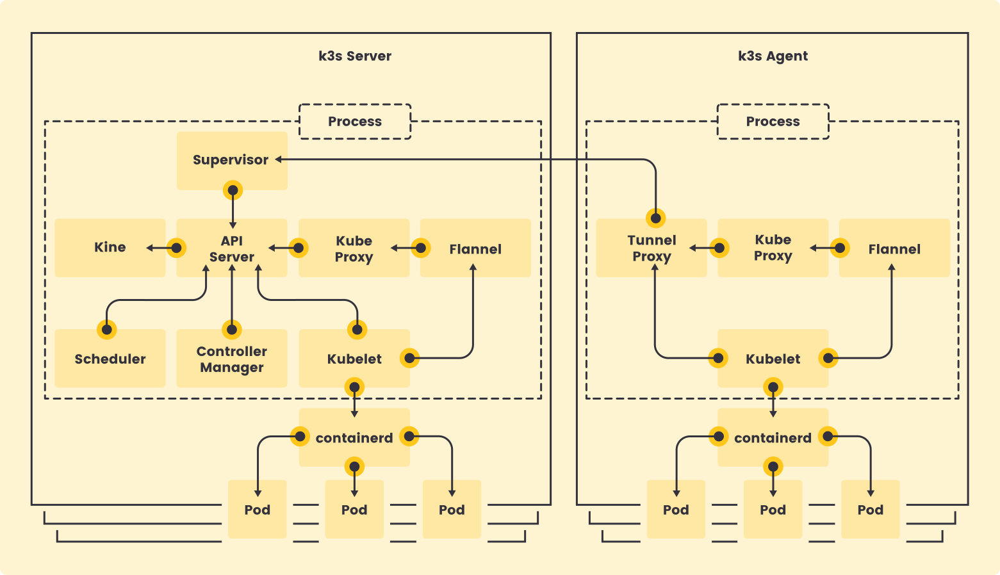

# {{ $frontmatter.title }}

<p align="center">
    
</p>

<p align="center">
    
</p>

## Overview

**K3s** is a lightweight, CNCF-certified Kubernetes distribution designed for edge computing, IoT, and resource-constrained environments. It packages all Kubernetes components into a single binary, significantly simplifying deployment and management.

### K3s Architecture Components

K3s operates with two distinct node roles:

- **k3s-server**: Runs the complete Kubernetes control plane (API server, scheduler, controller manager, etcd) plus worker components (kubelet, kube-proxy). Master nodes can simultaneously function as worker nodes.

- **k3s-agent**: Runs only worker components (kubelet and kube-proxy) for dedicated worker nodes.

## Target Cluster Architecture

This deployment creates a high-availability Kubernetes cluster spanning **9 nodes** (updated from the original 7-node configuration based on your actual cluster):

### Control Plane Nodes (3 nodes)

- **blueberry-master** (10.0.0.10) - Primary master node
- **strawberry-master** (10.0.0.11) - Secondary master node
- **blackberry-master** (10.0.0.12) - Tertiary master node

### Worker Nodes (6 nodes)

- **cranberry-worker** (10.0.0.13) - Raspberry Pi worker
- **orange-worker** (10.0.0.15) - Orange Pi worker
- **mandarine-worker** (10.0.0.16) - Orange Pi worker
- **lemon-worker** (10.0.0.17) - Orange Pi worker
- **clementine-worker** (10.0.0.18) - Orange Pi worker
- **grapefruit-worker** (10.0.0.19) - Orange Pi worker

The first three nodes form a high-availability control plane using embedded etcd, while the remaining nodes serve as dedicated workers.

## Prerequisites: Node Pre-configuration

These steps must be completed on **all nodes** before K3s installation.

### 1. Configure Bridge Networking

Enable iptables to process bridged traffic by loading the required kernel module:

```bash
echo "br_netfilter" | sudo tee /etc/modules-load.d/k8s.conf
```

Configure netfilter settings for IPv4 and IPv6 bridged traffic:

```bash
cat <<EOF | sudo tee /etc/sysctl.d/k8s.conf
net.bridge.bridge-nf-call-ip6tables = 1
net.bridge.bridge-nf-call-iptables = 1
EOF
```

Apply the new system control settings:

```bash
sudo sysctl --system
```

### 2. Disable Swap (x86 nodes only)

> [!WARNING]
> **Swap Memory Deactivation**
>
> This step is only required for x86 nodes and **not applicable to Raspberry Pi or Orange Pi nodes**.
>
> ```bash
> sudo swapoff -a
> ```
>
> To make this change persistent, edit `/etc/fstab` and comment out any swap-related entries.

### 3. Enable cgroup on Raspberry Pi Nodes

For Raspberry Pi nodes only, enable cgroup functionality by editing `/boot/firmware/cmdline.txt`:

```bash
# Add to the existing kernel parameters line:
cgroup_enable=cpuset cgroup_memory=1 cgroup_enable=memory
```

> [!NOTE]
> Orange Pi nodes do not require cgroup activation in the boot configuration.

### 4. Apply Changes

Reboot all nodes to ensure the configuration changes take effect:

```bash
sudo reboot
```

## High Availability K3s Cluster Setup

### Load Balancer Configuration with HAProxy

To ensure continuous availability of the Kubernetes API, we'll deploy HAProxy as a load balancer on the gateway node.

> [!IMPORTANT]
> **Single Point of Failure Warning**
>
> This HAProxy configuration represents a single point of failure. For true high availability, combine HAProxy with Keepalived or use an external load balancer solution.

#### Install and Configure HAProxy

Install HAProxy on the gateway node:

```bash
sudo apt install haproxy -y
```

Create the HAProxy configuration file at `/etc/haproxy/haproxy.cfg`:

```ini
#---------------------------------------------------------------------
# Global settings
#---------------------------------------------------------------------
global
    # Logging configuration
    log /dev/log local0
    log /dev/log local1 notice
    
    # Process configuration
    user haproxy
    group haproxy
    daemon
    
    # Security configuration
    chroot /var/lib/haproxy
    
    # Management interface
    stats socket /run/haproxy/admin.sock mode 660 level admin expose-fd listeners
    stats timeout 30s

#---------------------------------------------------------------------
# Default settings
#---------------------------------------------------------------------
defaults
    # Logging
    log global
    
    # Connection mode and options
    mode http
    option httplog
    option dontlognull
    
    # Retry and timeout configuration
    retries 3
    timeout http-request 10s
    timeout queue 20s
    timeout connect 10s
    timeout client 1h
    timeout server 1h
    timeout http-keep-alive 10s
    timeout check 10s
    
    # Error page configuration
    errorfile 400 /etc/haproxy/errors/400.http
    errorfile 403 /etc/haproxy/errors/403.http
    errorfile 408 /etc/haproxy/errors/408.http
    errorfile 500 /etc/haproxy/errors/500.http
    errorfile 502 /etc/haproxy/errors/502.http
    errorfile 503 /etc/haproxy/errors/503.http
    errorfile 504 /etc/haproxy/errors/504.http

#---------------------------------------------------------------------
# Kubernetes API Server Frontend
#---------------------------------------------------------------------
frontend k8s_apiserver
    # Listen configuration
    bind *:6443
    mode tcp
    option tcplog
    
    # Route to backend
    default_backend k8s_controlplane

#---------------------------------------------------------------------
# Kubernetes Control Plane Backend
#---------------------------------------------------------------------
backend k8s_controlplane
    # Health check configuration
    option httpchk GET /healthz
    http-check expect status 200
    
    # Connection configuration
    mode tcp
    option ssl-hello-chk
    balance roundrobin
    
    # Control plane nodes
    server blueberry-master 10.0.0.10:6443 check
    server strawberry-master 10.0.0.11:6443 check
    server blackberry-master 10.0.0.12:6443 check

#---------------------------------------------------------------------
# Statistics Interface
#---------------------------------------------------------------------
listen stats
    bind *:9000
    mode http
    stats enable
    stats hide-version
    stats uri /stats
    stats realm HAProxy\ Statistics
    stats auth admin:admin
    
    # Required timeouts for stats section
    timeout client 10m
    timeout connect 10m
    timeout server 10m
```

#### Start and Enable HAProxy

Validate the configuration:

```bash
sudo haproxy -c -f /etc/haproxy/haproxy.cfg
```

Start and enable HAProxy:

```bash
sudo systemctl restart haproxy
sudo systemctl enable haproxy
```

### Master Node Configuration

> [!IMPORTANT]
> Complete the [Node Pre-configuration](#prerequisites-node-pre-configuration) steps before proceeding.

#### 1. Prepare Master Configuration Directory

Create the K3s configuration directory on all master nodes:

```bash
sudo mkdir -p /etc/rancher/k3s
```

#### 2. Generate and Distribute Cluster Token

Create a shared cluster token for secure communication between nodes:

```bash
# Generate a secure random token
PIKUBE_TOKEN=$(openssl rand -base64 32)

# Store the token (replace 'secret1' with your generated token)
echo "secret1" | sudo tee /etc/rancher/k3s/cluster-token
sudo chmod 600 /etc/rancher/k3s/cluster-token
```

> [!NOTE]
> Use the same token on all cluster nodes (both masters and workers).

#### 3. Create Worker Kubelet Configuration

Create the kubelet configuration file at `/etc/rancher/k3s/kubelet.config`:

```yaml
apiVersion: kubelet.config.k8s.io/v1beta1
kind: KubeletConfiguration
shutdownGracePeriod: 30s
shutdownGracePeriodCriticalPods: 10s
```

#### 4. Create K3s Configuration

Create the main K3s configuration file at `/etc/rancher/k3s/config.yaml`:

```yaml
# Authentication
token-file: /etc/rancher/k3s/cluster-token

# Cluster identification
cluster-name: pikube-cluster

# Disable default components (replaced by custom implementations)
disable:
  - local-storage    # Using Longhorn for distributed storage
  - servicelb        # Using MetalLB for load balancing
  - traefik          # Using NGINX Ingress Controller
  - metrics-server   # Using custom monitoring stack (install later in Monitoring section)

# Monitoring configuration
etcd-expose-metrics: true

# Controller Manager configuration
kube-controller-manager-arg:
  - bind-address=0.0.0.0
  - terminated-pod-gc-threshold=10

# Kube-proxy configuration
kube-proxy-arg:
  - metrics-bind-address=0.0.0.0

# Scheduler configuration
kube-scheduler-arg:
  - bind-address=0.0.0.0

# Kubelet configuration
kubelet-arg:
  - config=/etc/rancher/k3s/kubelet.config

# Master node taint (prevents scheduling workloads on masters)
node-taint:
  - node-role.kubernetes.io/master=true:NoSchedule

# TLS Subject Alternative Names (includes load balancer)
tls-san:
  - 10.0.0.1
  - gateway.picluster.quantfinancehub.com

# Kubeconfig permissions and naming
write-kubeconfig-mode: 644
```

#### 5. Install Primary Master Node

On **blueberry-master**, initialize the cluster:

```bash
curl -sfL https://get.k3s.io | sh -s - server --cluster-init
```

#### 6. Install Secondary Master Nodes

On **strawberry-master** and **blackberry-master**, join the cluster:

```bash
curl -sfL https://get.k3s.io | sh -s - server --server https://gateway.picluster.quantfinancehub.com:6443
```

### Worker Node Configuration

#### 1. Prepare Worker Configuration Directory

Create the K3s configuration directory on all worker nodes:

```bash
sudo mkdir -p /etc/rancher/k3s
```

#### 2. Configure Cluster Token

Copy the cluster token used for master nodes:

```bash
echo "secret1" | sudo tee /etc/rancher/k3s/cluster-token
sudo chmod 600 /etc/rancher/k3s/cluster-token
```

#### 3. Create Kubelet Configuration

Create the kubelet configuration file at `/etc/rancher/k3s/kubelet.config`:

```yaml
apiVersion: kubelet.config.k8s.io/v1beta1
kind: KubeletConfiguration
shutdownGracePeriod: 30s
shutdownGracePeriodCriticalPods: 10s
```

#### 4. Create Worker Configuration

Create the K3s configuration file at `/etc/rancher/k3s/config.yaml`:

```yaml
# Authentication
token-file: /etc/rancher/k3s/cluster-token

# Node labeling
node-label:
  - 'node_type=worker'

# Kubelet configuration
kubelet-arg:
  - 'config=/etc/rancher/k3s/kubelet.config'

# Kube-proxy configuration
kube-proxy-arg:
  - 'metrics-bind-address=0.0.0.0'
```

#### 5. Install Worker Nodes

On each worker node, install the K3s agent:

```bash
curl -sfL https://get.k3s.io | sh -s - agent --server https://gateway.picluster.quantfinancehub.com:6443
```

#### 6. Label Worker Nodes

From the gateway node, apply worker labels:

```bash
kubectl label nodes <worker-node-name> node-role.kubernetes.io/worker=worker
```

## Cluster Management

### Client Tools Installation

#### Install kubectl

Download and install kubectl on the gateway node:

```bash
# Download kubectl for ARM64
curl -LO "https://dl.k8s.io/release/$(curl -L -s https://dl.k8s.io/release/stable.txt)/bin/linux/arm64/kubectl"

# Make executable and install
chmod +x kubectl
sudo mv kubectl /usr/local/bin/
```

#### Install Helm

Install Helm package manager:

```bash
# Download Helm installation script
curl -fsSL -o get_helm.sh https://raw.githubusercontent.com/helm/helm/main/scripts/get-helm-3

# Make executable and run
chmod 700 get_helm.sh
./get_helm.sh

# Clean up
rm get_helm.sh
```

#### Install K9s

Install K9s terminal UI for Kubernetes:

```bash
# Download, extract, and install K9s
curl -s https://api.github.com/repos/derailed/k9s/releases/latest \
  | grep "browser_download_url.*Linux_arm64.tar.gz" \
  | cut -d : -f 2,3 \
  | tr -d \" \
  | wget -qi -

tar -zxvf k9s_Linux_arm64.tar.gz k9s \
  && sudo mv k9s /usr/local/bin/ \
  && rm k9s_Linux_arm64.tar.gz
```

### Kubeconfig Setup

Configure remote access to the cluster from the gateway:

#### 1. Copy Configuration from Master

On **blueberry-master**:

```bash
sudo cp /etc/rancher/k3s/k3s.yaml ~/k3s.yaml
sudo chown pi:users ~/k3s.yaml
```

#### 2. Transfer to Gateway and Configure

On **gateway**:

```bash
# Create .kube directory
mkdir -p ~/.kube

# Copy configuration from master
scp -i ~/.ssh/gateway-pi pi@blueberry-master:~/k3s.yaml ~/.kube/config

# Set proper permissions
sudo chown $USER:$USER ~/.kube/config
chmod 644 ~/.kube/config

# Update server address and cluster context (prefer gateway FQDN)
sed -i 's|server: https://127.0.0.1:6443|server: https://gateway.picluster.quantfinancehub.com:6443|g' ~/.kube/config
sed -i 's|name: default|name: pikube-cluster|g' ~/.kube/config
sed -i 's|cluster: default|cluster: pikube-cluster|g' ~/.kube/config
sed -i 's|current-context: default|current-context: pikube-admin@pikube-cluster|g' ~/.kube/config

# Add KUBECONFIG to bashrc for persistent access
echo 'export KUBECONFIG=~/.kube/config' >> ~/.bashrc
source ~/.bashrc

> [!TIP]
> If your gateway FQDN is not resolvable yet, temporarily use the gateway IP:
> `https://10.0.0.1:6443` in the `server:` field, then switch to the FQDN once DNS is in place.
```

## Cluster Upgrades

### Semi-Automated Upgrades with System Upgrade Controller

K3s supports semi-automated upgrades using Rancher's System Upgrade Controller.

> [!WARNING]
> **Not Fully Automatic**
>
> The System Upgrade Controller is **NOT** fully automatic. It does not automatically detect and install the latest K3s versions. Instead, it:
>
> - **Automates the upgrade process** (rolling updates, cordoning nodes, etc.)
> - **Requires manual intervention** to specify which version to upgrade to
> - **Only triggers upgrades** when you explicitly change the version in the upgrade plans
>
> For true automation, you would need external tools (CI/CD pipelines, GitOps, or custom scripts) to monitor for new releases and update the plans accordingly.

#### 1. Install System Upgrade Controller

```bash
kubectl create namespace system-upgrade --dry-run=client -o yaml | kubectl apply -f -
kubectl apply -f https://github.com/rancher/system-upgrade-controller/releases/latest/download/system-upgrade-controller.yaml
kubectl -n system-upgrade rollout status deploy/system-upgrade-controller --timeout=3m
```

#### 2. Create Upgrade Plans

Get the latest K3s version:

```bash
latest_version=$(curl -s https://api.github.com/repos/k3s-io/k3s/releases/latest | jq -r '.tag_name')
echo "Latest version: $latest_version"
```

Create server upgrade plan (`k3s-server-upgrade.yaml`):

```yaml
apiVersion: upgrade.cattle.io/v1
kind: Plan
metadata:
  name: k3s-server
  namespace: system-upgrade
  labels:
    k3s-upgrade: server
spec:
  nodeSelector:
    matchExpressions:
      - key: node-role.kubernetes.io/control-plane
        operator: Exists
  serviceAccountName: system-upgrade
  concurrency: 1
  cordon: true
  drain:
    force: true
    deleteEmptyDirData: true
    ignoreDaemonSets: true
  tolerations:
    - key: node-role.kubernetes.io/master
      operator: Exists
      effect: NoSchedule
    - key: node-role.kubernetes.io/control-plane
      operator: Exists
      effect: NoSchedule
    - key: CriticalAddonsOnly
      operator: Exists
  upgrade:
    image: rancher/k3s-upgrade
  version: v1.34.1+k3s1  # Set explicitly (see Dynamic Version Options below)
```

Create agent upgrade plan (`k3s-agent-upgrade.yaml`):

```yaml
apiVersion: upgrade.cattle.io/v1
kind: Plan
metadata:
  name: k3s-agent
  namespace: system-upgrade
  labels:
    k3s-upgrade: agent
spec:
  nodeSelector:
    matchExpressions:
      - key: node-role.kubernetes.io/control-plane
        operator: DoesNotExist
  serviceAccountName: system-upgrade
  prepare:
    image: rancher/k3s-upgrade
    args:
      - prepare
      - k3s-server
  concurrency: 1
  cordon: true
  drain:
    force: true
    deleteEmptyDirData: true
    ignoreDaemonSets: true
  upgrade:
    image: rancher/k3s-upgrade
  version: v1.34.1+k3s1  # Set explicitly (see Dynamic Version Options below)
```

#### 3. Apply Initial Upgrade Plans

```bash
kubectl apply -f k3s-server-upgrade.yaml -f k3s-agent-upgrade.yaml
```

> [!NOTE]
> **No Upgrade Will Happen Yet**
>
> Applying these plans with `version: v1.33.1+k3s1` (your current version) will NOT trigger an upgrade. The plans are now installed and waiting for a version change to trigger the upgrade process.

#### 4. Trigger an Upgrade (When Needed)

To actually perform an upgrade, you need to **update the version** in both plans:

```bash
# Get the latest available K3s version
latest_version=$(curl -s https://api.github.com/repos/k3s-io/k3s/releases/latest | jq -r '.tag_name')
echo "Available version: $latest_version"
echo "Current version: v1.34.1+k3s1"

# Only proceed if you want to upgrade to this version
# Update the server plan to the new version
kubectl patch plan k3s-server -n system-upgrade --type='merge' -p="{\"spec\":{\"version\":\"$latest_version\"}}"

# Wait for server upgrades to complete (monitor with kubectl get nodes)
# Then update the agent plan
kubectl patch plan k3s-agent -n system-upgrade --type='merge' -p="{\"spec\":{\"version\":\"$latest_version\"}}"
```

#### 5. Monitor the Upgrade Process

```bash
# Watch the upgrade progress
kubectl get plans -n system-upgrade -w
kubectl get jobs -n system-upgrade
kubectl get pods -n system-upgrade

# Monitor node versions during upgrade
watch kubectl get nodes -o wide
```

> [!TIP]
> If a plan appears stuck, inspect it and its Jobs:
> `kubectl -n system-upgrade describe plan k3s-server` and
> `kubectl -n system-upgrade describe jobs`.

### Dynamic Version Options

This cluster uses the **v1.34 channel** for automatic patch upgrades within the 1.34.x series.

> [!NOTE]
> **Alternative Version Strategies**
>
> - **Stable channel**: Use `channel: https://update.k3s.io/v1-release/channels/stable` to track the latest stable release across all versions. Note: This may be behind your current version if you installed a newer release.
> - **Manual version**: Use explicit `version: v1.34.1+k3s1` instead of channel for full control. Requires manual patching to trigger upgrades.

  ```yaml
  spec:
    channel: https://update.k3s.io/v1-release/channels/v1.34  # automatic patch releases
    upgrade:
      image: rancher/k3s-upgrade
  ```

  Ready to copy/paste (using v1.34 channel):

  - Server plan (tracks v1.34.x patch releases)
    ```yaml
    apiVersion: upgrade.cattle.io/v1
    kind: Plan
    metadata:
      name: k3s-server
      namespace: system-upgrade
    spec:
      concurrency: 1
      cordon: true
      drain:
        force: true
        deleteEmptyDirData: true
        ignoreDaemonSets: true
      nodeSelector:
        matchExpressions:
          - key: node-role.kubernetes.io/control-plane
            operator: In
            values: ["true"]
      tolerations:
        - key: node-role.kubernetes.io/master
          operator: Exists
          effect: NoSchedule
        - key: node-role.kubernetes.io/control-plane
          operator: Exists
          effect: NoSchedule
        - key: CriticalAddonsOnly
          operator: Exists
      serviceAccountName: system-upgrade
      upgrade:
        image: rancher/k3s-upgrade
      channel: https://update.k3s.io/v1-release/channels/v1.34
    ```

  - Agent plan (waits for server plan, tracks v1.34.x patch releases)
    ```yaml
    apiVersion: upgrade.cattle.io/v1
    kind: Plan
    metadata:
      name: k3s-agent
      namespace: system-upgrade
    spec:
      concurrency: 2
      cordon: true
      drain:
        force: true
        deleteEmptyDirData: true
        ignoreDaemonSets: true
      nodeSelector:
        matchExpressions:
          - key: node-role.kubernetes.io/control-plane
            operator: DoesNotExist
      prepare:
        image: rancher/k3s-upgrade
        args: ["prepare", "k3s-server"]
      serviceAccountName: system-upgrade
      upgrade:
        image: rancher/k3s-upgrade
      channel: https://update.k3s.io/v1-release/channels/v1.34
    ```

- Option B – Template at apply time (pin but automate)

  Keep `version: ${K3S_TARGET_VERSION}` in YAML and inject it at apply:

  ```bash
  export K3S_TARGET_VERSION=$(curl -s https://api.github.com/repos/k3s-io/k3s/releases/latest | jq -r '.tag_name')
  envsubst < k3s-server-upgrade.yaml | kubectl apply -f -
  envsubst < k3s-agent-upgrade.yaml  | kubectl apply -f -
  ```

- Option C – GitOps bot (pin via PR)

  Use Renovate or a scheduled GitHub Action to bump `spec.version` and open a PR. Merging triggers SUC.

### Manual Node Updates

#### Update Master Nodes

- Get the node token from the primary master:

```bash
node_token=$(sudo cat /var/lib/rancher/k3s/server/node-token)
```

- Stop K3s service:

```bash
sudo systemctl stop k3s
```

- Install jq (if not already installed):

```bash
sudo apt install jq -y
```

- Get latest version and upgrade:

```bash
latest_version=$(curl -s https://api.github.com/repos/k3s-io/k3s/releases/latest | jq -r '.tag_name')
curl -sfL https://get.k3s.io | INSTALL_K3S_VERSION=$latest_version sh -s - server --server https://gateway.picluster.quantfinancehub.com:6443 --token $node_token
```

#### Update Worker Nodes

- Get node token from master and export on worker:

```bash
export node_token="<token_from_master>"
```

- Stop K3s agent:

```bash
sudo systemctl stop k3s-agent
```

- Install jq and upgrade:

```bash
sudo apt install jq -y
latest_version=$(curl -s https://api.github.com/repos/k3s-io/k3s/releases/latest | jq -r '.tag_name')
curl -sfL https://get.k3s.io | K3S_URL=https://gateway.picluster.quantfinancehub.com:6443 K3S_TOKEN="$node_token" INSTALL_K3S_VERSION="$latest_version" sh -
```

## Cluster Reset

To completely reset the K3s cluster:

### Reset Worker Nodes

On each worker node:

```bash
/usr/local/bin/k3s-agent-uninstall.sh
sudo rm -rf /etc/rancher /var/lib/rancher /var/lib/kubelet /etc/cni /var/lib/etcd /run/k3s /run/flannel /usr/local/bin/k3s /usr/local/bin/kubectl /var/lib/containerd/
```

#### Reset Master Nodes

On each master node:

```bash
/usr/local/bin/k3s-uninstall.sh
sudo rm -rf /etc/rancher /var/lib/rancher /var/lib/kubelet /etc/cni /var/lib/etcd /run/k3s /run/flannel /usr/local/bin/k3s /usr/local/bin/kubectl /var/lib/containerd/
```

> [!WARNING]
> This operation is irreversible and will destroy all cluster data. Ensure you have backups of any important data before proceeding.

## Ansible Integration

To enable Ansible-driven deployment on the cluster, install the Kubernetes Python package on the primary master node:

```bash
# Update PATH for local Python packages
echo 'export PATH=$PATH:/home/pi/.local/bin' >> ~/.bashrc
source ~/.bashrc

# Install required packages
sudo apt install python3-pip -y
pip3 install kubernetes
```

This enables the [Ansible kubernetes.core collection](https://github.com/ansible-collections/kubernetes.core) to interact with your K3s cluster.

## Verification

After installation, verify your cluster status:

```bash
# Check cluster info
kubectl cluster-info

# Verify all nodes are ready
kubectl get nodes -o wide

# Check system pods
kubectl get pods -n kube-system

# View cluster resources
kubectl get all --all-namespaces
```

> [!NOTE]
> `kubectl top` requires a metrics pipeline. In this cluster, `metrics-server` is disabled in K3s and metrics are provided by the
> monitoring stack installed later. If `kubectl top` fails now, continue to the Monitoring section first.

## Optional Tweaks & Safety

- Pre‑upgrade snapshot (embedded etcd):
  ```bash
  # Run on a control-plane node before upgrading
  sudo k3s etcd-snapshot save --name pre-upgrade-$(date +%Y%m%d-%H%M)
  ```
- Longhorn: ensure healthy volumes/replicas before draining nodes.
- Concurrency: you can increase `spec.concurrency` in the agent Plan to speed rollouts on larger clusters.
- Rollback: patch both Plans’ `spec.version` back to the previous K3s release to roll back.
