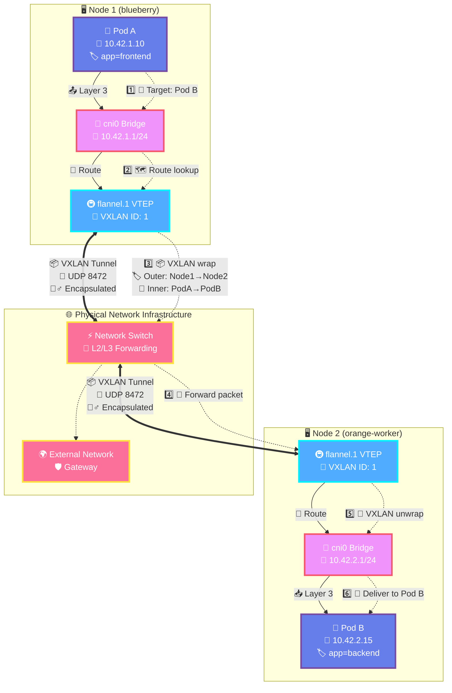

# {{ $frontmatter.title }}

## Overview

K3s comes with a complete networking stack pre-configured and ready to use. This integrated approach simplifies cluster deployment while maintaining the flexibility to customize networking components as needed.

## Default Networking Stack

K3s includes four core networking components that provide complete cluster connectivity:

### Container Networking Interface (CNI)

- **[Flannel](https://github.com/flannel-io/flannel)**: Default CNI plugin enabling pod-to-pod communication across nodes using VXLAN overlay networking

### DNS Services

- **[CoreDNS](https://coredns.io/)**: Cluster DNS server providing service discovery and name resolution for pods and services

### Ingress Controller

- **[Traefik](https://traefik.io/)**: HTTP reverse proxy and load balancer managing external access to cluster services

### Load Balancing

- **[Klipper Load Balancer](https://github.com/k3s-io/klipper-lb)**: Internal load balancer distributing traffic to services of type LoadBalancer

> [!TIP]
> **Additional Resources**
>
> For deeper understanding of Kubernetes networking concepts, see [Kubernetes Networking Fundamentals](../13-further-reading/kubernetes-networking-fundamentals.md)

## Flannel CNI Configuration

Flannel serves as the default Container Network Interface (CNI) plugin in K3s, implementing **Virtual Extensible Local Area Network (VXLAN)** overlay networking. Flannel runs as an integrated component within the K3s server process, eliminating the need for separate daemon management.

### Network Configuration Options

K3s provides several server installation options to customize the cluster networking:

| Configuration Option | Default Value | Description |
|---------------------|---------------|-------------|
| `--cluster-cidr` | `10.42.0.0/16` | IP address range for pod allocation |
| `--service-cidr` | `10.43.0.0/16` | IP address range for service allocation |
| `--flannel-backend` | `vxlan` | Networking backend (`none`, `vxlan`, `ipsec`, `host-gw`, `wireguard`) |

### IP Address Allocation

The cluster operates with a hierarchical IP allocation system:

- **Cluster-wide**: The entire `10.42.0.0/16` range is available for pods
- **Per-node**: Each node receives a `/24` subnet (e.g., `10.42.1.0/24`, `10.42.2.0/24`)
- **Per-pod**: Individual pods receive IP addresses from their node's subnet

### Network Interfaces

Flannel creates two primary network interfaces on each node:

#### VXLAN Tunnel Endpoint (flannel.1)

The `flannel.1` interface acts as a VXLAN Tunnel Endpoint (VTEP), enabling overlay networking between nodes:

```bash
# View flannel.1 interface configuration
ip -d addr show flannel.1
```

#### Container Bridge (cni0)

The `cni0` bridge interface provides local connectivity and serves as the gateway for pods on each node:

```bash
# View cni0 bridge interface configuration  
ip -d addr show cni0
```

### Traffic Flow

Inter-node pod communication follows this path:

1. **Pod-to-bridge**: Traffic flows from pod to local `cni0` bridge
2. **Bridge-to-VTEP**: Linux routing directs traffic to `flannel.1` VXLAN interface
3. **VTEP-to-VTEP**: VXLAN encapsulation enables communication between nodes
4. **VTEP-to-bridge**: Destination node routes traffic to local `cni0` bridge
5. **Bridge-to-pod**: Final delivery to destination pod

### Network Architecture Diagram

The following diagram illustrates how Flannel VXLAN networking enables pod-to-pod communication across nodes:



**🔄 Traffic Flow Steps:**

1. **🎯 Pod-to-Bridge**: Pod A (frontend) sends HTTP request to Pod B (backend) via local cni0 bridge
2. **🗺️ Bridge-to-VTEP**: Linux routing table directs cross-node traffic to flannel.1 VXLAN interface  
3. **📦 VXLAN Encapsulation**: VTEP wraps original packet with VXLAN + UDP + IP headers
4. **🚚 Network Transport**: Encapsulated packet travels through physical network infrastructure
5. **📂 Decapsulation**: Destination VTEP removes VXLAN wrapper and extracts original packet
6. **🎯 Final Delivery**: Target bridge delivers packet to Pod B on the correct network interface

**🔧 Technical Details:**

- **VXLAN ID**: All nodes use VXLAN ID `1` for the overlay network
- **UDP Port**: VXLAN traffic uses UDP port `8472` by default
- **MTU**: Typically 1450 bytes to account for VXLAN overhead (50 bytes)
- **Subnet Allocation**: Each node gets a unique `/24` subnet from the cluster CIDR

## CoreDNS Configuration

CoreDNS provides DNS services for the Kubernetes cluster, enabling service discovery and name resolution. K3s deploys CoreDNS automatically and offers configuration options during cluster initialization.

### DNS Configuration Options

| Configuration Option | Default Value | Description |
|---------------------|---------------|-------------|
| `--cluster-dns` | `10.43.0.10` | IP address of the CoreDNS service (must be within service CIDR) |
| `--cluster-domain` | `cluster.local` | Domain suffix for cluster services |

### Service Discovery

CoreDNS enables pods to resolve services using standard DNS queries:

```bash
# Examples of DNS resolution within the cluster
nslookup kubernetes.default.svc.cluster.local
nslookup my-service.my-namespace.svc.cluster.local
```

### DNS Records

CoreDNS automatically creates DNS records for:

- **Services**: `<service-name>.<namespace>.svc.cluster.local`
- **Pods**: `<pod-ip>.<namespace>.pod.cluster.local` (when hostname/subdomain specified)
- **Headless Services**: Individual pod IPs for StatefulSets and headless services

## Traefik Ingress Controller

[Traefik](https://traefik.io/) serves as the default ingress controller in K3s, providing HTTP reverse proxy and load balancing capabilities for external access to cluster services. Traefik is automatically deployed during cluster initialization.

### Traefik Default Behavior

- **Automatic deployment**: Traefik is installed and configured automatically
- **Dynamic configuration**: Automatically discovers services and routes through Kubernetes Ingress resources
- **Load balancing**: Distributes incoming requests across service endpoints

### Custom Configuration

For advanced use cases requiring specific Traefik versions or custom configurations:

```bash
# Disable default Traefik during K3s installation
curl -sfL https://get.k3s.io | sh -s - server --disable traefik
```

> [!TIP]
> **Advanced Configuration**
>
> For detailed Traefik configuration options and manual installation, see [Traefik Ingress Controller Documentation](../5-networking/3-ingress-controller-traefik.md)

## Klipper Load Balancer

K3s includes [Klipper Load Balancer](https://github.com/k3s-io/klipper-lb) as the default solution for services of type `LoadBalancer`. Klipper-LB provides basic load balancing functionality suitable for development and small production environments.

### Klipper-LB Default Behavior

- **Automatic deployment**: Installed by default with K3s
- **Service integration**: Automatically provisions external IPs for LoadBalancer services
- **Simple configuration**: Requires minimal setup and maintenance

### Alternative Solutions

For production environments requiring advanced load balancing features, consider these alternatives:

#### MetalLB

```bash
# Disable default load balancer during installation
curl -sfL https://get.k3s.io | sh -s - server --disable servicelb
```

> [!TIP]
> **MetalLB Installation**
>
> For MetalLB deployment and configuration, see [MetalLB Documentation](../5-networking/2-load-balancer-metal-lb.md)

#### Cilium Load Balancing

Cilium provides advanced networking capabilities including load balancing:

> [!TIP]
> **Cilium Configuration**
>
> For Cilium CNI and load balancing setup, see [Cilium Documentation](../5-networking/5-cilium-kubernetes-cni.md)

## Summary

K3s provides a complete networking solution out of the box:

- **Flannel CNI**: Handles pod-to-pod communication via VXLAN overlay
- **CoreDNS**: Provides cluster DNS and service discovery
- **Traefik**: Manages ingress traffic and external access
- **Klipper-LB**: Offers basic load balancing for development use
