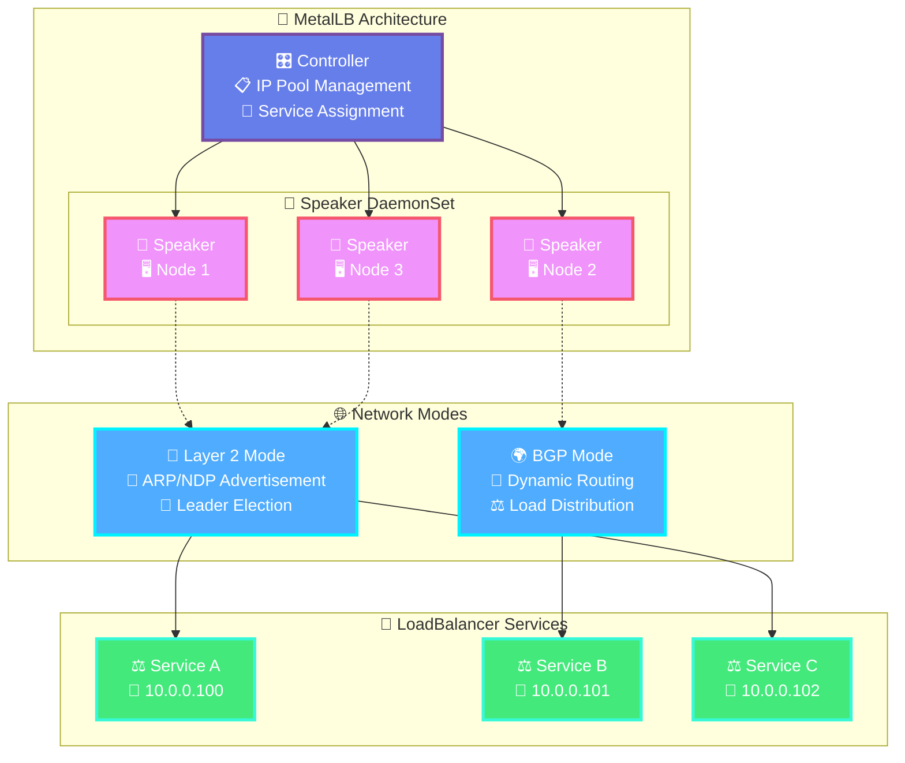

# {{ $frontmatter.title }}

<p align="center">
    
</p>

> [!IMPORTANT]
> **Load Balancer Technology Choice: MetalLB vs Cilium**
>
> You need to choose between MetalLB and Cilium for load balancing in your cluster. Here's a comparison:
>
> **🔧 MetalLB**
>
> **Pros:**
>
> - ✅ **Dedicated purpose** - focused solely on load balancing
> - ✅ **Simple setup** - easy to understand and configure
> - ✅ **CNI agnostic** - works with any CNI (Flannel, Calico, etc.)
> - ✅ **Mature technology** - battle-tested in production environments
> - ✅ **Lightweight** - minimal resource overhead
> - ✅ **Flexible IP management** - multiple pools and assignment strategies
>
> **Cons:**
>
> - ❌ **Limited scope** - only provides load balancing functionality
> - ❌ **Layer 2 limitations** - single point of failure in L2 mode
> - ❌ **Additional complexity** - separate component to manage
>
> **🌐 Cilium LB-IPAM**
>
> **Pros:**
>
> - ✅ **Integrated solution** - CNI and load balancing in one
> - ✅ **Advanced networking** - eBPF-based high performance
> - ✅ **Rich feature set** - network policies, observability, service mesh
> - ✅ **True load balancing** - no single point of failure
> - ✅ **Cloud-native** - designed for modern Kubernetes
> - ✅ **Future-proof** - actively developed with cutting-edge features
>
> **Cons:**
>
> - ❌ **Higher complexity** - requires Cilium as CNI replacement
> - ❌ **Resource overhead** - more memory and CPU usage
> - ❌ **Learning curve** - more complex configuration and troubleshooting
> - ❌ **Newer technology** - less mature than MetalLB
>
> **💡 Recommendation:** Choose MetalLB for simple, dedicated load balancing. Choose Cilium for comprehensive networking with integrated load balancing.

MetalLB is a powerful load balancer implementation designed for bare-metal Kubernetes clusters. It provides the missing LoadBalancer implementation that cloud providers typically offer, making it an excellent replacement for K3s's default Klipper Load Balancer.

## Disabling the Klipper Load Balancer

To use MetalLB, first disable K3s's embedded Klipper Load Balancer during cluster installation using the `--disable servicelb` option, as configured in the [K3s Installation Guide](../4-kubernetes/1-k3s-installation.md#master-node-configuration).

```bash
# During K3s installation
curl -sfL https://get.k3s.io | sh -s - server --disable servicelb
```

## Why Choose MetalLB?

In bare-metal Kubernetes environments, LoadBalancer services remain in "pending" state indefinitely without a proper load balancer implementation. Standard alternatives like NodePort and externalIPs have significant limitations for production deployments.

### MetalLB Advantages

🚀 **Production Ready**: Enterprise-grade load balancing for bare-metal clusters  
🌐 **Protocol Support**: Layer 2 and BGP networking modes  
🔧 **Flexibility**: Advanced configuration options and IP pool management  
📈 **Scalability**: Handles complex routing and multiple IP ranges  
🛡️ **Reliability**: High availability with leader election mechanisms

## MetalLB Architecture

MetalLB consists of two primary components working together:

### 🎛️ Controller

- **Purpose**: Manages IP address allocation from configured pools
- **Function**: Assigns unique external IPs to LoadBalancer services
- **Deployment**: Single replica with leader election for high availability

### 📢 Speaker

- **Purpose**: Announces allocated service IPs to the network
- **Function**: Handles Layer 2 ARP/NDP or BGP route advertisement
- **Deployment**: DaemonSet running on each worker node

### Architecture Diagram



## How MetalLB Operates

MetalLB supports two operational modes for different network environments:

### 🔗 Layer 2 Mode
- **Universal Compatibility**: Works with any Ethernet network infrastructure
- **Leader Node Role**: One node acts as the leader for each service IP, responding to ARP/NDP requests
- **Simplicity**: Ideal for simple networks without complex routing requirements
- **Limitations**: Single point of failure, all traffic flows through the leader node

### 🌍 BGP Mode
- **Router Requirements**: Requires BGP-capable network equipment
- **Advanced Integration**: Dynamic routing with sophisticated traffic distribution
- **Scalability**: True load balancing across multiple nodes
- **Production Ready**: Suitable for enterprise environments with complex networking

## Install MetalLB using Helm

### Add MetalLB Helm Repository

```bash
helm repo add metallb https://metallb.github.io/metallb
```

### Update Helm Repositories

```bash
helm repo update
```

### Create Dedicated Namespace

```bash
kubectl create namespace metal-lb
```

### Install MetalLB

```bash
helm install metallb metallb/metallb --namespace metal-lb
```

### Verify the Deployment

```bash
kubectl -n metal-lb get pods
```

Expected output:
```
NAME                          READY   STATUS    RESTARTS   AGE
metallb-controller-xxx        1/1     Running   0          2m
metallb-speaker-xxx           1/1     Running   0          2m
```

## Configure IP Address Pool and Advertisement

Create the MetalLB configuration file:

```yaml
# metal-lb-config.yaml
---
# MetalLB Address Pool Configuration
# This defines a range of IP addresses that MetalLB controls and can assign
apiVersion: metallb.io/v1beta1
kind: IPAddressPool
metadata:
  name: picluster-pool
  namespace: metal-lb
spec:
  addresses:
  - 10.0.0.100-10.0.0.200

---
# Layer 2 Advertisement Configuration
# This configures MetalLB to use Layer 2 mode to advertise IP addresses
apiVersion: metallb.io/v1beta1
kind: L2Advertisement
metadata:
  name: main-l2-advertisement
  namespace: metal-lb
spec:
  ipAddressPools:
  - picluster-pool
```

### Apply the Configuration

```bash
kubectl apply -f metal-lb-config.yaml
```

After applying the configuration, MetalLB will assign external IP addresses from the defined pool to LoadBalancer services.

## Verify LoadBalancer Services

Check that LoadBalancer services receive external IPs:

```bash
kubectl get services --all-namespaces
```

You should see services like NGINX Ingress Controller and other LoadBalancer services with external IPs assigned from the 10.0.0.100-10.0.0.200 range.

> [!TIP]
> **Advanced Configuration**
>
> For production environments, consider these advanced MetalLB configurations:
>
> **Multiple IP Pools**
>
> ```yaml
> ---
> apiVersion: metallb.io/v1beta1
> kind: IPAddressPool
> metadata:
>   name: production-pool
>   namespace: metal-lb
> spec:
>   addresses:
>   - 10.0.0.100-10.0.0.150
> 
> ---
> apiVersion: metallb.io/v1beta1
> kind: IPAddressPool
> metadata:
>   name: development-pool
>   namespace: metal-lb
> spec:
>   addresses:
>   - 10.0.0.151-10.0.0.200
> ```
>
> **BGP Configuration**
>
> ```yaml
> ---
> apiVersion: metallb.io/v1beta2
> kind: BGPPeer
> metadata:
>   name: router-peer
>   namespace: metal-lb
> spec:
>   myASN: 64512
>   peerASN: 64512
>   peerAddress: 10.0.0.1
> 
> ---
> apiVersion: metallb.io/v1beta1
> kind: BGPAdvertisement
> metadata:
>   name: bgp-advertisement
>   namespace: metal-lb
> spec:
>   ipAddressPools:
>   - production-pool
> ```

## 📊 Monitoring Integration

```yaml
# ServiceMonitor for Prometheus
apiVersion: monitoring.coreos.com/v1
kind: ServiceMonitor
metadata:
  name: metallb-monitor
  namespace: metal-lb
spec:
  selector:
    matchLabels:
      app.kubernetes.io/name: metallb
  endpoints:
  - port: monitoring
```

## Troubleshooting

### Common Issues

| Issue | Symptoms | Solution |
|-------|----------|----------|
| **No External IP** | Service shows `<pending>` | Verify IPAddressPool configuration |
| **IP Conflicts** | Connectivity issues | Check IP range doesn't overlap with DHCP |
| **ARP Problems** | Intermittent access | Review L2Advertisement settings |

### Debug Commands

```bash
# Check MetalLB controller logs
kubectl logs -n metal-lb deployment/metallb-controller

# Check speaker logs
kubectl logs -n metal-lb daemonset/metallb-speaker

# View MetalLB resources
kubectl get ipaddresspools -n metal-lb
kubectl get l2advertisements -n metal-lb
```
