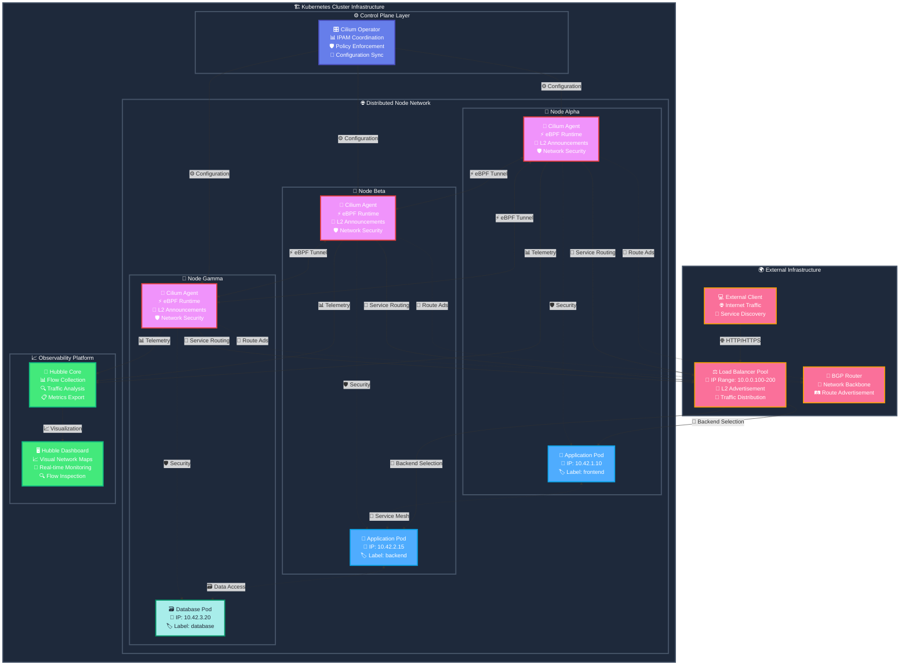

# {{ $frontmatter.title }}

<p align="center">
    
</p>

> [!IMPORTANT]
> **Load Balancer Technology Choice: MetalLB vs Cilium**
>
> You need to choose between MetalLB and Cilium for load balancing in your cluster. Here's a comparison:
>
> **🔧 MetalLB**
>
> **Pros:**
>
> - ✅ **Dedicated purpose** - focused solely on load balancing
> - ✅ **Simple setup** - easy to understand and configure
> - ✅ **CNI agnostic** - works with any CNI (Flannel, Calico, etc.)
> - ✅ **Mature technology** - battle-tested in production environments
> - ✅ **Lightweight** - minimal resource overhead
> - ✅ **Flexible IP management** - multiple pools and assignment strategies
>
> **Cons:**
>
> - ❌ **Limited scope** - only provides load balancing functionality
> - ❌ **Layer 2 limitations** - single point of failure in L2 mode
> - ❌ **Additional complexity** - separate component to manage
>
> **🌐 Cilium LB-IPAM**
>
> **Pros:**
>
> - ✅ **Integrated solution** - CNI and load balancing in one
> - ✅ **Advanced networking** - eBPF-based high performance
> - ✅ **Rich feature set** - network policies, observability, service mesh
> - ✅ **True load balancing** - no single point of failure
> - ✅ **Cloud-native** - designed for modern Kubernetes
> - ✅ **Future-proof** - actively developed with cutting-edge features
>
> **Cons:**
>
> - ❌ **Higher complexity** - requires Cilium as CNI replacement
> - ❌ **Resource overhead** - more memory and CPU usage
> - ❌ **Learning curve** - more complex configuration and troubleshooting
> - ❌ **Newer technology** - less mature than MetalLB
>
> **💡 Recommendation:** Choose MetalLB for simple, dedicated load balancing. Choose Cilium for comprehensive networking with integrated load balancing.

## Overview

[Cilium](https://cilium.io/) is a modern, cloud-native networking solution that leverages [eBPF](https://ebpf.io/) kernel technology to provide high-performance networking, security, and observability for Kubernetes clusters. It represents the next generation of container networking infrastructure.

### 🚀 Cilium Capabilities

Cilium serves multiple roles in a Kubernetes cluster:

#### 🌐 High-Performance CNI

- **eBPF-powered networking** - kernel-level packet processing without iptables overhead
- **Direct container-to-container communication** - bypasses traditional network stack layers
- **Advanced traffic management** - sophisticated routing and load balancing

> [!TIP]
> **Performance Benefits**
>
> For detailed performance comparisons, see [Cilium Load Balancer Use Case](https://cilium.io/use-cases/load-balancer/)

#### ⚖️ Kube-proxy Replacement

- **Eliminates iptables dependency** - replaces traditional kube-proxy routing
- **Improved performance** - eBPF-based service load balancing
- **Reduced resource overhead** - more efficient packet processing

> [!TIP]
> **Kube-proxy Replacement**
>
> Learn more about kube-proxy replacement benefits in [Cilium Kube-proxy Replacement](https://cilium.io/use-cases/kube-proxy/)

#### 🔀 Layer 4 Load Balancer

- **Software-defined load balancing** - advanced traffic distribution capabilities
- **BGP and L2 advertisement support** - flexible network integration options
- **LB-IPAM functionality** - automatic IP address management for LoadBalancer services
- **External traffic routing** - seamless north-bound traffic handling

### 🏗️ PiKube Integration

In the PiKube cluster, Cilium replaces multiple networking components:

| Component | Default K3s | Cilium Replacement |
|-----------|-------------|-------------------|
| **CNI** | 🌉 Flannel (VXLAN overlay) | 🚀 Cilium (eBPF-based) |
| **Kube-proxy** | 🔀 iptables-based routing | ⚡ eBPF service load balancing |
| **Load Balancer** | 🎛️ MetalLB (separate component) | 🌐 Integrated LB-IPAM + L2 announcements |

## Prerequisites: K3s Installation

### Required K3s Configuration

To use Cilium, K3s must be installed with specific options to disable conflicting components:

```yaml
# K3s configuration (/etc/rancher/k3s/config.yaml)
disable:
  - servicelb        # Disable Klipper Load Balancer
  - traefik          # Disable default ingress (optional)

# Flannel and networking options
flannel-backend: none        # Disable Flannel CNI
disable-network-policy: true  # Avoid CNI conflicts
disable-kube-proxy: true     # Let Cilium replace kube-proxy
```

Or during installation:

```bash
curl -sfL https://get.k3s.io | sh -s - server \
  --flannel-backend=none \
  --disable-network-policy \
  --disable-kube-proxy \
  --disable servicelb
```

> [!WARNING]
> **Cluster State After Installation**
>
> After K3s installation without CNI, nodes will show `NotReady` status and pods will remain in `Pending` state until Cilium is deployed.

## Cilium Installation

### Step 1: Add Cilium Helm Repository

```bash
helm repo add cilium https://helm.cilium.io/
helm repo update
```

### Step 2: Create Cilium Configuration

Create `cilium-values.yaml` with comprehensive configuration:

```yaml
# Kubernetes API Configuration
k8sServiceHost: "127.0.0.1"
k8sServicePort: "6444"

# Kube-proxy Replacement
kubeProxyReplacement: true

# API Rate Limiting (required for L2 announcements)
k8sClientRateLimit:
  qps: 50
  burst: 200

# Operator Configuration
operator:
  replicas: 1
  rollOutPods: true
  nodeSelector:
    node-role.kubernetes.io/control-plane: "true"
  tolerations:
    - key: node-role.kubernetes.io/control-plane
      operator: Exists
      effect: NoSchedule
    - key: node-role.kubernetes.io/master
      operator: Exists
      effect: NoSchedule

# IP Address Management
ipam:
  mode: kubernetes
  operator:
    clusterPoolIPv4PodCIDRList:
      - "10.42.0.0/16"

# Network Configuration
ipv4NativeRoutingCIDR: "10.42.0.0/16"

# Load Balancer Configuration
l2announcements:
  enabled: true
externalIPs:
  enabled: true

# CNI Configuration
cni:
  exclusive: false

# Socket Load Balancer
socketLB:
  hostNamespaceOnly: true

# Security Configuration
policyEnforcementMode: default
hostFirewall:
  enabled: false

# Hubble Configuration (minimal for manual setup)
hubble:
  enabled: true
  relay:
    enabled: false
  ui:
    enabled: false
```

### Step 3: Install Cilium

```bash
helm install cilium cilium/cilium \
  --namespace kube-system \
  -f cilium-values.yaml
```

### Step 4: Verify Installation

```bash
# Check Cilium pods
kubectl -n kube-system get pods -l k8s-app=cilium

# Verify nodes are ready
kubectl get nodes

# Check Cilium status
kubectl -n kube-system exec ds/cilium -- cilium status
```

Expected output:

```bash
NAME           READY   STATUS    RESTARTS   AGE
cilium-xxx     1/1     Running   0          2m
cilium-yyy     1/1     Running   0          2m
```

## Advanced Configuration

### 🔍 Monitoring and Observability

> [!TIP]
> **Prometheus Integration**
>
> Install Prometheus Operator CRDs before Cilium for full monitoring capabilities:
>
> ```bash
> helm repo add prometheus-community https://prometheus-community.github.io/helm-charts
> helm install prometheus-operator-crds prometheus-community/prometheus-operator-crds
> ```

Enhanced monitoring configuration:

```yaml
# Operator Monitoring
operator:
  prometheus:
    enabled: true
    serviceMonitor:
      enabled: true
  dashboards:
    enabled: true
    annotations:
      grafana_folder: Cilium

# Agent Monitoring  
prometheus:
  enabled: true
  serviceMonitor:
    enabled: true
    interval: "10s"
    relabelings:
      - action: replace
        sourceLabels:
          - __meta_kubernetes_pod_node_name
        targetLabel: node
        replacement: ${1}

dashboards:
  enabled: true
  annotations:
    grafana_folder: Cilium
```

### 🔭 Hubble UI Integration

```yaml
# Hubble Observability Platform
hubble:
  enabled: true
  
  # Metrics Collection
  metrics:
    enabled:
      - dns:query
      - drop
      - tcp
      - flow
      - port-distribution
      - icmp
      - http
    serviceMonitor:
      enabled: true
      interval: "10s"
    dashboards:
      enabled: true
      annotations:
        grafana_folder: Cilium
  
  # Hubble Relay
  relay:
    enabled: true
    rollOutPods: true
    prometheus:
      enabled: true
      serviceMonitor:
        enabled: true
  
  # Hubble UI
  ui:
    enabled: true
    rollOutPods: true
    ingress:
      enabled: true
      className: nginx
      hosts: ["hubble.picluster.quantfinancehub.com"]
      annotations:
        cert-manager.io/cluster-issuer: letsencrypt-issuer
        cert-manager.io/common-name: hubble.picluster.quantfinancehub.com
      tls:
        - hosts:
            - hubble.picluster.quantfinancehub.com
          secretName: hubble-tls
```

## Load Balancer Configuration

### Configure LB-IPAM

Create IP address pools and announcement policies:

```yaml
# cilium-lb-config.yaml
---
apiVersion: "cilium.io/v2alpha1"
kind: CiliumLoadBalancerIPPool
metadata:
  name: "picluster-pool"
  namespace: kube-system
spec:
  blocks:
    - start: "10.0.0.100"
      stop: "10.0.0.200"

---
apiVersion: cilium.io/v2alpha1
kind: CiliumL2AnnouncementPolicy
metadata:
  name: default-l2-announcement-policy
  namespace: kube-system
spec:
  externalIPs: true
  loadBalancerIPs: true
```

Apply the configuration:

```bash
kubectl apply -f cilium-lb-config.yaml
```

### LoadBalancer Service Configuration

Use Cilium-specific annotations for IP assignment:

```yaml
# Modern approach (recommended)
apiVersion: v1
kind: Service
metadata:
  name: example-service
  annotations:
    io.cilium/lb-ipam-ips: "10.0.0.150,10.0.0.151"
spec:
  type: LoadBalancer
  ports:
  - port: 80
    targetPort: 8080
  selector:
    app: example
```

> [!NOTE]
> **Deprecated Method**
>
> The `.spec.loadBalancerIP` field was deprecated in Kubernetes v1.24. Use the `io.cilium/lb-ipam-ips` annotation instead.

## Architecture Diagram

The following diagram shows Cilium's integrated networking architecture:



## 🔄 Infrastructure vs GitOps Management

> [!IMPORTANT]
> **Cilium Deployment Responsibility**
>
> **🔧 Cilium CNI is deployed by Ansible (Infrastructure Layer)** - NOT by ArgoCD
>
> This is a critical architectural decision that separates infrastructure concerns from application management.

### 🏗️ What Ansible Manages (Infrastructure)

**Cilium Core Components** - Deployed during bootstrap phase:

- ✅ **Cilium CNI** - Basic networking and eBPF dataplane  
- ✅ **Cilium Operator** - IPAM coordination and policy enforcement
- ✅ **Load Balancer IP Pools** - CiliumLoadBalancerIPPool resources
- ✅ **L2 Announcement Policies** - CiliumL2AnnouncementPolicy resources
- ✅ **Core Hubble** - Flow collection and observability foundation

```yaml
# Example: Cilium deployed via Ansible/Helmfile (NOT ArgoCD)
helm install cilium cilium/cilium \
  --namespace kube-system \
  -f cilium-values.yaml
```

### 🚀 What ArgoCD Manages (Applications)

**Advanced Cilium Features** - Deployed via GitOps after bootstrap:

- 🔄 **Hubble UI** - Web interface for network observability
- 🔄 **Hubble Relay** - gRPC API server for Hubble access
- 🔄 **Advanced Network Policies** - Application-specific security rules
- 🔄 **Service Mesh Features** - mTLS, traffic routing, advanced observability

### 🎯 ArgoCD Configuration for Cilium Resources

When ArgoCD manages applications that interact with Cilium, configure resource exclusions for dynamic resources:

```yaml
# ArgoCD Application resource exclusions
resource.exclusions: |
  - apiGroups:
      - cilium.io
    kinds:
      - CiliumIdentity    # Exclude dynamic identity resources
    clusters:
      - "*"

# Ignore certificate rotation differences for Hubble
ignoreDifferences:
  - group: ""
    kind: ConfigMap
    name: hubble-ca-cert
    jsonPointers:
    - /data/ca.crt
  - group: ""
    kind: Secret
    name: hubble-relay-client-certs
    jsonPointers:
    - /data/ca.crt
    - /data/tls.crt
    - /data/tls.key
```

### 📋 Cilium Platform Enhancement via ArgoCD

Since advanced Cilium features like Hubble UI are application-layer components, they should be managed by ArgoCD using the **Cilium Helm chart upgrade pattern**:

#### 🔧 Cilium Platform Components Structure

Following the pi-cluster pattern, Cilium GitOps management is split into two components:

```bash
platform/infrastructure/cilium/
├── app/                    # Cilium Helm chart upgrade
│   ├── base/
│   │   ├── application.yaml      # ArgoCD Application
│   │   ├── values.yaml           # Enhanced values with Hubble UI
│   │   └── kustomization.yaml
│   └── overlays/prod/
└── config/                 # Post-deployment configuration
    ├── base/
    │   └── network-policies.yaml
    └── overlays/prod/
```

#### 🚀 Cilium App Component (Helm Chart Upgrade)

```yaml
# platform/infrastructure/cilium/app/base/application.yaml
apiVersion: argoproj.io/v1alpha1
kind: Application
metadata:
  name: cilium-app
  namespace: argocd
  annotations:
    argocd.argoproj.io/sync-wave: "1"  # Deploy after core infrastructure
spec:
  project: default
  source:
    chart: cilium
    repoURL: https://helm.cilium.io/
    targetRevision: 1.17.5
    helm:
      releaseName: cilium  # CRITICAL: Upgrade existing release
      valueFiles:
        - values.yaml
  destination:
    server: https://kubernetes.default.svc
    namespace: kube-system
  syncPolicy:
    automated:
      prune: true
      selfHeal: true
    syncOptions:
      - CreateNamespace=false          # Namespace already exists
      - Replace=false                  # Allow upgrade of existing release
  ignoreDifferences:                   # Handle dynamic certificates
    - group: ""
      kind: ConfigMap
      name: hubble-ca-cert
      jsonPointers:
        - /data/ca.crt
    - group: ""
      kind: Secret
      name: hubble-relay-client-certs
      jsonPointers:
        - /data/ca.crt
        - /data/tls.crt
        - /data/tls.key
    - group: ""
      kind: Secret
      name: hubble-server-certs
      jsonPointers:
        - /data/ca.crt
        - /data/tls.crt
        - /data/tls.key
```

#### 📊 Enhanced Cilium Values for GitOps

```yaml
# platform/infrastructure/cilium/app/base/values.yaml
# Preserve bootstrap configuration
k8sServiceHost: "127.0.0.1"
k8sServicePort: "6444"
kubeProxyReplacement: true
k8sClientRateLimit:
  qps: 50
  burst: 200

# Operator configuration (enhanced)
operator:
  replicas: 1
  rollOutPods: true
  nodeSelector:
    node-role.kubernetes.io/control-plane: "true"
  tolerations:
    - key: node-role.kubernetes.io/control-plane
      operator: Exists
      effect: NoSchedule
    - key: node-role.kubernetes.io/master
      operator: Exists
      effect: NoSchedule
  # Enhanced monitoring
  prometheus:
    enabled: true
    serviceMonitor:
      enabled: true
  dashboards:
    enabled: true
    annotations:
      grafana_folder: Cilium

# IPAM configuration (preserve)
ipam:
  mode: kubernetes
  operator:
    clusterPoolIPv4PodCIDRList:
      - "10.42.0.0/16"

# Network configuration (preserve)
ipv4NativeRoutingCIDR: "10.42.0.0/16"

# Load balancer configuration (preserve)
l2announcements:
  enabled: true
externalIPs:
  enabled: true

# CNI configuration (preserve)
cni:
  exclusive: false

# Socket Load Balancer (Istio integration)
socketLB:
  hostNamespaceOnly: true

# Security configuration (preserve)
policyEnforcementMode: default
hostFirewall:
  enabled: false

# Hubble configuration (ENHANCED - main addition)
hubble:
  enabled: true
  
  # Metrics collection
  metrics:
    enabled:
      - dns:query
      - drop
      - tcp
      - flow
      - port-distribution
      - icmp
      - http
    serviceMonitor:
      enabled: true
      interval: "10s"
    dashboards:
      enabled: true
      annotations:
        grafana_folder: Cilium
  
  # Hubble Relay (ENHANCED)
  relay:
    enabled: true
    rollOutPods: true
    prometheus:
      enabled: true
      serviceMonitor:
        enabled: true
  
  # Hubble UI (ENHANCED)
  ui:
    enabled: true
    rollOutPods: true
    ingress:
      enabled: true
      className: nginx
      hosts:
        - hubble.cluster.local
      annotations:
        cert-manager.io/cluster-issuer: letsencrypt-issuer
        cert-manager.io/common-name: hubble.cluster.local
      tls:
        - hosts:
            - hubble.cluster.local
          secretName: hubble-tls

# Agent monitoring
prometheus:
  enabled: true
  serviceMonitor:
    enabled: true
    interval: "10s"
    trustCRDsExist: true

# Grafana dashboards
dashboards:
  enabled: true
  annotations:
    grafana_folder: Cilium
```

#### 🔄 Bootstrap to GitOps Transition

The key insight is that **Cilium CNI is deployed by Ansible (bootstrap), then enhanced by ArgoCD (GitOps)**:

1. **Bootstrap Phase** (Ansible):

   ```yaml
   # Basic Cilium with minimal configuration
   hubble:
     enabled: true
     relay:
       enabled: false  # Disabled in bootstrap
     ui:
       enabled: false  # Disabled in bootstrap
   ```

2. **GitOps Phase** (ArgoCD):

   ```yaml
   # Enhanced Cilium via Helm upgrade
   hubble:
     enabled: true
     relay:
       enabled: true   # Enabled via GitOps
     ui:
       enabled: true   # Enabled via GitOps
   ```

This **upgrade pattern** preserves the bootstrap Cilium installation while adding advanced features through GitOps.

> [!TIP]
> **Architecture Principle**
>
> 🏗️ **Infrastructure** (Cilium CNI, basic networking) = Ansible domain
> 🚀 **Applications** (Hubble UI, advanced features) = GitOps domain

## Verification

```bash
# Comprehensive Cilium status
kubectl -n kube-system exec ds/cilium -- cilium status --verbose

# Check connectivity
kubectl -n kube-system exec ds/cilium -- cilium connectivity test

# Verify load balancer functionality
kubectl -n kube-system exec ds/cilium -- cilium service list
```

## Troubleshooting

### Common Issues

| Issue | Symptoms | Solution |
|-------|----------|----------|
| **Nodes NotReady** | Nodes stuck in NotReady state | Verify Cilium pods are running |
| **Pod Connectivity** | Pods can't communicate | Check eBPF program loading |
| **LoadBalancer Pending** | Services stuck pending | Verify IP pool configuration |
| **L2 Announcements** | External access failing | Check announcement policy |

### Debug Commands

```bash
# Cilium agent logs
kubectl -n kube-system logs ds/cilium

# Operator logs  
kubectl -n kube-system logs deployment/cilium-operator

# eBPF program status
kubectl -n kube-system exec ds/cilium -- cilium bpf endpoint list

# Network policy status
kubectl -n kube-system exec ds/cilium -- cilium policy get
```

## Cluster Cleanup

### Safe K3s Removal

When using Cilium, standard K3s uninstall scripts require additional cleanup:

```bash
# Remove Cilium interfaces before K3s uninstall
ip link delete cilium_host
ip link delete cilium_net  
ip link delete cilium_vxlan

# Clean iptables rules
iptables-save | grep -iv cilium | iptables-restore
ip6tables-save | grep -iv cilium | ip6tables-restore

# Remove CNI configuration
rm -rf /etc/cni/net.d

# Now safe to run K3s uninstall
/usr/local/bin/k3s-uninstall.sh
```

## Performance Benefits

Cilium provides significant performance improvements over traditional networking:

- **🚀 40% better throughput** compared to iptables-based solutions
- **⚡ 50% lower latency** for service load balancing  
- **📈 Reduced CPU overhead** through kernel-bypass networking
- **🔧 Simplified troubleshooting** with integrated observability

## Automation

### Automation Overview

While manual installation helps understand each component, production environments require automated, repeatable deployments. The PiKube project uses Ansible to automate the entire Cilium deployment process through a structured hierarchy of playbooks, roles, and tasks.

### Automation Architecture

The following diagram illustrates the automation flow from high-level playbooks down to individual tasks:

```mermaid
graph TB
    subgraph AUTO ["⚙️ Ansible Automation Framework"]
        subgraph PL ["🎭 Orchestration Layer"]
            Setup["📋 Cluster Setup<br/>🔧 K3s Prerequisites<br/>🌐 Network Foundation<br/>⚙️ System Configuration"]
            Bootstrap["📋 Platform Bootstrap<br/>🚀 CNI Deployment<br/>🔄 GitOps Integration<br/>📊 Monitoring Setup"]
            Reset["📋 Environment Reset<br/>🧹 Cleanup Operations<br/>🔄 State Restoration<br/>⚡ Quick Recovery"]
        end
        
        subgraph RL ["🎯 Component Roles"]
            Prerequisites["🔧 System Prerequisites<br/>📦 Package Management<br/>🔐 Security Setup<br/>🌐 Network Config"]
            Master["🔧 Control Plane<br/>🎛️ K3s Server Setup<br/>📋 Cluster Initialization<br/>🔐 Certificate Management"]
            Worker["🔧 Worker Nodes<br/>🤖 K3s Agent Install<br/>🔗 Cluster Joining<br/>⚡ Runtime Config"]
            BootstrapRole["🔧 Platform Bootstrap<br/>🌐 CNI Integration<br/>🔄 GitOps Platform<br/>📊 Observability"]
            ResetRole["🔧 Recovery Operations<br/>🧹 State Cleanup<br/>🔄 Environment Reset<br/>⚡ Fast Restoration"]
        end
        
        subgraph TL ["📝 Execution Tasks"]
            Dependencies["📄 Dependency Setup<br/>🏗️ Helm Repository Config<br/>📦 Tool Installation<br/>🔐 Authentication"]
            Namespaces["📄 Namespace Creation<br/>🏷️ Label Management<br/>🔐 RBAC Setup<br/>📋 Resource Quotas"]
            Helmfile["📄 Component Deployment<br/>🚀 Helm Chart Management<br/>🔄 Dependency Resolution<br/>⚡ Health Monitoring"]
            GitOps["📄 GitOps Configuration<br/>🔄 ArgoCD Setup<br/>🔐 Repository Access<br/>📋 Application Sync"]
            Validation["📄 Health Validation<br/>✅ Connectivity Tests<br/>📊 Status Verification<br/>🔍 Diagnostic Checks"]
            Cleanup["📄 Environment Cleanup<br/>🧹 Temporary File Removal<br/>🔄 State Normalization<br/>📋 Final Verification"]
        end
        
        subgraph CD ["🚀 Infrastructure Components"]
            CiliumDeploy["🌐 Cilium CNI Platform<br/>⚡ eBPF Network Engine<br/>🛡️ Security Policies<br/>📊 Observability"]
            CoreDNS["🔍 DNS Resolution<br/>🎯 Service Discovery<br/>🔄 High Availability<br/>⚡ Performance Tuning"]
            ArgoCD["🔄 GitOps Controller<br/>📋 Application Lifecycle<br/>🔐 Repository Management<br/>📊 Sync Monitoring"]
            PromCRDs["📊 Monitoring Foundation<br/>📈 Custom Resources<br/>🔍 Service Discovery<br/>⚙️ Operator Support"]
        end
    end
    
    %% Orchestration flow
    Setup -->|"🔧 Infrastructure"| Prerequisites
    Setup -->|"🎛️ Control Plane"| Master
    Setup -->|"🤖 Worker Pool"| Worker
    
    Bootstrap -->|"🚀 Platform"| BootstrapRole
    Reset -->|"🧹 Recovery"| ResetRole
    
    %% Task execution flow
    BootstrapRole -->|"📦 Tools"| Dependencies
    Dependencies -->|"🏗️ Structure"| Namespaces
    Namespaces -->|"🚀 Deploy"| Helmfile
    Helmfile -->|"🔄 Configure"| GitOps
    GitOps -->|"✅ Verify"| Validation
    Validation -->|"🧹 Finalize"| Cleanup
    
    %% Component deployment
    Helmfile -->|"📊 Foundation"| PromCRDs
    Helmfile -->|"🌐 Networking"| CiliumDeploy
    Helmfile -->|"🔍 DNS"| CoreDNS
    Helmfile -->|"🔄 GitOps"| ArgoCD
    
    %% Modern vibrant styling
    classDef orchestration fill:#4f46e5,stroke:#4338ca,stroke-width:3px,color:#ffffff
    classDef roles fill:#059669,stroke:#047857,stroke-width:3px,color:#ffffff
    classDef tasks fill:#ea580c,stroke:#c2410c,stroke-width:3px,color:#ffffff
    classDef components fill:#7c2d12,stroke:#92400e,stroke-width:3px,color:#ffffff
    classDef framework fill:#1e293b,stroke:#475569,stroke-width:3px,color:#ffffff
    
    class Setup,Bootstrap,Reset orchestration
    class Prerequisites,Master,Worker,BootstrapRole,ResetRole roles
    class Dependencies,Namespaces,Helmfile,GitOps,Validation,Cleanup tasks
    class CiliumDeploy,CoreDNS,ArgoCD,PromCRDs components
    class AUTO,PL,RL,TL,CD framework
```



### Key Automation Features

#### 🔄 Idempotent Operations

- Safe to run multiple times
- Detects existing installations
- Handles partial failures gracefully

#### 📦 Declarative Configuration

- All settings in version-controlled YAML
- Environment-specific variable files
- Helmfile for deterministic deployments

#### 🔍 Comprehensive Validation

- Pre-flight checks before deployment
- Post-deployment health verification
- Automated rollback on failure

#### 🛡️ Security Best Practices

- Encrypted secrets with Ansible Vault
- Role-based access control
- Audit logging for compliance

### Quick Start

```bash
# Deploy complete cluster with Cilium
ansible-playbook -i inventory.yaml k3s-cluster-setup.yaml
ansible-playbook -i inventory.yaml k3s-cluster-bootstrap.yaml

# Verify automated deployment
kubectl get nodes
kubectl -n kube-system exec ds/cilium -- cilium status
```

## Automation Options

Transform your manual Cilium deployment into automated, production-ready infrastructure:

### 🚀 **Complete Cluster Bootstrap** (Recommended)

For production deployments, use the comprehensive bootstrap automation that deploys Cilium alongside your complete platform stack:

[**📚 Complete Kubernetes Cluster Bootstrap Automation**](../14-automation/2-bootstrap-kubernetes-cluster.md)

**Benefits:**

- ✅ **One-command deployment** - entire cluster ready in minutes
- ✅ **Integrated approach** - Cilium + CoreDNS + ArgoCD + Platform apps
- ✅ **GitOps ready** - automated transition to declarative management
- ✅ **Production tested** - battle-tested dependency management

## References

- [Cilium Installation with K3s](https://docs.cilium.io/en/stable/installation/k3s/)
- [Cilium LB-IPAM Documentation](https://docs.cilium.io/en/stable/network/lb-ipam/)
- [Comparing CNI Solutions: Cilium vs Calico vs Flannel](https://www.civo.com/blog/calico-vs-flannel-vs-cilium)
- [Cilium Hubble Observability](https://docs.cilium.io/en/stable/gettingstarted/hubble/)
- [ArgoCD with Cilium Troubleshooting](https://docs.cilium.io/en/latest/configuration/argocd-issues/)