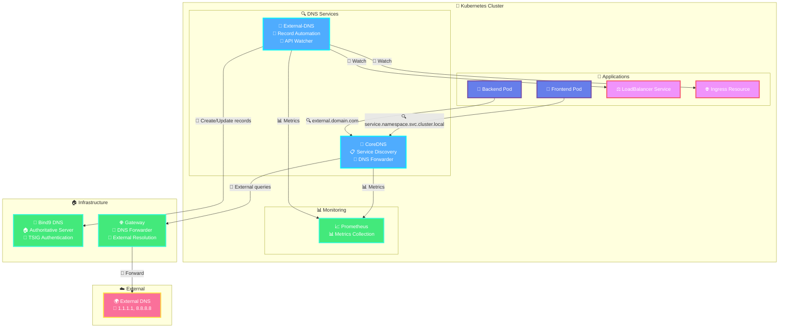

# {{ $frontmatter.title }}

## Overview

Kubernetes DNS services form the backbone of service discovery and external connectivity in the PiKube cluster. This implementation combines **CoreDNS** for internal cluster resolution and **External-DNS** for automated external DNS record management.

> [!IMPORTANT] 🏠 DNS Architecture Foundation
> This guide assumes you have already implemented the split-horizon DNS architecture described in:  
> [PiKube Split-Horizon DNS Architecture](../../2-cluster-setup/3-dns-architecture.md)
>
> The foundation includes:
>
> - **Bind9** authoritative DNS server (10.0.0.10)
> - **dnsmasq** DNS forwarder on gateway (10.0.0.1)  
> - **CloudFlare** external DNS configuration
> - **TSIG key** authentication setup

### 🔍 DNS Components Architecture



### 🎯 Core Functions

#### CoreDNS (Cluster DNS)

- **Service Discovery**: Automatic DNS records for pods and services
- **Domain Resolution**: Handles `*.cluster.local` queries
- **External Forwarding**: Routes external queries to upstream DNS servers
- **Performance**: Built-in caching and load balancing

#### External-DNS (DNS Automation)

- **Record Synchronization**: Automatically creates/updates DNS records
- **Kubernetes Integration**: Watches Services, Ingresses, and custom resources
- **Provider Agnostic**: Supports multiple DNS providers (Bind9, AWS Route53, etc.)
- **Policy Control**: Configurable record creation and deletion policies

## CoreDNS Configuration

CoreDNS is automatically deployed by K3s, but can be customized for advanced scenarios.

### Default K3s CoreDNS

K3s automatically configures CoreDNS with sensible defaults:

```yaml
# Automatically configured by K3s
apiVersion: v1
kind: ConfigMap
metadata:
  name: coredns
  namespace: kube-system
data:
  Corefile: |
    .:53 {
        errors
        health {
            lameduck 5s
        }
        ready
        kubernetes cluster.local in-addr.arpa ip6.arpa {
            pods insecure
            fallthrough in-addr.arpa ip6.arpa
            ttl 30
        }
        prometheus :9153
        forward . /etc/resolv.conf
        cache 30
        loop
        reload
        loadbalance
    }
```

### Custom CoreDNS Deployment

For advanced scenarios, deploy CoreDNS using Helm:

> [!WARNING]
> **K3s CoreDNS Replacement**
>
> If replacing K3s's default CoreDNS, you must disable it during installation:
>
> ```bash
> curl -sfL https://get.k3s.io | sh -s - server --disable coredns
> ```

#### Installation Steps

```bash
# Add CoreDNS Helm repository
helm repo add coredns https://coredns.github.io/helm
helm repo update

# Create namespace (if not using kube-system)
kubectl create namespace coredns
```

#### Configuration

Create `coredns-values.yaml`:

```yaml
# High availability configuration
replicaCount: 3

# Service configuration
k8sAppLabelOverride: kube-dns
serviceAccount:
  create: true

service:
  name: kube-dns
  clusterIP: 10.43.0.10  # Must match K3s --cluster-dns setting

# CoreDNS server configuration
servers:
  - zones:
    - zone: .
    port: 53
    plugins:
    # Error logging
    - name: errors
    
    # Health checks
    - name: health
      configBlock: |-
        lameduck 5s
    
    # Readiness probe
    - name: ready
    
    # Kubernetes service discovery
    - name: kubernetes
      parameters: cluster.local in-addr.arpa ip6.arpa
      configBlock: |-
        pods insecure
        fallthrough in-addr.arpa ip6.arpa
        ttl 30
    
    # Metrics for monitoring
    - name: prometheus
      parameters: 0.0.0.0:9153
    
    # External DNS resolution
    - name: forward
      parameters: . /etc/resolv.conf
      configBlock: |-
        max_concurrent 1000
    
    # Performance optimizations
    - name: cache
      parameters: 30
    - name: loop
    - name: reload
    - name: loadbalance

# Resource management
resources:
  requests:
    memory: "128Mi"
    cpu: "100m"
  limits:
    memory: "256Mi"
    cpu: "200m"

# Monitoring integration
serviceMonitor:
  enabled: true
  interval: 30s

# Node affinity for high availability
affinity:
  podAntiAffinity:
    preferredDuringSchedulingIgnoredDuringExecution:
    - weight: 100
      podAffinityTerm:
        labelSelector:
          matchExpressions:
          - key: k8s-app
            operator: In
            values:
            - kube-dns
        topologyKey: kubernetes.io/hostname
```

#### Deploy CoreDNS

```bash
helm install coredns coredns/coredns \
  --namespace kube-system \
  -f coredns-values.yaml
```

#### Verify Installation

```bash
# Check CoreDNS pods
kubectl -n kube-system get pods -l k8s-app=kube-dns

# Test DNS resolution
kubectl run test-pod --image=busybox --rm -it -- nslookup kubernetes.default.svc.cluster.local
```

## External-DNS Setup

External-DNS automatically synchronizes Kubernetes services with external DNS providers.

### Prerequisites: Bind9 TSIG Configuration

> [!IMPORTANT] 📋 Foundation Required  
> This section assumes you have already completed the Bind9 setup from:  
> [PiKube Split-Horizon DNS Architecture - Step 1](../../2-cluster-setup/3-dns-architecture.md#step-1-internal-authoritative-dns-server-setup)
>
> If you haven't completed the basic setup, please do so before proceeding.

For External-DNS integration, ensure your Bind9 configuration includes the TSIG key generated during the initial setup:

#### Verify TSIG Configuration

```bash
# Check that TSIG key exists
sudo cat /etc/bind/externaldns.key

# Verify it's included in named.conf
grep -q "include.*externaldns.key" /etc/bind/named.conf && echo "TSIG key included" || echo "TSIG key NOT included"

# Check zone configuration allows updates
sudo named-checkconf
```

If the TSIG key is missing, follow the [DNS Architecture Setup Guide](../../2-cluster-setup/3-dns-architecture.md#security-configuration) to generate and configure it.

### External-DNS Installation

#### 1. Add Helm Repository

```bash
helm repo add external-dns https://kubernetes-sigs.github.io/external-dns/
helm repo update
```

#### 2. Create Namespace

```bash
kubectl create namespace external-dns
```

#### 3. Create TSIG Secret

Extract the TSIG secret and create a Kubernetes secret:

```bash
# Extract secret from TSIG key file
TSIG_SECRET=$(grep -oP 'secret "\K[^"]+' /etc/bind/externaldns.key)

# Create Kubernetes secret
kubectl create secret generic external-dns-bind9-secret \
  --namespace external-dns \
  --from-literal=ddns-key="$TSIG_SECRET"
```

#### 4. Configuration

Create `external-dns-values.yaml`:

```yaml
# Provider configuration
provider:
  name: rfc2136

# Environment variables for RFC2136 provider
env:
  - name: EXTERNAL_DNS_RFC2136_HOST
    value: "10.0.0.10"  # Bind9 server IP
  - name: EXTERNAL_DNS_RFC2136_PORT
    value: "53"
  - name: EXTERNAL_DNS_RFC2136_ZONE
    value: "picluster.quantfinancehub.com"
  - name: EXTERNAL_DNS_RFC2136_TSIG_AXFR
    value: "true"
  - name: EXTERNAL_DNS_RFC2136_TSIG_KEYNAME
    value: "externaldns"
  - name: EXTERNAL_DNS_RFC2136_TSIG_SECRET_ALG
    value: "hmac-sha256"
  - name: EXTERNAL_DNS_RFC2136_TSIG_SECRET
    valueFrom:
      secretKeyRef:
        name: external-dns-bind9-secret
        key: ddns-key

# Policy and registry settings
policy: sync              # Enable create/delete operations
registry: txt             # Use TXT records for ownership
txtOwnerId: pikube-cluster
txtPrefix: external-dns-

# Source types to watch
sources:
  - service              # LoadBalancer services
  - ingress             # Ingress resources
  - crd                 # DNSEndpoint custom resources

# Domain filtering
domainFilters:
  - picluster.quantfinancehub.com

# Resource configuration
resources:
  requests:
    memory: "64Mi"
    cpu: "50m"
  limits:
    memory: "128Mi"
    cpu: "100m"

# Security context
securityContext:
  runAsNonRoot: true
  runAsUser: 65534
  allowPrivilegeEscalation: false
  readOnlyRootFilesystem: true
  capabilities:
    drop:
      - ALL

# Monitoring
serviceMonitor:
  enabled: true
  interval: 30s

# Logging
logLevel: info
logFormat: json

# Deployment settings
replicas: 1
interval: 1m
```

#### 5. Deploy External-DNS

```bash
helm install external-dns external-dns/external-dns \
  --namespace external-dns \
  -f external-dns-values.yaml
```

#### 6. Verify Installation

```bash
# Check External-DNS pod
kubectl -n external-dns get pods

# Check logs
kubectl -n external-dns logs -l app.kubernetes.io/name=external-dns

# Verify DNS provider connection
kubectl -n external-dns logs -l app.kubernetes.io/name=external-dns | grep -i "connected\|error"
```

## Usage Examples

### 🔀 LoadBalancer Service

Create a service with automatic DNS record creation:

```yaml
# loadbalancer-with-dns.yaml
apiVersion: apps/v1
kind: Deployment
metadata:
  name: nginx-app
  labels:
    app: nginx-app
spec:
  replicas: 2
  selector:
    matchLabels:
      app: nginx-app
  template:
    metadata:
      labels:
        app: nginx-app
    spec:
      containers:
      - name: nginx
        image: nginx:alpine
        ports:
        - containerPort: 80

---
apiVersion: v1
kind: Service
metadata:
  name: nginx-service
  annotations:
    external-dns.alpha.kubernetes.io/hostname: nginx.picluster.quantfinancehub.com
spec:
  type: LoadBalancer
  ports:
  - port: 80
    targetPort: 80
  selector:
    app: nginx-app
```

Deploy and test:

```bash
kubectl apply -f loadbalancer-with-dns.yaml

# Wait for DNS record creation
sleep 30

# Test DNS resolution
nslookup nginx.picluster.quantfinancehub.com

# Test service access
curl http://nginx.picluster.quantfinancehub.com
```

### 🌐 Ingress Resource

Ingress resources automatically get DNS records without annotations:

```yaml
# ingress-with-dns.yaml
apiVersion: networking.k8s.io/v1
kind: Ingress
metadata:
  name: web-ingress
  annotations:
    nginx.ingress.kubernetes.io/rewrite-target: /
spec:
  ingressClassName: nginx
  rules:
  - host: web.picluster.quantfinancehub.com
    http:
      paths:
      - path: /
        pathType: Prefix
        backend:
          service:
            name: nginx-service
            port:
              number: 80
  tls:
  - hosts:
    - web.picluster.quantfinancehub.com
    secretName: web-tls
```

### 📝 Custom DNS Records

Use DNSEndpoint custom resource for arbitrary DNS records:

```yaml
# custom-dns-record.yaml
apiVersion: externaldns.k8s.io/v1alpha1
kind: DNSEndpoint
metadata:
  name: custom-record
  namespace: external-dns
spec:
  endpoints:
  - dnsName: api.picluster.quantfinancehub.com
    recordTTL: 300
    recordType: A
    targets:
    - 10.0.0.150
  - dnsName: wildcard.picluster.quantfinancehub.com
    recordTTL: 300
    recordType: CNAME
    targets:
    - nginx.picluster.quantfinancehub.com
```

## Advanced Configuration

### 🔐 Enhanced Security

#### TSIG Key Rotation

```bash
# Generate new TSIG key
tsig-keygen -a hmac-sha256 externaldns-key-new > /etc/bind/keys/external-dns-new.key

# Update Bind9 configuration
# Update Kubernetes secret
kubectl create secret generic external-dns-bind9-secret-new \
  --namespace external-dns \
  --from-literal=ddns-key="new-base64-secret"

# Update External-DNS deployment
helm upgrade external-dns external-dns/external-dns \
  --namespace external-dns \
  -f external-dns-values.yaml
```

#### Network Policies

```yaml
# external-dns-network-policy.yaml
apiVersion: networking.k8s.io/v1
kind: NetworkPolicy
metadata:
  name: external-dns-policy
  namespace: external-dns
spec:
  podSelector:
    matchLabels:
      app.kubernetes.io/name: external-dns
  policyTypes:
  - Egress
  egress:
  - to: []
    ports:
    - protocol: TCP
      port: 53
    - protocol: UDP
      port: 53
  - to: []
    ports:
    - protocol: TCP
      port: 443  # Kubernetes API
```

### 📊 Monitoring Integration

#### Grafana Dashboard

```yaml
# coredns-dashboard-configmap.yaml
apiVersion: v1
kind: ConfigMap
metadata:
  name: coredns-dashboard
  namespace: monitoring
  labels:
    grafana_dashboard: "1"
data:
  coredns.json: |
    {
      "dashboard": {
        "title": "CoreDNS",
        "panels": [
          {
            "title": "DNS Query Rate",
            "type": "graph",
            "targets": [
              {
                "expr": "rate(coredns_dns_request_count_total[5m])",
                "legendFormat": "{{server}} {{zone}} {{type}}"
              }
            ]
          }
        ]
      }
    }
```

#### AlertManager Rules

```yaml
# dns-alerts.yaml
apiVersion: monitoring.coreos.com/v1
kind: PrometheusRule
metadata:
  name: dns-alerts
  namespace: monitoring
spec:
  groups:
  - name: dns
    rules:
    - alert: CoreDNSDown
      expr: up{job="coredns"} == 0
      for: 5m
      annotations:
        summary: "CoreDNS is down"
        description: "CoreDNS has been down for more than 5 minutes"
    
    - alert: ExternalDNSDown
      expr: up{job="external-dns"} == 0
      for: 5m
      annotations:
        summary: "External-DNS is down"
        description: "External-DNS has been down for more than 5 minutes"
    
    - alert: HighDNSErrorRate
      expr: rate(coredns_dns_request_count_total{rcode!="NOERROR"}[5m]) > 0.1
      for: 2m
      annotations:
        summary: "High DNS error rate"
        description: "DNS error rate is above 10% for 2 minutes"
```

## Troubleshooting

### Common Issues

| Issue | Symptoms | Solution |
|-------|----------|----------|
| **DNS Resolution Fails** | Pods can't resolve services | Check CoreDNS pods and logs |
| **External Records Not Created** | Services don't get DNS records | Verify External-DNS connectivity to Bind9 |
| **TSIG Authentication Fails** | External-DNS can't update records | Check TSIG key configuration |
| **High DNS Latency** | Slow service discovery | Increase CoreDNS cache settings |

### Debug Commands

```bash
# Test CoreDNS functionality
kubectl run debug-pod --image=busybox --rm -it -- sh
# Inside pod:
nslookup kubernetes.default.svc.cluster.local
nslookup google.com

# Check CoreDNS logs
kubectl -n kube-system logs -l k8s-app=kube-dns

# Check External-DNS logs
kubectl -n external-dns logs -l app.kubernetes.io/name=external-dns

# Test TSIG key manually
dig @10.0.0.10 picluster.quantfinancehub.com SOA

# Monitor DNS queries
kubectl -n kube-system port-forward svc/kube-dns 9153:9153
curl http://localhost:9153/metrics | grep coredns_dns
```

### Performance Tuning

#### CoreDNS Optimization

```yaml
# Optimized CoreDNS configuration
- name: cache
  parameters: 300  # Increase cache duration
  configBlock: |-
    success 9984 30
    denial 9984 5

- name: forward
  parameters: . /etc/resolv.conf
  configBlock: |-
    max_concurrent 1000
    except picluster.quantfinancehub.com
```

#### External-DNS Optimization

```yaml
# Performance tuning for External-DNS
interval: 30s          # Reduce sync interval
minEventSyncInterval: 5s
sources:
  - ingress
  - service
  # Remove 'crd' if not using DNSEndpoint

# Batch updates
batchChangeSize: 1000
batchChangeInterval: 1s
```

## Best Practices

### 🔧 Configuration

1. **Use separate namespaces** for DNS services
2. **Implement resource limits** to prevent resource exhaustion
3. **Configure monitoring** for all DNS components
4. **Use TSIG authentication** for secure DNS updates
5. **Implement network policies** for security

### 🚀 Performance

1. **Tune cache settings** based on your workload
2. **Use anti-affinity rules** for CoreDNS high availability
3. **Monitor DNS query patterns** and optimize accordingly
4. **Consider local DNS caching** for high-traffic applications

### 🔒 Security

1. **Rotate TSIG keys** regularly
2. **Restrict DNS update permissions** to minimum required
3. **Monitor DNS queries** for suspicious activity
4. **Use TLS** for DNS over HTTPS where possible
