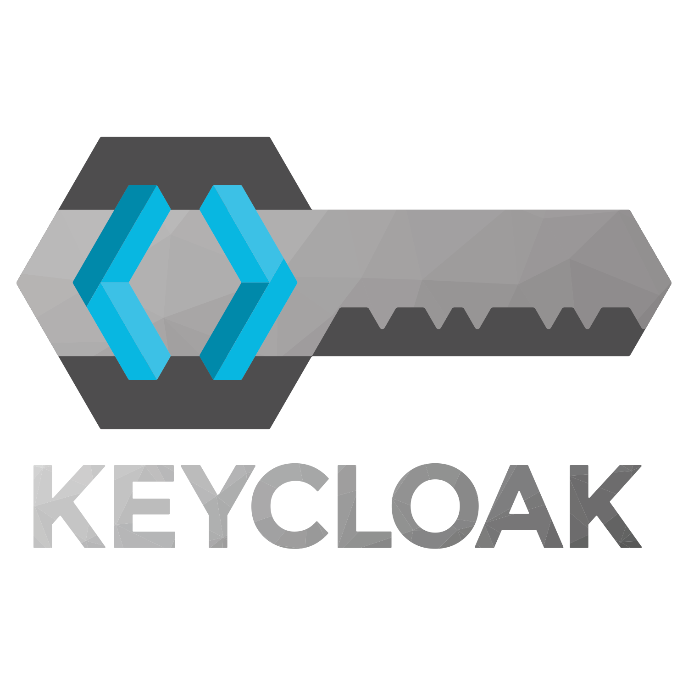
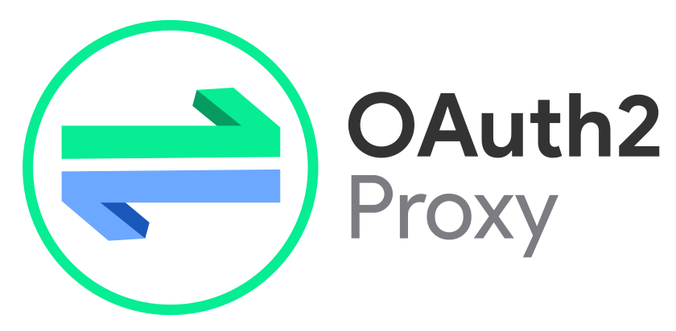
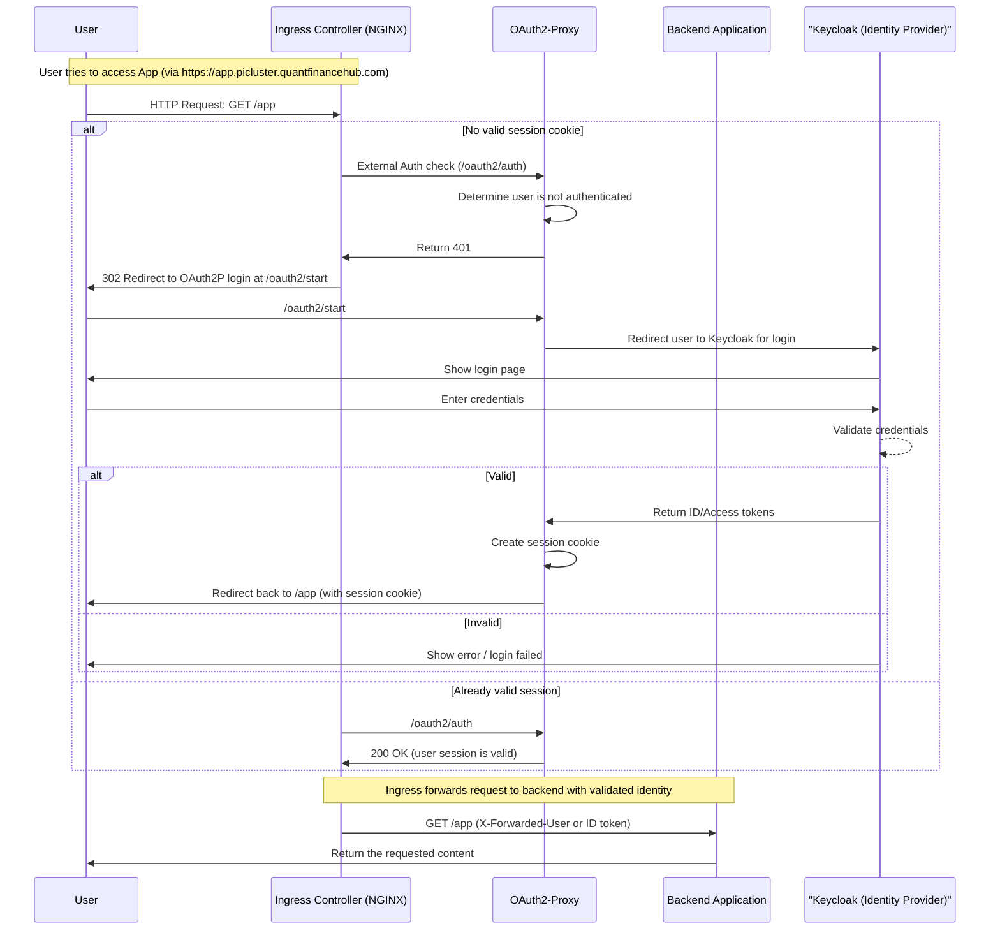

# {{ $frontmatter.title }}

<div style="display: flex; justify-content: center; align-items: center;">
    <div style="flex: 0 0 auto; margin-right: 60x;"> <!-- Adjust margin as needed for spacing -->
        
    </div>
    <div style="flex: 0 0 auto;">
        
    </div>
</div>

This guide outlines the implementation of Single Sign-On (SSO) within the PiKube Kubernetes Service using [**`Keycloak`**](https://www.keycloak.org/) for centralized authentication and OAuth2-Proxy for secure access management. The solution enables:

- Centralized authentication across cluster services
- OpenID Connect and OAuth 2.0 protocol support
- External authentication for services lacking built-in auth capabilities
- Integration with Ingress NGINX for secure access management


```mermaid
sequenceDiagram
    participant User
    participant Ingress as Ingress Controller (NGINX)
    participant OAuth2P as OAuth2-Proxy
    participant App as Backend Application
    participant Keycloak as "Keycloak (Identity Provider)"

    Note over User,Ingress: User tries to access App (via https://app.picluster.quantfinancehub.com)
    User->>Ingress: HTTP Request: GET /app
    alt No valid session cookie
        Ingress->>OAuth2P: External Auth check (/oauth2/auth)
        OAuth2P->>OAuth2P: Determine user is not authenticated
        OAuth2P->>Ingress: Return 401
        Ingress->>User: 302 Redirect to OAuth2P login at /oauth2/start
        User->>OAuth2P: /oauth2/start
        OAuth2P->>Keycloak: Redirect user to Keycloak for login
        Keycloak->>User: Show login page
        User->>Keycloak: Enter credentials
        Keycloak-->>Keycloak: Validate credentials
        alt Valid
            Keycloak->>OAuth2P: Return ID/Access tokens
            OAuth2P->>OAuth2P: Create session cookie
            OAuth2P->>User: Redirect back to /app (with session cookie)
        else Invalid
            Keycloak->>User: Show error / login failed
        end
    else Already valid session
        Ingress->>OAuth2P: /oauth2/auth
        OAuth2P->>Ingress: 200 OK (user session is valid)
    end
    Note over Ingress,App: Ingress forwards request to backend with validated identity
    Ingress->>App: GET /app (X-Forwarded-User or ID token)
    App->>User: Return the requested content
```

> [!NOTE]
>
> For graphical user interfaces (GUIs) within the PiKube Kubernetes Service, such as Grafana and Kibana, SSO can be established allowing for authentication through Keycloak instead of relying on local accounts.
>
> It is important to note that the Elasticsearch/Kibana SSO integration using OpenID Connect is not available in the community edition. Consequently, SSO will not be configured for this component. However, Grafana's SSO capability can be enabled by configuring OAuth2.0/OpenID Connect authentication. Detailed instructions for integrating Grafana with Keycloak can be found in the [Monitoring (Prometheus)](../9-monitoring/7-monitoring-prometheus.md) documentation.

For applications lacking built-in authentication features (e.g., Longhorn, Prometheus, Linkerd-viz), it's possible to set up an external authentication mechanism through the Ingress controller. The [Ingress NGINX](https://kubernetes.github.io/ingress-nginx/examples/auth/oauth-external-auth/) supports an OAuth2-based external authentication method using OAuth2-Proxy. This allows for the integration of [OAuth2-Proxy](https://oauth2-proxy.github.io/oauth2-proxy/) with OpenID-Connect IAM solutions like Keycloak, thereby extending SSO capabilities to these applications.

## Architecture Overview

The SSO implementation consists of two main components:

1. **Keycloak**: An open-source Identity and Access Management (IAM) solution that supports:
   - OpenID Connect
   - OAuth 2.0
   - SAML protocols

2. **OAuth2-Proxy**: A reverse proxy that provides authentication using OAuth2 providers, enabling:
   - External authentication for services without built-in auth
   - Integration with Ingress NGINX
   - SSO capabilities across multiple applications

TODO pikube-sso-architecture.drawio

## Setting Up Keycloak on Kubernetes

This section describes how to deploy Keycloak on Kubernetes using the **official Keycloak Operator** and an **external PostgreSQL database**. This avoids any dependency on Bitnami charts and uses upstream Keycloak images.

### 1. Create the namespace

```bash
kubectl create namespace keycloak
```

### 2. Provision PostgreSQL for Keycloak (CloudNativePG)

The Keycloak Operator does **not** manage a database. You must provision PostgreSQL separately and expose it inside the cluster.

On PiKube the recommended pattern is to run a small **CloudNativePG** cluster dedicated to Keycloak in the `keycloak` namespace, with backups stored on the external MinIO server.

1. **Create MinIO credentials in Vault (on gateway)**
   On the `gateway` node (where Vault runs):

   ```bash
   export VAULT_ADDR=https://vault.picluster.quantfinancehub.com:8200
   export VAULT_TOKEN=$(cat ~/.vault-token)

   # MinIO user for keycloak-db backups (bucket s3://k3s-barman/keycloak-db)
   vault kv put secret/minio/keycloak-db \
     user="<KEYCLOAK_DB_S3_ACCESS_KEY>" \
     key="<KEYCLOAK_DB_S3_SECRET_KEY>"
   ```

2. **Project these credentials into Kubernetes via ExternalSecret**
   In the `keycloak` namespace, create an `ExternalSecret` that materializes `keycloak-minio-secret`:

   ```yaml
   apiVersion: external-secrets.io/v1
   kind: ExternalSecret
   metadata:
     name: keycloak-minio-credentials
     namespace: keycloak
   spec:
     refreshInterval: 1h
     secretStoreRef:
       name: vault-backend
       kind: ClusterSecretStore
     target:
       name: keycloak-minio-secret
       creationPolicy: Owner
     data:
       - secretKey: AWS_ACCESS_KEY_ID
         remoteRef:
           key: secret/minio/keycloak-db
           property: user
       - secretKey: AWS_SECRET_ACCESS_KEY
         remoteRef:
           key: secret/minio/keycloak-db
           property: key
   ```

3. **Create the CloudNativePG `keycloak-db` cluster**
   This example matches the current PiKube cluster and wires backups to MinIO via `keycloak-minio-secret`:

   ```yaml
   apiVersion: postgresql.cnpg.io/v1
   kind: Cluster
   metadata:
     name: keycloak-db
     namespace: keycloak
   spec:
     instances: 3
     imageName: ghcr.io/cloudnative-pg/postgresql:16.3-4
     storage:
       size: 10Gi
       storageClass: longhorn
     monitoring:
       enablePodMonitor: true
     bootstrap:
       initdb:
         database: keycloak
         owner: keycloak
         secret:
           name: keycloak-db-secret   # created by ExternalSecret below
     backup:
       barmanObjectStore:
         destinationPath: s3://k3s-barman/keycloak-db
         endpointURL: https://s3.quantfinancehub.com:9091
         s3Credentials:
           accessKeyId:
             name: keycloak-minio-secret
             key: AWS_ACCESS_KEY_ID
           secretAccessKey:
             name: keycloak-minio-secret
             key: AWS_SECRET_ACCESS_KEY
       retentionPolicy: 30d
   ```

   This cluster exposes a read/write service at `keycloak-db-rw.keycloak.svc.cluster.local:5432`, which the Keycloak CR will use.

### 3. Manage credentials via External Secrets

In PiKube, credentials should live in **Vault** and be synced into Kubernetes using **External Secrets Operator (ESO)** rather than checked into Git.

For Keycloak we need at least:

- Admin user password (for the initial bootstrap admin).
- Database username and password for the `keycloak` database.

Example ESO resources (simplified):

```yaml
apiVersion: external-secrets.io/v1
kind: ExternalSecret
metadata:
  name: keycloak-admin-credentials
  namespace: keycloak
spec:
  refreshInterval: 1h
  secretStoreRef:
    name: vault-backend
    kind: ClusterSecretStore
  target:
    name: keycloak-admin-secret
    creationPolicy: Owner
  data:
    - secretKey: username
      remoteRef:
        key: secret/keycloak/admin       # Vault path
        property: username
    - secretKey: password
      remoteRef:
        key: secret/keycloak/admin
        property: password
---
apiVersion: external-secrets.io/v1
kind: ExternalSecret
metadata:
  name: keycloak-db-credentials
  namespace: keycloak
spec:
  refreshInterval: 1h
  secretStoreRef:
    name: vault-backend
    kind: ClusterSecretStore
  target:
    name: keycloak-db-secret
    creationPolicy: Owner
  data:
    - secretKey: username
      remoteRef:
        key: secret/postgres/keycloak   # Vault path
        property: username
    - secretKey: password
      remoteRef:
        key: secret/postgres/keycloak
        property: password
```

Apply them:

```bash
kubectl apply -f keycloak-admin-externalsecret.yaml
kubectl apply -f keycloak-db-externalsecret.yaml
```

> [!NOTE]
> For quick local testing, you can skip External Secrets and create `keycloak-admin-secret` and `keycloak-db-secret` manually with `kubectl create secret ...`. In the current PiKube cluster, both secrets are now managed by External Secrets pulling from Vault (`secret/keycloak/admin` and `secret/postgres/keycloak`). A legacy static secret named `keycloak-secret` still exists from the old Bitnami-based setup but is no longer used by the operator-based deployment. For production, prefer ESO-managed secrets rather than static ones.

### 4. Install the Keycloak Operator

Install the CRDs and Operator from the official `keycloak/keycloak-k8s-resources` repository. Replace `${KEYCLOAK_VERSION}` with the **latest stable** Keycloak version you want to run (for example `26.3.0`):

```bash
KEYCLOAK_VERSION=26.3.0   # check https://github.com/keycloak/keycloak-k8s-resources/tags
kubectl apply -f https://raw.githubusercontent.com/keycloak/keycloak-k8s-resources/${KEYCLOAK_VERSION}/kubernetes/keycloaks.k8s.keycloak.org-v1.yml
kubectl apply -f https://raw.githubusercontent.com/keycloak/keycloak-k8s-resources/${KEYCLOAK_VERSION}/kubernetes/keycloakrealmimports.k8s.keycloak.org-v1.yml
kubectl apply -f https://raw.githubusercontent.com/keycloak/keycloak-k8s-resources/${KEYCLOAK_VERSION}/kubernetes/kubernetes.yml
```

Verify the operator pod in the `keycloak` namespace is `Running` before continuing.

### 5. Deploy Keycloak with external Postgres and realm import

Create a `Keycloak` custom resource that:

- Points to the external PostgreSQL (`keycloak-db-rw` service) managed by CloudNativePG.
- Uses secrets projected by ESO for DB credentials and bootstrap admin.
- Relies on a separate CloudNativePG `Cluster` (`keycloak-db`) with S3 backups configured via the `keycloak-minio-secret` created by an ExternalSecret (see the Databases and Vault/External Secrets docs for the full `Cluster` and `ExternalSecret` manifests).

Example (aligned with the current cluster):

```yaml
apiVersion: k8s.keycloak.org/v2alpha1
kind: Keycloak
metadata:
  name: picluster-keycloak
  namespace: keycloak
spec:
  instances: 1
  hostname:
    # IMPORTANT: use the full HTTPS URL here so that
    # the OIDC discovery document advertises an HTTPS issuer.
    hostname: https://sso.picluster.quantfinancehub.com
  http:
    # TLS is terminated at NGINX Ingress; Keycloak serves plain HTTP internally.
    httpEnabled: true
    httpPort: 8080
  db:
    vendor: postgres
    host: keycloak-db-rw.keycloak.svc.cluster.local
    port: 5432
    database: keycloak
    usernameSecret:
      name: keycloak-db-secret
      key: username
    passwordSecret:
      name: keycloak-db-secret
      key: password
  bootstrapAdmin:
    user:
      # Secret with `username` and `password` keys, managed by External Secrets.
      secret: keycloak-admin-secret
```

Apply these manifests and wait for the `Keycloak` CR to become `Ready`:

```bash
kubectl apply -f keycloak.yaml
kubectl wait --for=condition=Ready keycloaks.k8s.keycloak.org/picluster-keycloak -n keycloak --timeout=600s
```

> [!NOTE]
> Once the `picluster` realm is configured (clients, roles, users), export it to a JSON file from the Keycloak admin console or via the Admin REST API. You can then reuse that JSON to create a `KeycloakRealmImport` object (by embedding it under `spec.realm`) so that future redeployments can restore the realm configuration without manual UI steps.

Once the CR is ready, the operator will also create an Ingress named `picluster-keycloak-ingress` for `sso.picluster.quantfinancehub.com`. Patch it (or create an equivalent Ingress) to integrate cert-manager and ExternalDNS:

```yaml
apiVersion: networking.k8s.io/v1
kind: Ingress
metadata:
  name: picluster-keycloak-ingress
  namespace: keycloak
  annotations:
    cert-manager.io/cluster-issuer: letsencrypt-issuer
    cert-manager.io/common-name: sso.picluster.quantfinancehub.com
    external-dns.alpha.kubernetes.io/hostname: sso.picluster.quantfinancehub.com
    nginx.ingress.kubernetes.io/backend-protocol: HTTP
spec:
  ingressClassName: nginx
  tls:
    - hosts:
        - sso.picluster.quantfinancehub.com
      secretName: sso.picluster.quantfinancehub.com-tls
  rules:
    - host: sso.picluster.quantfinancehub.com
      http:
        paths:
          - path: /
            pathType: ImplementationSpecific
            backend:
              service:
                name: picluster-keycloak-service
                port:
                  name: http
```

You can then access the admin console at **`https://sso.picluster.quantfinancehub.com`** using the admin username and password managed in Vault and projected via ESO.

If connecting from outside the cluster (e.g. Windows laptop but same network as the `gateway`), DNS will resolve automatically `sso.picluster.quantfinancehub.com` to `10.0.0.100`.

- Check the DNS resolution

```bash
nslookup sso.picluster.quantfinancehub.com
```

If it not resolving to `10.0.0.100`, open Notepad as Administrator, then open the file `C:\Windows\System32\drivers\etc\hosts` and add `10.0.0.100   sso.picluster.quantfinancehub.com`.

### 6. Sanity checks (Keycloak DB + SSO)

Before wiring more UIs through SSO, verify that both the database cluster and Keycloak itself are healthy:

- **Check CloudNativePG cluster and pods**

```bash
kubectl -n keycloak get cluster keycloak-db
kubectl -n keycloak get pods -l cnpg.io/cluster=keycloak-db
```

You should see `keycloak-db-1/2/3` Running, with at least 2 Ready instances and a clearly identified primary.

- **Confirm MinIO backup credentials are synced**

```bash
kubectl -n keycloak get externalsecret keycloak-minio-credentials
kubectl -n keycloak get secret keycloak-minio-secret -o yaml
```

The `keycloak-minio-secret` should contain `AWS_ACCESS_KEY_ID` and `AWS_SECRET_ACCESS_KEY` projected from Vault.

- **Verify Keycloak ingress and OIDC issuer**

```bash
kubectl -n keycloak get ingress picluster-keycloak-ingress
kubectl -n monitoring exec -it deploy/kube-prometheus-stack-grafana-7d68f58994-8twh7 -c grafana -- \
  sh -lc 'curl -ksS https://sso.picluster.quantfinancehub.com/realms/picluster/.well-known/openid-configuration | jq .issuer'
```

The issuer should be exactly:

```json
"https://sso.picluster.quantfinancehub.com/realms/picluster"
```

Once these checks pass, the Keycloak + CloudNativePG + MinIO + oauth2-proxy stack is ready to protect additional UIs.

### Alternative installation using External Secret (GitOps)

When implementing GitOps practices, particularly with tools like ArgoCD, it's recommended to separate sensitive information from the main configuration. External Secrets provide a secure way to manage credentials separately from your GitOps workflow, offering several benefits:

- Improved security by keeping sensitive data out of Git repositories
- Better secrets management and rotation
- Compliance with security best practices
- Separation of concerns between configuration and sensitive data

- Create a secret for credentials:

```bash
cat <<EOF | kubectl apply -f -
apiVersion: v1
kind: Secret
metadata:
    name: keycloak-secret
    namespace: keycloak
type: kubernetes.io/basic-auth
data:
    admin-password: $(echo -n 'admin123' | base64)
    postgresql-admin-password: $(echo -n 'postgres123' | base64)
    password: $(echo -n 'keycloak123' | base64)
EOF
```

- Example Helm values snippet using an external secret:

```yaml
auth:
    existingSecret: keycloak-secret
    adminUser: admin

postgresql:
  enabled: true
  auth:
    username: keycloak
    database: keycloak
    existingSecret: keycloak-secret
    secretKeys:
      adminPasswordKey: postgresql-admin-password
      userPasswordKey: password
  architecture: standalone
```

### Alternative installation using external database

Instead of using Bitnami's PostgreSQL subchart, an external PostgreSQL database can be used. For example, using CloudNative-PG, a Keycloak database cluster can be created. See the details on how to install CloudNative-PG in the [**`Databases`**](../12-microservices/1-databases.md).

> [!NOTE]
> The examples in this section are kept for historical context. For new PiKube deployments, prefer the CloudNativePG operator pattern and avoid Bitnami-based Keycloak charts, in line with the Bitnami deprecation decision.

## Configuring Keycloak

### Pi Cluster Realm Configuration

1. Access Keycloak admin console at `https://sso.picluster.quantfinancehub.com`
2. Create a new realm named 'picluster'
3. Procedure in Keycloak documentation: [Keycloak: Creating an OpenID Connect client](https://www.keycloak.org/docs/latest/server_admin/#proc-creating-oidc-client_server_administration_guide)

### Configure OAuth2-Proxy Client

Follow procedure in [Oauth2-Proxy: Keycloak OIDC Auth Provider Configuration](https://oauth2-proxy.github.io/oauth2-proxy/configuration/providers/keycloak_oidc) to provide the proper configuration.

1. Create a new OIDC client in 'picluster' Keycloak realm `Clients` ➜ `Create client`:

- `General settings`
  - `Client Type`: OpenID Connect
  - `Client ID`: oauth2-proxy

<p align="center">
    
</p>

- `Capability config`
  - `Client authentication`: On
  - `Standard flow`: enabled
  - `Direct access grants`: disabled

<p align="center">
    
</p>

- `Login settings`
  - `Valid redirect URI`: `https://oauth2-proxy.picluster.quantfinancehub.com/oauth2/callback`

<p align="center">
    
</p>

2. Locate the OAuth2 Proxy client credentials

    Under the `Credentials tab`, you will now be able to locate the OAuth2 Proxy `client's secret`.

<p align="center">
    
</p>

3. Configure audience mapper `Clients` ➜ `oauth2-proxy client` ➜ `Client scopes`:

- Access `oauth2-proxy-dedicated`

<p align="center">
    
</p>

- Under `Mappers` tab, `Configure a new mapper`

<p align="center">
    
</p>

- Choose `Audience`

<p align="center">
    
</p>

- Add mapper
  - `Name`: aud-mapper-oauth2-proxy
  - `Included Client Audience`: oauth2-proxy
  - `Add to ID token`: On
  - `Add to access token`: On (OAuth2 proxy can be set up to pass both the access and ID JWT tokens to your upstream services)
  - `Add to lightweight access token`: Off
  - `Add to token introspection`: Off

<p align="center">
    
</p>

### Automated Realm Configuration

Realm configuration in Keycloak can be exported or imported to/from JSON files.
Once the realm and clients are configured manually, the configuration can be exported to a JSON file. See the [Keycloak export import configuration](https://www.keycloak.org/server/importExport).

Realm configuration can be imported automatically from json file when deploying helm chart.
See the [Keycloak documentation](https://www.keycloak.org/server/importExport#_importing_a_realm_during_startup) documentation on export and import configuration.

The realm configuration can also be imported automatically from a JSON file when deploying the Keycloak Helm chart. See the Keycloak documentation on importing a realm during startup.
To import the realm configuration automatically, a new ConfigMap containing the JSON files needs to be mounted by the Keycloak pods at the /opt/`bitnami/keycloak/data/import` path. Additionally, the `--import-realm` argument needs to be provided when starting the Keycloak pods.

- Create ConfigMap for realm configuration, `keycloak-realm-configmap.yaml`:

```yaml
apiVersion: v1
kind: ConfigMap
metadata:
  name: keycloak-realm-configmap
  namespace: keycloak
data:
  picluster-realm.json: |
    # Realm configuration JSON
```

- Or use directly this script `export-realm.sh`

```bash
# Define your variables
KEYCLOAK_URL="https://sso.picluster.quantfinancehub.com"
REALM="master"  # Realm to authenticate against
CLIENT_ID="admin-cli"
USERNAME="admin"
EXPORT_REALM="picluster"  # Replace with your realm name if different

# Prompt for Keycloak admin password securely
read -sp "Enter Keycloak admin password: " PASSWORD
echo

# Obtain access token
TOKEN=$(curl -k -s -X POST "$KEYCLOAK_URL/realms/$REALM/protocol/openid-connect/token" \
  -H "Content-Type: application/x-www-form-urlencoded" \
  -d "grant_type=password" \
  -d "client_id=$CLIENT_ID" \
  -d "username=$USERNAME" \
  -d "password=$PASSWORD" | jq -r .access_token)

# Create the ConfigMap with the realm JSON
cat <<EOF > keycloak-realm-configmap.yaml
apiVersion: v1
kind: ConfigMap
metadata:
  name: keycloak-realm-configmap
  namespace: keycloak
data:
  ${EXPORT_REALM}-realm.json: |
$(curl -k -s -X GET "$KEYCLOAK_URL/admin/realms/$EXPORT_REALM" \
  -H "Authorization: Bearer $TOKEN" \
  -H "Content-Type: application/json" | sed 's/^/    /')
EOF
```

- Apply configMap
  
```bash
kubectl apply -f keycloak-realm-configmap.yaml
```

## OAuth2-Proxy Installation

### Secure Deployment with External Secrets in a GitOps Workflow

OAuth credentials (client ID, client secret), cookie secret, and Redis password can be provided from external secrets.

> [!WARNING] About ArgoCD and helm native commands
>
> The Redis backend is installed using the Redis Bitnami Helm sub-chart. This Helm chart creates a random credential for the Redis backend.
> When using ArgoCD, Helm native commands like `random` or `lookup`used by the Helm chart to generate this random secret are not supported. As a result, oauth2-proxy fails to save any data to Redis.
> See the [issue bitnami@charts#18130](https://github.com/bitnami/charts/issues/18130) and [issue argocd@argocd#14944](https://github.com/argoproj/argo-cd/issues/14944) for more details.
>
> As a workaround, the issue can be solved by providing the credentials in external secrets.

- Create secret containing oauth2-proxy credentials:

```bash
cat <<EOF | kubectl apply -f -
apiVersion: v1
kind: Secret
metadata:
    name: oauth2-proxy-secret
    namespace: oauth2-proxy
type: Opaque
data:
  client-id: $(echo -n 'oauth2-proxy' | base64)
  client-secret: $(echo -n 'supersecret' | base64)
  cookie-secret: $(openssl rand -base64 32 | head -c 32 | base64)
  redis-password: $(openssl rand -base64 32 | head -c 32 | base64)
EOF
```

- Decode and verify the oauth2-`proxy-secret`

```bash
kubectl get secret oauth2-proxy-secret -n oauth2-proxy -o jsonpath="{.data}" | jq
```

### Standard Installation (aligned with current PiKube cluster)

- Add Helm repository:

```bash
helm repo add oauth2-proxy https://oauth2-proxy.github.io/manifests
helm repo update
```

- Create namespace:

```bash
kubectl create namespace oauth2-proxy
```

- Create `oauth2-proxy-values.yaml`:

```yaml
config:
  existingSecret: oauth2-proxy-secret
  cookieName: "oauth2-proxy"
  configFile: |-
    provider="keycloak-oidc"
    provider_display_name="Keycloak"
    redirect_url="https://oauth2-proxy.picluster.quantfinancehub.com/oauth2/callback"
    # IMPORTANT: this must match the issuer in the
    # OIDC discovery document:
    #   https://sso.picluster.quantfinancehub.com/realms/picluster/.well-known/openid-configuration
    oidc_issuer_url="https://sso.picluster.quantfinancehub.com/realms/picluster"
    code_challenge_method="S256"
    # TLS is terminated at the NGINX ingress using a Let's Encrypt
    # certificate. For extra safety you can set this to false once
    # you have confirmed CA trust inside the container.
    ssl_insecure_skip_verify=true
    http_address="0.0.0.0:4180"
    upstreams="file:///dev/null"
    email_domains=["*"]
    cookie_domains=["picluster.quantfinancehub.com"]
    cookie_secure=false
    # Request only the mandatory OpenID scope and let oauth2-proxy
    # use the subject (sub) claim as the stable user identifier.
    # This avoids Keycloak invalid_scope errors and does not depend
    # on email/profile being configured as client scopes.
    scope="openid"
    oidc_email_claim="sub"
    whitelist_domains=[".picluster.quantfinancehub.com"]
    insecure_oidc_allow_unverified_email="true"

sessionStorage:
  type: redis
  redis:
    existingSecret: oauth2-proxy-secret
    passwordKey: redis-password

redis:
  enabled: true
  redisPassword: "redis-secret-change-me"

ingress:
  enabled: true
  className: "nginx"
  pathType: Prefix
  path: /oauth2
  annotations:
    cert-manager.io/cluster-issuer: letsencrypt-issuer
    cert-manager.io/common-name: oauth2-proxy.picluster.quantfinancehub.com
    nginx.ingress.kubernetes.io/proxy-buffer-size: "16k"
    external-dns.alpha.kubernetes.io/hostname: oauth2-proxy.picluster.quantfinancehub.com
  hosts:
    - oauth2-proxy.picluster.quantfinancehub.com
  tls:
    - hosts:
        - oauth2-proxy.picluster.quantfinancehub.com
      secretName: oauth2-proxy-tls
```

- Install OAuth2-Proxy:

```bash
helm install oauth2-proxy oauth2-proxy/oauth2-proxy -f oauth2-proxy-values.yaml --namespace oauth2-proxy
```

- Check status oauth2-proxy pods

```bash
kubectl --namespace=oauth2-proxy get pods -l "app=oauth2-proxy"
```
  
## Integrating with Ingress

Add the following annotations to your Ingress resources (for example, the Longhorn UI Ingress in the `longhorn-system` namespace):

```yaml
annotations:
  nginx.ingress.kubernetes.io/auth-signin: https://oauth2-proxy.picluster.quantfinancehub.com/oauth2/start?rd=https://$host$request_uri
  nginx.ingress.kubernetes.io/auth-url: http://oauth2-proxy.oauth2-proxy.svc.cluster.local/oauth2/auth
  nginx.ingress.kubernetes.io/proxy-buffer-size: "16k"
  nginx.ingress.kubernetes.io/auth-response-headers: Authorization
```
