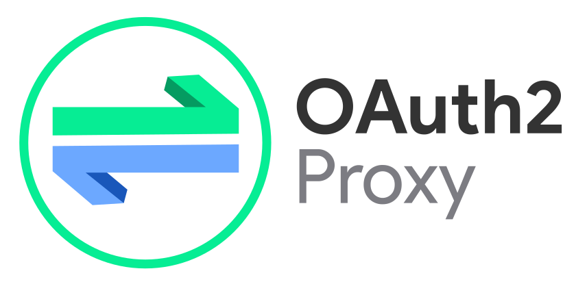

# {{ $frontmatter.title }}

<div style="display: flex; justify-content: center; align-items: center;">
    <div style="flex: 0 0 auto; margin-right: 60x;"> <!-- Adjust margin as needed for spacing -->
        
    </div>
    <div style="flex: 0 0 auto;">
        
    </div>
</div>

This guide outlines the implementation of Single Sign-On (SSO) within the PiKube Kubernetes Service using [**`Keycloak`**](https://www.keycloak.org/) for centralized authentication and OAuth2-Proxy for secure access management. The solution enables:

- Centralized authentication across cluster services
- OpenID Connect and OAuth 2.0 protocol support
- External authentication for services lacking built-in auth capabilities
- Integration with Ingress NGINX for secure access management


> [!NOTE]
>
> For graphical user interfaces (GUIs) within the PiKube Kubernetes Service, such as Grafana and Kibana, SSO can be established allowing for authentication through Keycloak instead of relying on local accounts.
>
> It is important to note that the Elasticsearch/Kibana SSO integration using OpenID Connect is not available in the community edition. Consequently, SSO will not be configured for this component. However, Grafana's SSO capability can be enabled by configuring OAuth2.0/OpenID Connect authentication. Detailed instructions for integrating Grafana with Keycloak can be found in the [Monitoring (Prometheus)](../9-monitoring/7-monitoring-prometheus.md) documentation.

For applications lacking built-in authentication features (e.g., Longhorn, Prometheus, Linkerd-viz), it's possible to set up an external authentication mechanism through the Ingress controller. The [Ingress NGINX](https://kubernetes.github.io/ingress-nginx/examples/auth/oauth-external-auth/) supports an OAuth2-based external authentication method using OAuth2-Proxy. This allows for the integration of [OAuth2-Proxy](https://oauth2-proxy.github.io/oauth2-proxy/) with OpenID-Connect IAM solutions like Keycloak, thereby extending SSO capabilities to these applications.

## Architecture Overview

The SSO implementation consists of two main components:

1. **Keycloak**: An open-source Identity and Access Management (IAM) solution that supports:
   - OpenID Connect
   - OAuth 2.0
   - SAML protocols

2. **OAuth2-Proxy**: A reverse proxy that provides authentication using OAuth2 providers, enabling:
   - External authentication for services without built-in auth
   - Integration with Ingress NGINX
   - SSO capabilities across multiple applications

TODO pikube-sso-architecture.drawio

## Setting Up Keycloak on Kubernetes

This section guides through the process of deploying Keycloak on Kubernetes using Bitnami's Helm chart. The setup includes a PostgreSQL database as the backend for Keycloak.

- Create a dedicated namespace for **`keycloak`**

```bash
kubectl create namespace keycloak
```

- Create the Keycloak secret

```bash
# Create new secret
cat <<EOF | kubectl apply -f -
apiVersion: v1
kind: Secret
metadata:
  name: keycloak-secret
  namespace: keycloak
type: Opaque
data:
  admin-password: $(echo -n 'admin123' | base64)
  postgresql-password: $(echo -n 'keycloak123' | base64)
  postgresql-admin-password: $(echo -n 'postgres123' | base64)
EOF
```

- Add the Bitnami Helm repository to fetch the Keycloak chart and Helm repository

```bash
helm repo add bitnami https://charts.bitnami.com/bitnami
helm repo update
```

- Generate a configuration file, **`keycloak-values.yaml`**, that specifies the deployment preferences, including storage class, running mode, admin user details, PostgreSQL configuration, and ingress settings:

```yaml
global:
  storageClass: longhorn
auth:
  adminUser: admin
  existingSecret: keycloak-secret
  passwordSecretKey: admin-password
postgresql:
  enabled: true
  auth:
    username: keycloak
    database: keycloak
    existingSecret: keycloak-secret
    secretKeys:
      userPasswordKey: postgresql-password
      adminPasswordKey: postgresql-admin-password
# Production mode configuration
production: true
proxy: edge
# Resource limits suitable for ARM
resources:
  limits:
    memory: "1Gi"
    cpu: "1000m"
  requests:
    memory: "512Mi"
    cpu: "250m"
# Startup probe configuration
startupProbe:
  enabled: true
  initialDelaySeconds: 60
  periodSeconds: 10
  timeoutSeconds: 1
  failureThreshold: 60
  successThreshold: 1
# Readiness probe configuration
readinessProbe:
  enabled: true
  initialDelaySeconds: 60
  periodSeconds: 10
  timeoutSeconds: 1
  failureThreshold: 3
  successThreshold: 1
# Liveness probe configuration
livenessProbe:
  enabled: true
  initialDelaySeconds: 60
  periodSeconds: 10
  timeoutSeconds: 1
  failureThreshold: 3
  successThreshold: 1
ingress:
  enabled: true
  ingressClassName: "nginx"
  annotations:
    cert-manager.io/cluster-issuer: letsencrypt-issuer
    nginx.ingress.kubernetes.io/proxy-buffers-number: "4"
    nginx.ingress.kubernetes.io/proxy-buffer-size: "16k"
  hostname: sso.picluster.quantfinancehub.com
  tls: true
```

This configuration enables:

- Deployment in a secure, production-ready setup.

- Use of PostgreSQL as the database.

- Configuration of an ingress resource for external access.

>📢 Note
>
> *This setup automatically generates random passwords for Keycloak's admin account and PostgreSQL. To avoid issues during upgrades, provide the existing passwords when running helm upgrade.*

- Deploy Keycloak to PiKube cluster within the specified namespace

```bash
helm install keycloak bitnami/keycloak -f keycloak-values.yml --namespace keycloak
```

- Verify the deployment by checking the status of Keycloak pods

```bash
kubectl get pods -n keycloak
```

- Access the Keycloak admin console at **`https://sso.picluster.quantfinancehub.com`** and log in with the 'admin' user credentials obtained in the previous step

```bash
kubectl get secret keycloak-secret -n keycloak -o jsonpath='{.data.admin-password}' | base64 -d && echo
```

If connecting from outside the cluster (e.g. Windows laptop but same network as the `gateway`), DNS will resolve automatically `sso.picluster.quantfinancehub.com` to `10.0.0.100`.

- Check the DNS resolution

```bash
nslookup sso.picluster.quantfinancehub.com
```

If it not resolving to `10.0.0.100`, open Notepad as Administrator, then open the file `C:\Windows\System32\drivers\etc\hosts` and add `10.0.0.100   sso.picluster.quantfinancehub.com`.

### Alternative installation using External Secret (GitOps)

When implementing GitOps practices, particularly with tools like ArgoCD, it's recommended to separate sensitive information from the main configuration. External Secrets provide a secure way to manage credentials separately from your GitOps workflow, offering several benefits:

- Improved security by keeping sensitive data out of Git repositories
- Better secrets management and rotation
- Compliance with security best practices
- Separation of concerns between configuration and sensitive data

- Create a secret for credentials:

```bash
cat <<EOF | kubectl apply -f -
apiVersion: v1
kind: Secret
metadata:
    name: keycloak-secret
    namespace: keycloak
type: kubernetes.io/basic-auth
data:
    admin-password: $(echo -n 'admin123' | base64)
    postgresql-admin-password: $(echo -n 'postgres123' | base64)
    password: $(echo -n 'keycloak123' | base64)
EOF
```

- Modify keycloak-values.yaml to use external secret:

```yaml
auth:
    existingSecret: keycloak-secret
    adminUser: admin

postgresql:
  enabled: true
  auth:
    username: keycloak
    database: keycloak
    existingSecret: keycloak-secret
    secretKeys:
      adminPasswordKey: postgresql-admin-password
      userPasswordKey: password
  architecture: standalone
```

### Alternative installation using external database

Instead of using Bitnami's PostgreSQL subchart, an external PostgreSQL database can be used. For example, using CloudNative-PG, a Keycloak database cluster can be created. See the details on how to install CloudNative-PG in the [**`Databases`**](../12-microservices/2-service-mesh-linkerd.md).

- Create secret for keycloak admin user

```bash
cat <<EOF | kubectl apply -f -
apiVersion: v1
kind: Secret
metadata:
    name: keycloak-secret
    namespace: keycloak
type: kubernetes.io/basic-auth
data:
    admin-password: $(echo -n 'admin123' | base64)
EOF
```

- Create secret for external database

```bash
cat <<EOF | kubectl apply -f -
apiVersion: v1
kind: Secret
metadata:
  name: keycloak-db-secret
  namespace: keycloak
  labels:
    cnpg.io/reload: "true"
type: kubernetes.io/basic-auth
data:
  username: $(echo -n 'keycloak' | base64)
  password: $(echo -n 'supersecret' | base64)
EOF
```

- Create CloudNative PG database for keycloak

  ```yaml
  apiVersion: postgresql.cnpg.io/v1
  kind: Cluster
  metadata:
    name: keycloak-db
    namespace: keycloak
  spec:
    instances: 3
    imageName: ghcr.io/cloudnative-pg/postgresql:16.3-4
    storage:
      size: 10Gi
      storageClass: longhorn
    monitoring:
      enablePodMonitor: true
    bootstrap:
      initdb:
        database: keycloak
        owner: keycloak
        secret:
          name: keycloak-db-secret
    # Backup to external Minio (Optional)
    backup:
      barmanObjectStore:
        data:
          compression: bzip2
        wal:
          compression: bzip2
          maxParallel: 8
        destinationPath: s3://k3s-barman/keycloak-db
        endpointURL: https://s3.quantfinancehub.com:9091
        s3Credentials:
          accessKeyId:
            name: keycloak-minio-secret
            key: AWS_ACCESS_KEY_ID
          secretAccessKey:
            name: keycloak-minio-secret
            key: AWS_SECRET_ACCESS_KEY
      retentionPolicy: "30d"
  ```

- Add external database configuration to helm `keycloak-values.yaml`

  ```yaml
  # Admin user
  auth:
      existingSecret: keycloak-secret
      adminUser: admin
  # External DB: https://github.com/bitnami/charts/tree/main/bitnami/keycloak#use-an-external-database
  postgresql:
    enabled: false

  externalDatabase:
    host: "keycloak-db-rw"
    port: 5432
    database: keycloak
    existingSecret: "keycloak-db-secret"
    existingSecretUserKey: "username"
    existingSecretPasswordKey: "password"
  ```

## Configuring Keycloak

### Pi Cluster Realm Configuration

1. Access Keycloak admin console at `https://sso.picluster.quantfinancehub.com`
2. Create a new realm named 'picluster'
3. Procedure in Keycloak documentation: [Keycloak: Creating an OpenID Connect client](https://www.keycloak.org/docs/latest/server_admin/#proc-creating-oidc-client_server_administration_guide)

### Configure Oauth2-Proxy Client

Follow procedure in [Oauth2-Proxy: Keycloak OIDC Auth Provider Configuration](https://oauth2-proxy.github.io/oauth2-proxy/configuration/providers/keycloak_oidc) to provide the proper configuration.

1. Create a new OIDC client in 'picluster' Keycloak realm `Clients` ➜ `Create client`:

- `General settings`
  - `Client Type`: OpenID Connect
  - `Client ID`: oauth2-proxy

<p align="center">
    
</p>

- `Capability config`
  - `Client authentication`: On
  - `Standard flow`: enabled
  - `Direct access grants`: disabled

<p align="center">
    
</p>

- `Login settings`
  - `Valid redirect URI`: `https://ouath2-proxy.picluster.quantfinancehub.com/oauth2/callback`

<p align="center">
    
</p>

2. Locate the OAuth2 Proxy client credentials

    Under the `Credentials tab`, you will now be able to locate the OAuth2 Proxy `client's secret`.

<p align="center">
    
</p>

3. Configure audience mapper `Clients` ➜ `oauth2-proxy client` ➜ `Client scopes`:

- Access `oauth2-proxy-dedicated`

<p align="center">
    
</p>

- Under `Mappers` tab, `Configure a new mapper`

<p align="center">
    
</p>

- Choose `Audience`

<p align="center">
    
</p>

- Add mapper
  - `Name`: aud-mapper-oauth2-proxy
  - `Included Client Audience`: oauth2-proxy
  - `Add to ID token`: On
  - `Add to access token`: On (OAuth2 proxy can be set up to pass both the access and ID JWT tokens to your upstream services)
  - `Add to lightweight access token`: Off
  - `Add to token introspection`: Off

<p align="center">
    
</p>

### Automated Realm Configuration

Realm configuration in Keycloak can be exported or imported to/from JSON files.
Once the realm and clients are configured manually, the configuration can be exported to a JSON file. See the [Keycloak export import configuration](https://www.keycloak.org/server/importExport).

Realm configuration can be imported automatically from json file when deploying helm chart.
See the [Keycloak documentation](https://www.keycloak.org/server/importExport#_importing_a_realm_during_startup) documentation on export and import configuration.

The realm configuration can also be imported automatically from a JSON file when deploying the Keycloak Helm chart. See the Keycloak documentation on importing a realm during startup.
To import the realm configuration automatically, a new ConfigMap containing the JSON files needs to be mounted by the Keycloak pods at the /opt/`bitnami/keycloak/data/import` path. Additionally, the `--import-realm` argument needs to be provided when starting the Keycloak pods.

- Create ConfigMap for realm configuration, `keycloak-realm-configmap.yaml`:

```yaml
apiVersion: v1
kind: ConfigMap
metadata:
  name: keycloak-realm-configmap
  namespace: keycloak
data:
  picluster-realm.json: |
    # Realm configuration JSON
```

- Or use directly this script `export-realm.sh`

```bash
# Define your variables
KEYCLOAK_URL="https://sso.picluster.quantfinancehub.com"
REALM="master"  # Realm to authenticate against
CLIENT_ID="admin-cli"
USERNAME="admin"
EXPORT_REALM="picluster"  # Replace with your realm name if different

# Prompt for Keycloak admin password securely
read -sp "Enter Keycloak admin password: " PASSWORD
echo

# Obtain access token
TOKEN=$(curl -k -s -X POST "$KEYCLOAK_URL/realms/$REALM/protocol/openid-connect/token" \
  -H "Content-Type: application/x-www-form-urlencoded" \
  -d "grant_type=password" \
  -d "client_id=$CLIENT_ID" \
  -d "username=$USERNAME" \
  -d "password=$PASSWORD" | jq -r .access_token)

# Create the ConfigMap with the realm JSON
cat <<EOF > keycloak-realm-configmap.yaml
apiVersion: v1
kind: ConfigMap
metadata:
  name: keycloak-realm-configmap
  namespace: keycloak
data:
  ${EXPORT_REALM}-realm.json: |
$(curl -k -s -X GET "$KEYCLOAK_URL/admin/realms/$EXPORT_REALM" \
  -H "Authorization: Bearer $TOKEN" \
  -H "Content-Type: application/json" | sed 's/^/    /')
EOF
```

- Apply configMap
  
```bash
kubectl apply -f keycloak-realm-configmap.yaml
```

- Update keycloak-values.yaml to import realm

```yaml
extraStartupArgs: "--import-realm"
extraVolumes:
  - name: realm-config
    configMap:
      name: keycloak-realm-configmap
extraVolumeMounts:
  - mountPath: /opt/bitnami/keycloak/data/import
    name: realm-config
```

- Apply changes

```bash
helm upgrade --install keycloak bitnami/keycloak \
  --namespace keycloak \
  -f keycloak-values.yaml
```

## OAuth2-Proxy Installation

### Secure Deployment with External Secrets in a GitOps Workflow

OAuth credentials (client ID, client secret), cookie secret, and Redis password can be provided from external secrets.

> [!WARNING] About ArgoCD and helm native commands
>
> The Redis backend is installed using the Redis Bitnami Helm sub-chart. This Helm chart creates a random credential for the Redis backend.
> When using ArgoCD, Helm native commands like `random` or `lookup`used by the Helm chart to generate this random secret are not supported. As a result, oauth2-proxy fails to save any data to Redis.
> See the [issue bitnami@charts#18130](https://github.com/bitnami/charts/issues/18130) and [issue argocd@argocd#14944](https://github.com/argoproj/argo-cd/issues/14944) for more details.
>
> As a workaround, the issue can be solved by providing the credentials in external secrets.

- Create secret containing oauth2-proxy credentials:

```bash
cat <<EOF | kubectl apply -f -
apiVersion: v1
kind: Secret
metadata:
    name: oauth2-proxy-secret
    namespace: oauth2-proxy
type: Opaque
data:
  client-id: $(echo -n 'oauth2-proxy' | base64)
  client-secret: $(echo -n 'supersecret' | base64)
  cookie-secret: $(openssl rand -base64 32 | head -c 32 | base64)
  redis-password: $(openssl rand -base64 32 | head -c 32 | base64)
EOF
```

- Decode and verify the oauth2-`proxy-secret`

```bash
kubectl get secret oauth2-proxy-secret -n oauth2-proxy -o jsonpath="{.data}" | jq
```

### Standard Installation

- Add Helm repository:

```bash
helm repo add oauth2-proxy https://oauth2-proxy.github.io/manifests
helm repo update
```

- Create namespace:

```bash
kubectl create namespace oauth2-proxy
```

- Create `oauth2-proxy-values.yaml`:

```yaml
helm upgrade --install oauth2-proxy oauth2-proxy/oauth2-proxy \
  --namespace oauth2-proxy \
  --set global.redis.password="$(kubectl get secret --namespace "oauth2-proxy" oauth2-proxy-secret -o jsonpath="{.data.redis-password}" | base64 --decode)" \
  -f - <<EOF
config:
  clientID: "oauth2-proxy"
  cookieName: "oauth2-proxy"
  configFile: |-
    provider="keycloak-oidc"
    provider_display_name="Keycloak"
    redirect_url="https://oauth2-proxy.picluster.quantfinancehub.com/oauth2/callback"
    oidc_issuer_url="https://sso.picluster.quantfinancehub.com/realms/picluster"
    code_challenge_method="S256"
    ssl_insecure_skip_verify=true
    http_address="0.0.0.0:4180"
    upstreams="file:///dev/null"
    email_domains=["*"]
    cookie_domains=["picluster.quantfinancehub.com"]
    cookie_secure=false
    scope="openid"
    whitelist_domains=[".picluster.quantfinancehub.com"]
    insecure_oidc_allow_unverified_email="true"

auth:
  existingSecret: oauth2-proxy-secret
  existingSecretKeys:
    clientID: client-id
    clientSecret: client-secret
    cookieSecret: cookie-secret

sessionStorage:
  type: redis
  redis:
    existingSecret: oauth2-proxy-secret
    passwordKey: redis-password

redis:
  enabled: true
  architecture: standalone

global:
  redis:
    password: "$(kubectl get secret --namespace "oauth2-proxy" oauth2-proxy-secret -o jsonpath="{.data.redis-password}" | base64 --decode)"

ingress:
  enabled: true
  className: "nginx"
  pathType: Prefix
  path: /oauth2
  annotations:
    cert-manager.io/cluster-issuer: letsencrypt-issuer
    cert-manager.io/common-name: oauth2-proxy.picluster.quantfinancehub.com
    nginx.ingress.kubernetes.io/proxy-buffer-size: "16k"
  hosts:
    - oauth2-proxy.picluster.quantfinancehub.com
  tls:
    - hosts:
        - oauth2-proxy.picluster.quantfinancehub.com
      secretName: oauth2-proxy-tls
EOF
```

- Install OAuth2-Proxy:

```bash
helm install oauth2-proxy oauth2-proxy/oauth2-proxy -f oauth2-proxy-values.yaml --namespace oauth2-proxy
```

- Check status oauth2-proxy pods

```bash
kubectl --namespace=oauth2-proxy get pods -l "app=oauth2-proxy"
```
  
## Integrating with Ingress

Add the following annotations to your Ingress resources:

```yaml
annotations:
  nginx.ingress.kubernetes.io/auth-signin: https://oauth2-proxy.picluster.quantfinancehub.com/oauth2/start?rd=https://$host$request_uri
  nginx.ingress.kubernetes.io/auth-url: http://oauth2-proxy.oauth2-proxy.svc.cluster.local/oauth2/auth
  nginx.ingress.kubernetes.io/proxy-buffer-size: "16k"
  nginx.ingress.kubernetes.io/auth-response-headers: Authorization
```
