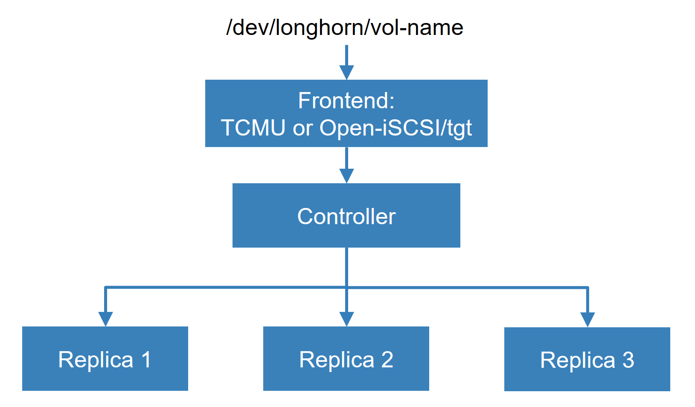
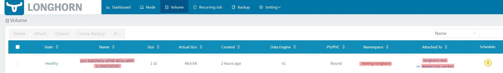
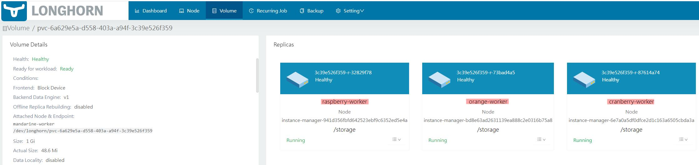

# {{ $frontmatter.title }}

<p align="center">
    
</p>

K3s, by default, uses a Local Path Provisioner for PersistentVolumeClaims (PVCs), which relies on storage local to the host node. This approach limits data access to the specific node where the pod is running. To overcome this limitation, a distributed block storage system like `Longhorn` is essential. `Longhorn` decouples storage from pods, allowing PVCs to be mounted on any pod across the cluster, irrespective of node location.

**Longhorn as a distributed block storage solution**:

Longhorn is a lightweight, reliable, and user-friendly distributed block storage system for Kubernetes. It's a viable alternative to other storage solutions like Rook/Ceph and is compatible with both AMD64 and ARM64 architectures. This compatibility makes it well-suited for a diverse environment such as PiKube Kubernetes cluster with Raspberry Pi and Orange Pi nodes.

## Implementation Using Internet Small Computer System Interface (iSCSI)

Longhorn requires the `open-iscsi` package on all cluster nodes, with the `iscsid` daemon running on all worker nodes. Additionally, for optimal compatibility and functionality, ensure that `nfs-common`, `open-iscsi`, `cryptsetup`, and `dmsetup` are installed on each node.

> [!IMPORTANT] 🔧 PiKube requirement  
> On PiKube, these packages **must be installed on every k3s node** (masters and workers). Longhorn will not function correctly if `open-iscsi` or `iscsid` is missing on any node that might attach volumes.
>
> Quick validation on each node:
> ```bash
> dpkg -l | egrep 'open-iscsi|nfs-common|cryptsetup|dmsetup'
> systemctl is-active iscsid
> ```

For more details on the implementation, refer to [**`Longhorn Engine documentation`**](https://github.com/longhorn/longhorn-engine):

<p align="center">
    
</p>

- **`Longhorn as iSCSI Target`**: Longhorn functions as an iSCSI Target, creating volumes that are detected by the iSCSI Initiator on each node.

- **`Nodes as iSCSI Initiators`**: Nodes in the cluster are configured as iSCSI Initiators, recognizing Longhorn volumes as block devices under **`/dev/longhorn/`**.

Configure **`iSCSI`** for Longhorn involves installation of **`Open-iscsi`** on each **`Node`** to ensures all nodes can interact with Longhorn volumes using iSCSI.

```bash
sudo apt-get install nfs-common open-iscsi cryptsetup dmsetup
```

Configure **`SCSI Initiators`** by excluding default authentication parameters in **`iscsid.conf`** on each **`Node`**. Longhorn's local iSCSI target does not use authentication.

Inside **`iscsid.conf`**, look for lines related to authentication. These might include settings like **`node.session.auth.username`**, **`node.session.auth.password`**, **`discovery.sendtargets.auth.username`**, and **`discovery.sendtargets.auth.password`**.

## Addressing Longhorn Issues with Multipath

When multipath is active on storage nodes, it can automatically manage block devices, including those created by Longhorn. This might lead to errors when starting Pods that use Longhorn volumes, such as "volume already mounted."

> [!NOTE] 🧬 PiKube and multipath  
> PiKube runs `multipathd` on the Orange Pi worker nodes. We **keep multipath enabled** for future external/SAN storage scenarios, but explicitly instruct it to ignore Longhorn‑managed local disks. The blacklist below prevents multipath from claiming Longhorn volumes while still allowing multipath to be used for other devices if needed.

**Solution**: To resolve this, Longhorn devices need to be blacklisted in the multipath configuration. This prevents multipath from managing these devices.

To modify **`Multipath`** configuration, open the **`/etc/multipath.conf`** file on each node where multipath is running, this includes nodes using Longhorn for storage, and add the blacklist command.

```ini
blacklist {
  devnode "^sd[a-z0-9]+"
}
```

This configuration tells `multipath` to ignore devices matching the specified pattern, which includes Longhorn-managed devices.

After updating the configuration, restart the `multipath` daemon to apply the changes.

```bash
sudo systemctl restart multipathd
```

## Longhorn Installation Procedure Using Helm

### Step 1: Add Longhorn Helm Repository

- On **`gateway`**, add **`Longhorn`**'s Helm Repository

```bash
helm repo add longhorn https://charts.longhorn.io
```

- Fetch the latest charts from the repository to ensure you have the most recent updates

```bash
helm repo update
```

- Create a dedicated namespace for Longhorn in your PiKube Kubernetes cluster

```bash
kubectl create namespace longhorn-system
```

### Step 2: Label Storage Nodes (Fast Tier Only)

PiKube’s primary Longhorn storage tier lives on the three NVMe workers. To ensure Longhorn only creates default disks on these nodes, enable the **Create Default Disk on Labeled Nodes** behavior and label only the NVMe nodes:

- Apply the label on NVMe workers **before** installing Longhorn:

```bash
kubectl label node lemon-worker      node.longhorn.io/create-default-disk=true
kubectl label node clementine-worker node.longhorn.io/create-default-disk=true
kubectl label node grapefruit-worker node.longhorn.io/create-default-disk=true
```

Longhorn will automatically create data disks only on nodes with this label when the corresponding setting is enabled.

### Step 3: Create `longhorn-values.yaml` (NVMe fast tier + NGINX Ingress)

- Create a **`longhorn-values.yaml`** file for custom configurations:

```yaml
defaultSettings:
  # Only create default disks on labeled storage nodes
  createDefaultDiskLabeledNodes: true
  # PiKube: use NVMe fast tier on Ultra workers
  defaultDataPath: "/var/lib/longhorn/fast"

ingress:
  enabled: true
  ingressClassName: nginx
  host: longhorn.picluster.quantfinancehub.com
  tls: true
  tlsSecret: longhorn-tls
  path: "/"
  annotations:
    nginx.ingress.kubernetes.io/auth-type: basic
    nginx.ingress.kubernetes.io/auth-secret: basic-auth-secret
    nginx.ingress.kubernetes.io/service-upstream: "true"
    cert-manager.io/cluster-issuer: letsencrypt-issuer
    cert-manager.io/common-name: longhorn.picluster.quantfinancehub.com
```

📢 This configuration:

➜ Uses the **NVMe fast tier** on the three Orange Pi 5 Ultra workers (`/var/lib/longhorn/fast`) as the default Longhorn data path.

➜ Enables and configures an **Ingress** resource for accessing the **Longhorn dashboard** through **NGINX**.

➜ Configures **basic authentication** and **TLS** for the dashboard using **cert-manager**.

### Basic-auth secret for Longhorn via Vault + External Secrets

On PiKube, the HTTP basic-auth credentials used by NGINX are stored in **Vault on the gateway (`10.0.0.1`)** at:

- **Path:** `secret/ingress/basic_auth`  
- **Field:** `htpasswd-pair` (a single `username:hash` `htpasswd` line)

To project this into Kubernetes for Longhorn, create an `ExternalSecret` in the `longhorn-system` namespace so that the Ingress annotation

```yaml
nginx.ingress.kubernetes.io/auth-secret: basic-auth-secret
```

has a matching Secret in the same namespace:

```yaml
apiVersion: external-secrets.io/v1beta1
kind: ExternalSecret
metadata:
  name: longhorn-basic-auth
  namespace: longhorn-system
spec:
  refreshInterval: 1h
  secretStoreRef:
    name: vault-backend
    kind: ClusterSecretStore
  target:
    name: basic-auth-secret   # Secret referenced by the Ingress
    creationPolicy: Owner
  data:
    - secretKey: auth         # Key expected by NGINX
      remoteRef:
        key: secret/ingress/basic_auth
        property: htpasswd-pair
```

> [!NOTE]
> - The same Vault path (`secret/ingress/basic_auth`) can be reused for other NGINX Ingresses (Prometheus, Linkerd Viz, etc.) by creating similar `ExternalSecret` objects in their namespaces.  
> - The detailed pattern for managing this secret in Vault and External Secrets is described in `docs/5-networking/4-ingress-controller-nginx.md`.

> [!WARNING] 🔐 SSO integration planned  
> This initial configuration uses basic auth in front of the Longhorn UI. In the PiKube roadmap, GUI access will be unified behind **Keycloak + OAuth2-Proxy** (see `docs/7-single-sign-on/1-sso-with-keycloak-and-oauth2-proxy.md`). Once SSO is in place, the Longhorn Ingress will be updated to use OAuth2‑Proxy/Keycloak instead of static basic auth. Treat this basic‑auth ingress as a **bootstrap configuration**, not the final security model. The live cluster is already starting this migration by wiring Longhorn’s Ingress through OAuth2‑Proxy/Keycloak instead of relying solely on `basic-auth-secret`.

- Install **`Longhorn`** in the **`longhorn-system`** namespace using **`longhorn-values.yaml`** file

```bash
helm install longhorn longhorn/longhorn --namespace longhorn-system -f longhorn-values.yaml
```

📌 **Note**

TODO

*For enabling backup to an S3 storage server, additional backup configurations are required. Refer to the [**`Longhorn backup documentation`**](../10-backup/1-backup-and-restore.md) for setup details.*

- To confirm that the Longhorn installation has succeeded:

```bash
kubectl -n longhorn-system get pods
```

## Storage Strategy: Tiers and Data Paths in PiKube

PiKube uses a heterogeneous mix of SD cards and NVMe disks. The storage strategy is:

- Treat **NVMe as the primary tier** for all important workloads (reliable, high‑performance).  
- Treat **SD cards as OS + optional “slow” tier** that can be enabled later for bulk, low‑I/O data.

Longhorn sits on top of this design and exposes it as two logical tiers, mapped to clear on‑disk paths.

### Fast tier (NVMe) – primary and configured by default

- Nodes: the three Orange Pi 5 Ultra workers (`lemon-worker`, `clementine-worker`, `grapefruit-worker`).  
- Path: mount the NVMe disk on each of these nodes at:
  - `/var/lib/longhorn/fast`
- Longhorn disk configuration:
  - One disk per NVMe node pointing to `/var/lib/longhorn/fast`.  
  - Disk tag: `fast` (or `nvme` if you prefer).
- StorageClass:
  - `longhorn` (default) – uses disks tagged `fast` only.  
  - **All standard PVCs in PiKube should use this class.**

This tier is what the Helm values in this document configure out of the box (`defaultDataPath: "/var/lib/longhorn/fast"`).

### Slow tier (SD) – optional expansion tier

- Nodes: any workers where you want to expose SD capacity to Longhorn.  
- Path (if enabled):  
  - `/var/lib/longhorn/slow`
- Longhorn disk configuration:
  - Disks pointing to `/var/lib/longhorn/slow` with disk tag `slow`.  
- StorageClass:
  - `longhorn-slow` – uses disks tagged `slow` only.  
  - Intended for **large, low‑I/O, non‑critical data** when you explicitly want to consume SD capacity.

> [!NOTE]  
> The slow tier is **not required** for a functional PiKube cluster and is not configured by default. Enable it only when you need additional capacity and are comfortable using SD cards for non‑critical workloads.

In addition to Longhorn disk tags, PiKube uses Kubernetes node labels to drive scheduling:

- `pikube.io/has-nvme=true` on the three NVMe workers.  
- `pikube.io/device-type=orange-pi-5-ultra` on the same nodes.

Recommended pattern:

- For high‑I/O workloads (Elasticsearch, Prometheus, DBs, AI jobs):
  - Use `schedulerName: volcano` and `nodeSelector` / affinity on `pikube.io/has-nvme="true"` or `pikube.io/device-type=orange-pi-5-ultra`.  
  - Use the `longhorn` StorageClass (backed by `/var/lib/longhorn/fast`).
- For cold / bulk data (later, if needed):
  - Use the `longhorn-slow` StorageClass and schedule onto SD‑backed nodes only when acceptable.

## Testing Longhorn Storage

To verify that **`Longhorn storage`** is functioning correctly, create a **`PersistentVolumeClaim (PVC)`** using Longhorn as the storage class and then deploy a Pod that utilizes this PVC. Here's how to perform this test:

📌 **Note**

*An Ansible playbook has been developed to automate the creation of this testing Pod. It's located at roles/longhorn/test_longhorn.yaml.*

- Create a dedicated namespace for the testing resources

```bash
kubectl create namespace testing-longhorn
```

- Define a PersistentVolumeClaim and a Pod in **`longhorn-test.yaml`** file:

```yaml
---
apiVersion: v1
kind: PersistentVolumeClaim
metadata:
  name: longhorn-pvc
  namespace: testing-longhorn
spec:
  accessModes:
    - ReadWriteOnce
  storageClassName: longhorn
  resources:
    requests:
      storage: 1Gi

---
apiVersion: v1
kind: Pod
metadata:
  name: longhorn-test
  namespace: testing-longhorn
spec:
  containers:
    - name: longhorn-test
      image: nginx:stable-alpine
      imagePullPolicy: IfNotPresent
      volumeMounts:
        - name: longhorn-pvc
          mountPath: /data
      ports:
        - containerPort: 80
  volumes:
    - name: longhorn-pvc
      persistentVolumeClaim:
        claimName: longhorn-pvc
```

This file describes a PersistentVolumeClaim for Longhorn storage and a test Pod using Nginx image to utilize the claimed volume.

- Deploy the PersistentVolumeClaim and Pod

```bash
kubectl apply -f longhorn-test.yaml
```

- Verify that the Pod has been successfully started:

```bash
kubectl get pods -o wide -n testing-longhorn
```

- Ensure that the PersistentVolume (PV) and PersistentVolumeClaim (PVC) have been successfully created

```bash
kubectl get pv
kubectl get pvc -n testing-longhorn
```

- Access the Pod's shell and write a test file to the persistent volume

```bash
kubectl -n testing-longhorn exec -it longhorn-test -- sh -c "echo 'Hello Longhorn' > /data/test.txt"
```

- Confirm that the file was written successfully

```bash
kubectl -n testing-longhorn exec -it longhorn-test -- cat /data/test.txt
```

- Delete the Pod to simulate a failure

```bash
kubectl -n testing-longhorn delete pod longhorn-test
```

Re-deploy the Pod (it will re-attach to the existing PVC)

```bash
kubectl apply -f longhorn-test.yaml
```

- Once the Pod is back up, check the file again

```bash
kubectl -n testing-longhorn exec -it longhorn-test -- cat /data/test.txt
```

The output should still be `Hello Longhorn`, confirming that the data persisted across Pod restarts.

> [!NOTE]
> - **Monitoring and Logs:** Monitor the Pod and Longhorn system logs for any errors or issues.  
> - **Volume Size:** Adjust the requested storage size in the PVC according to your needs and available resources.  
> - **Cleanup:** Remember to delete the testing resources after you're done to free up space and resources.  
> - You can also verify the created volume and replicas from the Longhorn UI.

<p align="center">
    
</p>

<p align="center">
    
</p>

## Configuring Longhorn as the Default Kubernetes StorageClass

🚨 **Important Note**

This step is not necessary if K3s is installed with the Local Path Provisioner disabled (using the **`--disable local-storage`** installation option). If this option wasn't set during installation, follow the procedure below.

**Background**:

By default, K3s includes Rancher's Local Path Provisioner, enabling the immediate creation of Persistent Volume Claims using local storage on the respective node.

To utilize Longhorn as the default storage class for new Helm installations, the Local Path Provisioner must be reconfigured.

**Checking Default Storage Classes**:

- After installing Longhorn, verify the default storage classes

```bash
kubectl get storageclass
```

On PiKube (with `local-storage` disabled in K3s), you should see `longhorn` as the only default StorageClass.

Full procedure for changing defaults in a generic cluster is explained in the [Kubernetes documentation](https://kubernetes.io/docs/tasks/administer-cluster/change-default-storage-class/).

> [!NOTE]
> - **Helm installations:** With Longhorn as the default StorageClass, any new Helm installations that do not specify a `storageClassName` will automatically use Longhorn for dynamic provisioning.  
> - **Existing PVCs:** Changing the default StorageClass does not migrate existing PVCs. Data migration requires manual steps or recreation of PVCs.  
> - **Cluster configuration:** Always ensure node resources (CPU, RAM, disks, NVMe) align with Longhorn’s best practices for optimal performance and stability.
