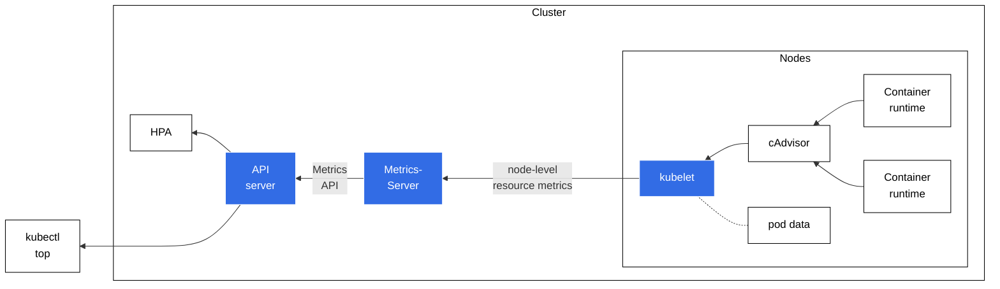

# {{ $frontmatter.title }}

<p align="center">
    
</p>

**Metrics Server** is a scalable, efficient source of container resource metrics in Kubernetes. It powers Kubernetes autoscaling features such as the [Horizontal Pod Autoscaler (HPA)](https://kubernetes.io/docs/tasks/run-application/horizontal-pod-autoscale/) and the [Vertical Pod Autoscaler](https://github.com/kubernetes/autoscaler/tree/master/vertical-pod-autoscaler), and also provides metrics for `kubectl top`. This enables both real-time usage visibility and the ability to automatically scale workloads based on CPU and memory consumption.

## How Does It Work?



*Diagram adapted from [Kubernetes Resource Metrics Pipeline](https://kubernetes.io/docs/tasks/debug/debug-cluster/resource-metrics-pipeline/).*

- **metrics-server** queries each node’s **kubelet** for CPU and memory usage.
- **kubelet** aggregates container runtime usage stats (often via [cAdvisor](https://github.com/google/cadvisor)) and exposes them through the **Resource Metrics API**.
- **metrics-server** then exposes these aggregated metrics to the Kubernetes **API server**.
- `kubectl top` can read these values to debug usage, while **HPA** uses them to scale pods automatically.

## Metrics Server in K3s

K3s installs Metrics Server by default as an add-on, so you typically have a working metrics pipeline out of the box. If needed, you can disable it (`--disable metrics-server` when installing K3s) and install your own Helm-managed instance for greater version or config control.

## Installing Metrics Server via Helm

If you’re on a cluster that doesn’t include Metrics Server by default (or you disabled it in K3s), you can install it via the [official Helm chart](https://github.com/kubernetes-sigs/metrics-server/tree/master/charts/metrics-server):

- Add the repository:

```bash
helm repo add metrics-server https://kubernetes-sigs.github.io/metrics-server/
helm repo update 
```

- Install into the `kube-system` namespace (or another namespace you prefer):

```bash
helm upgrade --install metrics-server metrics-server/metrics-server \
  --namespace kube-system
```

- Verify installation:

```bash
kubectl get pods -n kube-system | grep metrics-server
```

- If everything is running smoothly, you can then confirm metrics availability:

```bash
kubectl top nodes
kubectl top pods
```

These commands should display current CPU/memory usage, confirming that **Metrics Server** is correctly providing resource data to the cluster.
