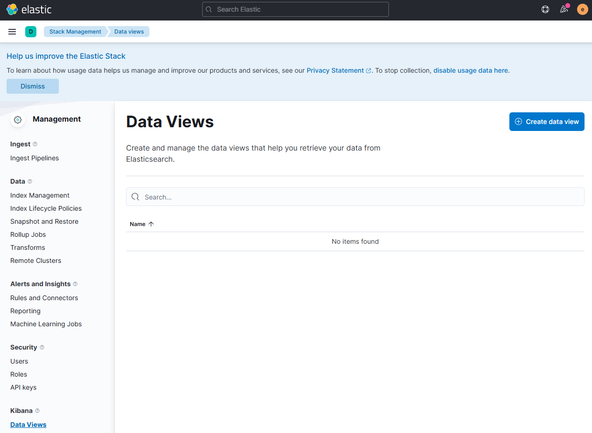
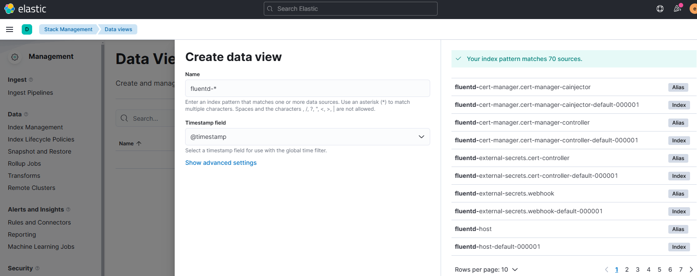

<p align="center">
    
</p>

- [Installing the ECK Operator](#installing-the-eck-operator)
  - [Deploying Elasticsearch](#deploying-elasticsearch)
  - [Configuring Authentication for Elasticsearch](#configuring-authentication-for-elasticsearch)
  - [Accessing Elasticsearch Externally](#accessing-elasticsearch-externally)
- [Setting Up Kibana on Kubernetes](#setting-up-kibana-on-kubernetes)
  - [Exposing Kibana Externally](#exposing-kibana-externally)
  - [Configuring DataView in Kibana for Elasticsearch Data Access](#configuring-dataview-in-kibana-for-elasticsearch-data-access)
- [Installing Prometheus Elasticsearch Exporter](#installing-prometheus-elasticsearch-exporter)

The [**`Elastic Cloud on Kubernetes (ECK)`**](https://www.elastic.co/guide/en/cloud-on-k8s/current/index.html) project simplifies the deployment and management of the Elastic Stack on Kubernetes clusters. ECK leverages the Kubernetes operator pattern to automate the provisioning, management, and orchestration of the Elastic Stack components, including Elasticsearch, Kibana, APM Server, Enterprise Search, Beats, Elastic Agent, and Elastic Maps Server.

>📢 Note
>
> *The ECK operator does not support the deployment of Logstash.*

## Installing the ECK Operator

Follow these steps to install the ECK Operator, which facilitates the deployment of Elasticsearch and Kibana on Kubernetes:

- Add the Elastic Helm repository

```bash
helm repo add elastic https://helm.elastic.co
```

- Update the Helm repository to ensure you have the latest charts

```bash
helm repo update
```

- Create a dedicated namespace for **`logging`** components

```bash
kubectl create namespace logging
```

- Install the ECK Operator within the **`logging`** namespace

```bash
helm install elastic-operator elastic/eck-operator --namespace logging
```

- To observe the operator's deployment and initialization, monitor the logs

```bash
kubectl -n logging logs -f statefulset.apps/elastic-operator
```

### Deploying Elasticsearch

- Create a manifest file **`efk-elasticsearch.yaml`** with the following specifications to set up a single-node Elasticsearch cluster using Longhorn as the storage class and configuring a 5GB volume for data storage. Also, refer to [**`ECK Documentation: "Deploy an Elasticsearch cluster"`**](https://www.elastic.co/guide/en/cloud-on-k8s/current/k8s-deploy-elasticsearch.html)

```yaml
apiVersion: elasticsearch.k8s.elastic.co/v1
kind: Elasticsearch
metadata:
  name: efk
  namespace: logging
spec:
  version: 8.1.2
  nodeSets:
  - name: default
    count: 1  # One node elastic search cluster
    config:
      node.store.allow_mmap: false # Disable memory mapping
    volumeClaimTemplates: 
      - metadata:
          name: elasticsearch-data
        spec:
          accessModes:
          - ReadWriteOnce
          resources:
            requests:
              storage: 5Gi
          storageClassName: longhorn
  http:
    tls:
      selfSignedCertificate:
        disabled: true
```

Where

- **Virtual Memory Configuration:** Elasticsearch typically uses memory mapping (mmap) for efficient index access. Disabling mmap (**`node.store.allow_mmap: false`**) is recommended when the default Linux virtual address space limit is insufficient. For production, consider increasing **`vm.max_map_count`** to 262144 instead.

- **Persistent Storage Configuration:** The manifest configures Longhorn as the storage solution for Elasticsearch pods, specifying a 5GB volume claim.

- **Disabling TLS:** This setup disables automatic TLS configuration to facilitate unencrypted HTTP traffic, useful when integrating with service meshes like Linkerd that manage TLS communication.

- Apply the created manifest to your Kubernetes cluster

```bash
kubectl apply -f efk-elasticsearch.yaml
```

- Check the deployment status of Elasticsearch

```bash
kubectl get elasticsearch -n logging
```

>📢 Note
>
> *An Elasticsearch status of **`HEALTH=yellow`** is normal for a single-node cluster, indicating no high availability (HA) setup. **`PHASE=Ready`** confirms that Elasticsearch is operational.*

### Configuring Authentication for Elasticsearch

Elastic Cloud on Kubernetes (ECK) automatically sets up user authentication for accessing the Elasticsearch service. It generates a default administrative user named **elastic`** and stores the password in a Kubernetes Secret associated with the Elasticsearch cluster.

Accessing Elasticsearch from the Kibana interface or configuring Fluentd to send data requires the elastic user's credentials.

To retrieve the password, use the following command:

```bash
kubectl get secret -n logging efk-es-elastic-user -o=jsonpath='{.data.elastic}' | base64 --decode; echo
```

ECK now supports the creation of custom users and roles through Elasticsearch File-based Authentication.

Refer to the [**Users and roles`**](https://www.elastic.co/guide/en/cloud-on-k8s/current/k8s-users-and-roles.html) section in the ECK documentation for more details.

To facilitate access for Fluentd and Prometheus exporter, specific roles with necessary permissions can be defined for new users (**`fluentd`** and **`prometheus`**).

- Define roles for Fluentd and Prometheus Exporter users by creating Kubernetes Secrets

  - Fluentd User Role in **`efk-fluentd-role-secret.yaml`**

  ```yaml
  # Fluentd User Role
  ---
  kind: Secret
  apiVersion: v1
  metadata:
    name: es-fluentd-roles-secret
    namespace: logging
  stringData:
    roles.yml: |-
      fluentd_role:
        cluster: ['manage_index_templates', 'monitor', 'manage_ilm']
        indices:
        - names: [ '*' ]
          privileges: [
            'indices:admin/create',
            'write',
            'create',
            'delete',
            'create_index',
            'manage',
            'manage_ilm'
          ]
  ```

  - Prometheus Exporter User Role in **`efk-prometheus-role-secret.yaml`**

  ```yaml
  # Prometheus Exporter User Role
  ---
  kind: Secret
  apiVersion: v1
  metadata:
    name: es-prometheus-roles-secret
    namespace: logging
  stringData:
    roles.yml: |-
      prometheus_role:
        cluster: [
          'cluster:monitor/health',
          'cluster:monitor/nodes/stats',
          'cluster:monitor/state',
          'cluster:monitor/nodes/info',
          'cluster:monitor/prometheus/metrics'
        ] 
        indices:
        - names: [ '*' ]
          privileges: [ 'indices:admin/aliases/get', 'indices:admin/mappings/get', 'indices:monitor/stats', 'indices:data/read/search' ]
  ```

- Create Secrets for Fluentd and Prometheus exporter users, specifying usernames, passwords, and their associated roles

  - Encode username

  ```bash
  echo -n 'fluentd' | base64
  echo -n 'prometheus' | base64
  ```

  - Encode password

  ```bash
  echo -n 'secret1' | base64
  ```

  - Encode role

  ```bash
  echo -n 'fluentd_role' | base64
  echo -n 'prometheus_role' | base64
  ```

  - Fluentd User in **`efk-fluentd-user-secret.yaml`**

  ```yaml
  apiVersion: v1
  kind: Secret
  metadata:
    name: es-fluentd-user-file-realm
    namespace: logging
  type: kubernetes.io/basic-auth
  data:
    username: <`echo -n 'fluentd' | base64`>
    password: <`echo -n 'supersecret' | base64`>
    roles: <`echo -n 'fluentd_role' | base64`>
  ```

  - Prometheus Exporter User in **`efk-prometheus-user-secret.yaml`**

  ```yaml
  apiVersion: v1
  kind: Secret
  metadata:
    name: es-prometheus-user-file-realm
    namespace: logging
  type: kubernetes.io/basic-auth
  data:
    username: <`echo -n 'prometheus' | base64`>
    password: <`echo -n 'supersecret' | base64`>
    roles: <`echo -n 'prometheus_role' | base64`>
  ```

- Incorporate the role and user definitions into the Elasticsearch manifest by adding the specified secrets to **`efk-elasticsearch.yaml`**

```yaml
apiVersion: elasticsearch.k8s.elastic.co/v1
kind: Elasticsearch
metadata:
  name: efk
  namespace: logging
spec:
  auth:
    roles:
    - secretName: es-fluentd-roles-secret
    - secretName: es-prometheus-roles-secret
    fileRealm:
    - secretName: es-fluentd-user-file-realm
    - secretName: es-prometheus-user-file-realm
```

- Apply the manifest to Kubernetes cluster

```bash
kubectl apply -f efk-fluentd-role-secret.yaml \
              -f efk-prometheus-role-secret.yaml \
              -f efk-fluentd-user-secret.yaml \
              -f efk-prometheus-user-secret.yaml \
              -f efk-elasticsearch-ingress.yaml
```

Additionally, a superuser account can be created similarly to the **`fluentd`** or **`prometheus`** user, but with the role set to **`superuser`**, for enhanced access and management capabilities.

### Accessing Elasticsearch Externally

By default, Elasticsearch's HTTP service is configured with a Kubernetes **`ClusterIP`** service type, restricting access to within the cluster only. To enable external access, configuring Ingress NGINX can facilitate communication with the Elasticsearch server from outside the cluster.

Such external access is beneficial for performing remote operations on Elasticsearch, like setting up backup snapshots, via its API from nodes outside the Kubernetes cluster, such as **`ansible-automaton`** node.

- Define an ingress rule to expose Elasticsearch externally. Create a YAML manifest, **`efk-elasticsearch-ingress.yaml`**, with the following configuration

```yaml
---
apiVersion: networking.k8s.io/v1
kind: Ingress
metadata:
  name: elasticsearch-ingress
  namespace: logging
  annotations:
    cert-manager.io/cluster-issuer: letsencrypt-issuer
    cert-manager.io/common-name: elasticsearch.picluster.quantfinancehub.com
spec:
  ingressClassName: nginx
  tls:
    - hosts:
        - elasticsearch.picluster.quantfinancehub.com
      secretName: elasticsearch-tls
  rules:
    - host: elasticsearch.picluster.quantfinancehub.com
      http:
        paths:
          - path: /
            pathType: Prefix
            backend:
              service:
                name: efk-es-http
                port:
                  number: 9200
```

This configuration sets up an Ingress NGINX to expose the Elasticsearch server at **`elasticsearch.picluster.quantfinancehub.com`**, with rules for redirecting HTTP traffic to HTTPS. TLS encryption is enabled, utilizing a certificate automatically generated by Cert-manager.

For additional details on configuring Ingress NGINX, refer to the [**`specific documentation`**](../5-networking/4-ingress-controller-nginx.md).

- Apply the manifest to Kubernetes cluster

```bash
kubectl apply -f efk-elasticsearch-ingress.yaml
```

The Elasticsearch UI can be accessed through **`https://elasticsearch.picluster.quantfinancehub.com`**, using the **`elastic`** user and the password retrieved from the Kubernetes Secret (`<efk_cluster_name>-es-elastic-user`).

Upon successful access, Elasticsearch will display information about the cluster, including its version, cluster name, and other relevant details, in a JSON format response.

```json
{
  "name" : "efk-es-default-0",
  "cluster_name" : "efk",
  "cluster_uuid" : "ywDZ8MdBQqe77UpoK9sA6Q",
  "version" : {
    "number" : "8.1.2",
    "build_flavor" : "default",
    "build_type" : "docker",
    "build_hash" : "31df9689e80bad366ac20176aa7f2371ea5eb4c1",
    "build_date" : "2022-03-29T21:18:59.991429448Z",
    "build_snapshot" : false,
    "lucene_version" : "9.0.0",
    "minimum_wire_compatibility_version" : "7.17.0",
    "minimum_index_compatibility_version" : "7.0.0"
  },
  "tagline" : "You Know, for Search"
}
```

## Setting Up Kibana on Kubernetes

- Draft **`efk-kibana.yaml`** YAML file, to define the Kibana deployment. This configuration sets up Kibana to connect to an existing Elasticsearch cluster named efk, disables the default TLS for Kibana, and specifies two replicas for redundancy.

```yaml
---
apiVersion: kibana.k8s.elastic.co/v1
kind: Kibana
metadata:
  name: kibana
  namespace: logging
spec:
  version: 8.1.2
  count: 2 # Elastic Search statefulset deployment with two replicas
  elasticsearchRef:
    name: "efk"
  http:
    tls:
      selfSignedCertificate:
        disabled: true
```

Apply the manifest to the cluster

```bash
kubectl apply -f efk-kibana.yaml
```

- After deployment, check the status to ensure Kibana is running correctly

```bash
kubectl get kibana -n logging
```

>📢 Note
>
> *A **`HEALTH=green`** status confirms Kibana is operational.*

### Exposing Kibana Externally

- Create **`efk-kibana-ingress.yaml`** YAML file for the Ingress rule that exposes Kibana, securing access via HTTPS with a certificate managed by cert-manager

```yaml
---
apiVersion: networking.k8s.io/v1
kind: Ingress
metadata:
  name: kibana-ingress
  namespace: logging
  annotations:
    cert-manager.io/cluster-issuer: letsencrypt-issuer
    cert-manager.io/common-name: kibana.picluster.quantfinancehub.com
spec:
  ingressClassName: nginx
  tls:
    - hosts:
        - kibana.picluster.quantfinancehub.com
      secretName: kibana-tls
  rules:
    - host: kibana.picluster.quantfinancehub.com
      http:
        paths:
          - path: /
            pathType: Prefix
            backend:
              service:
                name: kibana-kb-http
                port:
                  number: 5601
```

- Deploy the Ingress rule to facilitate external access

```bash
kubectl apply -f efk-kibana-ingress.yaml
```

Navigate to **`https://kibana.picluster.quantfinancehub.com`** to access the Kibana UI. Use the **`elastic`** login and the password from the `<efk_cluster_name>-es-elastic-user` secret for authentication.

### Configuring DataView in Kibana for Elasticsearch Data Access

To effectively utilize Kibana for analyzing and visualizing data stored in Elasticsearch, setting up a [**`DataView`**](https://www.elastic.co/guide/en/kibana/master/data-views.html) is essential.
This step is crucial once Fluentd begins shipping logs to Elasticsearch and creates indices named **`fluentd-<date>`**.

>📢 Note
>
> *Ensure that Fluentd has already started inserting data into Elasticsearch, resulting in the creation of at least one index, before proceeding with the DataView configuration.*

- In the Kibana UI, locate and open the **`Management`** menu. This section allows to configure various settings related to data and index management.

<p align="center">
    
</p>

- Within the **`Management`** area, find and select the **`Data Views`** option under the **`Kibana`** section. Then, click on **`Create data view`** to start configuring a new DataView.

<p align="center">
    
</p>

- For the **`Index pattern name`**, enter **`fluentd-*`** to match indices created by Fluentd. This pattern ensures that Kibana can access all relevant data logs. Additionally, select **`@timestamp`** as the field for Kibana to use as the primary time reference for log data. Finalize the configuration by clicking on **`Create index pattern`**.

<p align="center">
    
</p>

## Installing Prometheus Elasticsearch Exporter

To monitor Elasticsearch using Prometheus, the Prometheus Elasticsearch Exporter is required. This guide outlines the installation process using the official Helm chart from the Prometheus community.

- Add the Prometheus Community Helm Repository

```bash
helm repo add prometheus-community https://prometheus-community.github.io/helm-charts
```

- Update the Helm Repository

```bash
helm repo update
```

- Create a **`efk-prometheus-elasticsearch-exporter-values.yaml`** file to customize the Helm chart settings. This configuration specifies the Elasticsearch API endpoint and authentication credentials

```yaml
---
extraEnvSecrets:
  ES_USERNAME:
    secret: es-prometheus-user-file-realm
    key: username
  ES_PASSWORD:
    secret: es-prometheus-user-file-realm
    key: password

es:
  uri: http://efk-es-http:9200
```

This setup uses environment variables (**`ES_USERNAME`** and **`ES_PASSWORD`**) to pass the Elasticsearch credentials. The **`es-prometheus-user-file-realm`** secret, containing these credentials, should already be configured as part of the [**`Configuring Authentication for Elasticsearch`**](#configuring-authentication-for-elasticsearch) section.

- Install the Prometheus Elasticsearch Exporter into the logging namespace, applying the customized **`efk-prometheus-elasticsearch-exporter-values.yaml`**

```bash
helm install -f efk-prometheus-elasticsearch-exporter-values.yaml prometheus-elasticsearch-exporter prometheus-community/prometheus-elasticsearch-exporter --namespace logging
```


To test the availability of the metrics endpoint using curl, use a temporary debug pod in the `logging` namespace to test the endpoint

```bash
kubectl run curl-test --rm -it --image=alpine --namespace=logging -- /bin/sh
```

- Inside the pod, install `curl`

```bash
apk add --no-cache curl
```

- Test the metrics endpoint

```bash
curl prometheus-elasticsearch-exporter.logging.svc.cluster.local:9108/metrics
```

- Exit the pod to delete it

```bash
exit
```
