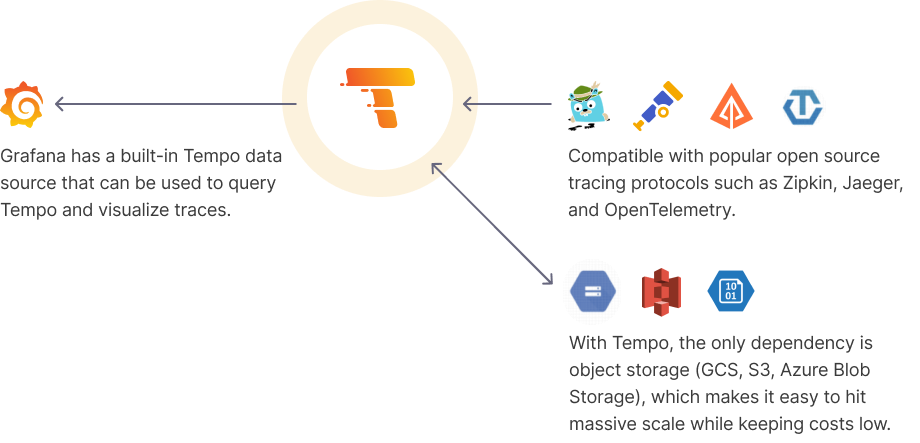
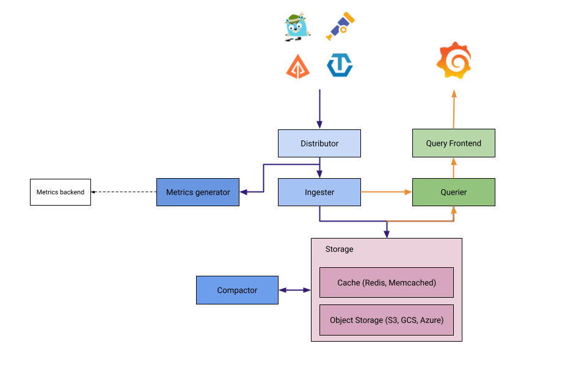

<p align="center">
    
</p>

- [Tempo Architecture](#tempo-architecture)
- [Configuring the S3 Minio Server](#configuring-the-s3-minio-server)
  - [Creating the Minio User and Bucket](#creating-the-minio-user-and-bucket)
  - [Tempo Installation](#tempo-installation)
  - [GitOps Installation (Optional)](#gitops-installation-optional)
- [Integration with Linkerd Traces](#integration-with-linkerd-traces)
- [Integration with Traefik for Tracing](#integration-with-traefik-for-tracing)
  - [Correlating Logs with Traces in Grafana](#correlating-logs-with-traces-in-grafana)
  - [Helm Configuration for Traefik](#helm-configuration-for-traefik)
- [Integration with Ingress NGINX for Tracing](#integration-with-ingress-nginx-for-tracing)
  - [Activating Tracing with W3C Protocol](#activating-tracing-with-w3c-protocol)
- [Grafana Configuration for Tempo](#grafana-configuration-for-tempo)
- [Loki and Tempo Integration](#loki-and-tempo-integration)
- [Testing with Emojivoto application](#testing-with-emojivoto-application)

This section details how to set up a distributed tracing solution on your Kubernetes cluster using [**`Grafana Tempo`**](https://grafana.com/oss/tempo/) as the tracing backend, with Grafana as the frontend.

<p align="center">
    
</p>

**Grafana Tempo** serves as the traces backend, complemented by Grafana for visualization. Tempo integrates with an [**`OpenTelemetry collector`**](https://opentelemetry.io/docs/collector/) to ingest traces from popular protocols such as Jaeger, Zipkin, and OpenTelemetry.

Tempo requires only object storage as a backend and integrates seamlessly with Grafana, Prometheus, and Loki. In this setup, Minio S3 storage will serve as Tempo's backend.

## Tempo Architecture

Tempo’s architecture closely resembles Loki’s. The diagram below (source: [**`Grafana documentation`**](https://grafana.com/docs/tempo/latest/operations/architecture/)) highlights Tempo’s components:

<p align="center">
    
</p>

**Key Components**:

- **Distributor**: Receives and validates traces from various protocols.
- **Ingester**: Batches traces into blocks and stores them in the S3 backend.
- **Query Frontend**: Splits incoming queries into shards and distributes them to Queriers.
- **Querier**: Locates requested trace IDs from ingesters or the backend storage.
- **Compactor**: Compacts trace blocks in the backend storage to optimize resource usage.

Tempo can be deployed in two modes:

- **Monolithic Mode**: All components run in a single process.
- **Microservices Mode**: Components run as separate processes (PODs), allowing for granular scaling and HA per component.

For details, refer to [**`Tempo Architecture`**](https://grafana.com/docs/tempo/latest/operations/architecture/) and [**`Tempo Deployment`**](https://grafana.com/docs/tempo/latest/setup/deployment/).

In this setup, Tempo will be deployed in microservices mode, with Minio S3 as the backend.

## Configuring the S3 Minio Server

Minio acts as the long-term storage solution for Tempo’s chunks and indexes.

::: note

The Tempo Helm chart can install Minio as a subchart, but that’s disabled here since the cluster already has a Minio service deployed. The Tempo S3 bucket, policy, and user for Minio have been set up as part of the Minio installation process. See [**`Minio S3 Object Storage Service`**](../8-storage/2-s3-object-storage-service-minio.md) for details.

:::

### Creating the Minio User and Bucket

- On `blueberry-master`, use `mc` (Minio Client) to create a bucket and user for Tempo

```bash
mc mb <minio_alias>/k3s-tempo # <minio_alias> being PiKubeS3Cluster, previously setup
mc admin user add <minio_alias> tempo <user_password>
```

::: note

[**`Tempo`**](https://grafana.com/docs/tempo/latest/configuration/s3/#amazon-s3-permissions) requires the following permissions for S3 object storage:

- s3:ListBucket
- s3:PutObject
- s3:GetObject
- s3:DeleteObject
- s3:GetObjectTagging
- s3:PutObjectTagging

:::

These apply to `arn:aws:s3:::k3s-tempo` and `arn:aws:s3:::k3s-tempo/*`

- Apply the policy to the tempo user

```bash
mc admin policy add <minio_alias> tempo user_policy.json
```

Where `user_policy.json` contains the AWS access policies definition

```json
{
    "Version": "2012-10-17",
    "Statement": [
        {
            "Sid": "TempoPermissions",
            "Effect": "Allow",
            "Action": [
                "s3:PutObject",
                "s3:GetObject",
                "s3:ListBucket",
                "s3:DeleteObject",
                "s3:GetObjectTagging",
                "s3:PutObjectTagging"
            ],
            "Resource": [
                "arn:aws:s3:::k3s-tempo/*",
                "arn:aws:s3:::k3s-tempo"
            ]
        }
    ]
}
```

### Tempo Installation

- Add the Grafana repository

```bash
helm repo add grafana https://grafana.github.io/helm-charts
```

- Update Helm repositories

```bash
helm repo update
```

- Create the `tracing` namespace

```bash
kubectl create namespace tracing
```

- Create `tempo-values.yaml` with the following configuration

```yaml
# Enable trace ingestion protocols
traces:
  otlp:
    grpc:
      enabled: true
    http:
      enabled: true
  zipkin:
    enabled: true
  jaeger:
    thriftCompact:
      enabled: true
    thriftHttp:
      enabled: true
  opencensus:
    enabled: true

# Configure S3 backend
storage:
  trace:
    backend: s3
    s3:
      bucket: <minio_tempo_bucket>
      endpoint: <minio_endpoint>
      region: <minio_site_region>
      access_key: <minio_tempo_user>
      secret_key: <minio_tempo_key>
      insecure: false

# Configure distributor
distributor:
  config:
    log_received_spans:
      enabled: true

# Disable Minio server installation
minio:
  enabled: false
```

- Install Tempo

```bash
helm install tempo grafana/tempo-distributed -f tempo-values.yaml --namespace tracing
```

- Check Tempo pods

```bash
kubectl get pods -l app.kubernetes.io/name=tempo -n tracing
```

### GitOps Installation (Optional)

For GitOps deployments, create a secret with Minio credentials, and use environment variables in the Tempo configuration:

```yaml
apiVersion: v1
kind: Secret
metadata:
  name: tempo-minio-secret
  namespace: tracing
type: Opaque
data:
  MINIO_ACCESS_KEY_ID: <Encoded minio_tempo_user>
  MINIO_SECRET_ACCESS_KEY: <Encoded minio_tempo_key>
```

Then reference these environment variables in the Helm chart values (`-config.expand-env=true` and `extraEnv` fields) for distributor, ingester, compactor, querier, and query-frontend.

```yaml
# Enable trace ingestion
traces:
  otlp:
    grpc:
      enabled: true
    http:
      enabled: true
  zipkin:
    enabled: true
  jaeger:
    thriftCompact:
      enabled: true
    thriftHttp:
      enabled: true
  opencensus:
    enabled: true

# Configure S3 backend
storage:
  trace:
    backend: s3
    s3:
      bucket: k3s-tempo
      endpoint: s3.picluster.quantfinancehub.com:9091
      region: eu-west-1
      access_key: ${MINIO_ACCESS_KEY_ID}
      secret_key: ${MINIO_SECRET_ACCESS_KEY}
      insecure: false

# Configure distributor
distributor:
  config:
    log_received_spans:
      enabled: true
  # Enable environment variables in config file
  # https://grafana.com/docs/tempo/latest/configuration/#use-environment-variables-in-the-configuration
  extraArgs:
    - '-config.expand-env=true'
  extraEnv:
    - name: MINIO_ACCESS_KEY_ID
      valueFrom:
        secretKeyRef:
          name: tempo-minio-secret
          key: MINIO_ACCESS_KEY_ID
    - name: MINIO_SECRET_ACCESS_KEY
      valueFrom:
        secretKeyRef:
          name: tempo-minio-secret
          key: MINIO_SECRET_ACCESS_KEY
# Configure ingester
ingester:
  # Enable environment variables in config file
  # https://grafana.com/docs/tempo/latest/configuration/#use-environment-variables-in-the-configuration
  extraArgs:
    - '-config.expand-env=true'
  extraEnv:
    - name: MINIO_ACCESS_KEY_ID
      valueFrom:
        secretKeyRef:
          name: tempo-minio-secret
          key: MINIO_ACCESS_KEY_ID
    - name: MINIO_SECRET_ACCESS_KEY
      valueFrom:
        secretKeyRef:
          name: tempo-minio-secret
          key: MINIO_SECRET_ACCESS_KEY
# Configure compactor
compactor:
  # Enable environment variables in config file
  # https://grafana.com/docs/tempo/latest/configuration/#use-environment-variables-in-the-configuration
  extraArgs:
    - '-config.expand-env=true'
  extraEnv:
    - name: MINIO_ACCESS_KEY_ID
      valueFrom:
        secretKeyRef:
          name: tempo-minio-secret
          key: MINIO_ACCESS_KEY_ID
    - name: MINIO_SECRET_ACCESS_KEY
      valueFrom:
        secretKeyRef:
          name: tempo-minio-secret
          key: MINIO_SECRET_ACCESS_KEY
# Configure querier
querier:
  # Enable environment variables in config file
  # https://grafana.com/docs/tempo/latest/configuration/#use-environment-variables-in-the-configuration
  extraArgs:
    - '-config.expand-env=true'
  extraEnv:
    - name: MINIO_ACCESS_KEY_ID
      valueFrom:
        secretKeyRef:
          name: tempo-minio-secret
          key: MINIO_ACCESS_KEY_ID
    - name: MINIO_SECRET_ACCESS_KEY
      valueFrom:
        secretKeyRef:
          name: tempo-minio-secret
          key: MINIO_SECRET_ACCESS_KEY
# Configure query-frontend
queryFrontend:
  # Enable environment variables in config file
  # https://grafana.com/docs/tempo/latest/configuration/#use-environment-variables-in-the-configuration
  extraArgs:
    - '-config.expand-env=true'
  extraEnv:
    - name: MINIO_ACCESS_KEY_ID
      valueFrom:
        secretKeyRef:
          name: tempo-minio-secret
          key: MINIO_ACCESS_KEY_ID
    - name: MINIO_SECRET_ACCESS_KEY
      valueFrom:
        secretKeyRef:
          name: tempo-minio-secret
          key: MINIO_SECRET_ACCESS_KEY
# Disable Minio server installation
minio:
  enabled: false
```

## Integration with Linkerd Traces

Follow the steps in [**`Service Mesh (Linkerd) - Linkerd Jaeger extension`**](../12-microservices/2-service-mesh-linkerd.md) installation to enable Linkerd’s distributed tracing capabilities.

## Integration with Traefik for Tracing

TThe ingress controller plays a crucial role in a distributed tracing solution as it is responsible for creating the root span of each trace and determining whether the trace should be sampled.

Distributed tracing systems rely on propagating the trace context through the chain of involved services. This context is encoded in HTTP request headers. Among the available propagation protocols, B3 is the only one supported by Linkerd, making it the standard for use across the system.

Traefik uses OpenTracing to export traces to various backends. To enable tracing with the B3 propagation protocol, the following options must be configured:

```bash
--tracing.zipkin=true
--tracing.zipkin.httpEndpoint=http://tempo-distributor.tracing.svc.cluster.local:9411/api/v2/spans
--tracing.zipkin.sameSpan=true
--tracing.zipkin.id128Bit=true
--tracing.zipkin.sampleRate=1
```

For more details, refer to [**`Traefik's tracing documentation`**](https://doc.traefik.io/traefik/observability/tracing/overview/).

### Correlating Logs with Traces in Grafana

To correlate logs with traces in Grafana, the Traefik access log must include the trace ID as a field. The trace ID is passed as a header (`X-B3-Traceid`) and needs to be included in the logs.

By default, Traefik does not include any headers in its access logs. To include the trace ID, additional parameters must be configured:

```bash
--accesslog.fields.headers.defaultmode=drop
--accesslog.fields.headers.names.X-B3-Traceid=keep
```

See the [**`Traefik access log documentation`**](https://doc.traefik.io/traefik/observability/access-logs/#limiting-the-fieldsincluding-headers) for more details.

### Helm Configuration for Traefik

When deploying Traefik with Helm, the following `traefik-values.yaml` file configures both tracing and access logging with the trace ID:

```yaml
# Enable access log
logs:
  access:
    enabled: true
    format: json
    fields:
      general:
        defaultmode: keep
      headers:
        defaultmode: drop
        names:
          X-B3-Traceid: keep

# Enable tracing
tracing:
  zipkin:
    httpEndpoint: http://tempo-distributor.tracing.svc.cluster.local:9411/api/v2/spans
    sameSpan: true
    id128Bit: true
    sampleRate: 1.0
```

## Integration with Ingress NGINX for Tracing

The Ingress Controller is a critical component in a distributed tracing solution as it is responsible for creating the root span of each trace and determining whether the trace should be sampled.

Distributed tracing systems rely on propagating the trace context through the chain of involved services. This context is encoded in HTTP request headers. Two major protocols are used for context propagation:

- `W3C`, used by OpenTelemetry.
- `B3`, used by OpenTracing.

As of [**`release 1.10`**](https://github.com/kubernetes/ingress-nginx/releases/tag/controller-v1.10.0), Ingress NGINX has deprecated the `OpenTracing` and `Zipkin` modules, making `OpenTelemetry` the only supported option.

The OpenTelemetry module in Ingress NGINX supports only `W3C context propagation`, while B3 is not supported. For more information, see the open [**`issue #10324`**](https://github.com/kubernetes/ingress-nginx/issues/10324).

On the other hand, Linkerd has included support for `W3C tracing propagation` since release v2.13. When both W3C and B3 headers are present, Linkerd prioritizes W3C by default and falls back to B3 if W3C is not available. For more details, see Linkerd [**`issue #5416`**](https://github.com/linkerd/linkerd2/issues/5416).

### Activating Tracing with W3C Protocol

To enable tracing using the W3C propagation protocol, the following values should be configured in the Helm `values.yaml` file:

```yaml
controller:
  config:
    # Enable OpenTelemetry
    enable-opentelemetry: "true"
    otlp-collector-host: tracing-tempo-distributor.tracing.svc.cluster.local
    otlp-service-name: nginx-internal
    # Configure access log
    access-log-path: "/data/access.log"
    log-format-escape-json: "true"
    log-format-upstream: '{"source": "nginx", "time": $msec, "resp_body_size": $body_bytes_sent, "request_host": "$http_host", "request_address": "$remote_addr", "request_length": $request_length, "request_method": "$request_method", "uri": "$request_uri", "status": $status,  "user_agent": "$http_user_agent", "resp_time": $request_time, "upstream_addr": "$upstream_addr", "trace_id": "$opentelemetry_trace_id", "span_id": "$opentelemetry_span_id"}'
```

With this configuration:

- The embedded Tempo OpenTelemetry (OTEL) collector (distributor) is used as the destination.
- Access logs include W3C context with `trace_id` (`$opentelemetry_trace_id`) and `span_id` (`$opentelemetry_span_id`) fields.

For additional details, see the Ingress [**`NGINX OpenTelemetry documentation`**](https://kubernetes.github.io/ingress-nginx/user-guide/third-party-addons/opentelemetry/).

## Grafana Configuration for Tempo

Add Tempo as a Data Source in Grafana `prometheus-values.yaml` file:

```yaml
grafana:
  additionalDataSources:
    - name: Tempo
      type: tempo
      uid: tempo
      access: proxy
      url: http://tempo-query-frontend.tracing.svc.cluster.local:3100
```

## Loki and Tempo Integration

Configure [**`Loki’s derived fields`**](https://grafana.com/docs/grafana/latest/datasources/loki/#derived-fields) in `prometheus-values.yaml` to recognize trace IDs in logs, linking them to Tempo:

```yaml
grafana:
  additionalDataSources:
  - name: Loki
    type: loki
    uid: loki
    access: proxy
    url: http://loki-gateway.logging.svc.cluster.local
    jsonData:
      derivedFields:
        - datasourceUid: tempo
          matcherRegex: '"trace_id": "(\w+)"'
          name: TraceID
          url: $${__value.raw}
  - name: Tempo
    uid: tempo
    type: tempo
    access: proxy
    url: http://tempo-query-frontend.tracing.svc.cluster.local:3100
```

This enables logs in Grafana to have a link to corresponding Tempo traces.

## Testing with Emojivoto application

